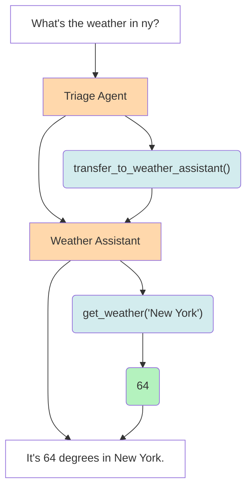

# SwarmX (forked from OpenAI's Swarm)

[](https://pypi.org/project/swarm)
[](https://pypi.org/project/swarmx/)
[](https://opensource.org/licenses/MIT)
[](https://pepy.tech/project/swarmx)
[](https://github.com/tcztzy/swarmx/stargazers)
[](https://github.com/tcztzy/swarmx/network)
[](https://github.com/tcztzy/swarmx/issues)
[](https://github.com/psf/black)

An extreme simple framework exploring ergonomic, lightweight multi-agent orchestration.

## Highlights
1. SwarmX is both Agent and Workflow
2. MCP servers support
3. OpenAI-compatible streaming-server
4. Workflow import/export in JSON format


## Star History

[](https://www.star-history.com/#tcztzy/swarmx&Date)

## Quick start

SwarmX automatically loads environment variables from a `.env` file if present. You can either:

1. **Use a .env file** (recommended):
   ```shell
   # Create a .env file in your project directory
   echo "OPENAI_API_KEY=your-api-key" > .env
   echo "OPENAI_BASE_URL=http://localhost:11434/v1" >> .env  # optional
   uvx swarmx  # Start interactive REPL
   ```

2. **Set environment variables manually**:
   ```shell
   export OPENAI_API_KEY="your-api-key"
   # export OPENAI_BASE_URL="http://localhost:11434/v1"  # optional
   uvx swarmx  # Start interactive REPL
   ```

### API Server

You can also start SwarmX as an OpenAI-compatible API server:

```shell
uvx swarmx serve --host 0.0.0.0 --port 8000
```

This provides OpenAI-compatible endpoints:

- `POST /chat/completions` - Chat completions with streaming support
- `GET /models` - List available models

Use it with any OpenAI-compatible client:

```python
import openai

client = openai.OpenAI(
    base_url="http://localhost:8000",
    api_key="dummy"  # SwarmX doesn't require authentication
)

response = client.chat.completions.create(
    model="agent-created-by-yourself",
    messages=[{"role": "user", "content": "Hello!"}]
)
```

## Installation

Requires Python 3.11+

```console
$ pip install swarmx # or `uv tool install swarmx`
```

## Usage

```python
import asyncio
from swarmx import Swarm, Agent

client = Swarm()

def transfer_to_agent_b():
    return agent_b


agent_a = Agent(
    name="Agent A",
    instructions="You are a helpful agent.",
    functions=[transfer_to_agent_b],
)

agent_b = Agent(
    name="Agent B",
    model="deepseek-r1:7b",
    instructions="你只能说中文。",  # You can only speak Chinese.
)


async def main():
    response = await client.run(
        agent=agent_a,
        messages=[{"role": "user", "content": "I want to talk to agent B."}],
    )

    print(response.messages[-1]["content"])


asyncio.run(main())
```

## Context Variables

SwarmX supports special context variables that control agent behavior:

### `background`
Provides additional context for the agent. This can be used for:
- Adding external knowledge (web search results, database queries)
- Compressing previous conversation history into summaries
- Isolating context for sub-agents who don't need full conversation history

**Example:**
```python
context = {
    "background": "Recent news: AI conference announced for next month. User is interested in AI developments."
}
```

### `message_slice` 
Controls which messages are sent to the LLM using Python slice syntax. This enables:
- Context compression by sending only recent messages
- LLM-driven filtering decisions
- Memory management for long conversations

**Slice patterns:**
- `":10"` - First 10 messages
- `"-5:"` - Last 5 messages  
- `":0"` - No messages (useful with `background` for context compression)
- `"2:8"` - Messages from index 2 to 7

**Example:**
```python
context = {
    "message_slice": "-10:"  # Send only last 10 messages
}
```

### `tools`
Dynamically selects which tools are available for the current completion. This allows:
- Context-aware tool selection
- Reducing tool overload by showing only relevant tools
- Dynamic tool routing based on conversation context

**Example:**
```python
context = {
    "tools": [
        {
            "type": "function",
            "function": {
                "name": "search_web",
                "description": "Search the web for information",
                "parameters": {
                    "type": "object",
                    "properties": {
                        "query": {"type": "string"}
                    },
                    "required": ["query"]
                }
            }
        },
        {
            "type": "function", 
            "function": {
                "name": "get_weather",
                "description": "Get weather information for a location",
                "parameters": {
                    "type": "object",
                    "properties": {
                        "location": {"type": "string"}
                    },
                    "required": ["location"]
                }
            }
        }
    ]
}
```

### Advanced Usage Examples

**Context Compression:**
```python
# Compress history into background and send no previous messages
context = {
    "background": "Previous conversation summary: User asked about weather, then travel plans.",
    "message_slice": ":0"  # No previous messages
}
```

**RAG Pattern:**
```python
# Add web search results to background, send all messages for comprehensive context
context = {
    "background": "Web search results: Latest AI developments from yesterday's conference...",
    # No slice means all message might pass to LLM
}
```

**Dynamic Tool Selection:**
```python
# Based on conversation topic, show only relevant tools
if "weather" in user_message:
    context = {"tools": [{"type": "function", "function": {"name": "get_weather", "description": "Get weather", "parameters": {"type": "object", "properties": {"location": {"type": "string"}}, "required": ["location"]}}}]}
elif "search" in user_message:
    context = {"tools": [{"type": "function", "function": {"name": "search_web", "description": "Search web", "parameters": {"type": "object", "properties": {"query": {"type": "string"}}, "required": ["query"]}}}]}
```

## Architecture



[1]: https://platform.openai.com/docs/api-reference/chat/create
