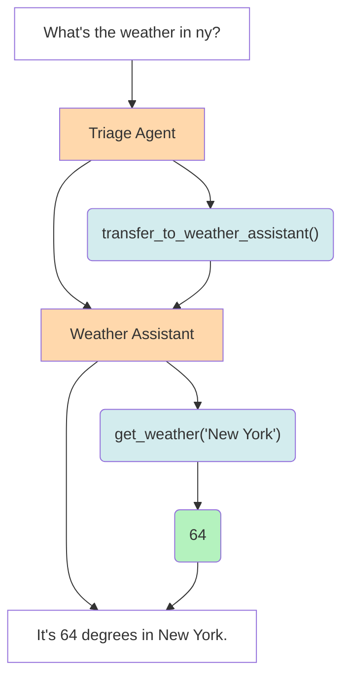

# SwarmX (forked from OpenAI's Swarm)

[](https://pypi.org/project/swarm)
[](https://pypi.org/project/swarmx/)
[](https://opensource.org/licenses/MIT)
[](https://pepy.tech/project/swarmx)
[](https://github.com/tcztzy/swarmx/stargazers)
[](https://github.com/tcztzy/swarmx/network)
[](https://github.com/tcztzy/swarmx/issues)
[](https://github.com/psf/black)

An extreme simple framework exploring ergonomic, lightweight multi-agent orchestration.

## Highlights
1. SwarmX is both Agent and Workflow
2. MCP servers support
3. OpenAI-compatible streaming-server
4. Workflow import/export in JSON format


## Star History

[](https://www.star-history.com/#tcztzy/swarmx&Date)

## Quick start

After setting `OPENAI_API_KEY` environment variable, you can start a simple REPL by running the following command:

```shell
export OPENAI_API_KEY="your-api-key"
# export OPENAI_BASE_URL="http://localhost:11434/v1"  # optional
uvx swarmx  # Start interactive REPL
```

### API Server

You can also start SwarmX as an OpenAI-compatible API server:

```shell
uvx swarmx serve --host 0.0.0.0 --port 8000
```

This provides OpenAI-compatible endpoints:

- `POST /v1/chat/completions` - Chat completions with streaming support
- `GET /v1/models` - List available models

Use it with any OpenAI-compatible client:

```python
import openai

client = openai.OpenAI(
    base_url="http://localhost:8000/v1",
    api_key="dummy"  # SwarmX doesn't require authentication
)

response = client.chat.completions.create(
    model="gpt-4o",
    messages=[{"role": "user", "content": "Hello!"}]
)
```

## Installation

Requires Python 3.11+

```console
$ pip install swarmx # or `uv tool install swarmx`
```

## Usage

```python
import asyncio
from swarmx import Swarm, Agent

client = Swarm()

def transfer_to_agent_b():
    return agent_b


agent_a = Agent(
    name="Agent A",
    instructions="You are a helpful agent.",
    functions=[transfer_to_agent_b],
)

agent_b = Agent(
    name="Agent B",
    model="deepseek-r1:7b",
    instructions="你只能说中文。",  # You can only speak Chinese.
)


async def main():
    response = await client.run(
        agent=agent_a,
        messages=[{"role": "user", "content": "I want to talk to agent B."}],
    )

    print(response.messages[-1]["content"])


asyncio.run(main())
```

## Architecture



[1]: https://platform.openai.com/docs/api-reference/chat/create
