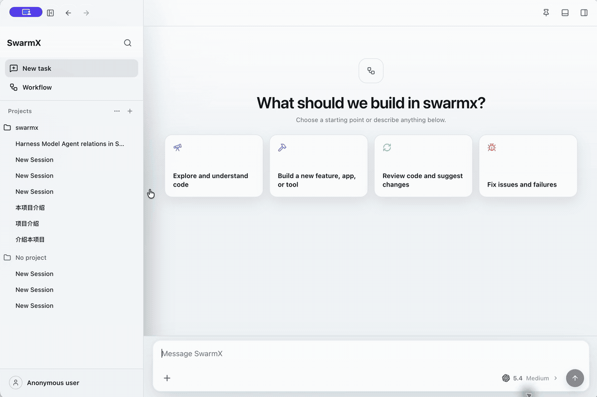

# SwarmX

A lightweight, stateless multi-agent orchestration framework with a TypeScript core, CLI, ACP server, and a user-friendly Electron desktop interface.

SwarmX now includes a polished desktop UI for browsing local and ACP sessions, switching harnesses, sending messages, and reading Markdown-rich agent output in one place.

<p align="center">
  <a href="docs/assets/swarmx-demo.mp4">
    
  </a>
</p>

<p align="center"><sub>Select an agent, run a prompt, and inspect a multi-agent workflow. Click the animation for the MP4.</sub></p>

## Architecture

This workspace contains:

- **`packages/core/`** — Core library with agents, swarms, MCP tools, session persistence, and OpenAI-compatible server
- **`packages/runtime/`** — Shared host runtime detection plus Doctor inspection and confirmed repair planning
- **`packages/cli/`** — Command-line interface (`swarmx` binary)
- **`packages/acp-server/`** — Agent Client Protocol server
- **`packages/desktop/`** — Electron desktop application with React 19 UI

## How to Install

### Prerequisites

- Node.js >= 20
- pnpm >= 9

### Install the CLI from npm

```shell
npm install -g swarmx
swarmx --help
```

You can also run it without a global install:

```shell
npx swarmx --help
```

If pnpm is not already available, enable it through Corepack:

```shell
corepack enable
```

### Install from Source

```shell
git clone <your-swarmx-repo-url>
cd swarmx
pnpm install
pnpm build
```

### Configuration

In the desktop app, open the lower-left **Anonymous user** menu, choose
**Settings → Providers → Add Provider**, then enter a connection name, API
protocol, Base URL, and either an API key or auth token. For an
Anthropic-compatible endpoint, select **Anthropic** and choose the credential
type you were given. Saving the connection securely stores the credential and
does not refresh its Models API; Provider configuration never appears in
the three-row Agent picker.

The desktop does not scan ambient variables such as `OPENAI_API_KEY` or
`DEEPSEEK_API_KEY` to create Provider connections. Add each desktop connection
explicitly in Settings; OpenAI and DeepSeek then appear as peer Provider cards.
The environment configuration shown below remains available to the CLI/server,
not as implicit desktop Provider discovery.

The anonymous account menu intentionally contains only **Settings**. Its
Providers, Extensions, Custom Agents, and Runtime sections keep supply,
distribution, composition, and shared dependencies separate. Codex appears as an OpenAI Provider peer instead of
in a separate tool-account section, and every row reserves the same 5-hour,
7-day, credit/balance, reset, updated, and action positions. Supported
connections show their balance or quota beside the Provider: DeepSeek and Moonshot/Kimi expose
documented balance APIs, while Kimi Code, Z.AI, and MiniMax use the same quota
interfaces as their official clients. A signed-in local Codex installation is
queried through `codex app-server` for its 5-hour and weekly windows. Anthropic
API keys, Gemini API keys, and OpenCode Go/Zen currently show an explicit
unsupported state because those credentials do not expose subscription quota.
For a compatible self-hosted gateway, choose **Usage API → New API** on that
Provider to query its same-origin `/api/usage/token/` endpoint. Usage requests
stay in the Electron main process; the renderer receives normalized display
data, never credentials.

An exact `api.deepseek.com` connection represents both official DeepSeek
entrypoints with one credential: Anthropic Messages at `/anthropic` and OpenAI
Chat Completions at the origin. Anthropic is preferred by default; explicitly
choosing OpenAI Chat makes Chat Completions the preferred route without
duplicating the Provider or its key.

A New API Provider may additionally connect one **Account access token** and
numeric user id. This high-privilege management credential is encrypted under
a separate key from the primary model API token and is used only for the same
origin's account, status, and masked token-list APIs. The matrix displays the
shared wallet once and expands individual token limits without summing them.

Update UI is normally absent. When the canonical npm registry
reports a newer stable `@swarmx/desktop`, a circular download icon appears at
the right edge of the anonymous-user row and expands to **Update** on hover or
keyboard focus. Clicking it shows download/install progress in place, verifies
the npm SHA-512 integrity and installed version, then restarts into the new
versioned app directory. Signed/packaged and embedded hosts stay hidden rather
than mutating their host application.

Desktop Provider metadata is written to `~/.swarmx/settings.json`. Credential
ciphertext is written to the mode-`0600` `~/.swarmx/provider-auth.json` using
Electron `safeStorage`; plaintext fallback is refused. The credential is
decrypted only in the main process for Model refresh and request-scoped Harness
execution. Optional New API account access is encrypted separately; only its
non-secret numeric user id appears in Provider metadata.

The CLI and server can use OpenAI-compatible environment settings. Export
credentials before running them:

```shell
export OPENAI_API_KEY="sk-..."
export OPENAI_BASE_URL="https://api.openai.com/v1"  # optional
export OPENAI_MODEL="gpt-4o"                         # optional, default: gpt-4o
```

For local OpenAI-compatible servers, start from the example file and adjust it for your provider:

```shell
cp .env.example .env
set -a
source .env
set +a
```

Or configure per agent via the `client` field:

```typescript
new Agent({
  name: "my-agent",
  client: { apiKey: "sk-...", baseUrl: "https://api.openai.com/v1" },
})
```

To run the OpenAI Responses protocol against a signed-in ChatGPT/Codex
subscription without starting a Codex task, use `codex_responses` mode:

```typescript
new Agent({
  name: "subscription-agent",
  model: "gpt-5.4",
  instructions: "Use this SwarmX agent context only.",
  client: {
    apiProtocol: "openai_responses",
    apiMode: "codex_responses", // `api_mode` is also accepted
    accessToken: process.env.CODEX_ACCESS_TOKEN,
  },
})
```

This direct backend is an experimental compatibility surface, not the public
OpenAI API. It may change independently of SwarmX. The desktop can reuse an
official Codex sign-in; CLI/server automation must provide
`CODEX_ACCESS_TOKEN` explicitly.

### Run the Desktop App

Launch the user-friendly Electron interface:

```shell
pnpm --filter @swarmx/desktop dev
```

The desktop app gives you a Project-grouped task sidebar, harness selector,
Markdown/image rendering, and a focused composer for running agents without
leaving the UI. Use the `+` action beside Projects to create a folder or add an
existing one; new tasks inherit that Project's working directory.
The overflow beside the Projects heading switches between grouped and flat task
lists and selects priority, last-updated, or stable manual ordering. Each
Project row has its own overflow to pin, reveal, rename, archive its visible
tasks, or remove the local bookmark without deleting the folder.

### Run the CLI

```shell
pnpm --filter @swarmx/cli exec swarmx
```

Check local harness health without changing the machine:

```shell
pnpm --filter @swarmx/cli exec swarmx doctor
pnpm --filter @swarmx/cli exec swarmx doctor --harness hermes --json
```

Use `doctor --fix` to preview a risk-labelled repair plan and confirm it
interactively. For deliberate non-interactive repair, add `--yes`; inspection
and declined plans never run installers or start services.

In the desktop composer, `/doctor`, `/doctor --fix`, and `/setup` open the same
temporary environment panel alongside the chat. Setup is not a permanent
workspace destination, and repair still requires confirmation in the panel.

Start the OpenAI-compatible API server:

```shell
pnpm --filter @swarmx/cli exec swarmx serve --port 8000
```

## Core Concepts

### Harness x Model

Model is a standalone primary entity. Provider profiles only describe supply
connections, and `ModelSupply` links Models and Providers many-to-many. Harness
is a reproducible recipe: Software + Skills + MCP servers + project context +
delivery and permission policy. An Agent is that Harness paired with a Model.
compatibility and Agent identity never depend on Provider: each resolved Agent
is identified by `harnessId:modelId`. The desktop exposes exactly Harness,
Model, and Effort; SwarmX resolves supply, bridge, runtime alias, and launch
environment internally from the Harness x Model pair.

For session-controlled ACP Harnesses, the desktop matrix is evidence-backed:
a cell exists only when a Model declares a fixed adapter runtime id or an
internal ModelSupply explicitly names that adapter and runtime id. Anthropic
catalog routes are named for Claude Code only when their runtime ids are proven
in the pinned adapter, and Codex app-server routes are named for Codex only at
the adapter-catalog intersection (all remain available to direct SwarmX).
OpenCode and Hermes are not given synthetic bare-id routes; they remain absent
until their provider-prefixed runtime ids are imported. A Custom Agent keeps
its own Harness id while reusing its selected Software adapter for model
bootstrap and protected execution.

Use **Settings → Custom Agents** to assemble a Harness and select its Model.
Skill bindings can be off, automatic, required, or pinned to a variant optimized
for a particular Agent/Model. **Settings → Extensions** manages marketplace and
plugin revision state; **Settings → Runtime** detects shared dependencies. See
[the Extension and Custom Agent guide](docs/extensions-custom-agents.md).

SwarmX also passively discovers native Agent definitions from the active
project and user directories used by Codex (`.codex/agents/*.toml`) and Claude
Code (`.claude/agents/*.md`). They appear as a separate read-only group in
**Settings → Custom Agents**. Project definitions override same-name user
definitions within one host; Codex and Claude Code names never overwrite one
another. An omitted or `inherit` native Model remains unresolved until an
explicit Harness x Model composition supplies it, and discovery never starts
hooks, MCP servers, Skills, or Agent sessions.

The built-in SwarmX Harness executes Anthropic Messages, OpenAI Responses, and
OpenAI Chat Completions directly, including streaming, reasoning output, MCP
tool continuation, and cancellation. Route resolution prefers the selected
Provider's native kind or declared native entrypoint. A yallm bridge is used
only when a `ModelSupply` explicitly requests it or no native route can satisfy
the Harness x Model pair; SwarmX does not translate a request merely to
normalize API shapes.

The desktop Model list is populated from explicitly configured Provider Models
APIs and manual Model entries. Desktop users add or edit OpenAI-compatible,
Anthropic, DeepSeek, and Ollama connections from **Anonymous user → Settings →
Providers** using a Base URL and credential. Successful results are cached, and
the cache is reused across desktop restarts without automatically calling
Provider Models APIs. Discovery runs only when the user selects **Refresh
Models**; saving a Provider never performs model discovery. The Model secondary
menu also supports manual Model fallback without adding a Provider or Supply
choice to the composer. Inside
that one Model menu, entries are grouped by Provider and then by an optional
New API `owned_by` group; choosing an item preserves its internal ModelSupply
route. The installed Codex app-server contributes its signed-in model list and
advertised effort values to both the Codex and SwarmX Harnesses. The Codex
Harness keeps its normal task context. The SwarmX route instead sends only the
selected Agent instructions, conversation, and MCP tools through the Responses
protocol; it does not create a Codex thread or turn. For this opt-in execution
route, the desktop asks the official app-server to refresh managed login state,
then extracts and uses only the short-lived access token from private mode-`0600`
Codex auth storage. It never extracts or copies the refresh token.

### Swarm vs Trace: Two Types of Graphs

**Swarm Graph (Your Workflow Blueprint)**
- A flowchart defining all possible paths agents can take
- Agents can loop back with conditions to prevent infinite loops
- Conditional routing using CEL expressions

**Trace Graph (What Actually Happened)**
- A record of one specific execution through your workflow
- Each agent run gets a unique ID
- Forms a tree structure for audit trails

### Usage Example

```typescript
import { Agent, Edge, Swarm, SwarmNode } from "@swarmx/core";

const agentA = new Agent({
  name: "agent_a",
  instructions: "You are a helpful agent.",
  model: "gpt-4o",
});

const agentB = new Agent({
  name: "agent_b",
  model: "deepseek-r1:7b",
  instructions: "You can only speak Chinese.",
});

const swarm = new Swarm({
  name: "demo",
  root: "agent_a",
  nodes: {
    agent_a: { kind: "agent", agent: { name: "agent_a", model: "gpt-4o", instructions: "You are helpful." } },
    agent_b: { kind: "agent", agent: { name: "agent_b", model: "deepseek", instructions: "Speak Chinese." } },
  },
  edges: [{ source: "agent_a", target: "agent_b" }],
});

const result = await swarm.execute({
  messages: [{ role: "user", content: "I want to talk to agent B." }],
});
```

## Project Structure

```
swarmx/
├── package.json                # Workspace root
├── packages/
│   ├── core/                   # Core orchestration library
│   ├── runtime/                # Host environment + Doctor service
│   ├── cli/                    # CLI binary (Commander)
│   ├── acp-server/             # ACP server implementation
│   └── desktop/                # Electron desktop app
│       ├── src/main/           # Main process + IPC
│       ├── src/preload/        # Context bridge API
│       └── src/renderer/       # React 19 SPA
└── docs/                       # Documentation
```

## Testing

```shell
pnpm test
```

## License

MIT
