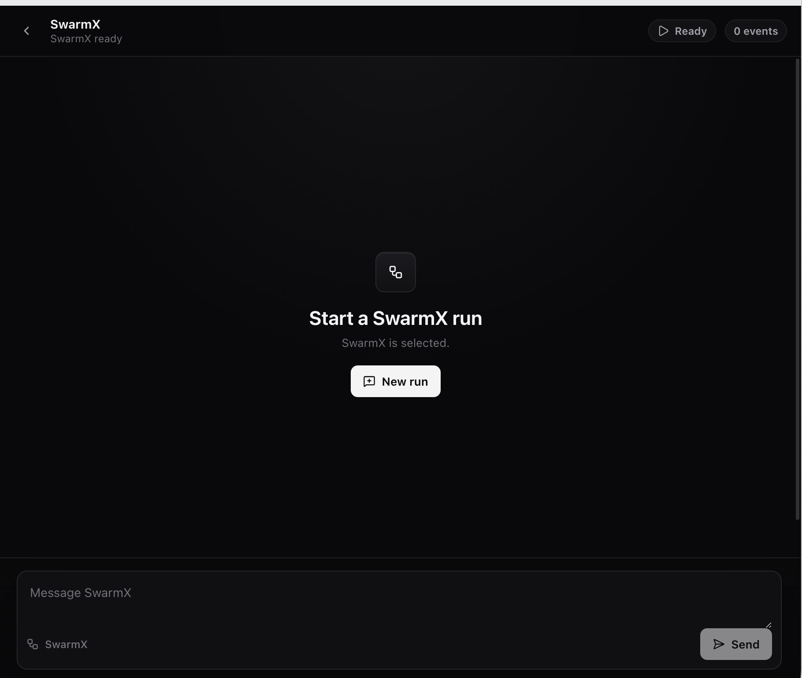

# SwarmX

A lightweight, stateless multi-agent orchestration framework with a TypeScript core, CLI, ACP server, and a user-friendly Electron desktop interface.

SwarmX now includes a polished desktop UI for browsing local and ACP sessions, switching harnesses, sending messages, and reading Markdown-rich agent output in one place.



## Architecture

This workspace contains:

- **`packages/core/`** — Core library with agents, swarms, MCP tools, session persistence, and OpenAI-compatible server
- **`packages/cli/`** — Command-line interface (`swarmx` binary)
- **`packages/acp-server/`** — Agent Client Protocol server
- **`packages/desktop/`** — Electron desktop application with React 19 UI

## How to Install

### Prerequisites

- Node.js >= 20
- pnpm >= 9

If pnpm is not already available, enable it through Corepack:

```shell
corepack enable
```

### Install from Source

```shell
git clone <your-swarmx-repo-url>
cd swarmx
pnpm install
pnpm build
```

### Configuration

SwarmX uses OpenAI-compatible provider settings. Export credentials in your shell before running the CLI, server, or desktop app:

```shell
export OPENAI_API_KEY="sk-..."
export OPENAI_BASE_URL="https://api.openai.com/v1"  # optional
export OPENAI_MODEL="gpt-4o"                         # optional, default: gpt-4o
```

For local OpenAI-compatible servers, start from the example file and adjust it for your provider:

```shell
cp .env.example .env
set -a
source .env
set +a
```

Or configure per agent via the `client` field:

```typescript
new Agent({
  name: "my-agent",
  client: { apiKey: "sk-...", baseUrl: "https://api.openai.com/v1" },
})
```

### Run the Desktop App

Launch the user-friendly Electron interface:

```shell
pnpm --filter @swarmx/desktop dev
```

The desktop app gives you a session sidebar, harness selector, Markdown/image rendering, and a focused composer for running agents without leaving the UI.

### Run the CLI

```shell
pnpm --filter @swarmx/cli swarmx
```

Start the OpenAI-compatible API server:

```shell
pnpm --filter @swarmx/cli swarmx serve --host 0.0.0.0 --port 8000
```

## Core Concepts

### Swarm vs Trace: Two Types of Graphs

**Swarm Graph (Your Workflow Blueprint)**
- A flowchart defining all possible paths agents can take
- Agents can loop back with conditions to prevent infinite loops
- Conditional routing using CEL expressions

**Trace Graph (What Actually Happened)**
- A record of one specific execution through your workflow
- Each agent run gets a unique ID
- Forms a tree structure for audit trails

### Usage Example

```typescript
import { Agent, Edge, Swarm, SwarmNode } from "@swarmx/core";

const agentA = new Agent({
  name: "agent_a",
  instructions: "You are a helpful agent.",
  model: "gpt-4o",
});

const agentB = new Agent({
  name: "agent_b",
  model: "deepseek-r1:7b",
  instructions: "You can only speak Chinese.",
});

const swarm = new Swarm({
  name: "demo",
  root: "agent_a",
  nodes: {
    agent_a: { kind: "agent", agent: { name: "agent_a", model: "gpt-4o", instructions: "You are helpful." } },
    agent_b: { kind: "agent", agent: { name: "agent_b", model: "deepseek", instructions: "Speak Chinese." } },
  },
  edges: [{ source: "agent_a", target: "agent_b" }],
});

const result = await swarm.execute({
  messages: [{ role: "user", content: "I want to talk to agent B." }],
});
```

## Project Structure

```
swarmx/
├── package.json                # Workspace root
├── packages/
│   ├── core/                   # Core orchestration library
│   ├── cli/                    # CLI binary (Commander)
│   ├── acp-server/             # ACP server implementation
│   └── desktop/                # Electron desktop app
│       ├── src/main/           # Main process + IPC
│       ├── src/preload/        # Context bridge API
│       └── src/renderer/       # React 19 SPA
└── docs/                       # Documentation
```

## Testing

```shell
pnpm test
```

## License

MIT
