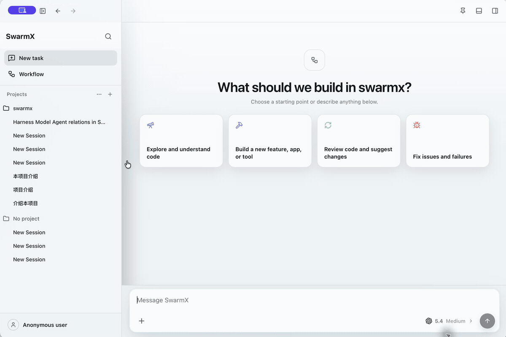

# SwarmX

Run local and ACP-compatible coding agents in one desktop workspace. SwarmX also provides a reusable TypeScript orchestration core and CLI.

<p align="center">
  <a href="docs/assets/swarmx-demo.mp4">
    
  </a>
</p>

<p align="center"><sub>Pick a Harness and Model, run a task, and inspect live agent work. Click for MP4.</sub></p>

## Install

### macOS app

Download the latest DMG from [GitHub Releases](https://github.com/tcztzy/swarmx/releases/latest):

- `arm64` for Apple silicon Macs
- `x64` for Intel Macs

Open the DMG and drag SwarmX to Applications.

### npm

Requires Node.js 20 or newer.

```shell
npm install swarmx
npx swarmx
```

`npx swarmx` opens Desktop. Installation itself never launches the app; the first launch may finish downloading the Electron runtime.

For a global command:

```shell
npm install --global swarmx
swarmx
```

## First run

Open **Anonymous user → Settings → Providers**, add an OpenAI-, Anthropic-, DeepSeek-, OpenCode Go-, or Ollama-compatible connection, then choose a Harness and Model in the composer. Custom Providers use one exact Base URL and key; OpenCode Go can keep additional plaintext backup keys with local usage counters and quota failover.

Provider credentials are stored as plaintext in the editable `~/.swarmx/provider-auth.json` file with restrictive permissions. The renderer never reads the file or receives plaintext credentials. The current file format is `schemaVersion: 2`; older encrypted auth files and legacy `local_keychain` Provider references are intentionally not migrated.

## CLI

Passing a CLI argument keeps the existing terminal workflow:

```shell
npx swarmx doctor
npx swarmx send "Explain this repository" --model gpt-5.6-sol
npx swarmx serve --port 8000
npx swarmx cli --help
```

Use `npx swarmx desktop` as an explicit Desktop alias.

Existing installs can preview and migrate legacy Session JSON files safely:

```shell
npx swarmx sessions migrate --dry-run
npx swarmx sessions migrate
```

The migration supports both prior TypeScript and Rust desktop formats, verifies
JSONL replay, then moves each old file into a timestamped backup.

## Develop from source

```shell
git clone https://github.com/tcztzy/swarmx.git
cd swarmx
corepack enable
pnpm install
pnpm --filter @swarmx/desktop dev
```

Validation:

```shell
pnpm lint
pnpm test
pnpm -r build
```

Create local macOS DMG and ZIP packages with:

```shell
pnpm --filter @swarmx/desktop dist:mac
```

## Packages

- `swarmx` — Desktop-first npm launcher with CLI compatibility
- `@swarmx/desktop` — Electron app and reusable renderer shell
- `@swarmx/core` — agents, swarms, MCP, ACP, sessions, and platform contracts
- `@swarmx/cli` — terminal commands and OpenAI-compatible server
- `@swarmx/acp-server` — ACP server adapter
- `@swarmx/runtime` — runtime detection, Doctor, and repair planning

## Documentation

- [Current product specification](SPEC.md)
- [Product vision](docs/vision.md)
- [Roadmap](ROADMAP.md)
- [Architecture and design](DESIGNS.md)
- [Full documentation](docs/index.md)
- [Extensions and Custom Agents](docs/extensions-custom-agents.md)
- [Multimedia attachments and previews](docs/multimedia.md)

## License

[MIT](LICENSE)
