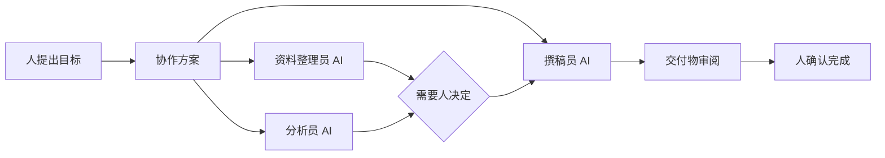
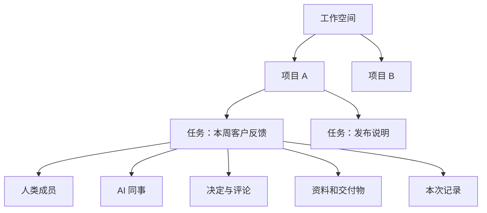
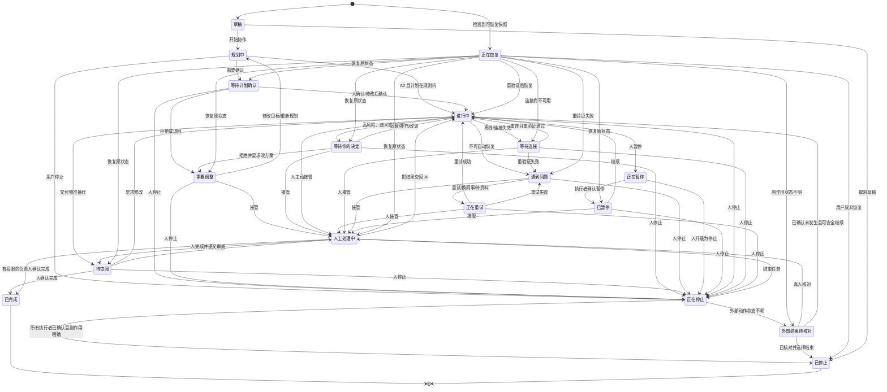
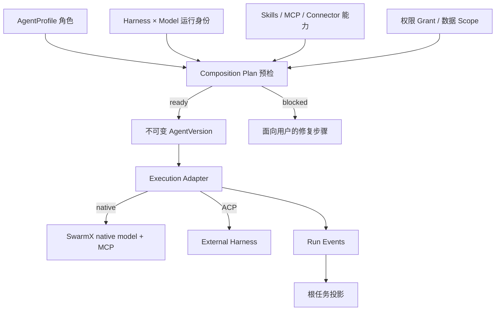
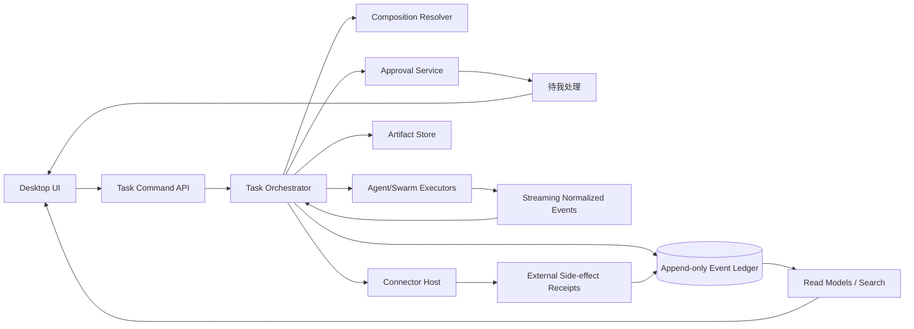

# SwarmX Agent-first 人机协同产品设计文档

> 状态：产品愿景与交互规格草案 · 版本：0.1 · 日期：2026-07-14
>
> 面向：产品、设计、研发、测试、插件/下游产品开发者
>
> 核心用户：没有技术背景的普通工作人员、业务负责人、审核人、团队管理员
>
> 适用端：SwarmX Electron Desktop，后续可扩展到 Web/Server 协作端

## 0. 文档定位

本文定义 SwarmX 从“开发者 Agent 控制台”走向“普通工作人员的人机协作空间”时的目标体验。它回答：

- 普通人第一次打开产品时看到什么、点击什么、如何在三分钟内得到第一次有价值的结果；
- 一个任务如何由多位 AI 同事接力，又如何让真实的人始终知道发生了什么、能随时暂停、修正、拒绝或接管；
- 新产品、新模型、新工具和新连接如何在不增加普通用户认知负担的前提下接入；
- 每个页面的结构、操作步骤、状态、文案、异常和微动效；
- 哪些能力当前已有，哪些只有底层契约，哪些需要新增产品与运行时能力。

本文是目标产品设计，不替代 `SPEC.md`、`DESIGNS.md` 或代码中的运行契约。当愿景与当前实现不一致时，必须显示标记：

- **[现有]**：当前工作树已有端到端能力，可以直接复用；
- **[补界面]**：已有数据结构或底层能力，缺面向用户的完整界面；
- **[新增]**：需要新增运行时、持久化、协作后端或权限执行能力；
- **[远期]**：需要真实用户研究和组织治理验证后再决定。

规范用词：

- “必须”表示发布前不可省略的安全、可用性或一致性要求；
- “应该”表示默认方案，只有经过记录的产品决策才可偏离；
- “可以”表示增强项；
- 页面编号用于设计、埋点、验收和测试用例引用，不要求直接成为 URL。

## 1. 一句话产品

**SwarmX 是一个让人类与多位 AI 同事在同一任务里分工、接力、核对和共同交付的工作空间。**

它不是工具商店，也不是把多个聊天窗口并排放置的控制台。用户从“我要推进什么工作”开始，SwarmX 在后台选择合适的 Agent、组织协作方案、汇总过程，并在需要判断、授权、承担责任或对外产生影响时把决定交还给人。

### 1.1 北极星体验

用户应该能自然地说：

> “请整理本周客户反馈，找出最常见的三个问题，写成给产品团队的简报。涉及客户原文时先让我确认。”

随后只需要理解五件事：

1. 这项任务要交付什么；
2. 哪几位 AI 同事会参与、各自负责什么；
3. 当前做到哪一步；
4. 什么时候需要自己决定；
5. 最终结果、依据和责任归属是什么。

用户不需要先理解 Harness、Model、Provider、ModelSupply、MCP、CEL、ACP 或 Trace。

### 1.2 成功定义

SwarmX 的成功不是“AI 自己做得越多越好”，而是：

- 人更容易表达意图、分配责任和校准结果；
- AI 承担机械、重复、耗时的推进工作；
- 关键判断仍由清楚知道上下文的人完成；
- 多 Agent 的复杂性被系统吸收，而不是转嫁给用户；
- 每个高影响动作都有明确的人类负责人、预览、理由与记录；
- 工作失败时保留已有成果，并把完整控制权交还给人。

## 2. 当前事实边界与诚实承诺

### 2.1 当前可复用的产品底座

当前仓库已经具备以下重要基础：

| 能力 | 当前事实 | 产品可复用方式 |
| --- | --- | --- |
| Agent 运行身份 | 稳定身份是 `harnessId:modelId` | 作为 AI 同事“运行方式”中的可追溯身份，默认折叠 |
| Agent Profile | 可保存角色名称、说明、指令、技能、MCP、权限、记忆等 | 直接成为“AI 同事档案” |
| Agent 组合预检 | 可解析 Harness、Model、Supply、Provider、Skill、MCP 与阻塞要求 | 成为“可用性检查”和连接前预检 |
| 单 Agent 执行 | SwarmX 原生调用及外部 ACP Harness | 成为任务中的一位执行者 |
| 顺序 Swarm | 可按 root、node、edge 顺序运行 Agent/Tool/Swarm 节点 | 成为早期“协作方案”的执行底座 |
| 本地 Session | 本地 JSON 会话历史已在 Desktop 端到端接入 | 成为单机“任务历史”初始形态 |
| ACP Session 原语 | Core/Main 已有显式 opt-in 的 discovery/load 原语；Renderer 默认没有传入 Harness 清单，也未展示 | 作为未来外部历史导入的底层能力，不能标成当前用户能力 |
| 停止 | Renderer 到 Main、原生调用和 ACP 的请求取消 | 全局“一键停止” |
| 过程呈现 | 消息、思考、工具、结果、规范化 Trace 卡 | 成为“工作过程”和“工作凭证” |
| Workflow | SwarmConfig JSON、可视化原型、n8n 结构导入 | 成为高级协作方案编辑器的底座 |
| Extensions | Harness、Model、Agent、Skill、MCP、Connector、UI contribution 等被动清单 | 成为 AI 同事与产品包目录的数据来源 |
| Provider Settings | 加密凭据、模型目录、额度矩阵 | 成为管理员层“AI 服务连接” |
| Doctor 与 Setup | Doctor 当前是只读检查；显式 Harness Setup/Install 是另一条已有流程。通用修复计划当前为空、执行为 no-op | 复用检查与显式安装入口；“计划 → 风险 → 确认 → 执行 → 结果”作为待建设的 HITL 目标范式 |
| Workspace tools | Review、Files、Browser、Terminal | 成为任务右侧“资料与工作凭证”；技术工具进高级区 |
| 安全 | Electron 隔离、有限 preload API、凭据加密、远程媒体默认阻止 | 保持为所有新页面的硬边界 |

### 2.2 当前不能宣称已经具备

产品文案、营销和演示不得把以下目标能力描述成当前已交付：

- 当前 Swarm 节点是串行调度；没有并行 worker；
- 上游 Agent 输出不会自动成为下游 Agent 输入，不能宣称已完成真实成果接力；
- 当前节点最多运行一次，不能宣称已支持自动返工循环；
- 当前审批、`needs_human`、证据包和 ActionConfirmation 主要是无副作用契约，不是可暂停并恢复的运行闭环；
- ACP 权限请求当前不会进入真人审批；
- 本地 Session 不是可跨崩溃恢复的工作流快照；
- 当前 Eval Trace 是扁平事件，不是完整父子 Trace Tree；
- Extensions 页面是被动资产清单，不会自动安装、授权、启停或隔离第三方组件；
- 没有团队身份、多人工作空间、评论、任务指派、组织角色、通知投递或租户隔离；
- MCP 配置与外部 ACP Harness 的实际注入存在能力边界，不能笼统承诺“所有 Agent 都能使用所有已选工具”。

### 2.3 发布时的分层承诺

| 层级 | 可以对用户说 | 不可以说 |
| --- | --- | --- |
| 当前版 | “选择 AI 运行方式，执行单次任务或顺序多 Agent 方案，查看过程并随时停止” | “多位 Agent 已共享上下文并实时协同” |
| Human-loop 版 | “任务可停在决定点，审批后从保存位置继续” | “AI 可替你承担审批责任” |
| 团队协作版 | “人与 AI 在同一项目和任务中分工、评论、审核和交付” | “所有第三方连接天然安全可信” |
| 自治版 | “经组织明确配置后，低风险重复工作可按规则自动运行” | “系统会自动提高自治级别” |

## 3. 产品设计原则

### P1. 目标先于技术

首次进入、首页和新建任务只问“想推进什么工作”。Harness、Model、Provider、MCP 等概念不得出现在首次任务主路径中。

### P2. Agent first，不是 Tool first

工具是 AI 同事的能力，不是一级导航、聊天对象或独立人格。任何新产品接入后，普通用户首先看到的是“它能为我承担什么角色”，而不是一长串 API 和工具名。

### P3. 人类拥有方向、边界与最后责任

AI 可以建议、执行、比较和提醒，但不能代替指定的人类负责人批准高风险动作，也不能把“AI 已生成”写成“人已确认完成”。

### P4. 复杂过程先摘要，证据随时可查

默认显示有意义的阶段状态、接力摘要、决定点和交付物。模型思考、工具入参、原始 Trace 和技术来源放在逐层展开的“过程记录”中。

### P5. 主动权可逆、可暂停、可接管

运行时始终提供“暂停/停止”；每个失败状态都提供继续、换人、跳过、补充信息或人工接管。不可逆动作必须先预览。

### P6. 失败不抹掉人的时间

失败后保留已完成步骤、资料、草稿、决定和下一步建议。不得要求用户从零重新描述任务。

### P7. 清楚标识 AI，不制造虚假拟人

AI 同事可以有友好名称和稳定图标，但必须一直带“AI”标识。不得使用真实人脸暗示真人，不得把 Agent 的自动判断显示为某位真人的批准。

### P8. 安静的技术

只有直接提及、分配给我的决定、因我而阻塞、关键完成或最终失败能主动打断人。普通工具调用、内部 handoff 和可自动重试错误只进入任务记录。

### P9. 渐进式信任，不自动升级自治

新用户从“每步看得见、关键处确认”开始。确定性策略检查可以建议更保守/合适的规则；若建议使用模型，必须由具名 Agent 署名。任何建议都不得根据使用频率静默扩大权限或自动提高自治级别。

### P10. 计划图与事实图严格分开

“协作方案”表示可能怎样工作；“本次记录”表示实际发生了什么。两者必须有不同标题、颜色语义和切换入口，不得混成一张看似确定的图。

## 4. 目标用户与工作场景

### 4.1 核心角色

#### U1 普通执行者

- 典型角色：运营、销售、行政、HR、市场、客户成功、项目助理；
- 技术背景：不了解模型、API、工作流引擎；
- 需求：把资料整理、初稿、跟进、比对等耗时工作交给 AI，但能随时纠正；
- 最大担忧：不知道 AI 在做什么、把错误内容发出去、需要学习复杂配置。

#### U2 业务负责人/审核人

- 典型角色：团队经理、项目负责人、法务/财务/品牌审核人；
- 需求：只在真正需要时收到完整、可判断的决策包；
- 最大担忧：审批疲劳、责任模糊、AI 结论没有依据、通知过量。

#### U3 工作空间管理员

- 典型角色：部门管理员、IT 支持、AI 运营；
- 需求：添加 AI 服务、连接业务系统、限定权限、维护 AI 同事和协作模板；
- 最大担忧：密钥泄露、能力漂移、模型静默变化、第三方扩展不可信。

#### U4 方案搭建者

- 典型角色：业务流程专家、低代码实施者；
- 需求：用自然语言和可视化方式编排多位 AI 同事；必要时查看 JSON/CEL；
- 最大担忧：图能画但不能真实执行、失败无法恢复、复杂配置难以交接。

### 4.2 优先场景

| 场景 | 参与者 | AI 分工示例 | 人类必须参与的点 | 优先级 |
| --- | --- | --- | --- | --- |
| 周报/经营简报 | 运营 + 负责人 | 资料收集、数据核对、分析、撰稿 | 确定受众、确认敏感数据、批准定稿 | P0 |
| 客户反馈整理 | 客户成功 + 产品 | 去重、分类、证据摘录、趋势分析 | 判断优先级、核准客户原文、决定回复 | P0 |
| 会议准备与跟进 | 项目助理 + 参会者 | 汇总背景、议程、纪要、行动项 | 确认责任人和截止日期 | P0 |
| 文档/方案审阅 | 撰写者 + 审核人 | 事实核对、结构审阅、风险审阅 | 接受修改、承担最终观点 | P0 |
| 营销内容制作 | 市场 + 品牌/法务 | 研究、创意、文案、合规预检 | 选择方向、品牌/法务批准、发布 | P1 |
| 采购比选 | 采购 + 财务 | 提取报价、对齐口径、风险比较 | 供应商选择、预算批准、签约 | P1 |
| HR 入职协同 | HR + 直属经理 | 清单、资料准备、提醒 | 访问授权、个人数据处理、责任确认 | P1 |
| 周期性运营巡检 | 运营 + 值班人 | 定时读取、比对、生成异常报告 | 异常处置、权限变化、外部写入 | P2 |

### 4.3 两条黄金路径：零配置信心与真实资料价值

**A. 三分钟零配置安全示例**

1. 新用户在 O02 选择“使用示例空间”。
2. 系统提供明确标记的受限演示 AI 同事，只读取内置匿名资料、禁止外部写入和长期记忆。
3. 用户点击“整理一份示例周报”，看到一行单步/多步摘要并确认。
4. AI 真实运行沙盒任务，展示阶段、来源和一张由用户确认的交付物。
5. 完成页解释：“这是示例资料；连接自己的资料后，SwarmX 仍会先显示范围和决定点。”

这条路径验证心智模型和交互，不证明真实连接已配置；不得把示例结果混入组织数据或真实任务指标。

**B. 真实资料首次价值**

前提：工作空间已经有一位可用 AI 同事或用户已登录可复用的 AI 服务。此路径从明确授权真实资料开始单独计时，不承诺三分钟完成连接、运行和真人等待。

1. 用户打开 SwarmX，首页焦点位于“今天想推进什么工作？”。
2. 用户点击“整理一份周报”示例卡。
3. 输入框自动填入可编辑模板：“整理本周进展、风险和下周计划，写给部门负责人。”
4. 用户通过“添加资料”选择文件夹、文档或表格。
5. 页面在输入框上方显示：“将由资料整理员和撰稿员协作；对外发送前一定会问你。”
6. 用户点击“开始协作”。
7. 已审核模板由本地规则展开；非模板目标由具名“协作规划助手”生成三到五步简明计划，并标出一个“定稿前由你确认”的检查点。
8. 用户点击“按此计划开始”，或直接修改交付物/删掉某一步。
9. 任务房间显示阶段状态和接力摘要，不展示内部工具噪声。
10. 初稿完成后，“待我处理”出现一张带预览、来源和风险说明的审阅卡。
11. 用户选择“编辑后确认”或“确认完成”。
12. 任务显示“AI 起草，张琳审阅”，并保留过程记录。

如果没有可用 AI 服务，第 5 步改为轻量拦截：“还差一步：准备一位 AI 同事”，优先提供已登录账户或管理员配置，不直接展示 Base URL 与 API protocol。

## 5. Agent-first 产品模型

### 5.1 两个必须同时成立的公式

系统不变式：

> **Agent 运行身份 = Harness × Model**

用户心智模型：

> **AI 同事 = Agent 运行身份 + 角色档案 + 工作资料 + 能力 + 权限边界**

同一 Harness × Model 可以承载“研究员”和“法务审阅员”两个不同角色档案；它们的运行身份相同，但职责、指令、资料和权限不同。界面必须能解释这一层次，避免把运行身份、角色模板和某次运行实例都混称为同一个对象。

### 5.2 用户层与系统层映射

| 普通用户看到 | 产品含义 | 当前/目标技术映射 |
| --- | --- | --- |
| AI 同事 | 有名称、职责、能力和边界的协作者 | AgentProfile + resolved `harnessId:modelId` |
| 工作方式 | 这位同事怎样执行工作 | Harness |
| 思考引擎 | 用哪一类模型进行理解和生成 | Model |
| 思考深度 | 本次速度/成本/推理强度 | Effort |
| AI 服务连接 | 提供模型访问和额度的连接 | Provider |
| 内部路线 | 某模型从哪个连接获得 | ModelSupply，仅系统可见 |
| 能力 | 可读取/操作的业务系统与方法 | Skill、MCP、Tool、Connector |
| 协作方案 | 角色、先后顺序、条件与人类检查点 | SwarmConfig + host policy |
| 本次记录 | 实际执行步骤、结果、错误和来源 | run/invocation/render/autonomy events |
| 任务 | 有目标、状态、讨论、决定与交付物的根对象 | Session/Conversation + WorkItem，目标态 |

### 5.3 新产品接入规则

“接入一个新产品”可能代表不同东西，系统必须先正确归类：

| 接入对象 | 应成为 | 不应成为 |
| --- | --- | --- |
| Codex、Claude Code、OpenCode 等自带 Agent 循环的产品 | Harness，优先 ACP/custom backend | 一组散落工具 |
| 新模型或模型 API | Model + Provider + ModelSupply | 新的业务角色 |
| CRM、邮件、文档、数据库、飞书等业务能力 | Connector/MCP/Tool，挂到 AI 同事的“能力” | 独立人格或一级导航 |
| 销售助理、研究员、审阅员等岗位 | AgentProfile，绑定默认 Harness × Model | Provider |
| 多岗位协作 | SwarmConfig/协作方案 | 多个互不关联的聊天 |
| 产品专属页面 | 宿主注册的安全 UI contribution | Manifest 中可执行的任意远程 UI |

### 5.4 “添加新产品”的 Agent-first 契约

任何产品包进入普通用户界面前，必须能回答：

1. 它为用户带来哪一位或哪几位 AI 同事；
2. 每位 AI 同事的工作结果是什么；
3. 其 Harness 与 Model 是否兼容、运行环境是否准备好；
4. 它需要哪些资料和权限；
5. 哪些动作只读，哪些会写入、联网、发送、安装或删除；
6. 哪些步骤一定等待人；
7. 如何暂停、失败恢复和卸载；
8. 版本、来源、维护者和最近一次验证状态。

如果一个扩展只贡献工具而没有角色，产品安装流程必须让管理员把这些工具绑定给已有 AI 同事，或创建一个新的 AgentProfile；不能把工具本身直接放进“AI 同事”列表。

### 5.5 接入后的普通用户呈现

普通用户看到：

- “客户反馈助手”；
- “擅长：读取客服工单、归类问题、生成回复草稿”；
- “不会：自动向客户发送、修改订单、查看未授权客户”；
- “对外发送前会请你确认”；
- “运行方式”折叠项。

管理员展开后看到：

- Harness、Model、Effort；
- Provider 连接状态与最近验证；
- Skill、MCP、Connector 列表；
- Secret reference 状态，不显示密钥值；
- 权限、网络、文件、执行和信任风险；
- 插件来源、版本与 UI contribution。

### 5.6 计划图和记录图

- 上图在“协作方案”中表示预期关系；
- 实际运行必须另开“本次记录”，按时间显示真正发生的 Agent run、handoff、重试、跳过和决定；
- “人类检查点”是持久、fail-closed 的宿主状态，不得用当前 fail-open 的 CEL edge 充当权限门；
- 在现有 SwarmConfig 尚未支持暂停恢复前，检查点只能标记为 [新增] 目标能力，不能伪装成已经可运行的节点。

### 5.7 系统智能必须有身份

Agent-first 不允许出现一个看不见的“系统 AI”。凡是读取用户内容并进行生成、分类、总结、推荐或规划的模型调用，都必须解析为一位可追溯的 Agent；不使用模型的调度与校验则必须明确标为确定性宿主逻辑。

| 能力 | 默认实现 | 用户如何追溯 | 失败/替换规则 |
| --- | --- | --- | --- |
| 可用性、权限、版本、预算守卫 | Task Orchestrator 的确定性规则 | “检查详情”显示规则版本，不显示成 AI 同事 | fail-closed；不能改用模型猜测 |
| AI 同事兼容性过滤 | composition preflight 的确定性规则 | 显示排除原因 | 无兼容项则让人选择或配置 |
| 常用交付物 chip | 本地模板与关键词规则 | 标为“常用建议” | 规则失败只隐藏建议 |
| 语义交付物建议 | 具名“协作规划助手” Agent | 建议旁显示“由协作规划助手建议” | 可禁用/更换；失败回退到手填 |
| 多 Agent 计划草案 | 具名“协作规划助手” AgentVersion | 计划卡显示运行身份、资料范围、成本与记录入口 | 不可用时使用已审核模板或手动计划，不能调用隐藏模型 |
| Agent 排序理由 | 确定性匹配分 + 可选协作规划助手解释 | “为什么推荐”区分规则与 AI 解释 | AI 解释不能越过兼容性/权限过滤 |
| 风险级别与审批人数 | 组织策略与 ActionIntent 规则 | 决定卡显示命中的策略 | AI 只能提示潜在风险，不能降低等级 |
| 接力摘要、分歧摘要 | 当前计划中具名总结 Agent；若无则模板化宿主摘要 | 本次记录显示 invocation 与来源 | 原始主张和证据始终保留 |

“协作规划助手”是一份平台提供但普通人可以看到、禁用和替换的 AgentProfile：它也必须解析到 `Harness × Model`，拥有版本、维护者、资料范围、权限、成本、事件记录和数据策略。它不是 Task Orchestrator。Task Orchestrator 是不调用模型的状态机/调度器，只负责守卫、事件、暂停恢复、幂等和路由；若未来某项 orchestrator 能力使用模型，该部分必须单独变成具名 AgentInvocation。

界面用语约束：可以写“SwarmX 正在检查权限”，因为这是确定性逻辑；涉及生成时必须写“协作规划助手正在起草计划”，不能写模糊的“系统正在智能生成”。

## 6. 渐进式概念披露

### 6.1 五层信息密度

| 层 | 用户问题 | 默认内容 | 进入方式 |
| --- | --- | --- | --- |
| L0 目标 | “我要完成什么？” | 任务描述、资料、交付物、截止时间 | 首页与新建任务 |
| L1 计划 | “谁做、怎么做、何时问我？” | AI 同事、步骤、人类检查点、预计范围 | 开始前计划卡 |
| L2 进度 | “现在到哪了？” | 阶段、负责人、接力摘要、阻塞、交付物 | 任务主时间线 |
| L3 记录 | “依据和过程是什么？” | 来源、工具摘要、参数、产物、错误、决定收据 | 展开“过程记录” |
| L4 技术 | “具体怎样运行？” | Harness、Model、Effort、MCP、Provider、CEL、raw ref | 高级设置/管理员模式 |

不得在 L0-L1 里展示 L4 内容，除非当前问题就是“配置运行方式”。

### 6.2 术语替换

| 技术词 | 普通界面 | 高级界面说明 |
| --- | --- | --- |
| Session | 任务 | 会话/Session id |
| Agent | AI 同事 | Agent profile 与运行身份 |
| Agent Picker | 与谁一起做 | Agent composition |
| Swarm | AI 工作组 | SwarmConfig |
| Workflow | 协作方案 | Workflow/Swarm JSON |
| Swarm graph | 协作计划 | Blueprint |
| Trace graph | 本次记录 | Run trace |
| Harness | 工作方式 | Harness runtime |
| Model | 思考引擎 | Model id |
| Effort | 思考深度 | Reasoning effort |
| Tool/MCP | 能力 | Tool/MCP server |
| Provider | AI 服务连接 | Provider profile |
| ModelSupply | 不显示 | Internal route |
| Handoff | 已交给……继续 | Edge/invocation handoff |
| Interruption | 等待你的决定 | needs_human |
| Context packet | 已提供的资料 | Context packet |
| Artifact | 交付物/工作凭证 | Artifact reference |
| Doctor | 运行检查 | Runtime doctor |
| Extension | AI 同事与连接 | Extension bundle |
| Execute workflow | 开始协作 | Execute Swarm |
| Event | 进展 | Normalized render event |

#### 6.2.1 不得混用的核心名词

以下词是全产品唯一含义，页面不得为了“更亲切”而互换：

| 名词 | 唯一含义 | 不能用来表示 |
| --- | --- | --- |
| 运行身份 | 精确的 `Harness × Model` 组合，是一次 Agent 解析后的稳定身份 | 角色名称、某次调用实例 |
| 运行方式 | 用户可展开的配置容器，包含工作方式、思考引擎、思考深度与版本 | 单独的 Harness |
| 工作方式 | Harness，即 Agent 循环怎样执行 | Model 或完整运行身份 |
| 工作空间 | 人员、组织策略和项目的顶层协作边界；本地个人版也只有一个“个人工作空间” | 文件系统目录 |
| 项目 | 工作空间内承载长期目标、成员、资料范围和默认规则的容器 | 一次任务或任意 `cwd` |
| 本地资料位置 | 用户明确选中的文件夹及其授权范围 | 团队/租户工作空间 |
| 工作位置 | 只用于 O02 问题文案，表示“本地资料位置、示例空间或团队空间”三选一 | 持久化领域对象 |
| 任务负责人 | 对目标、范围和最终交付负责的真人 | 当前正在执行的 AI |
| 当前执行者 | 当前步骤正在工作的真人或 AI 同事 | 任务最终责任人 |
| 当前审核人 | 被明确指派做某个决定或审阅的真人 | 关注者或当前执行者 |

代码、埋点和文档字段必须分别使用 `runtimeIdentity`、`runtimeSettings`、`harnessId`、`workspaceId`、`projectId`、`localSourceRoot`、`humanOwnerId`、`activeActorRef`、`reviewerId`，不能复用一个 `owner` 或 `workspace` 字段承载多个含义。

### 6.3 首次使用的概念预算

首次任务前最多引入三个新词：

1. 任务；
2. AI 同事；
3. 待你决定。

“协作方案”和“交付物”在第一次任务运行中按需出现；“AI 工作组”只在用户明确需要多个角色或打开模板时出现；技术层概念永远不通过强制教学引入。

## 7. Human-in-the-loop 产品契约

### 7.1 人类参与不是异常态

“等待你的决定”是任务的正常主状态，与“进行中”“待审阅”同级，不得显示为红色错误。只有数据丢失、安全违规、不可恢复失败或超时风险才使用危险色。

### 7.2 自治级别

沿用底层 A0-A4，但普通界面使用可理解名称：

| 级别 | 普通名称 | AI 可做 | 人必须做 | 默认适用 |
| --- | --- | --- | --- | --- |
| A0 | 只给建议 | 阅读已授权资料、提出建议 | 执行所有变更 | 高风险首次场景 |
| A1 | 一步一确认 | 完成当前只读/草稿步骤 | 每个有影响步骤确认 | 新用户、新连接默认 |
| A2 | 按计划推进 | 执行已批准计划中的低风险步骤 | 计划确认、高风险动作、最终交付 | 普通任务目标默认 |
| A3 | 按规则自动 | 在明确范围内运行重复任务 | 异常、范围变化、定期复核 | 稳定模板、管理员配置 |
| A4 | 受监督自治 | 持续调度、自动重试、低风险闭环 | 策略、审计、重大异常 | 远期，仅组织级 |

规则：

- 系统不得自动升级自治级别；
- A2 以上必须显示作用范围、有效期、可撤销方式和人类负责人；
- 更换 Harness、Model、权限、工具、数据范围或任务目标后，原审批不得无条件沿用；
- A3/A4 必须先在只读或沙盒模式试运行；
- 每个任务都能临时降低自治级别；
- 高风险动作不因 A4 而免除明确的人类责任。

### 7.3 风险与确认矩阵

| 风险层 | 示例 | 默认行为 | 对应底层风险 |
| --- | --- | --- | --- |
| R0 只读 | 搜索、读取已授权文件、计算、生成本地草稿 | 已授权范围内直接执行并记录 | `read_only` |
| R1 可撤销本地变更 | 新建草稿、修改私有副本 | 预览或事后可撤销，首次提示 | `writes_files/settings` |
| R2 共享范围变更 | 修改共享文档、启动连接、写业务系统 | 每任务/每作用域明确确认 | `network`、`writes_*` |
| R3 对外或执行 | 发消息、发布、执行代码、下载并运行 | 完整预览、仅本次同意、记录人 | `executes_code`、`downloads_code`、`secrets` |
| R4 不可逆/重大 | 删除、付款、合同、权限/信任变化、HR 决策 | 双步骤，必要时双人审批；不得记住同意 | `destructive`、`trust_change` |

#### 7.3.1 R4 不可降级子流程

R4 不是一张通用确认框。ActionIntent 必须先落入下列确定类别；分类不明时采用更严格流程。组织策略可以提高要求，不能低于表中默认值。

| R4 类别 | 示例 | 必须审批 | 职责分离 |
| --- | --- | --- | --- |
| `R4_PERSONAL_DESTRUCTIVE` | 永久删除仅属于本人的本地草稿且无他人访问 | 同一位有权真人完成“影响预览 → 再认证 → 具体动词确认”两步 | 不要求第二人；必须有明确恢复窗口或写明不可恢复 |
| `R4_PERSONAL_SIGNED_INSTALL` | 在个人工作空间安装已签名、目录已审核、无提权、最小挂载的 Apple Container/本地 Harness | 资源所有者完成“来源/权限预览 → OS 再认证 → 具体动词确认”两步 | 不要求第二人；仅限个人 scope，不能授予组织信任或绕过沙盒 |
| `R4_SHARED_DESTRUCTIVE` | 删除团队项目、共享资料、审计记录 | 任务/数据负责人 + 工作空间管理员或数据管理员，两位真人 | 发起人不能兼任第二审批人 |
| `R4_FINANCIAL_CONTRACT` | 付款、下单、签署合同、修改付款账户 | 业务负责人 + 财务/法务授权人，两位真人 | AI、同一账号、代理给自己均不合格 |
| `R4_HUMAN_DECISION` | 录用、解雇、绩效、薪酬、医疗/福利重大决定 | 业务授权人 + HR/合规授权人；系统只能准备材料 | AI 不得成为决策人；受影响人的申诉/纠错通道必须存在 |
| `R4_PRIVILEGE_TRUST` | 扩大管理员权限、信任插件、安装可执行代码、改变安全策略 | 资源所有者 + 安全/工作空间管理员 | 受益账号不能作为唯一审批链 |
| `R4_MASS_EXTERNAL` | 超过组织阈值的批量发送/公开发布 | 内容负责人 + 渠道/合规审核人 | 两人看到相同最终版本和收件人集合 |

固定交互契约：

1. 创建不可变 `ApprovalIntentVersion`，冻结对象集合、内容 hash、权限 diff、金额/数量、AgentVersion、连接和策略版本。
2. 第一位审批人看到完整影响与替代方案；批准后只进入“等待第二位审批”，不执行动作。
3. 第二位审批人必须看到与第一位相同的最终内容、完整差异、第一位的角色与理由；不能只收到“某人已同意”。
4. 任何内容、对象、金额、收件人、权限、Agent/模型、连接或策略变化都创建新版本，并使旧审批全部失效。
5. 任一人拒绝后进入 `AWAITING_ADJUSTMENT`，保留理由；不得自动改派另一人绕过拒绝。
6. 审批人在执行前可以撤回；撤回后状态回到“等待你的决定”并写收据。
7. 审批按组织 TTL 过期；过期后必须查看当前版本重新批准，不能续期旧点击。
8. 指定人员不可用时 fail-closed，只允许转给满足同一资格和职责分离的真人；不能降为单人、转给 AI 或使用“管理员兜底”绕过。
9. 最后一次批准后，Executor 在同一提交边界重新验证版本、策略、人数和幂等键；验证失败不产生外部动作。
10. 执行结果无明确回执时进入 `SIDE_EFFECT_UNKNOWN`，必须由真人在外部系统核对。
11. R4 永不出现“记住我的选择”“本任务自动同意”或默认勾选的同意框。

第二审批人收到的是 I01 行动事项，而不是普通通知。待第二人期间，依赖步骤保持暂停；任务负责人可撤回、换合格审批人或停止任务，但不能执行。

个人工作空间的单人例外只适用于 `R4_PERSONAL_DESTRUCTIVE` 和 `R4_PERSONAL_SIGNED_INSTALL` 的全部守卫同时成立。来源未知/签名无效、需要管理员权限、原生安装脚本、广泛 home/网络访问、改变系统信任或发布给团队时，必须升级为 `R4_PRIVILEGE_TRUST`；个人版没有第二位合格真人时明确显示“此操作需要团队安全审核，个人空间不能继续”，提供选择已审核版本或取消，不用同一人点两次伪造职责分离。

### 7.4 决策卡的固定结构

每个决策卡必须包含：

1. **业务结果标题**：例如“向 120 位客户发送这封更新”，不得只写“允许 sendEmail”；
2. **谁提出**：AI 同事名称、AI 标识、所属步骤；
3. **为什么现在需要**：一句业务解释；
4. **将读取什么、改变什么、影响谁**；
5. **完整预览或差异**：邮件、文档改动、权限、命令、目标对象；
6. **风险、可逆性和撤销方式**；
7. **建议与其他选项**：不得把建议伪装成唯一选择；
8. **按钮**：R0-R3 使用“编辑后同意”“仅本次同意”“拒绝并说明”“接管处理”；R4 改用 7.3.1/T04 的“提交我的审批”或满足最后一位时的“批准并执行”，并保留“拒绝并说明”“接管处理”；
9. **下一步**：每种选择之后任务会怎样继续；
10. **责任收据**：决定人、时间、理由、范围、版本。

“本任务内同类操作自动同意”只允许 R0-R2，且只能放在二级菜单，并同时限定 Agent、能力、数据范围、目标对象与任务。参数或影响范围实质变化时必须再次确认。R3 默认仅本次确认；R4 永不显示自动同意、记住选择或“编辑后同意”。

### 7.5 接力卡的固定结构

Agent 间的内部对话默认不逐条展示。每次有意义的 handoff 只产生一条摘要：

> 资料整理员已把 18 条客户反馈和 3 个待核对问题交给分析员。

展开后可查看：

- 上一位 AI 同事；
- 下一位 AI 同事；
- 交接目标；
- 交付物/上下文引用；
- 已知限制和未解决问题；
- 运行身份与工具来源（高级层）。

在真实跨 Agent 成果通道实现前，该卡只能用于展示明确传递过的宿主产物，不能根据节点顺序推测“已经交接”。

### 7.6 人类责任与署名

- 交付物必须区分“AI 起草”“人类编辑”“人类审阅”“人类批准”；
- AI 不进入组织审批人的候选列表；
- 人类评论和 AI 输出在视觉与数据上分开；
- 一个任务必须有明确的人类负责人；
- AI 的推荐不等于负责人决定；
- 管理界面不得用在线时长、阅读回执或 AI 使用量进行员工监控；
- 日常协作不使用焦虑式倒计时或羞辱性逾期文案。

## 8. 信息架构

### 8.1 普通用户主导航

| 入口 | 用户问题 | 内容 | 默认可见 |
| --- | --- | --- | --- |
| 工作台 | “今天最需要我做什么？” | 继续任务、待我决定、最近交付物、快捷开始 | 是 |
| 任务 | “所有工作进展在哪里？” | 按项目/状态/负责人筛选的任务 | 是 |
| 待我处理 | “什么事情正在等我？” | 决定、提及、阻塞、待审阅 | 是，有数量 |
| AI 同事 | “谁能帮我做这件事？” | 同事目录、能力、状态、负责人 | 是 |
| 协作方案 | “怎样让多位同事重复配合？” | 模板与可视化方案 | 权限/用量触发后显示 |
| 搜索 | “那条任务、决定或资料在哪？” | 全局搜索与命令 | 是 |

账号菜单：

- 个人偏好；
- 通知与免打扰；
- 工作空间管理（有权限时）；
- 设置；
- 帮助与反馈；
- 更新。

管理员设置：

- AI 服务连接；
- 产品与数据连接；
- AI 同事运行方式；
- 权限、安全与数据；
- 运行检查；
- 扩展与高级清单。

### 8.2 项目与任务的关系

- 项目是长期容器，承载成员、资料、AI 同事、模板和默认通知；
- 任务是一次有目标、有状态、有交付物的根讨论；
- 子 Agent 不创建新的一级聊天，所有更新挂在根任务；
- 普通回复进入根任务并提供给当前步骤执行者；需要指定时使用 `@AI同事` 或 `@人`；
- 工具调用、Agent handoff 和内部重试只进入任务记录，不进入项目主消息流。

### 8.3 任务状态机

实现时 Mermaid 图必须由与状态守卫共用的 transition registry 生成；上图和 8.3.1 任一不一致都阻止发布。8.3.1 是字段、按钮、筛选和测试的规范源，图用于阅读，不维护第二份独立枚举。

#### 8.3.1 权威状态词表

这是唯一的任务状态词表。页面可以显示阶段说明，但不得发明另一个“近义状态”；例如“已取消”不是状态，取消草稿后也记录为 `STOPPED`，原因是 `cancelled_before_start`。

| 代码 | 用户文案 | 进入事件与守卫 | 允许的主要命令 | 退出事件 | 可恢复/终态 |
| --- | --- | --- | --- | --- | --- |
| `DRAFT` | 草稿 | 目标已保存；未开始执行 | 编辑、删除草稿、开始协作 | `planning.requested` / `stop.requested` | 可恢复/否 |
| `PLANNING` | 规划中 | 计划生成者身份与资料范围已确定 | 停止、查看生成者、缩小资料 | `plan.proposed` / `run.auto_started` / `stop.requested` | 可恢复/否 |
| `AWAITING_PLAN` | 等待计划确认 | 计划版本已持久化且需要人确认 | 同意、修改、拒绝、停止 | `plan.approved` / `plan.returned` / `stop.requested` | 可恢复/否 |
| `AWAITING_ADJUSTMENT` | 需要调整 | 决定或计划被拒绝，并记录理由 | 编辑目标、改计划、指派真人、停止 | `replan.requested` / `human.takeover` / `stop.requested` | 可恢复/否 |
| `RUNNING` | 进行中 | 计划、身份、权限、版本和预算均通过守卫 | 补充信息、暂停、停止、接管 | `approval.requested` / `artifact.ready` / `run.blocked` / `connection.lost` / `pause.requested` / `stop.requested` / `human.takeover` | 可恢复/否 |
| `AWAITING_DECISION` | 等待你的决定 | 决定请求及运行游标已持久化；依赖步骤已停 | 同意、拒绝、补充、转交、接管、停止 | `approval.resolved` / `plan.returned` / `human.takeover` / `stop.requested` | 可恢复/否 |
| `IN_REVIEW` | 待审阅 | 交付物版本与审核人已锁定 | 确认、要求修改、接管、停止 | `review.approved` / `review.returned` / `human.takeover` / `stop.requested` | 可恢复/否 |
| `WAITING_CONNECTION` | 等待连接 | 本地事件已落盘；不得假定外部动作失败 | 重连、离线查看、接管、停止 | `connection.revalidated` / `run.blocked` / `human.takeover` / `stop.requested` | 可恢复/否 |
| `BLOCKED` | 遇到问题 | 错误已分类，已有成果已保存 | 补资料、换 AI、重试、接管、停止 | `retry.requested` / `human.takeover` / `stop.requested` | 可恢复/否 |
| `PAUSING` | 正在暂停 | 已发出取消/暂停信号，尚未得到所有执行者确认 | 仅查看、升级为停止 | `pause.confirmed` / `stop.requested` | 可恢复/否 |
| `PAUSED` | 已暂停 | 所有执行者已确认暂停，游标与产物已保存 | 继续、编辑后重验证、接管、停止 | `resume.requested` / `human.takeover` / `stop.requested` | 可恢复/否 |
| `RETRYING` | 正在重试 | 幂等检查已通过或明确显示重复风险并获确认 | 停止、接管 | `retry.succeeded` / `retry.failed` / `human.takeover` / `stop.requested` | 可恢复/否 |
| `STOPPING` | 正在停止 | 停止请求已持久化，禁止启动新步骤 | 仅查看；状态不明时核对 | `stop.confirmed` / `side_effect.unknown` | 可恢复/否 |
| `SIDE_EFFECT_UNKNOWN` | 外部结果待核对 | 外部系统可能已执行但未收到确定回执 | 打开外部系统、标记已发生/未发生、接管 | `side_effect.reconciled_resume` / `side_effect.reconciled_stop` / `human.takeover` | 可恢复/否；fail-closed |
| `HUMAN_CONTROL` | 人工处理中 | 接管包、范围和真人执行者已持久化 | 编辑、上传结果、交回 AI、提交审阅、完成、停止 | `human.completed` / `run.resume_requested` / `review.submitted` / `stop.requested` | 可恢复/否 |
| `RECOVERING` | 正在恢复 | 快照和事件账本存在；版本/权限正在重验证 | 只读打开成果、放弃恢复 | `recovery.completed` / `recovery.blocked` / `recovery.aborted` | 可恢复/否 |
| `COMPLETED` | 已完成 | 必要步骤、决定和审核均满足；负责人确认 | 查看、分享、复制为新任务、归档 | 无；重新工作必须创建新版本/任务 | 否/是 |
| `STOPPED` | 已停止 | 所有执行者停止且外部影响已明确；保存原因 | 查看成果、复制为新任务、归档 | 无；恢复必须创建新的 TaskRun | 否/是 |

`RECOVERING` 是应用重启后的暂态，完成后回到快照所指的可恢复状态；它不能直接跳到 `COMPLETED`。所有状态变化都必须同时写入 `previousState`、`nextState`、`reasonCode`、`actorRef`、`eventId` 和时间戳。按钮可用性、筛选、通知和动效均引用此表。

任务状态不得仅根据“模型返回了最终消息”推断。目标产品中，完成至少要求：

- 所有必要步骤已结束或被明确跳过；
- 必要的人类决定已记录；
- 交付物存在且可打开；
- 若需要审核，审核人已确认；
- 未解决风险被明确接受或留在后续事项中。

### 8.4 页面清单

| 编号 | 页面/表面 | 阶段 |
| --- | --- | --- |
| L00 | 启动、更新与崩溃恢复 | M1 |
| O01-O09 | 创建者首次上手、团队邀请/身份/权限/角色首次进入与进度恢复 | M1-M3 |
| H01-H04 | 工作台、新建任务、模板库、任务列表 | M1-M2 |
| PJ01-PJ03 | 项目空间、成员与默认规则、成员生命周期与责任迁移 | M3 |
| T01-T08 | 任务房间、计划、运行、决定、交付物、记录、完成、接管 | M2 |
| I01-I02 | 待我处理收件箱与决定详情 | M2 |
| A01-A05 | AI 同事目录、详情、创建/编辑、版本变化、记忆与反馈治理 | M2-M3 |
| W01-W06 | 协作方案目录、搭建器、步骤/接力、试运行、n8n 导入、发布 | M2-M3 |
| C01-C08 | 产品目录、业务连接，以及 Harness 接入、组合预检、沙盒发布/回滚 | M2-M3 |
| X01-X05 | 任务资料、工作凭证、文件、浏览器、专业工具 | M1-M2 |
| S01 | 全局搜索与命令 | M2 |
| N01 | 活动与通知中心 | M2-M3 |
| G01-G07 | 个人、通知、AI 服务、运行方式、安全、运行检查、扩展清单 | M1-M3 |
| E01-E06 | 离线、缺少运行条件、失败、危险确认、恢复、插件隔离 | M1-M3 |
| P01 | 下游产品注册页面宿主 | M1-M3 |

后续章节逐一规定这些页面。

## 9. 全局体验与视觉系统

### 9.1 延续现有 Liquid Runtime，而不是另起一套视觉语言

目标体验沿用 `specs/desktop-ui-design-language.md` 和当前 Renderer 的基础：

- 跟随系统浅色/深色主题；
- 深石墨或浅中性背景，半透明材质只用于导航、浮层和控制面；
- 10/14/16px 圆角；
- 青色只用于焦点与活动边缘，绿色表示完成，红色只表示危险或不可恢复错误；
- 事件、工具、决定和交付物使用不同结构，不都画成聊天气泡；
- Inter/system sans 与 SF Mono/system mono；
- 所有玻璃材质在不支持 blur 或需要高对比度时退化为实色；
- 不使用装饰性渐变、漂浮光球、连续背景动画或“未来感”噪声压过工作内容。

为普通工作人员增加两点：

1. 默认跟随系统主题，不强制深色；第一次使用不询问主题；
2. 增加语义 warning token，仅用于即将超时、范围扩大或可恢复风险，不成为品牌色。

建议补充 token：

| Token | 建议 | 用途 |
| --- | --- | --- |
| `--warning` | 深色 `#fbbf24` / 浅色 `#9a6700` | 可恢复风险、即将到期 |
| `--human` | 与品牌无关的稳定中性色 | 真人责任与评论 |
| `--ai` | 当前 accent 的低饱和变体 | AI 身份边缘，不铺满卡片 |
| `--decision` | warning 的低透明背景 | 等待人的正常状态 |
| `--surface-raised` | 主题化实色/玻璃 | 决策、浮层、右栏 |
| `--space-1…8` | 4px 基准阶梯 | 替换散落间距 |
| `--control-sm/md/lg` | 28/36/44px | 统一控件高度 |

### 9.2 桌面布局

默认宽度大于 1100px：

| 区域 | 尺寸 | 内容 |
| --- | --- | --- |
| 左侧栏 | 288px，可收起 | 主导航、项目/最近任务、账号 |
| 标题栏 | 54-58px | 当前页面标题、状态、搜索、辅助面板 |
| 主内容 | 自适应，最小 560px | 工作台、任务、目录、搭建器 |
| 任务正文 | 最大 920px | 对话、计划、决定、交付物 |
| 右侧检查栏 | 360-420px；复杂工具可占 50% | 资料、交付物、过程、成员 |
| 底部专业面板 | 240-360px | Terminal 等高级工具，普通用户默认隐藏 |

全局壳层保持固定；页面切换只替换主内容，避免左栏和标题栏重新出现。任务中的 Composer 固定在主内容底部，但不得遮挡最后一条消息。

### 9.3 窄窗口

| 宽度 | 行为 |
| --- | --- |
| 861-1100px | 左栏保持；右侧检查栏改为 40% 或覆盖抽屉；任务正文最小 520px |
| 681-860px | 左栏成为抽屉；右栏成为全高抽屉；标题栏只保留标题、待处理数量和更多 |
| ≤680px | 单列；计划横条改为纵向步骤；决定卡按钮纵排；Composer 附件行可横向滚动 |

窄窗口不是移动端的简化营销页，核心任务、决定、停止、交付物与过程记录都必须可达。

### 9.4 信息层级

单个任务页面从上到下必须保持：

1. 目标和状态；
2. 当前最重要的人类动作；
3. 交付物或最终回复；
4. 阶段进度与接力摘要；
5. 详细过程；
6. 技术记录。

不得让长时间工具输出把决定卡或最终交付物推到难以找到的位置。“等待你的决定”时，任务顶部显示粘性摘要，原位置保留完整卡片。

### 9.5 AI 与真人视觉区分

| 对象 | 视觉 |
| --- | --- |
| 真人 | 圆形头像或首字母；名称后不加特殊光效 |
| AI 同事 | 圆角方形稳定图标；右下角固定“小型 AI”徽标；名称可友好但不冒充真人 |
| AI 工作组 | 2-3 个 AI 图标轻微重叠，并显示参与数量 |
| 系统 | 无人格的系统图标；只用于权限、状态和错误 |

颜色不能是唯一区分方式。屏幕阅读器名称必须包含“AI 同事”或“真人成员”。

### 9.6 字体与可读性

- 页面标题：20px/28px，semibold；
- 任务标题：16px/24px，semibold；
- 正文与对话：14px/22px；
- 导航与卡片标题：13px/20px，medium；
- 元数据：12px/18px；
- 技术输出：12.5px/19px mono；
- 最小正文 13px，禁止随窗口宽度缩放字体；
- 中文和英文混排时优先系统 CJK 字体，数字表格使用 tabular nums；
- 每行正文建议 45-80 个中文字符等效宽度；
- 不用全大写表达状态。

### 9.7 无障碍硬要求

- 所有交互使用原生 button、input、select、textarea 或语义等价组件；
- 焦点顺序与视觉顺序一致；
- 图标按钮有可见 tooltip、`aria-label` 与键盘焦点；
- 菜单、列表框、对话框、tab 和 combobox 使用正确语义，不混合多种不兼容角色；
- 状态变化通过 `aria-live=polite` 汇报；危险或运行中断使用 assertive，但不得重复播报；
- 焦点不因事件流刷新而丢失；
- 决策卡打开后不强行抢走正在输入的焦点；桌面通知点击后才把焦点移到标题；
- 支持 200% 缩放、键盘全流程、高对比度与 `prefers-reduced-motion`；
- 所有风险图标同时带文字；
- 日期使用本地时区并提供绝对时间 tooltip；
- 中文版页面根语言为 `zh-CN`，插件文案缺翻译时明确标注来源语言。

## 10. 动效与过场规范

### 10.1 原则

动效只回答三个问题：

1. 什么内容刚刚出现或离开；
2. 它从哪里来、与哪个对象有关；
3. 状态是否已经被系统接受。

动效必须短、可打断、不阻塞输入。不得用持续“思考光效”制造进度假象，不得让不同 Agent 的头像在屏幕上无目的移动。

### 10.2 全局时间与缓动

沿用当前 token：

| 名称 | 时长 | 缓动 | 用途 |
| --- | --- | --- | --- |
| 即时 | 80ms | linear/ease-out | pressed、颜色确认 |
| 快速 | 160ms | `cubic-bezier(0.2,0.8,0.2,1)` | hover、focus、chip、箭头 |
| 标准 | 220ms | 同上 | 卡片、页面局部、侧栏 |
| 面板 | 240ms | 同上 | 抽屉、右栏、底栏退出保留 |
| 强调 | 320ms 上限 | 同上 | 首次计划转为执行、成功收据；每次只发生一次 |

除 loading spinner 和真实不确定长度的进度条外，不允许无限动画。Spinner 必须配文字状态。

### 10.3 动效清单

#### M01 页面切换

- 旧页面 80ms 淡出到 0.6；
- 新页面同时从 `translateY(4px)`、opacity 0 进入，220ms 完成；
- 左栏与标题栏不动；
- 返回上一页时方向反转为 `translateY(-2px)`，但不模拟移动端整页推入；
- Reduced Motion：立即替换，仅保留标题更新。

#### M02 左侧栏收起/展开

- 复用当前 220ms grid width 动画；
- 内容在前 120ms 淡出并左移 12px，容器宽度同步收起；
- 展开时先恢复容器宽度，80ms 后内容淡入；
- 焦点留在新的“打开/收起侧栏”按钮；
- Reduced Motion：1ms 切换，不做位移。

#### M03 右侧检查栏与底部面板

- 右栏从右侧 16px、opacity 0 进入，240ms；
- 底栏用 grid row 从 0fr 到 1fr，内容 opacity 0→1；
- 关闭后保留 240ms 再卸载，关闭期间设为 inert；
- 如果用户在右栏切换“资料/交付物/过程”，面板不退场，只做 160ms 内容交叉淡入。

#### M04 新消息/新进展

- 新内容 opacity 0→1、`translateY(5px)`→0，220ms；
- 若用户距底部 ≤80px，随内容增长保持底部；否则不自动滚动，出现“3 条新进展”按钮；
- 同一秒内超过 5 条工具事件时只动画容器一次，不逐条闪动；
- Reduced Motion：直接出现。

#### M05 协作计划生成

- 等待时显示 3 行静态 skeleton，避免无意义文字跳动；
- 计划返回后 skeleton 与真实步骤用位置保持的 crossfade，220ms；
- 人类检查点最后出现，边缘从 neutral 过渡到 decision 色，160ms，一次；
- 用户点击“按此计划开始”后，按钮 80ms 进入 pressed，随后变为“正在开始”；确认成功后整张计划卡缩为任务顶部进度条，320ms；
- 失败时计划卡不消失，按钮恢复并显示局部错误。

#### M06 Agent 接力

- 当前步骤完成：状态点在 160ms 内由 running 变为 check；
- 连接线在 220ms 内从已完成节点延伸到下一节点，仅一次；
- 下一位 AI 同事卡片边缘高亮 160ms，随后恢复；
- 主时间线加入一条接力摘要；
- 不做头像飞行动画，不做连续脉冲。

#### M07 等待你的决定

- Task 状态从 `RUNNING` 切到 `AWAITING_DECISION` 时，运行 spinner 停止；
- 决策卡从 `translateY(6px)`、opacity 0 进入，220ms；
- 卡片边缘只做一次 160ms decision 高亮；
- 标题栏“待你决定”数量在 160ms 内 scale 0.94→1；不反复弹跳；
- 桌面通知遵守免打扰和通知矩阵。

#### M08 同意/拒绝/接管

- 点击按钮后仅被点击按钮进入 loading，其他按钮 disabled 但保持可读；
- 持久化成功后显示 check 160ms；
- 决策卡在 320ms 内折叠为“决定收据”，保留标题、选择、决定人和时间；
- 任务恢复时下一步骤进入遵循 M06；
- 如果持久化失败，卡片保持展开，所有按钮恢复，焦点回到原按钮并朗读错误。

#### M09 停止任务

- 第一次点击“停止”后按钮立即变为“正在停止”，不弹确认（停止本身是安全动作）；
- 任务进度冻结，未完成步骤变为“正在停止”；
- 收到取消确认后，220ms 切换为“已停止”，显示“保留已有成果”；
- 5 秒无确认时显示“仍在停止，可强制结束”；强制结束才要求二次确认并说明可能丢失未保存输出；
- 不用红色闪烁。

#### M10 Composer

- 聚焦时边框、阴影和 `translateY(-1px)` 在 220ms 内完成；
- 文本高度变化使用 160ms max-height/height，避免整页跳动；
- 添加附件时 chip 从 4px 下方淡入，160ms；
- 发送后输入区先清空，再把用户消息插入时间线；失败时恢复草稿和附件；
- 运行中 Send 保持原位；任务状态条的 Stop 独立变为“正在停止”，两者不互相替换。

#### M11 展开过程

- Chevron 160ms 旋转 90°；
- 内容高度 220ms 展开，opacity 160ms；
- 任务从 active 变为 complete 时只用 `aria-live="polite"` 宣告；不移动焦点，也不自动折叠用户正在查看的详情；
- 用户手动固定或展开的审计内容不得因为新事件强制关闭；只有用户再次点击 toggle 才折叠。

#### M12 拖拽协作步骤

- 被拖卡片 scale 1→1.015、阴影增强，160ms；
- 其他卡片用 FLIP 220ms 让位；
- 不合法位置以静态 danger 边框和文字说明，不能只靠抖动；
- 放下后先更新本地布局，再等待保存；保存失败回滚位置并提供“重试”；
- 键盘用户用“拿起/向前/向后/放下”完成同样操作。

#### M13 Toast

- 从右下或标题栏下方 8px 淡入，220ms；
- 普通成功 4 秒后消失；带“撤销”时至少 8 秒并可暂停；
- 错误不自动消失，除非同一错误已在页面内完整展示；
- 不连续堆叠超过 3 个，后续合并为“还有 N 条通知”。

#### M14 Loading

- 首次页面数据使用 skeleton，二次刷新保留旧内容并在刷新按钮内旋转；
- Spinner 0.8-0.9s linear，但必须有文字；
- 真实百分比才使用 determinate progress；
- 未知进度不显示虚构百分比；
- 超过 8 秒显示阶段说明，超过 30 秒提供后台运行或停止。

#### M15 错误与恢复

- 错误卡 220ms 淡入，不做左右抖动；
- 可恢复错误使用 warning，危险错误使用 danger；
- 重试成功后错误卡折叠为“已恢复”收据，320ms 后进入历史；
- 不自动清空用户输入、计划或已完成产物。

#### M16 更新可用与应用重启

- 沿用当前账号行圆形下载图标到“更新”文字的 160ms 展开；
- 下载/安装进度保持同一位置，避免弹出独立窗口；
- 重启前明确显示“任务已保存/仍有运行中任务”；
- 有运行中任务时默认不重启，提供“任务结束后重启”。

### 10.4 Reduced Motion

系统启用 Reduced Motion 时：

- 所有 transition/animation 缩为 1ms；
- 取消 translate、scale、smooth scroll 和连接线绘制；
- 状态变化通过文字、图标和 aria-live 表达；
- Spinner 可保留最小旋转，也可替换为静态图标 + “加载中”；
- 功能、顺序和焦点管理必须与标准模式相同。

## 11. 全局组件规格

### 11.1 应用壳层

左侧栏分四段：

1. 工作空间名称、切换与全局搜索；
2. 工作台、任务、待我处理、AI 同事；
3. 当前项目和最近任务；
4. 账号、通知状态、更新。

“协作方案”和管理员入口按权限渐进显示。当前 `Workflow`、`Extensions`、`Doctor` 不再作为普通用户并列一级入口：

- Workflow → 协作方案；
- Extensions → AI 同事/连接的管理员详情；
- Doctor → 设置中的运行检查，并在运行受阻时内联出现。

### 11.2 任务状态条

固定内容：

- 状态点与文本；
- 当前步骤：“分析员正在归类 42 条反馈”；
- 已用/预计时间只在有可靠数据时显示；
- “暂停/继续”；
- “停止”；
- “查看计划”；
- 待人决定时显示责任人和截止时间。

状态颜色：

- 草稿/已暂停：neutral；
- 进行中：accent；
- 等待你的决定/待审阅：decision；
- 已完成：success；
- 遇到问题/已停止：warning；
- 安全或不可恢复错误：danger。

### 11.3 AI 同事卡

默认卡片显示：

- 图标 + AI 标识；
- 名称和一句职责；
- “可以做”最多 3 项；
- “一定会先问你”最多 2 项；
- 可用状态；
- 负责人/维护者；
- 主按钮“加入任务”或“查看详情”。

展开“运行方式”才显示 Harness、Model、Effort、版本和最近验证。若运行身份变化，显示明确版本变更提示，不静默替换。

### 11.4 协作步骤卡

每张步骤卡：

- 序号/并行组；
- 结果导向标题，例如“归类客户问题”，不用“运行分类 Agent”；
- 负责人（AI/真人）；
- 输入与预期产出摘要；
- 状态；
- 是否有决定点；
- 更多菜单：改派、跳过、重试、查看过程。

运行前可编辑；运行后只能修改未开始步骤。修改已开始步骤必须先暂停并说明影响。

### 11.5 Composer

占位文案按上下文变化：

- 空白任务：“描述你想推进的工作……”；
- 任务运行中：“补充信息或 @一位同事……”；
- 等待你的决定：“你可以补充说明，也可以使用上方决定卡”；
- ACP 只读历史：“这是一份只读历史；新建任务继续讨论”。

左侧动作：

- 添加资料；
- @人/AI 同事/文件；
- 选择模板；
- 语音输入（远期）。

右侧动作：

- 开始协作/发送；
- 运行中仍保留“发送”；“停止”固定在任务状态条和 Cmd/Ctrl+. 快捷控制，不占用发送位置；
- 不能发送时显示原因，不只禁用。

运行中发送的影响规则：

1. 用户写完补充并发送后，若当前步骤尚未读取最终输入，显示轻量选择：“应用到当前步骤”或“只影响后续步骤”。
2. “只影响后续步骤”直接写入有序事件，当前步骤不停；接力包必须包含它。
3. “应用到当前步骤”先进入 `PAUSING`，展示将重做/作废的输出和外部影响；用户确认后重验证资料、权限、预算，再从安全游标恢复。
4. 当前步骤已经产生外部动作时，默认只能影响后续步骤；若要重做，先进入 `SIDE_EFFECT_UNKNOWN`/差异核对流程。
5. 每条补充显示生效范围和实际被哪一个 AgentInvocation 读取，用户可更正尚未读取的消息。

快捷键：

- Enter 发送；
- Shift+Enter 换行；
- Esc 关闭弹层；
- Cmd/Ctrl+Enter 在长表单中确认；
- @ 打开统一对象提及；
- $ Skill 补全只在高级模式或方案搭建器出现。

### 11.6 工作过程 Disclosure

复用当前“用户问题 → Working 折叠区 → 最终答复”模式并改名：

- 运行中：“正在工作 · 2 位 AI 同事”；
- 完成后：“工作过程 · 用时 2分14秒”；
- 默认折叠工具细节，保持接力摘要和决定可见；
- 展开后按 Agent 分组，不按原始消息类型平铺；
- 技术工具结果再展开一层；
- 不展示模型私有思维链，只展示可审计的动作、来源、假设和结果。

### 11.7 接力摘要

卡片主行：

> 分析员 → 撰稿员 · 已交接 3 个结论和 12 条来源

次行：

- 时间；
- 是否有待核对项；
- 是否改变数据范围；
- 展开入口。

### 11.8 交付物卡

必须显示：

- 类型图标与标题；
- 版本、更新时间；
- AI 起草/人类编辑/人类审阅状态；
- 主要来源数量；
- 打开预览；
- 评论；
- 请求修改；
- 确认完成；
- 导出/分享（有权限时）。

Artifact reference 在目标产品中必须可操作；当前只读 chip 可作为 M1 预览，不能永远停留在不可点击状态。

### 11.9 错误卡

固定回答：

1. 已完成什么；
2. 停在哪里；
3. 为什么停；
4. 是否影响已有成果；
5. 可选动作。

按钮优先级：

- “补充信息”；
- “重试这一步”；
- “换一位 AI 同事”；
- “跳过”；
- “我来接管”；
- “查看技术详情”。

“重新开始整个任务”只能放在更多菜单。

### 11.10 责任收据

任何计划确认、权限授权、发布、拒绝、跳过、接管和最终完成都生成不可与普通消息混淆的收据：

- 动作；
- 人；
- 时间；
- 作用范围；
- 对象版本；
- 原因（如果有）；
- 可撤销入口或“不可撤销”说明。

收据可折叠，但不得删除或由 AI 改写。

## 12. 逐页面规格：启动、首次上手与团队加入

每个页面都必须可验收目的、入口、布局、操作、状态、焦点/恢复、微动效与实现标记。主路径页面在正文展开；E01-E06 等跨页异常表面和共享设置状态可以采用“页面正文 + 27.6 页面级补全矩阵”的紧凑写法，矩阵与正文具有同等规范效力，不能因采用合并表而省略 loading、empty、offline、permission、conflict 或 Reduced Motion 行为。

### L00 启动、更新与崩溃恢复

**目的**

让用户尽快回到上次工作，启动过程不暴露技术日志，也不假装所有环境都已就绪。

**入口**

- 冷启动；
- 安装更新后重启；
- 应用异常退出后重启；
- 用户从系统链接打开某个任务（未来）。

**布局**

- 0-300ms：显示原生窗口背景和居中 SwarmX 标志，避免白屏；
- 300ms 后仍未完成：切换为应用壳层 skeleton，左栏、标题栏和主内容保持真实布局；
- 底部状态只显示一行：“正在准备应用和本地资料……”；
- 超过 8 秒显示当前阶段和“查看详情”，不得永远停在模糊 spinner。

**正常步骤**

1. Main 完成设置、本地资料位置与安全存储读取。
2. Renderer 先绘制壳层，不等待会话和扩展全部加载。
3. 读取上次页面和任务；若任务可打开则恢复到原滚动位置。
4. Provider/Extensions/会话清单并行加载，但不自动调用 Provider Models API。
5. 如果上次有未正常结束的运行，显示恢复卡，而不是自动重跑。
6. 页面稳定后移除 skeleton。

**恢复卡文案**

> 上次工作没有正常结束
>
> 已保存 4 个步骤和 1 份草稿。你可以查看已有成果、从中断处恢复，或结束这项任务。

按钮：“查看已有成果”“尝试恢复”“结束任务”。

**状态**

- 正常；
- 设置文件损坏：使用只读安全默认值，提供“导出诊断”；
- 凭据存储不可用：不降级到明文，进入 O03/G03；
- 会话索引损坏：跳过单条并显示“有 1 条历史无法读取”；
- 更新后迁移失败：保留旧数据副本并提供回退说明；
- 未选择本地资料位置且没有团队空间：进入 O02；
- 初次启动：进入 O01。

**微动效**

- 标志仅 160ms 淡入，不旋转、不呼吸；
- skeleton 到真实内容按 M05 的位置保持 crossfade；
- 恢复卡按 M15 进入；
- 恢复成功后卡片折叠为收据，任务正文原位出现；
- Reduced Motion 直接切换。

**实现标记**

- [现有] 应用更新状态、会话读取、设置与扩展并行加载基础；
- [补界面] 壳层 skeleton、阶段化启动错误；
- [新增] 可恢复运行快照、迁移回退与深链接。

### O01 欢迎页

**目的**

用一句人本主义承诺建立正确预期，并让用户立刻做真实工作。

**触发**

只在当前 `onboardingTrack=creator` 且没有任何已保存阶段时显示。若已有 `onboardingStage`、`draftTaskId` 或 `pendingInviteId`，按 O09 恢复到最近安全位置；以后从帮助中可重看提示，但不重复强制展示。

**页面文案**

标题：

> 和 AI 同事一起把工作推进下去

副标题：

> 你决定目标和边界，AI 负责查找、整理、起草和跟进。重要动作始终先问你。

主按钮：“开始第一项工作”。

次按钮：“看看 90 秒示例”；只播放可跳过的交互演示，不自动联网。

底部小字：

> SwarmX 会清楚标出 AI 做了什么、用了哪些资料，以及什么时候需要你决定。

**操作步骤**

1. 默认焦点落在标题后的主按钮，不自动播放视频。
2. 点击“开始第一项工作”进入 O02。
3. 点击示例后，在同页依次演示“目标 → 两位 AI 同事 → 等待你的决定 → 人确认”；用户可随时点击“跳过并开始”。
4. 示例结束回到主按钮，不自动进入设置。

**禁止**

- 不问职业、公司规模或“最喜欢的 AI 模型”；
- 不展示 Harness、Model 或功能总览；
- 不要求连续完成 5 页轮播；
- 不预选营销邮件订阅。

**微动效**

- 标题与按钮作为一个组按 M01 进入；
- 演示每一步用 220ms crossfade，上一内容保持可返回；
- 进度显示“1/4”，不自动推进；
- Reduced Motion 变为四张静态可翻页卡。

**实现标记**

- [新增] onboarding 状态与页面；
- 可复用现有 EmptyRun 的卡片和 Composer 视觉。

### O02 选择工作位置

**目的**

用普通语言建立任务的资料范围，取代当前默认使用进程工作目录的隐式行为。“工作位置”只是这一步的选择题；选择文件夹后保存的领域对象叫“本地资料位置”，选择团队后进入的是“工作空间”。

**页面文案**

标题：“这次想在哪里工作？”

选项：

1. “选择一个文件夹”——适合本地文档、项目资料；
2. “使用示例空间”——包含匿名示例数据，不访问用户文件；
3. “加入团队空间”——M3，使用邀请链接或组织登录；
4. “暂时不选”——只能进行无附件的通用对话，并持续显示范围提示。

**选择文件夹步骤**

1. 用户点击“选择一个文件夹”。
2. 使用系统目录选择器。
3. 返回后显示文件夹名称，不默认展示完整绝对路径。
4. 展示权限摘要：“AI 同事只能访问你明确加入任务的资料”；如果目标实现采用整个目录授权，则必须改为真实范围文案。
5. 用户点击“继续”。
6. 系统做只读可访问性检查，不遍历所有内容、不上传。
7. 成功进入 O03；失败保留选择并说明如何重选。

**示例空间步骤**

1. 点击后显示包含内容：“8 条客户反馈、1 份产品说明、1 个周报模板”。
2. 点击“使用示例”。
3. 本地复制/挂载示例资料。
4. 解析并验证下述演示 AgentVersion；成功后直接进入 O04 的示例任务，跳过 O03。
5. 示例完成后，用户第一次选择真实资料或自定义任务时再进入 O03；演示 Agent 不得用于真实项目。

**演示 Agent 供给契约 [新增]**

- 固定 AgentVersion：`swarmx-demo-assistant@1`；运行身份为 `swarmx-native:swarmx-demo-2026-07`（示例 id，发布时替换为锁定且可审计的真实 Harness/Model id），不能使用隐藏模型；
- Harness：SwarmX native Agent loop；Model：由 SwarmX 或组织承担成本的受限演示 ModelSupply，普通用户无需 API key，但管理员可查看 Provider、数据地域、保留和成本承担方；
- 资料：只允许内置、带 hash 的匿名样例包；Composer 在演示模式只接受预置任务与对样例的选择，不接受文件、粘贴板、业务连接或自由输入的个人/组织内容；
- 能力：只读样例、生成临时本地 artifact；禁用网络工具、外部发送、文件系统写入（演示缓存目录除外）、Connector/MCP、执行、长期记忆和分享；
- 网络：默认需要联网并在进入 O04 前做一次短预检；页面明确写“示例 AI 需要联网，但不需要你的 API 凭据”；
- 数据：请求只能包含样例 hash、预置任务 id 和最小运行元数据；不得用于模型训练；实际 Provider 保留期、地域和滥用日志策略必须在“示例数据说明”显示，不能用笼统“零保留”替代真实合同；
- 成本与限额：由产品/组织承担，按设备/账号限 3 次完整示例；达到限额后提供查看已保存示例结果或进入 O03，不诱导反复运行；
- 隔离：示例任务、artifact、事件和临时 credential 使用独立 namespace，不进入真实项目、搜索、记忆或组织指标；
- 清理：退出示例可立即删除缓存和临时 credential；默认 7 天清理，清理失败显示状态而不是假装已删除；
- 版本：Model/Harness/政策任一变化创建新 AgentVersion 并重新通过只读夹具测试，旧示例记录保留当时 identity。

若演示服务不可用、所在地区不支持或离线，显示：“现在无法运行示例 AI。你仍可查看一段静态演示，或准备自己的 AI 同事。”静态演示必须标“演示回放，不是本次 AI 运行”，不计入零配置首次价值。未来若提供真正的本地模型，也必须声明其 Model id、下载大小、硬件要求、许可和删除路径，不能把规则模板冒充 Model。

**状态**

- 文件夹不存在/被移动；
- 没有读取权限；
- 网络盘暂时离线；
- 路径包含敏感系统目录：明确警告并默认取消；
- 团队邀请过期；
- 用户选择“暂时不选”。

**微动效**

- 选项卡 hover 160ms，不上浮超过 1px；
- 系统选择器返回后，选中卡边框 160ms 转为 accent，摘要 220ms 展开；
- 检查中只在“继续”按钮内显示 spinner；
- 错误按 M15。

**实现标记**

- [现有] 文件/文件夹选择、workspace root、文件只读预览；
- [补界面] 明确本地资料位置选择与范围摘要；
- [新增] 示例空间、受限演示 AgentVersion/供给服务、临时 credential/隔离清理、团队空间与细粒度资料授权。

### O03 准备第一位 AI 同事

**目的**

当没有可运行 Agent 时，用“准备一位 AI 同事”解释连接，而不是把用户直接丢进 Provider 表单。

**跳过条件**

若至少一个组合同时满足：

- Harness/Model 兼容；
- 运行时已安装；
- 模型路线存在；
- 凭据已验证或明确可通过已登录账户获取；
- 最近验证未被安全策略阻止；

则自动跳过到 O04。不能只依据 composition plan 的宽松 `ready` 文案跳过。

O02 已验证 `swarmx-demo-assistant@1` 时，只为该示例任务跳过 O03；这一跳过不把演示 Agent 标为真实工作可用。用户离开示例 namespace、添加真实资料或输入自定义目标时，必须重新进入本页准备真实 Agent。

**页面结构**

标题：“还差一步：准备一位 AI 同事”

推荐区按真实可用性排序：

1. “使用已登录的 Codex/OpenAI 账户”（若检测到官方本地登录并允许复用）；
2. “使用团队已经准备好的 AI 服务”；
3. “连接我的 AI 服务”；
4. “稍后由管理员设置”。

高级入口：“我知道 Base URL 和 API 凭据”。

**已登录账户步骤**

1. 显示将使用的账户类型，不显示 token。
2. 列出用途：“生成回复”“使用本任务明确授权的资料”。
3. 点击“使用此账户”。
4. 系统验证短期访问，不复制长期凭据到 Renderer。
5. 读取可用 Model/effort 元数据。
6. 创建默认“通用助手”AgentProfile。
7. 显示成功卡：“已准备好。稍后可以更换运行方式（工作方式与思考引擎）。”
8. 进入 O04。

**团队服务步骤**

1. 选择管理员提供的 AI 同事；
2. 查看职责、数据范围和负责人；
3. 点击“使用”；
4. 做只读预检；
5. 进入 O04。

**高级 Provider 步骤**

1. 打开简化表单：服务名称、服务类型、Base URL、凭据；
2. 默认根据服务类型填写官方 Base URL；
3. 解释凭据只在 Main 进程解密；
4. 保存只写连接，不自动 Refresh Models；
5. 明确询问“现在查找可用模型吗？”；
6. 用户确认后才调用 Models API；
7. 选择推荐 Model，创建通用 AgentProfile；
8. 进入 O04。

**状态拆分**

不得只写“可用/不可用”。显示：

- 组合兼容；
- 运行环境；
- 模型路线；
- 凭据验证；
- 最近一次成功运行。

**失败**

- safeStorage 不可用：停止保存，提供官方登录或联系管理员；
- 凭据无效：字段保留在当前内存，离开页面即清除；
- 网络失败：提供“稍后验证”，但不能声称已可运行；
- 没有兼容 Model：解释需要管理员添加，不让普通用户手填未知 Model id；
- Harness 未安装：内联打开 G06 的简化运行检查。

**微动效**

- 跳过此页时不闪现页面；
- 预检 4-5 个状态逐项完成，每项由 spinner 变 check，160ms；
- 成功卡一次性 220ms 淡入，通过 `aria-live="polite"` 宣告完成；不自动移动焦点，用户按正常 Tab 顺序到“继续”；
- 高级表单从当前卡下方 220ms 展开，不开新技术页面；
- 凭据错误不抖动。

**实现标记**

- [现有] Provider CRUD、安全存储、Codex auth、模型目录、Harness 环境检查；
- [补界面] 普通语言外壳和分层 readiness；
- [新增] 面向角色的默认 AgentProfile 创建、团队配置分发。

### O04 第一次任务教学

**目的**

让用户通过完成任务学习，而不是阅读产品概念。

**布局**

- 主区就是简化版 H02 新建任务；
- 顶部仅有“第 1 项工作”进度和“退出教学”；
- 右侧 240px 教学提示在窄屏变为页内提示；
- 预置四个普通办公场景：周报、客户反馈、会议准备、文档审阅。

**操作步骤**

1. 用户选一个场景或写自己的目标。
2. 提示 1 指向目标输入：“先说清想得到什么，不必写提示词。”
3. 用户添加资料；提示 2 解释“只把必要资料交给 AI 同事”。
4. 确定性兼容性规则推荐一位或多位 AI 同事；提示 3 解释“你可以稍后更换”。若展示语义推荐理由，必须标出具名“协作规划助手”。
5. 显示安全承诺：“任何对外发送、共享修改和删除都会先问你。”
6. 用户点击“查看协作计划”。
7. 进入 T02 的真实计划确认，不使用假数据。
8. 完成第一次决定后显示提示：“你刚刚保留了最终决定权。”
9. 任务完成后将当前 onboarding track 标为完成，同时保留阶段收据。

**退出教学**

- 点击“退出教学”关闭提示，但保留草稿；
- 用户可以直接继续完成任务；
- 设置中可重新开启提示。

**微动效**

- 教学提示用 160ms 边缘高亮，不用遮罩全屏；
- 只在用户完成上一步后出现下一提示；
- 被指向控件仍可正常操作；
- Reduced Motion 取消指向动画，使用编号文字。

**实现标记**

- [新增] 教学编排；
- 复用 Composer、附件、Agent picker 与真实任务创建。

### O05 收到团队邀请

**目的**

让第一次接触 SwarmX 的审核人或协作者在登录前就理解“谁邀请我、进入哪里、为什么需要我、会看到什么”，不把邀请链接变成一条不透明的组织加入动作。

**入口**

- 邮件、飞书/Lark/Slack 或系统通知中的一次性邀请链接；
- 管理员复制的邀请链接；
- 已登录用户在 N01 点击团队邀请。

深链接先经过 L00 的安全解析，再进入 O05；不得先自动加入、启动 Agent 或读取工作资料。

**布局与文案**

- 邀请者真人姓名与头像；
- 工作空间名称、组织名称与可验证域名；
- 邀请角色：“项目审核人”“项目成员”等；
- 将加入的项目数量和名称；
- 一句职责：“你将负责审阅客户回复，对外发送仍需你确认”；
- 可见范围摘要：“加入后可查看项目 A 的任务与交付物，不能查看其他项目”；
- 到期时间；
- 主按钮“继续确认身份”；次按钮“拒绝邀请”。

**操作步骤**

1. 校验邀请签名、状态、组织、到期时间和目标邮箱摘要。
2. 只显示完成判断所需的组织元数据，不展示项目正文。
3. 用户点击“继续确认身份”进入 O06。
4. 点击“拒绝邀请”先显示结果预览：“邀请者会看到你已拒绝，不会看到原因”；理由可选。
5. 拒绝后写入收据，提供“关闭”而不是把用户送进空工作台。

**状态与恢复**

| 状态 | 页面文案 | 可用动作 | 焦点/恢复 |
| --- | --- | --- | --- |
| 正常 | “李青邀请你加入客户体验团队” | 继续、拒绝 | 主按钮；重开仍在本页 |
| 已过期 | “这份邀请已过期” | 请求新邀请、关闭 | “请求新邀请” |
| 已撤销 | “邀请者已撤销这份邀请” | 关闭、联系邀请者 | 关闭 |
| 已接受 | “你已经加入” | 打开工作空间 | 打开工作空间 |
| 账号不匹配 | “这份邀请发给了另一个账号” | 更换账号、联系管理员 | 更换账号 |
| 离线 | “连接后才能验证邀请；我们尚未接受它” | 重试、关闭 | 重试；不缓存敏感正文 |

**微动效与无障碍**

- 邀请卡按 M01 原位出现；组织验证完成只更新一行状态，不整页跳动；
- 拒绝结果按 M08，但不使用庆祝动画；
- 异步校验通过 `aria-live="polite"` 宣告，不移动焦点；
- Reduced Motion 直接切换。

**实现标记**

- [新增] 团队邀请 token、签名校验、邀请状态和深链接。

### O06 识别或建立团队身份

**目的**

把本地个人身份、组织账号和邀请目标正确对应，避免一个人因不同邮箱产生多个责任身份，也不未经同意合并本地历史。

**布局**

- 邀请摘要固定在顶部；
- 推荐方式：“使用组织账号继续”；
- 可用方式：组织 SSO、已登录账号、邮箱验证；
- “我已经在这台电脑使用 SwarmX”折叠项；
- 数据说明：“确认身份前不会把本地任务上传到团队空间”。

**操作步骤**

1. 若当前账号与邀请目标匹配，显示部分遮挡的邮箱并允许继续。
2. 若组织要求 SSO，打开系统浏览器完成认证，回到应用后校验 `state`、nonce 和组织。
3. 若是新用户，建立最小身份：姓名、组织标识、语言和时区；不强迫上传头像或手机号。
4. 若检测到本地个人身份，显示三种明确选择：
   - “保留个人空间并关联此账号”；
   - “只在本次使用组织账号”；
   - “取消”。
5. 关联前预览哪些本地项目仍只保留在本机；默认不迁移任何内容。
6. 身份确认成功后进入 O07，不代表已经接受邀请。

**状态**

- SSO 被取消：留在本页，不标记失败；
- SSO/邮箱不属于邀请域：解释原因并提供更换账号；
- 同一身份已被停用：fail-closed，联系管理员；
- 发现疑似重复身份：只允许管理员发起合并，用户可继续使用原身份；
- 网络中断：保留非敏感步骤状态，不保留一次性验证码；
- 组织策略变化：返回 O07 重新预览，不沿用旧同意。

**微动效与焦点**

- 外部认证返回后，只在原按钮下显示验证结果；不自动聚焦下一按钮；
- 关联预览按 M03 展开；
- 错误按 M15 原位显示；
- 屏幕阅读器先读结果，再允许用户自行 Tab 到下一动作。

**实现标记**

- [新增] 组织身份、SSO/邮箱验证、身份关联与重复身份处置。

### O07 预览权限并接受或拒绝

**目的**

在加入前把角色、资料范围、通知、责任和组织 AI 政策讲清楚；接受的是一个可理解的协作关系，不是一揽子隐藏条款。

**页面结构**

1. “你将能看到”——项目、任务、交付物范围；
2. “你可以做”——评论、编辑、审批、邀请等；
3. “你不能做”——未授权项目、密钥、管理员设置；
4. “什么时候会找你”——决定、审阅、提及；
5. “AI 如何使用资料”——组织允许的 Provider、保留和外部发送政策；
6. “你的责任”——例如 R4 审批不可转给 AI；
7. 政策版本、管理员和问题入口。

主按钮：“接受并加入”；次按钮：“拒绝”；三级动作：“向邀请者提问”。默认焦点在页面标题，不直接落在接受按钮。

**操作步骤**

1. 从组织当前策略实时计算权限摘要，不信任邀请创建时的旧快照。
2. 对比邀请创建后新增的权限；扩大项单独高亮。
3. 用户逐项展开敏感范围，但不要求机械勾选所有段落。
4. 点击接受后锁定策略版本，执行一次服务端 compare-and-commit。
5. 若提交前策略变化，停止并重新显示 diff；不得沿用旧点击。
6. 接受成功写入成员关系、角色和审计收据，进入 O08。
7. 拒绝时不创建成员关系；邀请者只收到结果和可选理由。

**状态**

- 权限为空：解释“你目前只能看到工作空间名称”，仍允许加入或拒绝；
- 邀请被撤销/过期：回到 O05 对应终态；
- 策略冲突：显示变化前后，不自动重试接受；
- 管理员不可联系：保留“复制问题摘要”；
- 服务端成功但客户端断线：重连后按幂等 receipt 查询，绝不重复创建成员。

**微动效**

- 权限 diff 按 M11 由用户展开，不自动折叠；
- 接受按 M08，成功后显示 320ms 收据再进入 O08；
- 策略变化按 M15，不用警报红闪；
- Reduced Motion 直接更新。

**实现标记**

- [新增] 组织 ACL、策略版本、幂等接受/拒绝与成员收据。

### O08 审核人或协作者第一次进入

**目的**

让不是任务发起者的新成员直接到达与自己职责有关的地方，不强迫其学习“创建 AI 同事”或完成 O04。

**路由规则**

- 有分配事项：打开 I01“需要我”，顶部显示一张可关闭的三步引导；
- 无分配事项但有项目：打开 PJ01，并突出“你为何被邀请”；
- 仅有工作空间成员身份：打开 H01 的团队空态；
- 管理员邀请：打开 G01 的工作空间概览，不直接进入密钥/扩展页。

**三步引导**

1. “这里是明确需要你行动的事项”；
2. “先看影响、依据和版本，再作决定”；
3. “AI 不会替你批准；你可以拒绝、补充或转交给有权限的真人”。

引导不遮挡决定卡，不自动打开高风险事项，也不把阅读视为同意。完成/关闭只写个人 `roleOnboardingDismissedAt`。

**状态与恢复**

- 分配在加入过程中已撤回：显示收据并进入项目，不出现空决定卡；
- 角色刚被修改：重新显示权限摘要；
- 无权查看原任务：说明“事项已转交或权限已变化”，不泄露标题；
- 多个工作空间：先显示明确的工作空间切换器；
- 重启：回到最近未完成的邀请/决定，而不是 O01。

**微动效与焦点**

- 从 O07 到目标页按 M01；
- 引导只用 2px 静态边框和 160ms 淡入；
- 焦点落在页面标题，`aria-live` 宣告“你有 N 件事项”，不自动进入第一条。

**实现标记**

- [新增] 角色化首次路由、团队 onboarding 状态和邀请来源说明。

### O09 首次上手进度与恢复契约

**目的**

当首次上手在邀请、身份验证、AI 准备或第一项任务中途退出时，用一张清楚的恢复页把人送回最近安全位置，不重复问已经回答的问题。

**入口与布局**

- L00 检测到未完成的 `pendingInviteId`、`draftTaskId` 或 onboarding stage；
- 帮助中的“继续首次设置”；
- O01-O08 异常恢复。

居中卡片显示：“继续上次的工作”、已完成步骤、当前未完成步骤、最后保存时间、将要打开的工作空间/任务，以及主按钮“继续”。次按钮“先去工作台”；更多菜单“重新开始引导”，只重置提示，不删除邀请、身份、连接或草稿。

**恢复步骤**

1. 只读加载进度并验证引用对象仍存在。
2. 按优先级选择路线：待接受邀请 > 待处理决定 > 未完成身份/权限 > 草稿任务 > AI 准备 > 普通提示。
3. 显示目的地和可能变化；权限/策略已变时先打开 diff。
4. 用户点击“继续”才导航，不自动提交、接受、连接或运行。
5. 目的地加载失败时留在本页，提供查看已有草稿、重试或安全退出。

首次上手不是一个布尔值。目标状态至少保存：

| 字段 | 用途 |
| --- | --- |
| `onboardingTrack` | `creator`、`reviewer`、`member`、`admin` |
| `onboardingStage` | 最近完成的 O01-O08 阶段 |
| `draftTaskId` | O04 已建立但未完成的草稿任务 |
| `pendingInviteId` | 未接受/拒绝的邀请 |
| `dismissedHints` | 已关闭的教学提示，不等于完成任务 |
| `lastSafeRoute` | 重启后的恢复目标 |

每一步完成后原子保存；重开时优先恢复未完成邀请或草稿，不重复欢迎页、不要求重选资料位置、不重复建立 Provider。用户可在“帮助 → 首次上手”重放提示，但重放不改变真实任务、权限或成员状态。

**两种首次价值指标**

- “零配置示例首次价值”：新用户选择示例空间和受限的演示 AI 同事，3 分钟内完成不含个人资料、无外部副作用的真实沙盒任务；
- “真实资料首次价值”：从选择本地资料位置或接受团队邀请开始，到生成第一份可审阅交付物；单独统计配置/等待时间，不用三分钟指标掩盖连接困难。

演示 AI 同事必须明确标“示例”，只读取内置匿名资料，禁用外部写操作，结果不可被误认为组织真实分析。

**状态、焦点与微动效**

- 没有可恢复内容：“没有未完成的首次设置”，主动作“前往工作台”；
- 引用已删除：“原任务已不存在，其他设置仍保留”，可回工作台；
- 离线：本地草稿可打开，团队邀请只能稍后验证；
- 多设备进度冲突：显示阶段与时间差，优先采用已提交的服务端成员/审批状态，本地提示状态可合并；
- 卡片按 M01；阶段列表不逐项动画；异步校验用 `aria-live`，不移动焦点；
- 点击继续后焦点由目标页标题接收；Reduced Motion 直接切换。

**实现标记**

- [新增] onboarding state machine、原子阶段存储、引用验证、角色化恢复路由与跨设备冲突规则。

## 13. 逐页面规格：工作台与新建任务

### H01 工作台

**目的**

一眼回答“现在什么最需要我”“哪些工作正在推进”“最近产出了什么”。

**默认布局**

顶部：

- 问候语：“上午好，张琳”；
- 全局输入：“今天想推进什么工作？”；
- 主按钮“新建任务”。

第一行：

- “待我处理”卡：最多 3 条，按风险/阻塞时间排序；
- “进行中的任务”卡：最多 4 条；
- 若两者均为空，显示单一新建引导，不空出仪表盘。

第二行：

- “继续最近工作”；
- “最近交付物”；
- “常用模板”。

底部：

- 背景任务摘要；
- 系统/连接问题只在确实影响工作时出现。

**首次空态**

标题：“从一件真实工作开始”

四个示例：

- 整理一份周报；
- 汇总客户反馈；
- 准备一次会议；
- 审阅一份文档。

示例只填充新建任务，不立即执行。

**操作**

1. 在顶部输入并按 Enter：打开 H02，保留文字并自动建议交付物。
2. 点击待处理项：进入 I02/T04。
3. 点击运行中任务：进入 T01 并恢复原位置。
4. 点击交付物：右侧打开 T05 预览；再点击“进入任务”跳转。
5. 点击模板：进入 H03 预览，不直接启动。
6. “查看全部”进入对应列表页并保留筛选。

**数据与排序**

- 待决定 > 因我阻塞 > 待审阅 > 直接提及；
- 同优先级按等待时间；
- 进行中任务优先显示我负责、我关注、最近更新；
- 不以 AI 事件数量作为重要性。

**状态**

- 加载：卡片 skeleton；
- 局部失败：只失败一个区块，其余可用；
- 离线：显示本地数据和“离线，外部连接暂不可用”；
- 无权限：隐藏相应团队内容，不显示空错误卡；
- 背景任务失败：只有最终阻塞进入待处理。

**微动效**

- 页面按 M01；
- 区块局部数据到达时 160ms crossfade；
- 待处理数量变化按 M07；
- 卡片完成后从进行中移到最近交付物，使用 220ms FLIP，不做庆祝彩屑。

**实现标记**

- [现有] 本地会话列表、项目分组、搜索和基本状态；
- [补界面] 首页聚合与办公示例；
- [新增] WorkItem/approval/artifact 聚合、多人身份。

### H02 新建任务抽屉

**目的**

用最少字段把自然语言目标转换成可检查的任务简报。

**入口**

- 工作台“新建任务”；
- 左栏“新建”；
- 模板“使用模板”；
- 任务内“基于此结果新建任务”；
- 全局快捷键 Cmd/Ctrl+N。

**形态**

- 桌面为居中 640-720px 模态/右侧宽抽屉；
- 用户已在某项目时默认继承项目；
- 关闭后保存本地草稿，15 分钟内再次打开可恢复；
- 抽屉不盖住账号级危险通知。

**默认快速路径**

首次只显示两项：“想完成什么？”和可选“添加资料”。输入后在按钮上方显示一行可检查摘要：

> 通用助手将读取 2 份已选资料，生成一份本地草稿；不会发送或修改外部内容。

右侧“调整”才展开交付物、参与者、截止时间和确认方式。只有满足“单 Agent、R0-R1、无外部写入、无新增权限、无真人协作者、运行身份已验证”时主按钮显示“开始”；点击即确认这份单步计划并保存计划版本。多 Agent、范围扩大、R2-R4、首次使用新连接或组织策略要求审核时，主按钮变为“查看协作计划”，并在旁边用一句话说明原因。

**展开后的基础字段**

1. “想完成什么？”——必填，自然语言；
2. “希望得到什么？”——本地常用建议或具名协作规划助手建议，可编辑，如“1 页简报”；
3. “使用哪些资料？”——文件、项目资料、产品连接；
4. “谁参与？”——默认推荐 AI 同事，真人协作者可选；
5. “何时需要？”——可选；
6. “重要动作怎样确认？”——默认“按计划推进，关键动作问我”。

高级折叠：

- 成本/时间预算；
- 自治级别；
- 指定审核人；
- 输出格式；
- 运行方式；
- 数据保留。

**操作步骤**

1. 打开后焦点落在目标输入。
2. 用户输入 12 个以上字符或停止输入 600ms 后，先用本地模板生成“常用建议”；只有用户开启语义建议时，才由具名“协作规划助手”读取当前目标并生成建议。两者都不得自动改写原文。
3. 默认先生成一行快速执行摘要；点击建议 chip 只填入“希望得到什么”，不自动展开整张表。
4. 添加资料后显示每项访问范围和是否会发送给外部模型。
5. composition preflight 先确定性筛出 1-3 位兼容 AI 同事并解释规则命中；可选的自然语言理由由具名“协作规划助手”生成并单独署名。
6. 若满足快速路径，用户点击“开始”；系统持久化单步计划与确认收据，创建任务并直接进入 T01/T03。
7. 若建议多 Agent或风险/范围扩大，显示一句：“将先整理资料，再由撰稿员形成结果，需要先看协作计划。”
8. 用户可点击“更换”，进入轻量 A01 选择器；点击“调整”展开完整字段。
9. 点击“查看协作计划”。
10. 先运行组合预检；有缺失条件则在本抽屉内解决。
11. 成功后创建草稿任务并进入 T02。

**校验**

- 目标为空：内联提示“先说说想推进什么”；
- 目标过于模糊：不阻止，建议补充受众/交付物；
- 资料超出权限：阻止选择并解释；
- 无 AI 同事：打开 O03；
- 截止时间早于当前时间：要求确认；
- 高风险目标如“删除全部”“给所有客户发送”：立即把确认策略提升到 R4，不允许普通用户关闭。

**关闭**

- 无输入：直接关闭；
- 有输入：自动保存草稿，并 toast“草稿已保存 · 撤销”；
- 选择“不保存”需二次动作，但不是危险红色。

**微动效**

- 抽屉按 M03；
- 建议 chip 160ms 出现，不逐字生成；
- AI 同事推荐卡 220ms crossfade；
- 高级区按 M11；
- 校验错误按 M15；
- 创建成功后抽屉 240ms 退场，T02 同步进入。

**实现标记**

- [现有] Composer、文件选择、Agent composition、Model/Harness 预检基础；
- [补界面] 简报表单和角色推荐；
- [新增] 草稿任务、权限范围、协作者、交付物与预算字段。

### H03 模板库

**目的**

让普通用户从熟悉的工作场景开始，而不是从空白 Workflow 或 JSON 开始。

**页面布局**

左栏筛选：

- 我的常用；
- 运营；
- 销售与客户；
- 会议与项目；
- 内容与审阅；
- 管理员发布；
- 高级协作方案。

主区：

- 搜索；
- 模板卡网格；
- 最近使用；
- “从已有任务保存为模板”。

右侧预览：

- 模板解决什么问题；
- 需要哪些资料；
- 参与的 AI 同事；
- 简化步骤；
- 会在哪些点问人；
- 预计输出；
- 权限与连接要求；
- “使用模板”。

**模板卡**

只显示名称、结果、适用角色、预计耗时和是否需要外部连接。不得在卡面罗列节点、工具或模型。

**操作步骤**

1. 用户搜索“客户反馈”。
2. 结果即时本地过滤；远程组织模板另显示加载。
3. 点击卡片在右侧打开预览，不跳页。
4. 预检缺失连接，以“需要连接客服系统”显示。
5. 点击“使用模板”打开 H02，并预填目标、交付物、参与者和确认策略。
6. 用户仍可在 H02 修改，再进入 T02。

**保存为模板**

1. 从已完成任务选择“保存为模板”。
2. 系统默认去除真实数据、密钥、客户名和绝对路径。
3. 用户命名、选择可见范围、指定哪些字段每次必填。
4. 预览匿名化结果。
5. 发布给团队时需要管理员/模板审核人确认。

**状态**

- 无模板：保留四个内置场景；
- 模板版本已更新：预览变更；
- 缺连接：允许先查看，不允许假装可运行；
- 模板包含不兼容 Agent：给出替代建议；
- 组织模板撤回：已创建任务不被删除，但标记来源版本。

**微动效**

- 筛选用 160ms 内容 crossfade；
- 预览右栏按 M03；
- 模板选中只改变边缘，不放大；
- “使用模板”成功后卡片短暂显示 check，再进入 H02；
- Reduced Motion 直接替换。

**实现标记**

- [补界面] 可从现有 SwarmConfig 和 AgentProfile 生成只读模板预览；
- [新增] 模板持久化、版本、组织发布和匿名化。

### H04 任务列表

**目的**

提供所有任务的稳定管理面，避免把侧栏最近会话误当完整任务系统。

**页面布局**

顶部：

- 标题“任务”；
- 新建任务；
- 搜索；
- 视图：列表/按项目/按状态；
- 保存筛选。

默认筛选 chip：

- 我负责；
- 等待我；
- 等待计划确认；
- 需要调整；
- 进行中；
- 待审阅；
- 等待连接；
- 已完成；
- 已暂停；
- 遇到问题；
- 人工处理中；
- 外部结果待核对；
- 已停止；
- 已归档。

筛选显示名和底层代码必须引用 8.3.1；“正在暂停/正在重试/正在停止/正在恢复”默认归入“进行中的过渡状态”，高级筛选可单独选择。归档是展示属性，不是运行状态。

列：

- 任务；
- 项目；
- 状态；
- 任务负责人（只能是真人）；
- 当前执行者（人或 AI）；
- 当前审核人（有决定/审阅时才有）；
- 下一步；
- 截止时间；
- 最后更新；
- 关注状态。

**操作**

1. 点击行进入 T01；
2. Hover/focus 可预加载详情，沿用当前会话缓存；
3. 行内更多：关注、重命名、移动、归档；
4. 多选只允许关注、移动、归档和指派真人；危险删除单独处理；
5. 点击负责人筛选相关任务；
6. 点击状态打开该状态解释，不直接改变；
7. 已完成任务可“基于此新建”。

**排序**

- 默认“需要注意”排序：等待我 > 最终阻塞 > 逾期 > 我负责进行中 > 最近更新；
- 可切换最后更新、截止、创建时间；
- Agent 工具事件不更新任务排序，只有业务进展、消息、决定和交付物更新才算。

**空态**

- 全部为空：“还没有任务，从一件真实工作开始”；
- 筛选为空：“没有符合这些条件的任务 · 清除筛选”；
- 搜索为空：保留查询并建议项目/负责人筛选。

**状态**

- 本地 Session 与目标 WorkItem 尚未统一时，M1 以“历史任务”区分；
- ACP 只读历史带只读标签；
- 加载局部失败；
- 权限撤回；
- 重复/冲突任务；
- 归档。

**微动效**

- 行状态 160ms；
- 筛选 160ms crossfade；
- 归档 220ms FLIP 并提供撤销；
- 排序时保持键盘焦点和选中行；
- 不为更新时间变化闪烁整行。

**实现标记**

- [现有] 会话列表、分组、搜索、预加载、前进/后退；
- [补界面] 完整列表、重命名/归档/删除入口；
- [新增] WorkItem 状态、批量操作、负责人和关注。

## 14. 逐页面规格：项目空间

### PJ01 项目空间

**目的**

提供 Slack/Lark 式持久协作上下文，让人、AI、任务和资料围绕一项长期工作聚合，而不是让每个 Agent 产生孤立聊天。

**布局**

标题区：

- 项目名称与说明；
- 人类负责人；
- 成员头像与 AI 同事数量；
- 关注/通知；
- 新建任务；
- 项目设置。

tab：

1. 概览；
2. 任务；
3. 资料；
4. 交付物；
5. 成员与 AI 同事；
6. 协作方案；
7. 活动。

**概览**

- 项目目标/说明；
- 等待本项目成员处理；
- 进行中任务；
- 最近交付物；
- 固定资料；
- 常用 AI 同事；
- 项目公告/关键决定。

概览不是聊天频道的无限消息流。普通讨论应附着在任务、交付物或公告话题中，避免上下文淹没。

**项目内新建任务**

- 继承项目成员、资料可选范围、默认 AI 同事、通知和审核角色；
- 不自动把全部项目资料交给任务；
- H02 显示继承项并允许移除；
- 项目模板可以建议协作方案。

**成员与 AI**

- 真人与 AI 分组显示；
- 真人角色：负责人、成员、审核人、访客；
- AI 显示维护人、能力和项目资料范围；
- AI 不占真人成员名额，不显示在线状态；
- 移除 AI 时列出受影响模板和任务。

**项目活动**

只显示业务事件：

- 任务创建/完成；
- 关键决定；
- 交付物发布；
- 成员与权限变化；
- 模板版本；
- AI 同事变化。

不显示每次工具调用。

**微动效**

- tab 按 160ms crossfade；
- 新任务/交付物按 M04；
- 成员变化 220ms FLIP；
- 项目通知级别 160ms；
- 不用持续在线指示动画。

**实现标记**

- [现有] 会话按 cwd/project 分组的初始线索；
- [新增] Project 实体、多人/AI 成员、项目资料、权限与活动。

### PJ02 项目设置、成员与默认规则

**目的**

让项目负责人定义人类责任、AI 边界和通知，而不进入组织级技术设置。

**分区**

- 基本信息；
- 真人成员与角色；
- AI 同事；
- 默认审核人；
- 项目资料范围；
- 默认自治级别；
- 通知；
- 常用模板；
- 数据保留；
- 归档/删除。

**邀请真人**

1. 输入姓名/邮箱或从团队目录选择；
2. 选择角色；
3. 预览可访问资料和任务；
4. 发送邀请；
5. 对方按 O05-O08 完成身份、权限预览和接受后才生效；
6. 本页显示“待接受/已接受/已拒绝/已过期/已撤销”，并记录邀请人与时间。

**添加 AI 同事**

1. 从 A01 选择；
2. 显示能力与权限；
3. 选择项目资料范围；
4. 指定该 AI 同事的人类维护者；
5. 设默认确认规则；
6. 运行预检；
7. 添加。

**默认规则**

- 只对新任务生效；
- 不覆盖任务级更严格规则；
- 权限扩大必须明确确认；
- 关键角色离开项目时，相关审核任务进入“需要重新指派”；
- AI 版本变化进入 A04。

**归档/删除**

- 归档保留任务与资料只读；
- 删除项目前列出任务、交付物、连接和分享链接；
- 团队项目删除需要明确管理员权限和恢复窗口；
- 运行中任务必须先处理。

**微动效**

- 设置 section 按 M01；
- 成员角色变化 160ms；
- 权限摘要 220ms 展开；
- 邀请成功显示收据；
- 删除遵循 E04。

**实现标记**

- [新增] 团队身份、Project ACL、邀请与规则继承。

### PJ03 成员生命周期与责任迁移

**目的**

处理邀请之后的真实组织变化：成员更换账号、休假、离职、退出项目或被停用时，先迁移人的责任，再撤销访问；不得让审批悄悄落给 AI 或消失在无人队列。

**入口与权限**

- PJ02“成员与角色”中的成员详情；
- G01 工作空间成员管理；
- I01 中“审核人不可用”；
- 管理员安全事件。

只有有对应 scope 的管理员能停用他人；成员本人可以退出，但有未迁移责任时必须先处理。查看成员不等于可读取其私人任务正文。

**成员详情布局**

- 姓名、身份来源、状态和最近角色变化；
- 工作空间/项目角色；
- 负责的任务；
- 待处理的决定与审阅；
- 维护的 AI 同事/模板/连接；
- 代理人和有效期；
- “更改角色”“设置代理”“迁移责任”“停用/退出”。

**休假与临时代理步骤**

1. 选择开始/结束时间和代理真人。
2. 列出将转给代理的决定类型；R4 默认不自动代理，必须满足职责分离策略。
3. 代理人预览并接受；未接受前原审核人仍负责。
4. 到期后停止新转发，未完成事项按策略回到原人或升级给任务负责人。
5. 生成双方可见的责任收据。

**停用/离职步骤**

1. 管理员点击“准备停用”，系统只读扫描责任引用。
2. 按对象分组显示：任务负责人、当前审核人、待决定、AI 维护者、模板维护者、连接所有者。
3. 为每组选择接替真人；系统验证权限、角色与职责分离。
4. 第二页预览访问撤销时间、开放决定和外部分享影响。
5. R4 审批人、唯一工作空间所有者或唯一连接所有者没有合格接替人时 fail-closed，禁止停用。
6. 提交后先冻结新分配，再原子迁移责任，最后撤销会话/令牌/访问。
7. 显示“已迁移 N 项、仍有 M 项需人工处理”收据；M 不为 0 时成员保持“受限停用中”。

**成员本人退出步骤**

1. 点击“退出项目/工作空间”。
2. 先显示自己的未完成责任，不展示无权查看的内容。
3. 选择接替人或请求管理员协助。
4. 无责任后确认退出；退出不删除其历史署名和审计记录。
5. 本地个人空间和本地资料不随组织退出被删除。

**状态表**

| 状态 | 文案 | 可用动作 | 恢复路径 |
| --- | --- | --- | --- |
| 邀请待接受 | “尚未加入，不能分配审批” | 撤销、重发 | 回 O05 |
| 活跃 | “可参与协作” | 改角色、代理、迁移、停用 | 成员详情 |
| 休假代理中 | “由周宁代理至 8 月 3 日” | 提前结束、查看收据 | 到期自动重算 |
| 受限停用中 | “已冻结新分配，仍有 2 项待迁移” | 完成迁移、恢复成员 | 原进度保留 |
| 已停用 | “访问已撤销，历史署名保留” | 重新邀请（新成员关系） | 不恢复旧 token |
| 已退出 | “成员主动退出” | 重新邀请 | 历史不变 |

**冲突、通知与焦点**

- 迁移期间若新增决定，Task Orchestrator 按冻结点进入 I01 管理员异常队列，不分给旧成员；
- 两位管理员同时编辑时，后提交者看到字段级 diff，不静默覆盖；
- 被影响的人在提交前收到预告，紧急安全停用除外；
- 异步扫描用 `aria-live` 报进度，不移动焦点；提交成功后焦点落到收据标题。

**微动效**

- 责任扫描用 M14；分组展开用 M11；
- 接替人验证逐行 160ms 更新；
- 停用确认按 E04/M08，不使用删除动画；
- Reduced Motion 直接切换并保留进度文本。

**实现标记**

- [新增] 成员状态机、代理关系、责任引用索引、冻结/迁移事务、会话撤销和审计。

## 15. 逐页面规格：任务与人机协同

### T01 任务房间

**目的**

把目标、真人讨论、AI 协作、决定、资料、交付物和过程记录放在一个稳定上下文里。

**总体布局**

标题栏：

- 返回项目/任务列表；
- 任务标题；
- 任务负责人（只能是真人）；
- 当前状态；
- 关注/静音；
- 分享（M3）；
- 更多：重命名、移动、归档、删除、导出记录。

标题下状态条：

- 当前阶段；
- 当前执行者（人或 AI）；
- 当前审核人（存在待决定/审阅时）；
- 暂停/继续；
- 停止；
- 查看协作计划；
- 待决定数量。

中心时间线：

1. 任务简报；
2. 协作计划摘要；
3. 真人消息与评论；
4. 阶段进展；
5. 接力摘要；
6. 决定卡；
7. 交付物；
8. 最终完成收据。

右侧检查栏 tab：

- 交付物；
- 资料；
- 参与者；
- 计划；
- 过程。

底部 Composer：

- 普通回复、补资料、@人或 AI；
- 运行时可发送补充，但系统必须说明会应用到当前步骤还是下一步骤；
- 停止按钮始终一键可达。

**进入步骤**

1. 从列表点击任务。
2. 先使用缓存/本地索引绘制标题和状态。
3. 加载消息、决定、交付物与运行状态。
4. 恢复滚动位置；若存在未读决定，优先在顶部显示粘性“需要你决定”，但不强制跳走用户正在看的位置。
5. ACP 历史若不能恢复，显示只读 banner 和“基于此历史新建任务”，不把 Composer 简单禁用后不解释下一步。

**时间线规则**

- AI 工具事件默认收进“工作过程”；
- Agent handoff 保留摘要；
- 同一阶段 30 秒内的低价值事件合并；
- 真人评论不折叠；
- 决定和责任收据不折叠到工具过程里；
- 最终交付物总是独立卡片；
- 内部模型思维链不显示，改为动作、依据、假设和限制。

**任务操作**

- 重命名：标题 inline edit，Enter 保存，Esc 取消；
- 关注：选择“全部更新 / 仅决定与提及 / 静音”；
- 移动：选择项目并预览权限影响；
- 归档：保留搜索、记录与交付物，可恢复；
- 删除：R4 确认；先进入 30 天回收站（若实现），否则清楚说明不可恢复；
- 导出：可选摘要、消息、决定、交付物索引与技术记录；
- 分享：默认内部，外部链接必须限制有效期和内容范围。

**状态**

- 草稿：可自由修改简报和计划；
- 规划中：显示明确阶段，不虚构百分比；
- 进行中：状态条 + 工作过程；
- 等待你的决定：正常 decision 色；
- 待审阅：交付物置顶；
- 已暂停/已停止：保留 Composer 和成果；
- 遇到问题：显示 T08；
- 已完成：Composer 仍可评论，但继续执行需“重新打开任务”或新建后续任务。

**微动效**

- 进入按 M01；
- 新事件按 M04；
- 右栏按 M03；
- 状态切换使用 160ms 文本/图标 crossfade；
- 不让整条时间线因状态切换重排；
- 用户从列表回到任务时不重复播放所有事件进入动画。

**实现标记**

- [现有] 会话、消息渲染、折叠工作过程、停止、右侧工具、历史预加载；
- [补界面] 任务术语、状态条、交付物/资料/参与者 tab；
- [新增] WorkItem 聚合、决定、可恢复运行、真人协作、关注与归档。

### T02 协作计划确认

**目的**

在执行前把用户目标转成可检查的分工、产出和人类检查点。

**页面形态**

任务房间中的主卡，而不是独立全屏技术编辑器。

T02 只在多 Agent、R2-R4、范围/权限扩大、真人协作者或组织策略要求时展开完整卡。单 Agent R0-R1 任务在 H02 用一行摘要完成确认，不再进入本页；用户仍可在 T01“查看计划”打开那份单步版本。

卡片顶部：

- “我们理解的目标”；
- 交付物；
- 截止时间；
- 资料范围；
- 自治级别。

步骤区：

- 3-7 个业务结果步骤；
- 每步的负责人；
- 顺序或并行关系；
- 预计输入/输出；
- 决定点。

卡片底部：

- “按此计划开始”；
- “修改计划”；
- “只用一位 AI 同事完成”；
- “取消任务”。

**生成步骤**

1. 任务创建后状态为“规划中”。
2. 已审核模板可由本地规则展开；需要新计划时，由具名“协作规划助手”使用目标、交付物、可用 AgentProfile 和权限摘要生成建议。计划卡必须显示“由谁起草”、该 AgentVersion、读取范围和记录入口。
3. 生成过程中可停止；停止后保留任务简报。
4. 计划返回后先做结构预检：Agent 可用、资料可访问、权限/连接存在。
5. 预检通过才启用“按此计划开始”。
6. 卡片明确列出“以下情况会暂停并问你”。
7. A1 必须确认；A2 可在组织允许且模板已审核时自动开始，但仍显示 5 秒可撤销入口；首次任务永不自动开始。

**修改计划**

普通模式：

- 改目标/交付物；
- 删除、增加、改名步骤；
- 改派 AI 同事或真人；
- 选择顺序/同时开始；
- 在接力处加入“先问我”；
- 设置最多重试次数；
- 设置时间/成本上限。

高级模式：

- 打开 W02 完整搭建器；
- 查看 Harness × Model；
- 查看/编辑 CEL（仅方案搭建者）。

**人类检查点**

用连接线上的 decision badge 表示：

- “定稿前由我确认”；
- “对外发送前由市场负责人确认”；
- “发现个人数据时停下”。

检查点必须映射到持久化 approval policy。现有 Edge condition 解析失败时可能 fail-open，绝不能直接承担安全审批。

**不一致与风险**

- 计划需要不存在的 Agent：显示替代者；
- 某 Agent 连接未验证：引导 C02/O03；
- 资料范围过宽：显示具体范围并要求缩小/确认；
- 高风险动作无审核人：阻止开始；
- 计划有条件循环：必须显示最大次数和退出条件；当前运行时不支持重访时标记“此方案暂不可运行”；
- 并行步骤：当前运行时不支持时自动改为顺序或明确标记目标能力，不能假装并行。

**微动效**

- 生成与确认按 M05；
- 修改步骤按 M12；
- 新增检查点 220ms 展开说明；
- 预检结果逐项 160ms 更新；
- 确认后卡片收成顶部计划条，保持空间位置连续。

**实现标记**

- [现有] SwarmConfig、Agent composition preflight、Workflow 解析；
- [补界面] 业务语言计划卡；
- [新增] 持久化任务计划、审批策略、并行/循环能力和可恢复 orchestrator。

### T03 多 Agent 运行视图

**目的**

让用户看懂“谁正在做什么、完成了什么、下一步是什么”，而不是监控原始 token 和工具日志。

**顶部计划条**

每个步骤显示：

- 名称；
- AI/真人负责人；
- StepRun 状态 `planned/running/needs-human/succeeded/failed/skipped/canceled`；这是步骤级状态，不得直接覆盖 8.3.1 的 Task 状态；
- 交付物数量；
- 展开入口。

并行步骤在同一列/组中纵向排列；小窗口改为列表。

**中心时间线内容**

- 阶段开始：“资料整理员开始读取 3 份已授权资料”；
- 有意义进展：“已提取 42 条反馈，正在去重”；
- handoff：“已把 18 个问题类别交给分析员”；
- 不确定性：“3 条反馈缺少上下文，已列为待核对”；
- 决定卡；
- 阶段结果；
- 交付物。

**运行控制**

- 暂停全部；
- 停止全部；
- 在步骤菜单暂停/取消单个 Agent（需要新调度器）；
- 改派未开始步骤；
- 对当前 Agent 补充信息；
- 把某步骤标为“完成后交给我”；
- 调整剩余预算。

**实时性**

目标版必须使用事件流：

- 运行开始后 500ms 内显示已接受；
- 每个阶段开始/结束实时到达；
- 工具细节可以批量；
- 网络断开时在本地保留已收到事件；
- 重连按 event id 去重；
- 决定请求必须在运行状态持久化后再推给用户。

当前 Renderer 等完整 `sendMessage` 返回后才展示结果，M2 实现前不得用静态动画伪造实时多 Agent 过程。

**接力规则**

- 只有明确创建并传递的 artifact/context packet 才显示“已交接”；
- 下游确认收到后，handoff 状态变为 complete；
- 交接失败保留上游产物，并可“重试交接/换人/我来接管”；
- Agent 之间意见不一致时显示“存在分歧”，列出各自结论和证据；任何具名总结 Agent 都不得静默抹平。

**分歧卡闭环**

当两个 Agent 对事实、来源可信度、建议、风险或下一步产生会影响下游的冲突时，Task Orchestrator 创建结构化 `DisagreementRecord`，暂停依赖该结论的步骤；不受影响的并行步骤可继续，但必须说明范围。

卡片固定包含：

1. 需要决定的具体问题，不写笼统“Agent 意见不同”；
2. 每位 AI 同事的主张、依据、AgentVersion 和生成时间；
3. 双方共同来源；
4. 冲突来源及版本/时间差；
5. 缺少的证据和各自主张的不确定性；
6. 若选择每个方案，会影响哪些步骤、交付物或外部动作；
7. 当前暂停了什么。

动作：

- “由我决定”——并排保留所有主张，选择一个或写第三种结论；
- “补充证据”——选择资料/问题和负责 Agent，完成后回到同一分歧版本；
- “交另一位 AI 核对”——先显示其运行身份、资料范围和成本，第三位意见不按多数票自动胜出；
- “交给真人专家”——创建 I01 事项并指定有权限的人；
- “保留多个方案”——下游交付物必须并列呈现，禁止对外执行依赖单一结论的动作。

解决后写入收据：选择、理由、采用/未采用证据、决定人、受影响步骤和恢复游标。任一来源版本变化都会把已解决记录标为“依据已变化”，需要重新检查；不会静默改写旧决定。

卡片按 M07 进入；并排主张用静态列或 tab，不做竞技式计分动画；解决后按 M08 折叠为“分歧处理收据”，原始主张仍可展开。

**微动效**

- 进展按 M04；
- 步骤与接力按 M06；
- 暂停时 spinner 在 160ms 停止，所有 running 标记改为“正在暂停”直到确认；
- 多个并发事件批量更新，不产生瀑布式动画；
- 页面后台时不播放积压动画，回到前台只显示“有 N 条新进展”。

**实现标记**

- [现有] 单次取消、规范化事件、基本 Swarm node trace；
- [新增] 流式 IPC、真实 invocation id、跨 Agent 产物通道、并行调度、单 Agent 控制、断线恢复。

### T04 等待你的决定

**目的**

把所有嵌套 Agent 和工具产生的决定上浮到根任务，并提供足够业务上下文。

**出现位置**

- 任务原始时间线；
- 标题下粘性摘要；
- I01 待我处理；
- 桌面通知（符合策略时）。

它们指向同一条 approval record，不复制状态。

**决策详情结构**

示例标题：

> 是否把这份更新发送给 120 位客户？

摘要：

- 请求者：客户沟通助手（AI）；
- 原因：你已确认内容，下一步将对外发送；
- 影响：120 个外部联系人；
- 数据：客户姓名、邮箱、版本号；
- 可逆性：发送后不可撤回；
- 审核人：张琳；
- 截止：今天 17:00。

预览：

- 完整邮件；
- 收件人范围；
- 附件；
- 与上一版本差异；
- 敏感内容提示；
- 来源与不确定项。

按钮：

- R0-R3：“编辑后同意”“仅本次同意”；
- R4：“提交我的审批”（第一人）或“批准并执行”（满足最后一位且提交时仍通过策略校验）；
- “拒绝并说明”；
- “我来处理”；
- 更多：“本任务内同类动作自动同意”（仅符合 R0-R2 且有权限）。

R4 卡片在按钮上方固定显示“第 1/2 位审批”“等待第二位：财务授权人”等阶段；不显示“仅本次同意”“编辑后同意”或任何自动同意入口。需要编辑时先创建新版本，再由所有审批人重新审阅。

**同意步骤**

1. 用户阅读预览。
2. 点击“仅本次同意”。
3. 系统重新验证对象版本、权限和作用范围。
4. 若自卡片生成后内容改变，阻止并要求重新审阅差异。
5. 写入 confirmation receipt。
6. 任务从准确的暂停点恢复。
7. 卡片折叠成责任收据。

**编辑后同意**

1. 打开可编辑副本/差异编辑器。
2. 原内容保持可对比。
3. 保存修改后重新计算影响范围。
4. 用户再次点击“确认并继续”。
5. 收据记录人工修改版本。

**拒绝**

1. 点击“拒绝并说明”。
2. 展开原因输入，可选快捷项：“信息不准确”“范围太大”“暂不执行”“改由其他人处理”。
3. 用户确认拒绝。
4. 默认把任务交回提出请求的步骤，状态为“需要调整”，而不是直接整项失败。

**接管**

1. 点击“我来处理”。
2. Task Orchestrator 以确定性规则生成 T08 接管包；若另行生成自然语言摘要，必须由具名 Agent 署名且不能替换原始事件。
3. 相关 StepRun 标为 `needs-human`/`canceled`，Task 状态按范围进入 `HUMAN_CONTROL`；不丢弃产物。
4. 人完成后可选择“标记我已处理，继续后续步骤”。

**过期与多人**

- 到期不自动批准；
- R0-R3 审核人离线可按组织规则升级给有权限的备份真人；
- R4 必须遵守 7.3.1 的资格、人数、顺序、版本锁、过期、撤回和 fail-closed 契约，不能降级；
- 多人审批明确“任一人/全部人/指定顺序”；其中 R4 不允许“任一人”策略；
- AI 不能作为高风险审批人；
- 两人同时操作时，先持久化者成功，后来者看到已处理收据。

**微动效**

- 进入与数量按 M07；
- 选择按 M08；
- 编辑器按 M03；
- 版本变化时差异区 160ms 高亮一次；
- 拒绝原因区按 M11；
- 不使用红色倒计时脉冲。

**实现标记**

- [现有] ActionIntent/Confirmation、风险类型和工程 Approval schema 等无副作用契约；
- [新增] approval inbox、真实 Executor、持久化暂停/恢复、权限请求桥接、版本锁、R4 职责分离和多人冲突处理。

### T05 交付物审阅

**目的**

让用户对结果进行阅读、比较、评论、修改和确认，明确“生成完成”不等于“工作完成”。

**入口**

- 任务时间线交付物卡；
- 右栏“交付物”；
- 工作台最近交付物；
- 待审阅通知。

**布局**

左/主区：

- 内容预览；
- 表格、文档、图片、代码 diff 等类型化呈现；
- 来源引用与不确定项；
- 版本切换。

右侧：

- 状态；
- 参与者与署名；
- 评论；
- 检查清单；
- 动作。

**动作**

- “确认完成”；
- “请求修改”；
- “直接编辑”；
- “比较版本”；
- “下载/导出”；
- “分享/发布”；
- “基于此新建任务”。

**请求修改步骤**

1. 用户选择文本/区域或写整体反馈。
2. 选择交给原 AI、另一 AI 或真人。
3. 明确修改范围：“只改选中部分/整份重写”。
4. 任务回到进行中，保留旧版本。
5. 新版本生成后显示 diff 和已处理评论。

**确认完成**

1. 检查是否仍有未解决决定/评论。
2. 若有，提示并允许“返回处理”；高风险评论不得忽略。
3. 用户确认。
4. 写入“人类审阅完成”收据。
5. 若另有“发布”，这是独立决定，不能把审阅同意复用为发布同意。

**来源**

- 显示来源标题、时间和访问范围；
- “未引用来源”与“模型一般知识”分开；
- 不显示未经校准的伪精确置信度；
- 用“已核对/待核对/存在冲突”表达证据状态。

**微动效**

- 交付物卡到全预览使用位置连续 240ms；
- 版本 diff 160ms 高亮变化，不闪烁；
- 评论锚点 160ms 出现；
- 确认完成按 M08 折叠为收据；
- 不使用庆祝粒子。

**实现标记**

- [现有] Markdown、代码、diff、图片、表格、Artifact reference 与安全渲染基础；
- [补界面] 可打开 artifact、版本与审阅动作；
- [新增] artifact store、评论、版本、分享和签核状态。

### T06 本次记录与审计

**目的**

提供可理解、可验证的事实记录，而不是暴露杂乱原始日志。

**入口**

- 任务右栏“过程”；
- 工作过程 Disclosure；
- 管理员审计；
- 决策卡“为什么需要”。

**默认层**

按时间显示：

- 谁开始/结束了哪一步；
- 使用了哪些资料；
- 创建/修改了什么；
- Agent handoff；
- 人类决定；
- 错误、重试与跳过；
- 交付物版本。

**展开层**

- Normalized render event；
- sanitized input/output；
- Terminal/File/Diff/Test/MCP/Automation/Media 专项呈现；
- provenance；
- artifact ref；
- raw payload ref（默认不打开）。

**技术层**

- Harness × Model；
- ModelSupply/Provider 路由（管理员）；
- invocation id/parent id；
- context packet hash；
- MCP server/Tool；
- 原始日志位置；
- 运行时版本。

**规则**

- 计划图和记录图用 tab 明确切换；
- 记录只陈述已发生事件；
- raw payload 打开视为风险动作，显示可能含敏感内容并记录；
- secret-like 字段继续使用现有 sanitizer；
- 远程图片默认不自动加载；
- 日志导出前再次做脱敏；
- 事件不可由插件任意渲染脚本。

**当前事实提示**

在 Trace Tree 尚未实现时，UI 应写“运行事件”，不得画出虚构父子树；只有存在真实 parent/invocation id 后才启用树形关系。

**微动效**

- 展开按 M11；
- 筛选不重新动画已有事件；
- 追踪运行中时只对新增批次做 M04；
- 切换计划/记录 160ms crossfade；
- raw payload 详情用 M03 右栏，不内联撑爆时间线。

**实现标记**

- [现有] NormalizedRenderEvent、TraceCard、sanitizer 和专项呈现；
- [新增] 真实父子 invocation、可点击 artifact、持久审计账本、导出策略。

### T07 完成、归档与分享

**目的**

在不夸大 AI 成果的前提下明确结束工作、责任与后续。

**完成卡**

标题：“这项工作已完成”

摘要：

- 交付物；
- AI 同事贡献；
- 人类审阅/批准；
- 关键决定；
- 未解决事项；
- 总耗时/预算（可靠时）；
- 后续建议最多 3 条。

动作：

- 打开交付物；
- 新建后续任务；
- 保存为模板；
- 分享；
- 归档。

**完成步骤**

1. 检查 T05 完成条件。
2. 人类点击“确认完成”。
3. 生成完成收据和摘要。
4. 任务仍可评论。
5. 继续执行需“重新打开”或新建后续任务。

**归档**

- 从普通任务列表移除；
- 搜索和审计仍可访问；
- 归档可恢复；
- 归档不是删除；
- 有运行中步骤时禁止归档，先暂停/停止。

**分享**

M3 内部分享默认包含：

- 最终交付物；
- 摘要；
- 公开决定收据；
- 不默认包含原始工具日志、私密评论和凭据状态。

外部分享必须：

- 预览范围；
- 设有效期；
- 可撤销；
- 水印/下载策略按组织设置；
- 记录创建人与访问范围。

**内部分享逐步操作**

1. 点击“分享”，右侧抽屉显示当前锁定的交付物版本；不直接复制链接。
2. 选择“工作空间成员/指定项目/指定真人”，搜索结果先做 ACL 过滤。
3. 为每个对象选择“可查看/可评论/可编辑副本”；“批准”不是分享权限，必须另走 I01。
4. 预览将包含与排除的内容，私密评论、原始日志、secret 状态默认关闭且无权用户看不到开关。
5. 可写通知文字；AI 可以起草，但必须由分享者确认。
6. 点击“分享给 N 人”，提交时重新验证版本与权限，成功后显示每位接收人的访问结果和收据。
7. 接收者从 N01 进入只读预览；需要额外权限时发请求，不显示泄密标题/缩略图。

**外部分享逐步操作**

1. 管理员策略允许时才显示“创建外部链接”。
2. 选择固定版本（默认）或明确的“始终显示最新已批准版本”；后者必须解释更新风险。
3. 设置有效期、是否需要登录/验证码、允许下载/评论、水印和访问域名。
4. 逐项预览交付物、来源、个人信息和附件；运行数据丢失/脱敏扫描。
5. R3 由有权限真人仅本次确认；含敏感/批量/重大信息时按 R4 `R4_MASS_EXTERNAL`。
6. 创建后才显示复制链接；链接值只在有权界面可见，不进入 AI 上下文或普通审计导出。
7. 所有者可暂停、撤销、延长或创建替代链接；撤销立即阻止新访问并保留历史收据。

**分享状态**

| 状态 | 文案 | 动作与恢复 |
| --- | --- | --- |
| 无分享权限 | “你可以请求任务负责人分享” | 请求权限、取消；不展示接收人目录 |
| 内容版本变化 | “交付物已更新，请重新预览 v4” | 查看 diff；旧确认失效 |
| 部分接收者无权 | “2 人可访问，1 人需要项目权限” | 移除该人、发权限请求；不扩大项目 ACL |
| 离线 | “离线时不能创建或撤销链接” | 保存分享草稿、重试；不生成本地假链接 |
| 已创建 | “已分享固定版本 v3，7 天后到期” | 复制、管理、撤销 |
| 已过期/撤销 | “链接已停止访问” | 创建新链接；不能复活旧 token |
| 并发撤销 | “链接已由周宁撤销” | 查看收据、关闭 |

分享抽屉按 M03；权限/脱敏检查按 M14；提交成功后焦点落在收据标题，复制链接由用户主动点击；异步权限变化不抢焦点。Reduced Motion 直接切换。

**微动效**

- 完成卡 320ms 进入；
- 任务状态点 160ms 变 success；
- 不播放彩屑、音效或强制弹窗；
- 归档后列表用 220ms FLIP 移除，并提供至少 8 秒撤销 toast。

**实现标记**

- [现有] Session 保存和基本结果；
- [补界面] 完成摘要、归档/删除区分；
- [新增] 审核门、分享、模板和组织权限。

### T08 失败恢复与人工接管

**目的**

让人接手时拥有完整上下文，避免重新开始。

**接管包**

- 原目标与当前状态；
- 已完成步骤；
- 已有资料；
- 最新草稿/交付物；
- 已做决定；
- 停止原因；
- 尚未完成的下一步；
- 当前权限和外部影响；
- 可下载/导出。

**入口**

- 错误卡“我来接管”；
- 决定卡“我来处理”；
- 步骤菜单“交给真人”；
- 任务更多菜单“接管任务”。

**接管步骤**

1. 用户选择接管范围：当前步骤/剩余任务/只处理一个外部动作。
2. 系统暂停对应 Agent。
3. 持久化接管包。
4. 用户选择接管后如何处理：
   - 在 SwarmX 内编辑；
   - 打开原始文件/业务系统；
   - 导出接管包；
   - 指派给另一位真人。
5. 人完成后选择：
   - “我已完成，继续后续步骤”；
   - “结束此任务”；
   - “把结果交回 AI 继续”。
6. 写入责任收据和新版本。

**恢复策略**

- 重试同一步不重复已成功的外部副作用；
- 重试前显示幂等/重复风险；
- 更换 Agent 时明确新运行身份和上下文范围；
- 跳过时显示下游受影响步骤；
- 超过失败阈值后，StepRun 进入 `needs-human`，Task 创建明确决定请求并进入 `AWAITING_DECISION`；不无限自动重试；
- 运行环境问题可内联打开 G06；
- 连接权限问题打开 C05，不丢任务。

**微动效**

- 接管包按 M03 从右侧进入；
- 暂停/接管状态按 M09；
- 完成人工步骤后，责任从真人卡移动到后续 AI 卡使用 M06；
- 导出不关闭接管页面；
- 错误恢复成功按 M15。

**实现标记**

- [补界面] 可从现有事件和 session 组装有限接管摘要；
- [新增] 幂等副作用记录、持久化暂停/恢复、人工步骤、接管包。

## 16. 逐页面规格：待我处理

### I01 待我处理收件箱

**目的**

把真正需要人的事项集中起来，避免用户去每个 Agent 或任务里寻找审批。

**导航 badge**

只计尚未解决、当前分配给本人的“可执行事项”：

- 分配给我的决定；
- 明确请求我补资料/回答、且任务因此阻塞；
- 分配给我的审阅；
- 明确指派给我的高风险失败处置。

不计普通 `@我`、关注任务完成、Agent 进展、工具调用、handoff 或仅供知悉的关键失败；这些只进入 N01。一个决定是一个计数单位，同一任务可在一行中分组显示多个计数。已“稍后处理”的事项在唤醒前不计，唤醒后重新计入。

**页面分组**

1. “需要我”——决定、阻塞、待审阅；
2. “稍后提醒”——已由本人明确延后的事项；
3. “已处理”——最近 30 天行动收据。

筛选：

- 类型；
- 项目；
- 风险；
- 分配人；
- 截止时间；
- 未读/全部。

**列表项**

- 业务标题；
- 来自哪个任务；
- 谁在等；
- 影响范围；
- 风险；
- 等待时间；
- 主动作；
- 是否有预览。

同一根任务的多个 Agent 请求合并到一个任务组，但每条决定保持独立。

**操作**

- 点击整行打开 I02；
- R0-R1 同类低风险事项可以多选批量处理；
- R2 以上禁止默认批量同意；
- “稍后处理”必须选择时间并说明任务会保持暂停；
- “转交”只能转给有权限的真人；
- 标记已读不等于批准。

**空态**

标题：“现在没有事情在等你”

次文案：“AI 同事会继续推进；只有需要你的判断或确认时才会出现在这里。”

**通知默认矩阵**

| 事件 | 任务内 | 收件箱 | 系统推送 |
| --- | --- | --- | --- |
| Agent 开始/工具完成/handoff | 是 | 否 | 否 |
| 计划或草稿准备好 | 是 | 仅在分配我确认时 | 仅在分配我确认时 |
| 普通 @我 | 是 | 否，进入 N01 | 按通知偏好 |
| 请求我补充且任务阻塞 | 是 | 是 | 是 |
| 决定分配给我 | 是 | 是 | 是 |
| 可自动恢复错误 | 是 | 否 | 否 |
| 最终阻塞/高风险失败 | 是 | 仅在分配我处置时 | 负责人/处置人 |
| 普通任务完成 | 是 | 否，进入 N01 | 可关闭 |
| 关键任务完成 | 是 | 仅在等待我审阅时 | 是 |

**微动效**

- 新条目按 M07，但不重排用户正在点击的行；新条目暂存顶部“1 条新事项”；
- 处理成功按 M08，行 220ms 移到已处理；
- 筛选 160ms crossfade；
- 空态不使用动态插画。

**实现标记**

- [新增] approval/mention/notification 聚合和投递；
- 可复用 autonomy report “最多三个 human decision prompt”的注意力约束。

### I02 决定详情

**目的**

让审核人不进入整个长任务也能做出负责任的决定，同时能一键回到完整上下文。

**布局**

顶部：

- 返回待我处理；
- 任务与项目；
- 请求者；
- 风险和截止；
- “在任务中查看”。

主体：

- T04 决策卡完整内容；
- 关联交付物/差异；
- 来源；
- 前序决定；
- 评论。

右栏：

- 任务目标；
- 当前计划位置；
- 参与者；
- 审批规则；
- 最近关键事件。

**操作**

完全复用 T04 的同一记录和版本检查。I02 不得实现一套独立审批逻辑。

**键盘**

- J/K 上下一个事项；
- E 编辑后同意；
- A 同意仅本次；
- R 拒绝；
- 快捷键只在没有输入焦点且用户开启快捷操作时生效；
- R3-R4 即使快捷键触发，也必须进入完整确认步骤。

**状态**

- 已被别人处理：显示收据，禁用动作；
- 内容自打开后改变：强制刷新差异；
- 权限撤回：说明无法处理并提供转交；
- 任务取消：显示“此决定不再需要”；
- 离线：可阅读缓存，不允许提交会产生副作用的决定。

**微动效**

- 从列表到详情使用 M01；
- 上下事项 160ms crossfade；
- 提交按 M08；
- 版本刷新不闪白，保留滚动并标记变化。

**实现标记**

- [新增] 与 T04 共用的 approval service、乐观锁、冲突收据。

## 17. 逐页面规格：AI 同事

### A01 AI 同事目录

**目的**

让用户按工作结果找到协作者，而不是按模型、厂商或工具挑选技术组件。

**页面布局**

顶部：

- 标题“AI 同事”；
- 搜索“搜索角色或能做的工作”；
- “添加 AI 同事”；
- 管理员可见“连接新产品”。

筛选：

- 擅长的工作；
- 所属项目；
- 可用/需要设置/已停用；
- 只读/可写/可对外；
- 团队提供/我创建；
- 维护者。

卡片区：

- 推荐给当前项目；
- 已加入项目；
- 团队目录；
- 需要管理员处理。

**卡片内容**

- 图标和 AI 标识；
- 角色名，例如“客户反馈助手”；
- 一句话结果：“把工单整理成有证据的产品简报”；
- 最多 3 个能力；
- 最多 2 个限制；
- 当前可用状态；
- “加入项目”“发起任务”“详情”。

卡面不得出现 ModelSupply、Provider id、MCP 数量或插件组件数量。

**操作**

1. 用户输入“周报”。
2. 本地索引匹配角色描述、建议任务和能力，不只匹配名称；若未来用模型重排，必须显示具名 Agent 和“为何推荐”。
3. 点击卡片打开 A02 右侧预览。
4. 点击“发起任务”打开 H02，并预选该同事。
5. 点击“加入项目”先显示将访问的项目资料范围和通知策略。
6. 需要设置时按钮写“完成设置”，进入具体缺失步骤，不使用 disabled 无解释状态。

**状态**

- 可用；
- 组合兼容但凭据待验证；
- 运行环境缺失；
- 权限待批准；
- 版本已变化待复核；
- 已停用；
- 来源不可用；
- 最近运行失败。

**微动效**

- 搜索/筛选 160ms crossfade；
- 预览按 M03；
- 加入项目成功后按钮变 check，160ms，再显示“已加入”；
- 状态变化只高亮一次；
- 卡片不使用自动轮播或鼠标跟随光效。

**实现标记**

- [现有] Extension agents、composition plan、readiness/requirements；
- [补界面] 角色导向目录；
- [新增] 项目成员关系、推荐与可用性验证。

### A02 AI 同事详情

**目的**

让普通用户理解“能做什么、不能做什么、会何时问我”，让管理员进一步核对运行方式和来源。

**tab**

1. 概览；
2. 能力与权限；
3. 最近工作；
4. 版本；
5. 运行方式（高级）。

**概览**

- 名称、AI 标识、职责；
- 典型任务；
- 支持的输入和交付物；
- 一定会先问你的动作；
- 不支持/不允许的事情；
- 人类负责人/维护者；
- “发起任务”“加入项目”。

**能力与权限**

按业务系统分组：

- 可读取；
- 可创建草稿；
- 可修改；
- 可发送/发布；
- 禁止；
- 授权范围和到期时间。

Skill/MCP/Tool 只在每组的“技术详情”内显示。

**最近工作**

- 成功/失败/等待人；
- 人类反馈；
- 不展示员工绩效排名；
- 不展示未经解释的“准确率 98%”；
- 只有经定义的数据集和时间范围才能展示质量指标。

**运行方式**

- Harness 标签和版本；
- Model、Effort；
- Provider 最近验证，不暴露 Supply 选择；
- isolation/host；
- 插件来源；
- skills/MCP；
- secret status；
- 最近测试。

**操作**

- 编辑（有权限）；
- 复制为新同事；
- 暂停使用；
- 从项目移除；
- 查看变更；
- 测试；
- 删除（仅自建且无依赖）。

删除前列出依赖的模板、任务和连接；默认建议停用，不直接删除。

**微动效**

- tab 160ms crossfade；
- 能力组按 M11；
- 高级 tab 首次打开才加载技术数据，保留 skeleton；
- 暂停成功后状态 160ms 变 neutral，提供撤销。

**实现标记**

- [现有] AgentProfile、plan、permission/context/visual/source 元数据；
- [补界面] 分层详情；
- [新增] 使用历史、版本、项目关系与质量反馈。

### A03 创建/编辑 AI 同事

**目的**

让业务专家先定义岗位，再由系统绑定运行身份与能力。

**步骤式表单**

#### 第 1 步：职责

字段：

- 名称；
- “希望它负责什么？”；
- 典型输入；
- 交付物；
- 不应做什么。

用户明确开启建议后，具名“协作规划助手”根据描述生成职责草稿并署名，但不覆盖用户原文；关闭时只使用手填内容。

#### 第 2 步：能力

- 从已连接产品中选择；
- 每项按业务动作显示读取/草稿/修改/发送；
- 默认最小权限；
- 选择高风险能力时自动加入检查点；
- 缺少连接时可先保存草稿。

#### 第 3 步：与人怎样配合

- 人类负责人；
- 默认自治级别；
- 哪些情况必须停下；
- 失败几次后找人；
- 最终交付物由谁审核；
- 工作时间与通知。

#### 第 4 步：运行方式

普通模式：

- “推荐设置”；
- 速度/质量偏好；
- 数据是否允许发送给外部 AI 服务。

高级模式：

- Harness；
- Model；
- Effort；
- host/isolation；
- Skill/MCP；
- context strategy；
- max turns/budget。

#### 第 5 步：试用与发布

- 使用匿名样例；
- 列出预期动作；
- 执行只读试运行；
- 查看结果、来源、权限请求；
- 保存草稿/发布给自己/申请团队发布。

**Agent-first 约束**

- 发布前必须解析到明确 `harnessId:modelId`；
- Provider/Supply 路由由可信 core 决定；
- 两个角色可使用同一运行身份；
- 更换 Model 或 Harness 属于运行身份版本变化，需 A04；
- 工具不能单独发布成 AI 同事；
- inline secret 永不进入 AgentProfile。

**编辑运行中的同事**

- 任务使用不可变版本快照；
- 新编辑只影响新任务；
- 若必须影响进行中任务，先暂停并显示差异；
- 权限缩小可立即生效；权限扩大必须重新批准；
- 删除能力时说明哪些模板会失效。

**校验**

- 角色名不得冒充真人；
- 职责与能力冲突；
- 没有 Model/Harness；
- 连接未验证；
- 高风险动作无审核人；
- 过宽资料范围；
- Skill gate/host compatibility issue；
- 插件只读、不能直接修改。

**微动效**

- 步骤间按 M01 局部切换；
- 自动建议 220ms crossfade，不逐字打字；
- 权限扩大时 decision 色 160ms 高亮；
- 试运行按 W04；
- 发布成功不自动退出，先显示版本和可用范围。

**实现标记**

- [现有] AgentProfile schema、定义 Markdown、composition resolver、secret guard；
- [补界面] 表单与预检；
- [新增] CRUD/persistence、版本、试运行、安全发布。

### A04 运行身份或能力版本变化

**目的**

防止 Harness、Model、插件或权限静默变化，破坏用户信任。

**触发**

- Harness/Model 变化；
- Effort 默认变化显著影响成本/质量；
- Skill/MCP/Connector 增删；
- 权限范围扩大；
- 插件升级改变行为；
- Provider 路线变化且影响数据地域/协议；
- 原版本不可用需要替代。

**变更页**

- 旧版本 vs 新版本；
- 业务影响摘要；
- 能力/权限差异；
- 数据范围；
- 成本/速度预估；
- 已依赖的模板和任务；
- 试运行结果；
- 发布策略。

**动作**

- 只对新任务启用；
- 在一个项目试用；
- 安排切换时间；
- 拒绝并保留旧版本；
- 旧版本不可用时选择替代/停用；
- 回滚。

**规则**

- 运行中的任务默认锁定旧版本；
- 安全修复可强制停用有漏洞版本，但必须解释影响；
- ModelSupply 内部等价路由可不创建新 Agent 身份，但数据地域、凭据或协议边界变化仍需管理员可见；
- 版本收据永久关联到任务记录。

**微动效**

- 差异 160ms 高亮；
- 试运行结果按 W04；
- 切换完成后状态一次性变 success；
- 回滚不播放反向“撤销”动画，只显示明确新收据。

**实现标记**

- [新增] 版本快照、依赖图、灰度与回滚。

### A05 记忆、纠正与反馈治理

**目的**

让人可以纠正 AI，又能准确控制“只改这一次”还是“以后也记住”。默认反馈只作用于当前任务；跨任务记忆必须显式预览、选择范围、可编辑、可到期、可删除。

**入口**

- A02“记忆与纠正”tab；
- T05 请求修改后的“是否在以后沿用”；
- 真人编辑某段 AI 草稿后的差异收据；
- 任务更多菜单“查看本任务提供给 AI 的记忆”；
- G05 数据与保留。

**记忆类型**

| 类型 | 示例 | 默认范围 | 谁可创建 |
| --- | --- | --- | --- |
| 本任务指示 | “这份简报先写结论” | 当前任务/当前 TaskRun | 任务成员 |
| 个人偏好 | “给我的摘要控制在一页” | 本人 + 指定 AI 同事 | 本人 |
| 项目惯例 | “客户名称使用 CRM 正式名称” | 指定项目 | 项目负责人/有权限成员 |
| 组织规则 | 品牌、合规、术语规则 | 工作空间 | 管理员/规则维护者，需版本审核 |
| 禁止记忆 | 密钥、一次性验证码、敏感个人判断、受限 HR/医疗信息 | 永不保存 | 系统强制 |

**纠正后的默认交互**

1. 人修改或拒绝 AI 输出，当前任务立即使用这次明确修改，不询问是否“训练 AI”。
2. 完成当前动作后显示非阻塞选项：“仅用于这次”（默认）和“以后也沿用”。
3. 点击“以后也沿用”打开记忆预览抽屉；没有点击就不跨任务保存。
4. 抽屉只提议一条最小、可复用规则，不保存整段聊天或原始敏感数据。
5. 若候选由模型概括，必须由具名 Agent 署名；用户看到原始纠正与候选规则的并排差异。

**记忆预览字段**

- 将保存的确切文字；
- 来自哪个任务、版本和真人纠正；
- 作用于哪位 AI 同事；
- 范围：个人/项目/工作空间；
- 适用/不适用场景；
- 可读取它的人；
- 到期时间（默认项目记忆 90 天后复核，组织规则按策略）；
- 是否可能包含敏感信息；
- “保存记忆”“编辑”“仅用于这次”。

项目/组织范围扩大必须有相应权限和预览；组织规则走版本审核。点赞/点踩只记录产品质量信号，默认不把任务内容发送给模型提供商、不改变 AgentProfile、不用于全局训练；若组织另有遥测政策，必须单独 opt-in 并说明数据。

**A02 中的记忆列表**

- 按范围分组；
- 显示规则、来源、创建人、使用次数、最近一次影响、到期和状态；
- 可搜索、编辑、暂停、删除、延长有效期；
- “查看影响”列出使用该记忆的 Agent/项目/模板，不泄露无权任务；
- 每次运行记录实际读取的记忆版本；未读到不能显示“已应用”。

**编辑、删除与版本变化**

1. 编辑创建新版本，不重写历史；运行中任务锁定已读版本，除非人暂停并重验证。
2. 删除立即阻止新 invocation 读取；历史任务只保留 hash、来源和当时可见的审计快照，不在普通页面继续暴露已删除敏感正文。
3. 删除影响模板/项目时先显示依赖；删除失败保持“删除待完成”，不得显示已删除。
4. Agent Harness/Model/职责显著变化时，旧记忆进入“需要复核”，默认不自动迁移到新 AgentVersion。
5. 失效/过期记忆不参与提示构建；用户可续期、归档或删除。

**状态与文案**

| 状态 | 文案 | 动作 |
| --- | --- | --- |
| 仅本任务 | “只在这项任务中使用” | 查看、移除 |
| 待确认 | “尚未跨任务保存” | 预览并保存、放弃 |
| 生效中 | “用于项目 A，至 10 月 12 日复核” | 编辑、暂停、删除 |
| 需要复核 | “AI 同事的运行身份已变化” | 对比后迁移、不再使用 |
| 已暂停 | “新任务不会读取” | 恢复、删除 |
| 已过期 | “已停止使用” | 续期、归档、删除 |
| 删除待完成 | “正在阻止后续使用” | 重试、查看影响 |

**微动效与无障碍**

- “以后也沿用”抽屉按 M03；候选规则整体 220ms crossfade，不逐字生成；
- 范围扩大用 decision 色高亮一次；
- 删除按 E04/M08，成功后保留收据；
- 异步候选完成只用 `aria-live`，不抢焦点；
- Reduced Motion 直接切换。

**实现标记**

- [现有] AgentProfile 中的 memory/context 相关 schema 基础；
- [补界面] 明确显示本次运行使用的记忆来源；
- [新增] 作用域记忆 store、版本/ACL/到期/删除、提示构建审计和反馈遥测同意。

## 18. 逐页面规格：AI 工作组与协作方案

### W01 协作方案目录

**目的**

管理可复用的多角色协作方案；普通用户从模板使用，方案搭建者才编辑图。

**页面内容**

- 我的草稿；
- 团队发布；
- 内置模板；
- 最近运行；
- 需要修复；
- 导入 n8n。

卡片显示：

- 业务名称；
- 交付物；
- 参与的 AI/真人角色数量；
- 人类检查点数量；
- 最近验证；
- 当前版本；
- “使用”“编辑”“查看记录”。

不在卡面显示节点 JSON、CEL 或 MCP 数量。

**操作**

- 使用：打开 H02；
- 编辑：进入 W02；
- 复制；
- 停用；
- 查看依赖；
- 导入；
- 新建：“描述你想重复完成的工作”。

**状态**

- 草稿；
- 已验证；
- 已发布；
- 依赖缺失；
- 版本过期；
- 当前运行时不支持某结构（并行/循环/暂停）；
- 已停用。

**微动效**

- 与 H03 一致；
- 状态修复成功后卡片 160ms 更新；
- 不用运行次数制造排行榜。

**实现标记**

- [现有] 默认 Workflow JSON 与解析、n8n import；
- [新增] 持久化目录、版本、验证与发布。

### W02 可视化协作方案搭建器

**目的**

让业务流程专家用“角色 + 结果 + 接力 + 人类检查点”编排，不先学习 Agent/Tool 节点 DSL。

**布局**

顶部：

- 面包屑；
- 版本/保存状态；
- 撤销/重做；
- “试运行”；
- “发布”；
- 高级模式。

左侧资源栏：

- AI 同事；
- 真人角色；
- 协作步骤模板；
- 决定点；
- 不直接列 Tools/MCP；高级模式才在 Agent 能力内查看。

中心画布：

- 结果步骤卡；
- 顺序/并行组；
- 接力线；
- 人类检查点 badge；
- 开始/交付结束；
- 画布控制。

右侧检查器：

- 选中步骤/接力/检查点的业务配置；
- 参数；
- 测试资料；
- 技术详情折叠。

底部验证栏：

- 结构；
- 依赖；
- 权限；
- 运行时支持；
- 待处理问题。

**新建步骤**

1. 点击“添加步骤”或从左栏拖入 AI 同事。
2. 输入结果导向标题。
3. 选择负责人。
4. 定义输入来自任务资料/前一步交付物/人工输入。
5. 定义输出类型。
6. 设置失败动作。
7. 选择是否需要人确认。
8. 保存到画布。

**连接步骤**

1. 从源步骤拖到目标步骤，或键盘选择“下一步”。
2. 默认“完成后继续”。
3. 若需要条件，选择自然语言表单：
   - 字段；
   - 比较；
   - 值；
   - 否则去向。
4. 高级模式显示生成的 CEL。
5. 任何解析/字段错误必须 fail-closed 并阻止发布。

**人类检查点**

- 作为连接上的策略，而不是伪装成 AI 节点；
- 设置决定标题、审核角色、风险、超时、升级、拒绝去向；
- 显示完整预览要求；
- 必须持久化并支持恢复后才能标为“可运行”。

**Agent-first 约束**

- 默认节点类型是 AI 同事承担的业务步骤；
- Tool 归属于步骤负责人；
- 独立 Tool node 只在高级兼容模式显示；
- 每个 AI 步骤必须解析 Harness × Model；
- SwarmConfig 是唯一工作流 DSL，不新建第二套持久 DSL；
- UI 表单编译/投影到 SwarmConfig 和宿主 approval policy；
- 编译结果可查看、可导出、可往返，不得丢失未知字段。

**当前能力护栏**

- 并行、循环、输出传递、暂停恢复没有真实实现时，画布可以设计但发布验证必须阻止执行或明确降级为顺序；
- 当前 `visited/scheduled` 会阻止节点重访，不能把条件环标为可运行；
- 当前节点输出不会自动进入下游，必须等待 artifact/context handoff 实现；
- 当前 Edge CEL 错误 fail-open，发布器必须增加严格预验证和安全门；
- “Saved” 只有在真正持久化成功后显示，不能复用当前仅代表 JSON 有效的文案。

**微动效**

- 拖拽按 M12；
- 连接线创建 220ms；
- 选择节点只变边缘；
- 验证问题出现按 M15；
- 保存状态 “正在保存→已保存” 160ms crossfade；
- 画布平移/缩放跟随直接操作，不使用惯性过度。

**实现标记**

- [现有] Workflow 视觉原型、SwarmConfig、CEL、解析；
- [新增] 真实画布编辑、持久化、严格编译、运行时能力、undo/redo。

### W03 步骤、接力与检查点检查器

**目的**

用一套检查器准确编辑不同对象，避免页面堆满表单。

**选中步骤**

tab：

- 目标；
- 输入/输出；
- 负责人；
- 失败处理；
- 权限；
- 高级。

**选中接力**

- 什么结果传递；
- 何时继续；
- 条件；
- 否则去向；
- 最大重试；
- 下游收到什么 context；
- 数据范围是否扩大。

**选中人类检查点**

- 业务决定标题；
- 审核人/角色；
- 影响范围；
- 预览要求；
- 同意/拒绝/超时路径；
- 是否允许代理审核；
- 通知；
- SLA。

**操作规则**

- 表单更改先本地校验；
- 500ms idle 后保存草稿；
- 跨对象前如果存在错误，保留草稿并在对象上显示错误点；
- 删除对象前显示受影响连接；
- 复制步骤默认移除真实资料引用和运行历史。

**微动效**

- 检查器内容 160ms crossfade，不关闭右栏；
- 字段依赖项 220ms 展开；
- 错误字段滚动到可见范围但不抢输入焦点；
- 删除后 M12 重排。

**实现标记**

- [新增] 完整检查器与数据模型映射。

### W04 沙盒试运行

**目的**

在发布前用匿名/副本资料验证分工、权限、接力和人类检查点。

**试运行设置**

- 样例资料；
- 禁止真实外部写入（默认）；
- 模拟审批人；
- 预算/时间；
- 从哪个步骤开始；
- 使用当前草稿版本。

**步骤**

1. 点击“试运行”。
2. 系统做静态验证。
3. 显示将运行的 Agent 和模拟/真实连接。
4. 用户确认开始。
5. 打开与 T03 同构的运行视图，但顶端始终显示“沙盒”。
6. 遇到决定点时，允许测试同意/拒绝/超时三个分支。
7. 完成后生成报告：
   - 实际步骤；
   - 交接数据；
   - 权限请求；
   - 失败；
   - 预算；
   - 未覆盖分支。
8. 点击问题返回 W02 对应对象。

**硬规则**

- 默认不发送、不发布、不删除、不付款；
- 对无法模拟的外部动作，生成预览并标记“未执行”；
- 测试数据与正式数据视觉和存储分开；
- 沙盒通过不等于安全审核通过。

**微动效**

- 沙盒 banner 160ms 出现；
- 运行遵循 M04/M06/M07；
- 报告由运行视图位置保持地过渡 320ms；
- 失败分支不弹出新窗口。

**实现标记**

- [新增] sandbox execution、mock connector 和分支覆盖。

### W05 导入 n8n

**目的**

把已有 n8n 拓扑作为协作方案草稿导入，同时诚实说明它不是原生 n8n 运行迁移。

**导入步骤**

1. W01 点击“导入 n8n”。
2. 选择 JSON 文件；只读取用户明确选择的文件。
3. 本地解析并显示文件名、node/connection 数量。
4. 安全摘要：
   - 不导入凭据 secret；
   - 不直接执行原生 n8n node；
   - node 将转换为 SwarmX 草稿步骤；
   - cycle-forming connection 将禁用并给出警告。
5. 用户点击“生成草稿”。
6. 调用现有 importer 得到 SwarmConfig。
7. 显示映射审阅：
   - 已转换；
   - 需要选择 AI 同事；
   - 缺连接；
   - 禁用连接；
   - 无法识别参数。
8. 用户逐项修复或选择“稍后处理”。
9. 保存为草稿，进入 W02。
10. 必须经过 W04 才能发布。

**文案**

不得写“导入并运行 n8n”。应写：

> SwarmX 会保留流程结构和节点说明，并把它转换成协作方案草稿。原 n8n 节点实现和凭据不会被执行或复制。

**状态**

- 非 JSON；
- schema 无效；
- 超大文件；
- 重名节点；
- cycle；
- credential reference；
- 部分成功；
- 用户取消。

**微动效**

- 文件解析在当前对话框内更新；
- 映射结果按组 220ms crossfade；
- 警告不逐条弹 toast；
- 完成后对话框 240ms 退场，W02 进入。

**实现标记**

- [现有] n8n 结构转换与警告；
- [补界面] 导入向导和映射审阅；
- [新增] 草稿持久化与修复器。

### W06 发布、版本与回滚

**目的**

让团队只使用经过验证、有负责人、可回滚的协作方案。

**发布前检查**

- 名称、用途、交付物；
- 所有 AI 步骤有明确 Agent identity；
- 输入/输出通道真实存在；
- 所有检查点可持久暂停恢复；
- 权限最小化；
- 高风险动作有真人；
- 试运行；
- 失败与重试上限；
- 维护者；
- 变更说明。

**发布范围**

- 仅自己；
- 指定项目；
- 整个团队；
- 组织（需要审核）。

**版本策略**

- 发布生成不可变版本；
- 新任务默认最新已批准版本；
- 运行中任务锁定原版本；
- 回滚创建新的“回滚到 vN”发布记录，不重写历史；
- 下架阻止新任务，不删除历史；
- 紧急安全停用可中止运行，但需要事故收据。

**微动效**

- 检查清单逐项 160ms；
- 发布成功 320ms 显示版本收据；
- 不自动跳回目录，提供“使用此方案”和“返回编辑”；
- 回滚使用同样流程，不用危险红色，除非存在数据风险。

**实现标记**

- [新增] 方案版本、发布审批、依赖锁和回滚。

## 19. 逐页面规格：连接新产品

### C01 产品与数据连接目录

**目的**

让管理员或授权用户按业务产品管理连接；普通用户仍通过 AI 同事使用能力。

**入口**

- A01“连接新产品”；
- 设置“产品与数据连接”；
- 任务缺少某项能力时的内联修复；
- 模板预检。

**目录卡**

- 产品名称与官方/组织图标；
- 连接状态；
- 能带来的 AI 同事/能力；
- 读取/写入/发送范围摘要；
- 维护者和来源；
- 最近验证；
- “连接”“详情”“修复”。

分类：

- AI 产品与 Agent 运行环境；
- 文档与知识；
- 沟通与消息；
- 客户与销售；
- 数据与表格；
- 项目与工单；
- 本地工作区；
- AI 服务；
- 自定义/插件。

**Agent-first 展示**

卡片不写“提供 18 个 tools”，而写：

> 连接后可以添加“客户反馈助手”和“工单摘要员”；它们可读取你授权的工单，不能自动回复客户。

技术详情才显示 Connector/MCP/Tool/UI contribution。

**操作**

1. 搜索产品。
2. 点击卡片打开预览。
3. 查看将增加的 AI 同事与能力。
4. 系统先按 5.3 确定性归类：自带 Agent 循环的产品进入 C06-C08；业务资料/工具进入 C02-C05；模型服务进入 G03/G04。用户可以查看并纠正分类，但不能把 Harness 偷换成一组 tools。
5. 点击“连接”进入对应分支。
6. 已连接的业务连接进入 C05；已接入 Harness 进入 C08 的版本详情。

**状态**

- 未连接；
- 正在授权；
- 已连接；
- 权限部分可用；
- 凭据将过期；
- 已断开；
- 插件版本不兼容；
- 来源不可信/待审核；
- 服务不可达。

**微动效**

- 与 A01 卡片一致；
- 连接状态更新 160ms；
- 不使用品牌色填满页面；
- 不自动弹出登录窗口，必须由用户点击。

**实现标记**

- [现有] AppConnector 元数据、MCP、Provider、extension source；
- [补界面] 业务目录；
- [新增] connector execution、授权生命周期和信任审核。

### C02 连接向导

**目的**

用五个清楚步骤完成来源确认、登录、范围选择、测试与绑定。

**第 1 步：确认来源**

显示：

- 产品/扩展名称；
- 发布者；
- 安装来源；
- 版本；
- 是否官方/团队审核；
- 将增加的 AgentProfile、能力和 UI；
- 数据会在哪里处理。

未知来源必须明确 warning；含可执行代码、网络、secret 或 trust change 时使用 ActionIntent 确认。

**第 2 步：登录或提供连接**

优先 OAuth/官方本地登录；API key/Base URL 放高级路径。

要求：

- 登录在受控 Browser/系统浏览器完成；
- 显示目标域名；
- 禁止任意重定向；
- Renderer 不接收 secret；
- 取消后回到向导并清除临时状态；
- 不把浏览器 cookie 当作通用凭据抓取。

**第 3 步：选择范围**

用业务对象：

- 哪些空间/项目/文件夹/邮箱/工单队列；
- 只读/草稿/修改/发送；
- 有效期；
- 哪些 AI 同事可以使用；
- 是否允许后台运行。

默认最小范围；“全部数据”放二级入口并要求额外确认。

**第 4 步：只读测试**

- 读取一条明确可展示的测试对象或服务健康信息；
- 不写入、不发送；
- 显示延迟、权限和返回类型；
- 测试失败保留配置；
- 无官方测试接口时清楚写“尚未验证”，不伪造成功。

**第 5 步：添加 AI 同事**

- 展示产品包带来的角色；
- 用户选择加入哪些项目；
- 角色使用推荐 Harness × Model；
- 管理员可展开 A03/A04；
- 完成后提供一个安全示例任务。

**微动效**

- 步骤 220ms crossfade；
- OAuth 返回后逐项状态 160ms；
- 范围展开按 M11；
- 测试按 M14；
- 完成卡 320ms，用户点击后才离开。

**实现标记**

- [现有] secret/action/auth policy 元数据基础与安全 Browser；
- [新增] OAuth/connector host、scope grant、ActionIntent 执行和绑定。

### C03 权限审阅与授权

**目的**

把技术权限翻译为真实业务影响，同时保留管理员可核对的技术层。

**权限行**

每行回答：

- 谁使用；
- 对哪个数据范围；
- 能读取/创建/修改/发送什么；
- 为什么需要；
- 是否可撤销；
- 是否在后台；
- 到期时间。

例：

> 客户反馈助手可以读取“产品 A”工单队列，用于分类和生成内部简报。它不能修改工单或回复客户。

技术详情：

- Connector/MCP id；
- tool names；
- host；
- network origin；
- secret ref；
- action risks；
- plugin permission ids/auth policy。

**授权操作**

- 同意选中范围；
- 缩小范围；
- 设置 1 次/本任务/30 天/持续；
- 指定项目；
- 拒绝；
- 请求管理员。

**规则**

- 新增 write/send/delete/execute 权限视为权限扩大；
- 权限扩大不继承旧同意；
- 权限缩小立即生效，并提示对运行中任务的影响；
- “记住选择”不得包含 R4；
- Agent 无权自我扩大范围；
- 插件声明不是授权，必须由 host enforcement 实际执行。

**微动效**

- 权限差异 160ms；
- 选择作用域后影响摘要 220ms 展开；
- 提交按 M08；
- 错误保留勾选状态。

**实现标记**

- [现有] permission/auth/action metadata；
- [新增] scope grant store 与 host enforcement。

### C04 绑定为 AI 同事

**目的**

保证产品连接最终以 AgentProfile 进入工作，而不是留下孤立工具。

**三种情况**

1. 产品包已带角色：选择启用哪些；
2. 只有能力：绑定给已有 AI 同事；
3. 用户需要新角色：进入简化 A03。

**绑定步骤**

1. 选择角色。
2. 展示默认 Harness × Model 和兼容性。
3. 展示新增能力与权限。
4. 选择项目与人类负责人。
5. 运行 composition preflight。
6. 做只读试用。
7. 保存版本。

**阻塞**

- 无兼容 Harness/Model；
- MCP 只支持某 host，而所选 Harness 不支持；
- ACP Harness 无法实际收到工具；
- secret 缺失；
- plugin/skill gate 不兼容；
- UI contribution 未在宿主注册。

阻塞时不允许“仍然启用”。可以保存草稿并生成管理员待办。

**微动效**

- 角色选择与预检沿用 A03；
- 成功后卡片从 connection 组移动到 AI 同事组，220ms FLIP；
- 不用“安装完成”表示 Agent 已可运行，必须分别显示连接与运行验证。

**实现标记**

- [现有] composition resolver 与 plan requirement；
- [新增] 绑定 UI、持久化与真实 host compatibility 验证。

### C05 连接详情、健康与撤销

**目的**

管理连接状态、范围、使用者、故障和撤销，且不暴露 secret。

**tab**

- 概览；
- 权限范围；
- 使用它的 AI 同事；
- 健康与用量；
- 版本/来源；
- 技术详情。

**概览**

- 连接名称；
- 状态；
- 账号/租户的非敏感标识；
- 数据范围；
- 最近验证；
- 维护人；
- “重新验证”“编辑范围”“断开”。

**健康**

拆分：

- 身份凭据；
- API 可达；
- 读取；
- 写入（只在安全测试对象上）；
- webhook/后台（若有）；
- 最近真实任务成功率（有定义时）。

**断开步骤**

1. 点击“断开”。
2. 列出依赖的 AI 同事、模板、运行中任务和后台计划。
3. 默认先暂停新使用。
4. 处理运行中任务：等待结束/立即暂停/取消。
5. 撤销 OAuth/删除 secret ref（根据产品能力）。
6. 写入收据。
7. 保留历史审计的连接 id 和已脱敏元数据。

删除 Provider/Model/Connection 都必须有依赖预览和撤销/恢复策略，不能像当前 UI 一键删除。

**微动效**

- 健康刷新保留旧数据，按钮内 spinner；
- 断开依赖区 220ms 展开；
- 成功后状态 160ms 变 neutral；
- 运行中依赖不会突然消失。

**实现标记**

- [现有] Provider usage/refresh、encrypted auth、部分 runtime health；
- [新增] 通用 connector health、依赖图、revoke 与停用策略。

### C06 接入 AI 产品：识别 Harness 与确认来源

**目的**

把 Codex、Claude Code、OpenCode 或组织自研 Agent 产品作为 Harness 接入，而不是拆成若干工具。此页完成“它是什么、从哪里来、怎样运行”的判断，尚不安装或启动任何代码。

**入口**

- C01“AI 产品与 Agent 运行环境”；
- G07 中某个已发现但未启用的 Harness；
- 模板预检提示“缺少工作方式”；
- 管理员打开本地 manifest/package。

**第 1 步：选择或发现产品**

选项：

1. 已审核目录中的 AI 产品；
2. 本机已安装的受支持产品；
3. 连接现有本地 ACP subprocess/custom backend；
4. [新增] 连接受管远程 ACP endpoint；
5. 导入组织签名的 Harness bundle；
6. “我正在开发新的 Harness”（高级，仅创建草稿，不向普通用户发布）。

选择后只读扫描 manifest、可执行入口、ACP/custom backend 类型、版本、发布者、签名、许可、更新源和支持的平台。扫描不执行 bundle 中的脚本。

**第 2 步：确认产品分类**

页面用一句可判断的解释：

> 这个产品有自己的任务循环、工具调用和上下文管理，因此会作为“工作方式（Harness）”接入。之后还要为它选择兼容的思考引擎（Model），两者共同形成 Agent 运行身份。

同时显示“为何不是业务连接/模型/工具”。若无法确定，阻止继续并提供“提交给管理员审核”；不得让普通用户猜技术类型。

**第 3 步：确认来源与信任**

- 产品、发布者、版本和校验 hash；
- 官方/组织审核/未知来源；
- 是否含可执行代码、网络访问、文件写入、下载、更新器；
- 默认运行用户和文件范围；
- 维护者、问题渠道和撤回能力；
- 签名与最近验证时间。

已签名、目录已审核、无需提权、最小挂载且只发布到个人工作空间的 Apple Container/本地 Harness 可进入 `R4_PERSONAL_SIGNED_INSTALL`。来源未知、签名无效、原生安装脚本、管理员权限、广泛文件/网络访问、trust change 或团队发布进入 `R4_PRIVILEGE_TRUST`；个人空间没有第二位合格审核人时不能继续。目录展示不等于信任或启用。

**第 4 步：选择运行形态**

按安全与可复现优先级给出：

1. 已存在的官方本地安装；
2. Apple Container 隔离运行（适合可容器化服务）；
3. 已配置的本地 ACP subprocess/custom backend；
4. [新增] 受管远程 ACP endpoint；
5. 原生安装/自定义命令（高级、风险更高）。

macOS 上，在建议 npm、brew 或其他原生安装前，必须先检查 `container --version` 和 Apple Container system status；适合容器化时默认推荐 Apple Container。不得假设 Docker 可用或优先，也不得把 `docker` 命令作为默认说明。Apple Container 不适用或不可用时，页面说明原因、原生回退会写入什么、如何卸载，再由用户选择。

**页面状态**

| 状态 | 文案 | 主动作 | 恢复 |
| --- | --- | --- | --- |
| 已审核 | “来源和版本已由团队验证” | 选择运行形态 | 保留选择 |
| 未知来源 | “尚未建立信任，暂不能运行” | 发起安全审核 | 审核后回本页 |
| 签名无效 | “文件与发布记录不一致” | 停止、导出诊断 | 禁止绕过 |
| 类型不明 | “无法确认它是否包含 Agent 循环” | 提交 manifest 审核 | 不执行探测命令 |
| 平台不兼容 | “此版本不支持当前 macOS/架构” | 选择其他版本 | 不建议强装 |
| 已撤回 | “维护者已撤回此版本” | 查看原因、选安全版本 | 禁止新发布 |
| 离线 | “可查看缓存信息，联网后才能验证来源” | 稍后继续 | 不沿用过期信任 |

**微动效与焦点**

- 四步进度只在用户提交后前进，240ms 横向 crossfade；
- 扫描状态按 M14，完成后 `aria-live` 宣告，不移动焦点；
- 风险展开按 M11；信任拒绝按 M15；
- 返回 C01 保留搜索和滚动位置。

**实现标记**

- [现有] Harness inventory、manifest 元数据、本地 ACP subprocess/custom command backend、部分 Setup/Install IPC、Apple Container 探测/保护策略；
- [补界面] 产品分类、来源说明、运行形态选择；
- [新增] 签名/审核/撤回服务、Harness 信任状态机，以及受管远程 ACP 的 transport、TLS/认证、连接健康、重连、会话与撤销生命周期。

### C07 运行环境、Model 配对与组合预检

**目的**

在创建任何 AI 同事前，证明 Harness 能安全启动、与选定 Model 兼容、实际能力与声明一致。此页把 `Harness × Model` 公式变成可操作的接入流程。

**固定页头**

- 产品名称、Harness 版本和来源状态；
- 当前运行形态；
- 进度：“环境 1/3 → 思考引擎 2/3 → 组合预检 3/3”；
- “保存草稿并退出”。

**步骤 A：准备运行环境**

1. 只读检查可执行文件、架构、版本、端口、依赖和权限。
2. Apple Container 路径显示 image 来源/digest、CPU/内存、挂载、网络和持久卷；默认不挂载用户 home 或整个资料目录。
3. 安装/拉取前显示下载大小、写入位置、命令、权限和卸载方法。
4. 通过 R3/R4 确认后执行；日志默认显示业务步骤，高级展开原始输出。
5. 启动后验证进程/容器健康、超时、退出码和清理。
6. 当前本地 ACP subprocess 路径验证协议版本、stdio ndjson 握手、initialize、取消、超时和最小 session 能力；不支持的能力标为“不支持”，不伪造成功。受管远程 ACP 只有在新增 transport/auth lifecycle 后才显示，并额外验证 TLS、身份、断线重连与撤销。

Apple Container 不可用时的明确分支：显示“此电脑没有可用的 Apple Container”，提供“查看安装说明”“[新增] 使用受管远程 ACP”“审阅原生安装”。选择原生安装前再次展示写入和执行风险；不得静默回退到 npm/native，也不显示 Docker 作为默认替代。

**步骤 B：选择兼容 Model**

1. 只列出 manifest 和 capability matrix 声明兼容的 Model。
2. 每项显示思考能力、上下文限制、数据处理位置、组织许可、预计成本等级和可用 Provider route。
3. 用户先选“思考引擎”，Provider/ModelSupply 路由由管理员层解析；普通用户不选内部路线。
4. 手工 Model id 仅高级管理员可用，并标为“未验证组合”。
5. 选择后生成预期 `runtimeIdentity = harnessId:modelId`，但在预检通过前状态为 draft。

**步骤 C：组合预检**

预检逐项输出证据：

- Harness 可启动且版本符合；
- Model 存在、Provider route 有效、credential 可用；
- Harness/Model capability 兼容；
- 当前工作空间策略允许；
- 取消、超时和最大并发可控；
- 需要的 Skill/MCP/Connector 已解析；
- 文件、网络、执行和 secret 权限在声明范围内；
- 成本/速率限制存在；
- UI contribution 有受信任宿主注册。

**ACP 工具注入边界**

外部 ACP Harness 可能不接受 SwarmX 选中的 MCP/Skill。预检必须显示能力矩阵：

| 能力 | 结果示例 | 产品行为 |
| --- | --- | --- |
| SwarmX MCP 注入 | “此 Harness 不支持动态注入” | 不允许给该 Agent 勾选这些 MCP；提供换 Harness |
| Harness 自带工具 | “由 Codex Harness 管理” | 显示来源与权限，不冒充 SwarmX 已注入 |
| 取消 | “已验证” | 允许试运行 |
| 会话恢复 | “仅支持只读 discovery” | 不承诺可恢复运行 |
| 文件权限 | “只能访问显式挂载目录” | 让管理员选择最小挂载 |

任何必需能力“不支持”都阻止发布；可选能力缺失则说明功能差异，由管理员明确接受。不得用节点顺序或静态 manifest 推断真实能力。

**失败与恢复**

| 失败 | 用户文案 | 可选动作 | 不允许 |
| --- | --- | --- | --- |
| 启动超时 | “工作方式未在 30 秒内准备好” | 看日志、重试、换版本 | 无限重启 |
| 端口占用 | “运行入口被其他服务占用” | 自动选安全端口、手动处理 | 强杀未知进程 |
| Model 不兼容 | “这组工作方式与思考引擎不能一起使用” | 换 Model/Harness | 仍创建 Agent |
| 凭据无效 | “AI 服务需要重新连接” | 打开 G03 | 在 Renderer 显示 secret |
| MCP 不支持 | “该工作方式不能接收这项能力” | 移除、换 Harness | 假装工具可用 |
| 版本变化 | “预检期间版本已更新” | 锁定旧版、重新验证新版 | 沿用旧结果 |
| 用户取消 | “已停止准备，草稿已保存” | 稍后继续、清理已下载内容 | 留下后台进程 |

**微动效与无障碍**

- 每个检查项由 pending → running → pass/fail，160ms 状态过渡；不一次涌入多条 toast；
- 失败自动滚入视口，但不抢焦点；首个失败摘要通过 `aria-live="assertive"` 宣告一次；
- 日志展开按 M11，进度按 M14；
- 停止后 spinner 进入 `STOPPING` 文案，确认进程退出才变为已停止；
- Reduced Motion 取消位移。

**实现标记**

- [现有] Agent composition 解析、Harness/Model/Provider/Supply readiness、部分 compatibility 与 setup 原语；
- [补界面] 分步预检、证据与能力矩阵；
- [新增] 可控安装 executor、沙盒/容器生命周期、ACP conformance checks、版本锁、清理收据，以及远程 ACP transport/auth/health/connection lifecycle。

### C08 创建 AI 同事、只读试运行与发布回滚

**目的**

把验证通过的 Harness × Model 包装成普通人能理解的 AI 同事，并在无外部副作用的沙盒中证明其行为，最后以不可变版本发布。

**步骤 1：定义角色档案**

字段：

- 名称与职责；
- 期望交付物；
- 能做/不能做；
- 默认资料范围；
- 已验证能力；
- 人类维护者；
- 何时必须问人；
- 记忆默认范围；
- 运行方式摘要；展开后显示精确 Harness、Model、版本和来源。

不允许以产品名直接充当业务职责，例如默认名不能只叫“Codex”。可以建议“文档整理助手（由 Codex 工作方式运行）”，用户可编辑角色但不能改写底层验证结果。

**步骤 2：权限与能力收缩**

1. 从 C07 验证能力中选择本角色真正需要的最小子集。
2. 每项用业务动词显示读取/写入/发送/执行范围。
3. 默认关闭网络写入、外部发送、删除、安装和长期记忆。
4. 权限扩大重新运行受影响预检；R4 进入 7.3.1。

**步骤 3：只读沙盒试运行**

1. 使用内置匿名样例或管理员提供的脱敏夹具；默认不读取真实工作空间资料。
2. 显示测试目标、预期交付物和禁止动作。
3. 启动真实 AgentInvocation；页面实时显示已读取资料、工具、token/cost 摘要、取消和超时。
4. 任何写入/网络发送/权限请求都 fail-closed，并作为测试失败展示。
5. 运行后展示结果、来源、能力差异、未满足项和完整记录。
6. 管理员选择“通过”“修改后重试”“不发布”；“通过”必须填写适用范围与已知限制。

**步骤 4：发布**

- 发布范围：仅自己、指定项目、工作空间；
- 生成不可变 AgentVersion：AgentProfile snapshot + Harness/Model identity + capability/permission/source hashes；
- 显示维护者、验证时间、沙盒结果和回滚版本；
- 项目/工作空间发布需相应审核；含 R4 trust 变化时沿用原批准版本，任何变化重新审批；
- 发布后才出现在 A01 普通目录。

**步骤 5：更新、回滚与卸载**

1. 新 Harness/Model/Profile 版本先进入草稿，不替换运行中任务。
2. 重新执行 C07 和沙盒试运行。
3. A04 向受影响用户展示身份、能力、权限与数据范围 diff。
4. 回滚创建新的发布记录，指向最后一个已验证不可变版本；不重写历史。
5. 紧急撤回停止新任务；运行中任务按风险选择完成、暂停或停止并写事故收据。
6. 卸载前列出 AI 同事、模板、任务、连接、容器/进程和本地文件依赖；先停用、再清理。
7. Apple Container 清理显示将删除的 image/volume；原生安装清理只执行接入时记录的可逆动作，不猜测删除路径。

**页面状态**

| 状态 | 文案 | 主动作 | 焦点/恢复 |
| --- | --- | --- | --- |
| 草稿 | “尚未提供给团队” | 继续编辑 | 恢复最后步骤 |
| 试运行中 | “正在匿名样例中验证” | 停止 | 焦点留在启动按钮位置 |
| 试运行失败 | “发现 2 项与声明不一致” | 查看差异、修改后重试 | 首个失败标题 |
| 待审核 | “等待安全管理员批准运行来源” | 查看审批 | 返回仍保留草稿 |
| 已发布 | “v3 已提供给项目 A” | 使用、查看版本 | 收据标题 |
| 更新待验证 | “新版本不会影响当前任务” | 开始验证 | 旧版仍可用 |
| 已撤回 | “不能开始新任务；历史记录仍保留” | 选择安全版本 | 禁止重新启用未审版本 |
| 回滚中 | “正在切换新任务的默认版本” | 查看影响 | 运行中任务不变 |

**微动效**

- 档案预览与权限区按 M03/M11；
- 沙盒事件按 T03，但顶部持续显示“只读沙盒”；
- 通过不播放庆祝粒子，只将检查项 160ms 变为完成并显示收据；
- 版本 diff 由用户展开，不自动折叠；
- 回滚/撤回按 M08/M15，Reduced Motion 直接切换。

**实现标记**

- [现有] AgentProfile schema/inventory、resolved identity、Harness/Model readiness 与部分 runtime events；
- [补界面] 角色包装、运行方式摘要、版本 diff；
- [新增] 只读沙盒 enforcement、不可变 AgentVersion、发布审核、运行依赖锁、回滚/撤回/卸载生命周期。

## 20. 逐页面规格：资料、交付物与专业工具

### X01 任务右侧“资料与工作”入口

**目的**

让普通用户预先知道右侧面板里有什么，替换当前只叫“Show right panel”的模糊图标。

**默认入口**

标题栏按钮带 tooltip“资料与工作”；首次使用显示一次文字标签。

面板首页：

- 交付物；
- 本任务资料；
- 参与者；
- 过程记录；
- 浏览资料；
- 专业工具（折叠）。

专业工具内：

- 变更审阅；
- 文件；
- 浏览器；
- Terminal。

普通办公项目不显示 Git/Terminal，除非项目策略或 Agent 能力声明需要。

**操作**

- 选择工具后顶部保持可切换 tab；
- 已访问工具保持状态，但隐藏时暂停不必要的 Browser/Terminal 可见性；
- 关闭后主内容扩展；
- 快捷键保留给高级用户，并可在帮助中查看。

**微动效**

- 面板按 M03；
- 工具切换 160ms crossfade；
- 工具首次加载 skeleton；
- 关闭恢复焦点到入口按钮。

**实现标记**

- [现有] WorkspacePanel launcher 与四工具；
- [补界面] 业务分组、可见性与明确名称。

### X02 变更审阅

**目的**

审阅 AI 对本地工作区产生的修改；普通业务文档优先显示文档差异，代码项目显示 Git diff。

**沿用状态**

- 加载；
- 不在 Git 仓库；
- 无本地变化；
- 文件列表；
- binary；
- truncated；
- 读取失败。

**目标增强**

- 每个文件/文档显示由哪个 Agent、哪一步、哪个决定产生；
- 支持逐文件评论；
- “接受/拒绝修改”必须由宿主实现真实可逆操作后才显示；
- 未实现时保持只读，按钮不做假动作；
- 大型差异显示截断原因和打开完整文件。

**操作**

- 刷新；
- 展开/收起；
- 跳到文件；
- 复制 diff；
- 请求 AI 修改；
- 打开关联任务记录。

**微动效**

- 复用当前 Chevron 160ms；
- diff 行不逐行动画；
- 刷新保留展开状态；
- 新变化仅在文件标题高亮一次。

**实现标记**

- [现有] 只读安全 Git review；
- [新增] 归因、评论与真实 accept/reject。

### X03 文件与任务资料

**目的**

查看已授权资料，并清楚区分“本地资料位置或项目中存在”与“已提供给本任务/某 Agent”。

**两种视图**

1. 本任务资料：默认；
2. 本地资料位置中的文件：高级。

每个资料显示：

- 名称/类型；
- 谁添加；
- 哪些 Agent 可用；
- 是否已读；
- 是否外发给模型；
- 版本；
- 移除。

**操作**

- 添加资料；
- 预览；
- 在任务中引用；
- 调整 Agent 范围；
- 替换新版本；
- 移除；
- 显示文件位置（高级）。

**规则**

- 目录浏览不等于授权全部目录；
- 如果实现确实授权整个 root，必须明示；
- binary/大文件显示大小限制；
- symlink 和越界路径沿用 Main 安全限制；
- 远程资料标明缓存与更新时间。

**微动效**

- 目录导航不整页动画；
- 文件预览 160ms crossfade；
- 添加资料 chip 160ms；
- 移除先从本任务范围淡出，文件本身不被删除。

**实现标记**

- [现有] 安全目录列表、文本预览、文件选择；
- [新增] 任务级授权、版本与 Agent scope。

### X04 内置浏览器

**目的**

用于任务相关查阅和安全授权，不成为不受控的通用浏览器。

**默认**

- 从任务链接/连接授权打开；
- 不默认打开 Google 首页；无目标时显示“输入网址或搜索”；
- 顶部明确当前域名和安全状态；
- Browser partition、sandbox、权限禁用保持现状。

**操作**

- 前进/后退/刷新；
- 地址/搜索；
- “把当前页加入任务资料”（需内容抓取与授权能力后）；
- “返回任务”；
- 打开外部浏览器；
- 授权流程中限制域名。

**风险**

- 非 HTTP(S) 拒绝；
- 下载默认阻止或显式确认；
- popup 阻止；
- 权限请求不自动同意；
- 页面内容不自动进入 Agent context；
- 登录 cookie 与模型/插件隔离。

**微动效**

- 真实加载条沿用当前 1.1s 动画；
- 导航按钮 160ms；
- Browser WebContents 显示/隐藏不做截图过场；
- 错误按 M15。

**实现标记**

- [现有] 隔离 Browser host 和导航；
- [补界面] 任务导向首页与域名说明；
- [新增] 经同意的页面捕获/引用。

### X05 Terminal 与底部专业面板

**目的**

为技术任务提供真实终端，同时避免普通员工误触高风险执行面。

**可见性**

- 仅开发者/方案搭建者角色默认可见；
- 普通用户只有当任务明确需要且组织允许时看到“专业工具”；
- AI 工具执行不等于给用户开放交互 Terminal。

**操作**

- 新建/结束；
- 输入；
- resize；
- 状态 starting/running/exited/error；
- 清屏/复制；
- 关联到任务记录（仅引用，不复制 secret）。

**安全**

- 显示 cwd；
- 危险目录警告；
- 不把 Terminal 输出自动加入模型；
- secret-like 内容在分享/导出时脱敏；
- 打开 Terminal 本身可以是普通动作，执行管理员/危险命令仍需具体 ActionIntent；
- 关闭面板要终止还是保持由明确策略决定，不能悄悄留进程。

**微动效**

- 面板按 M03；
- 状态 160ms；
- cursor blink 属于 Terminal 功能，可在 reduced motion/系统设置关闭；
- 不对每行输出做进入动画。

**实现标记**

- [现有] PTY Terminal、隔离 ownership、xterm 状态；
- [补界面] 权限可见性和任务归因。

## 21. 逐页面规格：搜索与活动

### S01 全局搜索与命令

**目的**

从任何位置找到任务、决定、交付物、人、AI 同事、项目和设置，并为熟练用户提供可发现的命令。

**入口**

- 左栏搜索；
- Cmd/Ctrl+K；
- 工作台搜索；
- 当前任务内 Cmd/Ctrl+F 只搜索本任务，不与全局混淆。

**布局**

顶部输入；

默认建议：

- 最近任务；
- 待我处理；
- 常用 AI 同事；
- 新建任务；
- 打开设置。

输入后分组：

- 任务；
- 交付物；
- 决定/评论；
- 人与 AI 同事；
- 项目；
- 协作方案；
- 设置与命令。

**搜索语法**

普通用户使用自然语言和筛选 chip。高级用户可输入：

- `状态:等待你的决定`；
- `负责人:我`；
- `项目:客户成功`；
- `类型:交付物`；
- `AI:反馈助手`；
- 时间范围。

不要求记忆语法；选择筛选时自动生成可读 chip。

**命令**

- 新建任务；
- 打开待我处理；
- 暂停当前任务；
- 添加资料；
- 切换项目；
- 打开运行检查；
- 更换 AI 同事；
- 打开高级记录。

危险命令只导航到确认页面，不在命令面板里直接执行。

**安全与权限**

- 搜索只返回当前人可访问对象；
- 片段在索引与渲染时脱敏；
- 被撤权对象从本地索引移除；
- 不用模型自动扩大搜索范围；
- 远程/本地结果标明来源；
- 搜索查询不进入任务上下文，除非用户明确选择结果。

**微动效**

- 面板 160ms 淡入；
- 结果更新不动画每行；
- 键盘选中边缘 80ms；
- 打开结果后面板 160ms 退场，目标页按 M01；
- Reduced Motion 立即切换。

**实现标记**

- [现有] 会话搜索、设置搜索、Model 搜索和 LSP completion 局部能力；
- [新增] 统一索引、权限过滤与 command registry。

### N01 活动与通知中心

**目的**

查看不需要执行动作、但值得知道的更新；I01 是唯一行动队列，N01 不复制决定、审阅或已处理收据列表。

**入口**

- 标题栏铃铛；
- 系统通知点击；
- 账号通知设置。

**顶部行动摘要**

若 I01 有事项，只显示一张不可在本页操作的摘要卡：“有 3 件事在等你”，点击后打开 I01；卡片不复制具体条目、排序、已读状态或处理按钮。没有事项时不占位。

**tab**

1. 更新——关注任务、关键完成/失败、连接与版本变化；
2. 提及——不阻塞任务的 `@我` 和回复；
3. 关注中——用户主动关注对象的合并时间线。

**筛选**

- 未读；
- 项目；
- 人/AI；
- 类型；
- 时间；
- 只看提及。

**规则**

- 同一任务更新合并；
- N01 badge 只计未读“更新组”，标记已读后归零；它与 I01 的未解决行动计数完全独立；
- Agent 内部进展不产生独立活动项；
- 标记已读不改变任务状态；
- 完成决定后跨窗口同步；
- 桌面推送点击只导航，不自动同意；
- 免打扰期间保留队列，紧急策略由真人发起且受权限控制；
- 允许每日摘要，最多突出 3 个真正需要人的事项。

**空态**

“没有新的更新。你关注的任务仍会继续在后台推进。”

**微动效**

- badge 按 M07；
- 新项目不打断当前滚动；
- 已读 160ms 降低强调但不消失；
- 批量标记已读不播放逐行动画。

**实现标记**

- [新增] notification service、偏好、系统推送和跨窗口同步。

## 22. 逐页面规格：设置与管理

### G01 个人、工作空间与外观

**目的**

管理个人身份、语言、主题和默认工作空间；本地版不假装存在云账号。

**分区**

- 个人资料：名称、头像/首字母、本地/团队身份；
- 语言：中文、英文与跟随系统；
- 外观：跟随系统/浅色/深色、减少动效；
- 默认本地资料位置；
- 更新；
- 帮助、反馈与诊断导出。

**本地身份文案**

当前只有本地身份时使用“本地用户”，不使用“Anonymous user”制造临时或不可信感。明确：

> 工作和设置保存在这台设备上，尚未加入团队空间。

**更新**

- 沿用当前只在有新版本时出现的 update 控件；
- 显示版本、下载大小、发布说明与完整性验证；
- 有运行中任务时提供“任务结束后重启”；
- 不在打断性弹窗强制更新，安全紧急更新除外并说明。

**微动效**

- 设置 section 按 M01；
- 主题切换立即应用，颜色 160ms，Reduced Motion 下也可保留颜色过渡但不位移；
- 更新按 M16。

**实现标记**

- [现有] 系统主题、产品 config、update；
- [补界面] 本地身份与个人设置；
- [新增] locale persistence、团队身份。

### G02 通知、关注与免打扰

**目的**

让用户决定何时被打断，不要求在每个任务逐一消噪。

**设置**

- 全局：全部/仅需要我/关闭系统推送；
- 免打扰时段；
- 工作日；
- 每日摘要时间；
- 关键任务；
- 声音；
- 决定到期提醒；
- 项目默认；
- 每任务覆盖。

**默认**

- 系统推送：决定、提及、因我阻塞、关键失败；
- 普通完成：收件箱，不系统推送；
- handoff/tool：任务内；
- 免打扰开启；
- 紧急绕过关闭，需用户明确开启。

**预览**

每项旁边有例子：“客户反馈任务需要你批准发送时通知”。不使用抽象“高优先级事件”。

**微动效**

- Toggle 160ms；
- 子设置 220ms 展开；
- 保存自动完成并显示小型“已保存”，不频繁 toast；
- 测试通知必须由用户点击“发送测试通知”。

**实现标记**

- [新增] 通知偏好与投递。

### G03 AI 服务连接（当前 Providers 重设计）

**目的**

保留当前完整 Provider 能力，但对普通用户先显示服务与状态，对管理员再显示协议细节。

**页面标题**

“AI 服务”

副文案：

> 这些连接为 AI 同事提供思考引擎。它们不会改变 AI 同事的职责和权限。

**默认矩阵**

列：

- 服务；
- 连接状态；
- 可用模型数量；
- 5 小时/7 天窗口（支持时）；
- 余额；
- 最近更新；
- 操作。

“Provider”只在高级说明中出现。Codex 本地账户作为 OpenAI 服务同级卡，但来源标明“本机登录”。

**新增服务普通流程**

1. 选择服务品牌/自定义；
2. 官方 Base URL 自动填充；
3. 输入 API key/auth token；
4. 显示本地加密说明；
5. 保存；
6. 询问是否显式刷新模型；
7. 刷新成功后显示发现数量；
8. 返回矩阵。

**高级字段**

- API protocol；
- Base URL；
- auth mode；
- Usage API；
- New API account access；
- account user id；
- multi-protocol preference；
- technical id。

**删除/断开**

必须先显示：

- 使用此连接的 ModelSupply/AI 同事；
- 运行中任务；
- 是否有替代路线；
- 删除 secret 的影响；
- 能否撤销。

默认动作“停用”，永久删除放二级危险区。

**状态**

- 已连接；
- 凭据待验证；
- 模型缓存可用但刷新失败；
- 用量接口不支持；
- 余额/额度部分失败；
- safeStorage 不可用；
- Base URL/redirect 被拒；
- 本机 Codex 登录过期。

**微动效**

- 矩阵刷新保留旧数据，行内 spinner；
- 新增表单 220ms 展开；
- 表单错误不关闭；
- 删除依赖 220ms 展开；
- 当前 progress/download/update 原位反馈原则保持。

**实现标记**

- [现有] Provider Matrix、usage、model refresh、encrypted CRUD；
- [补界面] 语言与依赖确认；
- [新增] 通用验证状态拆分、撤销。

### G04 运行方式、模型与 Harness（高级）

**目的**

为管理员和搭建者提供完整技术控制，不污染普通任务路径。

**tab**

- AI 同事运行方式；
- Harness；
- Model；
- Model route（只读诊断）；
- Effort 策略；
- 兼容性。

**规则**

- 主表按 AI 同事/`harnessId:modelId` 展示；
- Provider 不定义 Model 身份；
- ModelSupply 是 route，不成为第四个 Composer 选择；
- 手工添加 Model 放在本页，不在普通 Agent 选择器中；
- Refresh Models 仍必须显式触发；
- Harness disabled 显示原因和 G06 修复；
- 更换运行身份进入 A04 版本流程；
- 固定 route/bridge 以诊断信息呈现。

**Composer 中的高级选择**

当前三行 Harness/Model/Effort picker 可保留为“更换运行方式”高级弹层：

1. 普通默认只显示 AI 同事名；
2. 点击二级“运行方式”才出现工作方式、思考引擎、思考深度；
3. 技术名称在每行次级说明；
4. Provider route 不出现；
5. 键盘方向、Esc 返回焦点与搜索行为保留；
6. Add model/Refresh 移到 G04，任务 Composer 只选择已验证项。

**微动效**

- 沿用当前 AgentPicker 160ms interaction；
- 二级面板根据视口左右翻转；
- 保存/预检逐项状态；
- 运行身份变化不立即影响当前任务。

**实现标记**

- [现有] 三行 AgentPicker、动态目录、compatibility、manual model；
- [补界面] 下沉层级与角色版本关联。

### G05 权限、安全与数据

**目的**

集中管理权限、数据发送、保留、secret 状态、遥测与审计，而不向 Renderer 暴露 secret。

**分区**

- AI 同事权限；
- 产品连接授权；
- 本地文件范围；
- 对外模型数据策略；
- Secret 状态；
- 遥测（默认关闭）；
- 远程媒体；
- 数据保留与删除；
- 审计导出；
- 插件信任。

**默认**

- 最小权限；
- 远程 Markdown 图片阻止；
- 遥测关闭；
- raw payload 隐藏；
- secret 只显示“已配置/缺失/需要重新验证”；
- 非 loopback server 需要 bearer token；
- CORS 无 wildcard；
- 新插件被动清单不等于启用。

**操作**

- 查看权限来源；
- 缩小/撤销；
- 请求管理员；
- 设置到期；
- 导出审计；
- 删除本地数据；
- 变更信任。

权限扩大、trust change、删除数据走 T04/E04 决策范式。

**微动效**

- 权限 diff 160ms；
- 危险区默认折叠；
- 导出进度 M14；
- 删除成功保留收据，不仅 toast。

**实现标记**

- [现有] secret/telemetry/action/server/remote media 契约；
- [新增] 设置 UI 与 host enforcement。

### G06 运行检查与修复（Doctor）

**目的**

把当前只读 Doctor 检查和独立的 Harness Setup/Install 整合成普通人可理解的运行检查入口；目标态再补齐“计划 → 风险 → 确认 → 执行 → 结果”的通用修复闭环。不得把当前空 repair plan/no-op fix 描述成已经可用的自动修复。

**入口**

- 设置；
- 任务因 Harness/Container/依赖受阻时内联；
- 命令面板；
- `/doctor` 等高级 slash command。

**默认页**

- 总体：“可以开始/有 N 项需要处理”；
- 受影响的 AI 同事/任务；
- 问题列表；
- 命中已有 Setup/Install 时显示具体“准备此工作方式”；只有存在受信任 repair action 时才显示 [新增]“生成修复计划”；否则显示“查看人工处理方法”；
- Harness 版本；
- 高级详情折叠。

**修复步骤**

1. 只读检查。
2. 若命中已有显式 Harness Setup/Install，打开对应安装流程；否则只给出人工处理说明。
3. [新增] 由受信任的 repair action registry 生成 deterministic repair plan；没有已注册 action 时不得伪造“可自动修复”。
4. 按动作列出风险：下载、写文件、执行、管理员权限、启动服务。
5. 用户选择修复项。
6. 明确确认。
7. 执行。
8. 重新检查。
9. 显示成功/仍需人工处理。
10. 返回原任务并恢复上下文。

**Apple Container**

- macOS 本地保护执行优先 Apple Container；
- 检查 `container --version` 与 system status；
- 安装/启动必须经确认；
- 不默认假设 Docker；
- 不可用时解释可选原生模式的风险，不能静默降级。

**修正当前风险**

- `setupNeededCount` 不能硬编码 0；
- “Ready”必须基于真实选中 Harness/任务需求；
- 检查失败不等于所有 Agent 不可用；
- 修复失败保留计划与日志；
- 版本检查与可执行 readiness 分开。

**微动效**

- 右栏按 M03；
- 检查状态逐项 160ms；
- 确认按 M08；
- 安装进度 M14；
- 返回任务时原位置恢复。

**实现标记**

- [现有] Doctor 只读检查、独立 Harness Setup/Install、Apple Container 探测与保护策略；
- [补界面] 业务语言、准确计数、从检查跳转已有 Setup/Install、原任务恢复；
- [新增] 非空 repair action registry、确定性修复计划、风险确认、执行收据与通用复检闭环。

### G07 扩展与技术清单（管理员高级）

**目的**

保留当前 Extensions 的完整审计价值，但不把它当普通用户产品目录。

**对象分区保持独立**

- Marketplace sources；
- Plugin catalog；
- Bundles；
- Harnesses；
- Models；
- ModelSupplies；
- Providers；
- Agent profiles；
- Skills；
- MCP；
- App connectors；
- UI contributions；
- Commands/LSP/Hooks/Monitors/Output styles/Settings/Assets/Permissions/Auth policies；
- Warnings。

**默认动作**

当前只有只读查看和“使用已 ready 的 AgentProfile”。未来安装/启用/启动/信任变更必须：

- 生成 ActionIntent；
- 显示来源、签名/版本、风险；
- 明确确认；
- 隔离执行；
- 可回滚；
- 写收据。

**界面规则**

- 不把“manifest 中声明”显示成“正在运行”；
- 不把 UI contribution 注册显示成远程代码已安全加载；
- 未注册 componentRef 说明“宿主未提供界面”；
- blocked plan 可见但不可使用；
- 技术 id 可复制；
- inline secret issue 明确阻止加载。

**微动效**

- 大清单虚拟化；不为每行播放动画；
- 分区折叠 160ms；
- 状态刷新保留位置；
- 安装/信任未来动作遵循 M08/M14。

**实现标记**

- [现有] 完整被动 inventory 页面；
- [补界面] 管理员定位、术语说明和 ActionIntent 入口；
- [新增] 安装/启停/回滚 executor。

## 23. 逐页面规格：异常与保护

### E01 离线或外部服务不可达

**呈现**

顶部非阻塞 banner：

> 当前离线。你仍可查看本地任务和已有交付物；需要外部服务的步骤会暂停。

**行为**

- 本地浏览/编辑继续；
- 不提交高风险决定；
- 可保存决定草稿；
- 运行步骤进入“等待连接”，不计为失败；
- 重连后先验证版本和权限，再恢复；
- 不重复发送可能已成功的外部动作。

**微动效**

- banner 220ms 下滑 4px；
- 重连后变“已恢复”，320ms 折叠；
- 不反复 toast。

### E02 缺少运行条件

**卡片**

- 哪位 AI 同事不可用；
- 缺什么：运行环境/Model/route/credential/permission；
- 哪些其他同事仍可用；
- “完成设置”“换一位同事”“保存草稿”。

不写裸错误如 “ENOENT bun” 作为主文案；技术详情保留原始信息。

**行为**

- 打开 O03/G06/G03 对应步骤；
- 修复后返回任务自动重新预检；
- 不自动发送。

### E03 运行失败

复用 11.9/T08，必须区分：

- 可自动重试；
- 需要补资料；
- 权限/连接；
- Agent/模型错误；
- 外部副作用状态不明；
- 产品缺陷。

外部副作用状态不明时默认停下，要求人核对；不得盲目重试。

### E04 危险动作二次确认

**适用**

- 删除任务/数据；
- trust change；
- 强制结束；
- 外部发布/批量发送；
- 执行/安装；
- 权限扩大；
- 付款、合同、HR 等重大动作。

**结构**

- 业务结果；
- 对象与数量；
- 不可逆说明；
- 预览；
- 责任人；
- 取消为默认焦点；
- 确认按钮用具体动词：“删除 12 个文件”“发送给 120 位客户”。

R4 必须先按 7.3.1 分类并执行对应不可降级流程。个人本地永久删除至少需要影响预览、再认证和具体动词确认；共享删除、付款/合同、HR、权限/信任和大规模对外动作必须由规定的两位不同真人批准。输入对象名只能辅助防误触，不得用机械输入“CONFIRM”代替理解，也不得替代第二位真人。

### E05 崩溃、重启与恢复

**行为**

- 从持久事件/快照重建；
- 标出最后确认保存时间；
- 对状态未知的副作用单独列出；
- 允许只打开成果、不恢复执行；
- 恢复前重新验证版本、权限、连接和 Agent identity；
- 旧版本不可用时进入 A04/T08；
- 恢复生成收据。

当前 Session JSON 不足以实现此承诺，必须新增 orchestrator snapshot/event log。

### E06 插件页面故障隔离

**触发**

注册的 UI contribution 抛错、超时、权限不符或版本不兼容。

**页面**

> “客户分析”页面暂时无法显示。你的任务和数据没有被删除。

动作：

- 重试页面；
- 返回任务；
- 查看插件状态；
- 禁用此页面（管理员）；
- 导出诊断。

**规则**

- contribution 必须有 Error Boundary；
- 故障不能导致整个 App 白屏；
- 组件只获得 sanitized metadata 与显式 callbacks；
- 不从 manifest 加载任意 HTML/script/iframe/webview；
- 权限拒绝不应伪装成渲染错误。

**微动效（E01-E06 共用）**

- 按 M15；
- 恢复后保留一条可审计收据；
- 危险确认按 M08；
- 不抖动、不闪烁、不播放警报音，除非系统级安全策略要求。

## 24. 逐页面规格：下游产品页面宿主

### P01 下游产品注册页面宿主

**目的**

允许 GEEPilot 等下游产品在 SwarmX 壳层中提供专业页面，同时保持 Agent-first 导航、安全和人类责任。

**导航规则**

- 注册页面应挂在项目、AI 同事、任务或管理员设置的合适位置；
- 不把所有 contribution 统一塞进“Apps”列表；
- `navigation_item/view/dashboard_widget` 可形成入口；
- `composer_action/message_action/inspector_section` 应出现在上下文位置；
- 未注册 `componentRef` 只在 G07 显示，不成为坏链接。

**宿主契约**

- 组件由可信宿主代码注册；
- 接收 sanitized contribution 与 inventory；
- 通过显式 callbacks 选择 Agent/创建任务/打开 artifact；
- 不能读取 Electron/Node；
- 不能绕过 ActionIntent 与权限；
- 有独立 Error Boundary、loading、empty、permission、offline 状态；
- 使用共享 token、组件和动效；
- 支持 locale、键盘和 Reduced Motion。

**Agent-first 要求**

一个产品页面若发起 AI 工作：

1. 显示使用哪位 AI 同事；
2. 能追溯到 Harness × Model；
3. 使用根任务承载运行；
4. 所有决定上浮 I01；
5. 产物进入 T05；
6. 过程进入 T06；
7. 页面关闭不取消任务，除非用户明确停止。

**微动效**

- 页面按 M01；
- 插件自己的动效不得超过全局时长和 reduced-motion 规则；
- 插件加载失败按 E06；
- 从插件页进入任务保持返回位置。

**实现标记**

- [现有] `createSwarmxDesktopApp`、product config、component registry、registered contribution 导航；
- [补界面] 上下文 placement 与错误隔离；
- [新增] 统一 host callbacks、permission/action enforcement。

## 25. 多人协作规则

### 25.1 人类角色

| 角色 | 可以 | 不可以 |
| --- | --- | --- |
| 任务负责人 | 改目标、分配、暂停、确认完成 | 绕过组织 R4 策略 |
| 协作者 | 评论、补资料、完成分配步骤 | 修改未授权权限/发布规则 |
| 审核人 | 处理分配给自己的决定、请求修改 | 代替其他指定角色审批 |
| 观察者 | 阅读允许的内容、关注 | 执行、审批、改变资料 |
| 项目负责人 | 管理项目成员、AI、模板与默认规则 | 绕过组织安全策略 |
| 工作空间管理员 | 管理服务、连接、扩展、权限 | 查看未授权任务正文/secret |
| AI 同事 | 在明确角色、资料和权限内工作 | 承担真人责任、审批高风险、扩大自身权限 |

角色必须作用到具体 scope：工作空间、项目、任务、交付物或决定，不能用模糊“管理员”覆盖所有数据。

### 25.2 人与 AI 的消息

- 真人消息使用真人身份、时间和编辑状态；
- AI 输出始终带 AI 标识、AgentProfile 版本和可展开运行身份；
- System 只表示状态，不发表业务观点；
- Agent 内部消息默认不进入主讨论；
- 用户可 `@AI同事` 直接分配问题，但任务负责人仍保持明确；
- `@所有人` 与紧急广播受角色权限和二次确认；
- 编辑真人消息保留编辑标识；关键决定依据的消息修改后提示重新审阅；
- AI 输出不能被静默修改成人类消息；人工编辑生成新版本和署名。

### 25.3 话题与评论

借鉴 Slack/Lark 的上下文协作，但把一次实质性工作固定为根任务：

- 项目公告可以有话题；
- 交付物段落/表格/差异可以有锚定评论；
- 决策卡有自己的评论；
- 评论可以转为任务或补充步骤；
- 解决评论不删除历史；
- Agent 可以回应评论或生成修改，但“已解决”默认由评论发起人/负责人确认；
- 子 Agent 不创建新的一级话题。

### 25.4 分配与责任转移

转交真人：

1. 选择新负责人；
2. 显示当前目标、截止、未完成决定；
3. 新负责人确认接受或组织策略直接分配；
4. 原负责人仍可关注；
5. 写入责任收据。

转交 AI：

1. 选择 AI 同事；
2. 显示能力、权限与运行身份差异；
3. 预览将提供的上下文；
4. 高风险/范围扩大时确认；
5. 创建新的 Agent run；
6. 原 Agent 产物保留。

责任转移不等于更换聊天对象，仍在同一根任务。

### 25.5 在线状态与协同编辑

- 真人可显示“正在查看/正在编辑”，但默认不作为绩效数据；
- AI 不显示“在线”，只显示 task-scoped 状态；
- 同时编辑任务简报/计划时使用版本锁或合并；
- 决策使用 optimistic lock，防止重复批准；
- 同时评论不阻塞；
- 运行时修改计划必须显示谁先暂停；
- 离线编辑恢复时先展示冲突，不静默覆盖。

### 25.6 工作时间与照顾

- 项目可以定义时区和工作时间；
- 决定到期跨越免打扰时段时，本地日历规则建议合理时间，而不是制造红色逾期；
- AI 可以持续运行，但非紧急通知延后；
- 自动升级只转给事先指定的真人角色；
- “等待人”期间不持续发送催促；
- 默认最多一次到期前提醒和一次到期后提醒；
- 用户休假时可设置代理审核人和返回日期。

## 26. 文案与内容设计

### 26.1 文案原则

- 先写业务结果，再写系统动作；
- 使用主动、具体、非责备语气；
- 明确“谁、做什么、对什么、会怎样”；
- 对 AI 能力不使用“完全理解”“自主负责”“保证正确”；
- 不把未知写成成功；
- 不把缓存写成实时；
- 不把生成写成审核；
- 不把声明写成已执行；
- 技术错误在“查看详情”保留，不直接倾倒给普通用户；
- 按钮使用具体动词。

### 26.2 当前文案到目标文案

| 当前/技术文案 | 目标普通文案 |
| --- | --- |
| New session | 新建任务 |
| Workflow | 协作方案 |
| Extensions | AI 同事与连接；技术清单放设置 |
| Choose agent | 与谁一起做 |
| Harness | 工作方式 |
| Model | 思考引擎 |
| Effort | 思考深度 |
| Provider | AI 服务 |
| Ready | 可以开始 / 当前步骤可运行 |
| Running | 正在推进 |
| 0 events | 还没有进展 |
| Working | 正在工作 |
| Worked for 2m | 工作过程 · 2 分钟 |
| Execute workflow | 开始协作 |
| Saved | 已保存（只有持久化成功后） |
| Invalid | 有 N 项需要修改 |
| No run output yet | 开始后，关键进展会出现在这里 |
| Waiting for agent output | 已开始；正在等待第一条进展 |
| Agent failure | 工作停在“{步骤}” |
| Permission required | 需要你决定是否允许“{业务动作}” |
| ACP history is read-only | 这是一份只读历史；新建任务继续讨论 |
| Anonymous user | 本地用户 |
| Doctor | 运行检查 |

### 26.3 状态文案

| 状态 | 主文案 | 次文案示例 |
| --- | --- | --- |
| `PLANNING` | 正在整理协作计划 | 会列出参与者、步骤和需要你决定的地方 |
| `AWAITING_PLAN` | 计划等你确认 | 确认前不会开始访问外部服务 |
| `AWAITING_ADJUSTMENT` | 需要调整 | 已保留退回理由和现有草稿 |
| `RUNNING` | 正在推进 | 分析员正在归类 42 条反馈 |
| `AWAITING_DECISION` | 等待你的决定 | 批准发送后才能继续 |
| `IN_REVIEW` | 交付物等你审阅 | AI 已起草，人尚未确认 |
| `WAITING_CONNECTION` | 正在等待连接 | 已有进展已保存，不会重复发送 |
| `BLOCKED` | 工作停在这里 | 缺少“客户工单”读取权限 |
| `PAUSING` | 正在暂停 | 已开始的外部动作可能需要几秒结束 |
| `PAUSED` | 已暂停 | 已有成果已保存 |
| `RETRYING` | 正在重试这一步 | 已先检查重复执行风险 |
| `STOPPING` | 正在停止 | 正在请求各步骤安全结束 |
| `SIDE_EFFECT_UNKNOWN` | 外部结果待核对 | 请先确认外部系统是否已经执行 |
| `HUMAN_CONTROL` | 由真人处理中 | AI 已暂停，接管资料已准备好 |
| `RECOVERING` | 正在恢复 | 正在重新验证版本、权限和连接 |
| `STOPPED` | 已停止 | 未完成步骤不会继续，已有成果已保留 |
| `COMPLETED` | 已完成 | AI 起草，张琳审阅 |

### 26.4 错误文案公式

> **发生了什么** + **已有成果是否安全** + **用户现在能做什么**

好：

> 无法读取客户工单。已经整理的 18 条反馈仍然保留。你可以重新连接客服系统、跳过这一步或由自己补充资料。

差：

> MCP error 401.

技术详情可以保留：

> Connector `support.mcp` returned HTTP 401 at 16:42.

### 26.5 空态

空态只做一件事：

- 解释为什么为空；
- 给一个主动作；
- 可选一个次动作；
- 不使用大段营销文字；
- 不使用动态装饰插画。

### 26.6 不确定性

使用：

- “已由来源核对”；
- “这 3 项还没有足够依据”；
- “两个来源存在冲突”；
- “这是 AI 根据现有资料提出的建议”；
- “需要法务/负责人判断”。

不使用未经校准的“置信度 92%”。若展示概率，必须说明校准方法、适用数据与更新时间。

### 26.7 国际化

- 所有核心文案进入 locale registry；
- 插值使用有名称参数，避免中文语序拼接；
- 数量、日期、金额、时区本地化；
- AgentProfile/插件可提供翻译；缺失时显示原文并标记语言；
- 中文优先使用“AI 同事”，英文可使用 “AI teammate”；
- Harness/Model 等技术词保留英文 id 和本地化说明；
- 搜索支持中英文别名；
- 测试长文本、CJK 换行、RTL 预留，不把宽度写死。

## 27. 视觉状态与组件验收细则

### 27.1 控件状态

每个 button/input/menu item 必须有：

- default；
- hover；
- pressed；
- focus-visible；
- disabled + 原因；
- loading；
- success（短暂）；
- error（局部）；
- high contrast。

“disabled”不能是唯一反馈。不可用主动作旁必须显示原因或可解决入口。

### 27.2 列表状态

每个列表页必须覆盖：

- initial loading；
- refreshing with stale data；
- empty；
- no search results；
- partial failure；
- permission denied；
- offline；
- pagination/loading more；
- stale/version changed；
- selected；
- keyboard focus；
- bulk selection。

### 27.3 表单状态

每个表单必须覆盖：

- pristine；
- dirty；
- autosaving；
- saved；
- validation error；
- server/runtime error；
- conflict；
- offline draft；
- cancel；
- destructive leave；
- secret field never repopulated from storage。

### 27.4 运行状态

每个执行表面必须覆盖：

- accepted（`RUNNING`，尚待首个事件）；
- streaming/progress（`RUNNING`）；
- needs human（`AWAITING_DECISION`）；
- pausing/paused（`PAUSING`/`PAUSED`）；
- stopping/stopped（`STOPPING`/`STOPPED`）；
- retrying（`RETRYING`）；
- failed recoverable（`BLOCKED`）；
- failed side-effect unknown（`SIDE_EFFECT_UNKNOWN`）；
- succeeded pending review（`IN_REVIEW`）；
- completed by human（`COMPLETED`）；
- lost connection/reconnected（`WAITING_CONNECTION` → 原状态）；
- app restarted/recovered（`RECOVERING` → 快照状态）。

用户文案和允许命令一律引用 8.3.1；组件内部不得另建 `canceled`、`needs_human` 等第二套顶层 Task 状态，只能作为事件原因或底层 invocation 状态映射。

### 27.5 动效验收

- 标准模式所有非进度动效 ≤320ms；
- Reduced Motion 无位移/scale/smooth scroll；
- 同屏 5+ 新事件不逐条动画；
- 关闭面板后 inert，再卸载；
- 动效中可点击停止；
- 动效不改变焦点；
- 不因动画延迟写入状态；
- 60Hz 普通设备无明显掉帧；
- 颜色状态变化有文本和图标替代。

### 27.6 页面级状态补全矩阵

下表补全正文中采用紧凑写法的页面。除表内特例外，首次加载用 M14、错误用 M15、面板用 M03；所有异步变化只通过 `aria-live` 宣告，不主动移动焦点；Reduced Motion 取消位移并保留相同文案、次序和恢复动作。

#### 27.6.1 项目与成员页面

| 页面 | 触发/状态 | 页面文案 | 可用/禁用动作 | 恢复、焦点与过场 |
| --- | --- | --- | --- | --- |
| PJ01 | 首次加载 | “正在加载项目概览”并保持真实 tab 骨架 | 可返回；新建暂禁用并说明 | 数据到达不重排标题；焦点留在返回/标题 |
| PJ01 | 空项目 | “这个项目还没有任务。先说说要推进什么。” | 新建任务、邀请成员、添加资料 | 主动作“新建任务”；无动态插画 |
| PJ01 | 离线缓存 | “正在显示 14:32 保存的项目内容；团队更新稍后同步” | 查看/写本地评论草稿；禁用邀请、审批和共享 | 重连显示 diff；不自动提交草稿 |
| PJ01 | 权限被撤销 | “你已不能查看这个项目” | 返回工作台、联系项目负责人 | 立即清除正文视图；焦点到错误标题 |
| PJ01 | 并发项目设置变化 | “项目名称或资料范围刚刚更新” | 查看变化、刷新；不阻止阅读 | 保留当前 tab/滚动，diff 由用户打开 |
| PJ02 | 无管理权限 | “你可以查看这些规则，但不能更改” | 只读查看、请求权限；保存禁用且有原因 | 焦点不落入禁用字段 |
| PJ02 | 离线编辑 | “更改已保存在本机，尚未应用给团队” | 继续编辑、放弃；发布/删除禁用 | 重连先显示 server/local diff |
| PJ02 | 保存冲突 | “另一位管理员修改了 3 项规则” | 逐项采用我的/对方版本、取消 | 首个冲突标题获程序化焦点；不整表覆盖 |
| PJ02 | 删除被运行中任务阻止 | “还有 2 个任务正在使用此项目” | 查看任务、先归档；删除禁用 | 返回后恢复删除预览 |
| PJ03 | 扫描/迁移/停用 | 使用 PJ03 状态表 | 只有所有责任守卫通过才启用停用 | 扫描 `aria-live`；收据标题接收提交后的焦点 |

#### 27.6.2 设置与管理页面

| 页面 | 触发/状态 | 页面文案 | 可用/禁用动作 | 恢复、焦点与过场 |
| --- | --- | --- | --- | --- |
| G01 | 本地个人版 | “资料只保存在这台电脑；尚未加入团队空间” | 改语言/外观、本地资料位置、加入团队 | 默认焦点在设置标题，不伪造云账号 |
| G01 | 工作空间切换 | “将切换到客户体验团队；未发送草稿仍留在当前空间” | 切换、取消 | 切换后回该空间上次安全页面；220ms crossfade |
| G01 | 退出被责任阻止 | “先迁移 4 项负责人/审批责任” | 打开 PJ03、取消；退出禁用 | 完成迁移后回原确认 |
| G02 | 系统通知权限关闭 | “macOS 已关闭通知；应用内更新仍会保留” | 打开系统设置、继续仅应用内 | 返回后重新检测，不反复弹窗 |
| G02 | 免打扰规则冲突 | “两个时间段重叠，将按更安静的规则执行” | 合并、保留、取消 | 冲突行静态高亮；焦点到说明 |
| G03 | 无 AI 服务 | “还没有可用的 AI 服务连接” | 使用组织服务、连接服务 | API key 高级入口次级显示 |
| G03 | safeStorage 不可用 | “无法安全保存凭据，因此没有保存这次输入” | 使用官方登录、导出诊断 | secret 字段立即清空；焦点到错误摘要 |
| G03 | 测试离线/失败 | “尚未验证连接，任务不会使用它” | 重试、保存为未验证草稿、删除 | 保留非 secret 字段；不显示绿色 ready |
| G03 | 并发变更 | “连接已在另一窗口更新” | 重新载入；未保存字段可复制 | 禁止覆盖 secret/version |
| G04 | 没有兼容组合 | “没有可一起使用的工作方式和思考引擎” | 打开 C06/C07、联系管理员 | 保留当前 AI 同事选择 |
| G04 | 运行身份变化 | “新设置会创建 v4，不影响进行中任务” | 预检、只对新任务启用、取消 | diff 默认展开到变化项 |
| G05 | 无管理权限 | “只有安全管理员可更改此项” | 查看来源、请求管理员 | 隐藏敏感值，不隐藏规则说明 |
| G05 | 审计导出 | “正在准备可访问范围内的记录” | 后台运行、停止 | 完成后焦点不移动；N01 给下载入口 |
| G06 | 只读检查无修复 action | “已找到问题，但当前没有安全的自动修复” | 打开显式 Setup、复制步骤、导出诊断 | 不显示“全部修复”；返回原任务 |
| G06 | 检查全通过 | “所选 AI 同事可以开始；这不代表所有扩展都可用” | 返回任务、查看详情 | 收据原位出现 |
| G07 | inventory 空 | “没有发现扩展资产；这不会影响内置功能” | 刷新、查看目录位置 | 空态保留技术说明 |
| G07 | 部分解析失败/未签名 | “已载入 12 项，2 项无法验证” | 查看每项错误、禁用/审核 | 可信项仍可浏览；风险项不能启用 |

#### 27.6.3 P01 与异常表面

| 页面 | 入口/状态 | 页面文案与布局 | 动作与恢复 | 焦点/过场 |
| --- | --- | --- | --- | --- |
| P01 | 项目导航、任务上下文或管理员注册入口 | 宿主标题 + 面包屑 + contribution 主区 + 来源/权限摘要 | 返回原上下文、打开关联任务 | M01；返回恢复原滚动 |
| P01 | loading/empty | “正在准备客户分析” / “还没有可显示的数据” | 停止加载、创建任务或添加资料（由 host callback） | skeleton 不替换壳层；焦点留在标题 |
| P01 | permission/offline | “此页面需要项目 A 的只读客户权限” / “离线时只能看已缓存摘要” | 请求权限、返回任务 / 查看缓存、重试 | 不加载 contribution 代码前先做权限守卫 |
| P01 | crash/version conflict | 使用 E06；“此页面版本与当前宿主不兼容” | 重试、禁用、回滚插件、导出诊断 | Error Boundary 标题获焦点；不白屏 |
| E01 | 网络状态从 online 变 offline | 顶部 banner + 受影响步骤列表；已有正文保持 | 离线查看、保存决定草稿、重试 | banner `aria-live` 一次；不抢焦点 |
| E02 | composition preflight 缺项 | 任务内卡片列 AI、缺项、仍可用替代 | 完成设置、换 AI、保存草稿 | 修复返回同一卡和滚动位置 |
| E03 | invocation/工具/产品错误 | 任务内错误卡列已完成、停止点、原因和成果 | 按错误类别补资料/重试/接管 | 首次出现不强制聚焦；用户触发后回原按钮 |
| E04 | 用户发起 R3/R4 动作 | 居中确认面，背景 inert；显示对象、数量、diff、责任人 | 具体动词确认、取消；R4 按 7.3.1 | 默认焦点取消；Esc 只在未提交时取消 |
| E05 | 崩溃后发现快照 | L00 恢复卡 + 成果/未知副作用列表 | 只读打开、验证后恢复、结束任务 | 标题获焦点；M15；不自动重跑 |
| E06 | contribution 抛错/超时/权限不符 | contribution 区域内 Error Boundary，壳层与任务保持 | 重试、返回任务、查看状态、管理员禁用 | 错误标题获焦点；其他页面保持可操作 |

异常表面的空态不是“没有错误”，恢复成功必须留下可审计收据。permission 和 offline 状态不得共用模糊“加载失败”；冲突页面必须保留双方版本和取消路径。

## 28. 典型工作场景蓝图

### 28.1 场景 A：每周经营简报

**人物**

- 林晓，运营专员，任务负责人；
- 王总，审阅人；
- 资料整理员 AI；
- 数据核对员 AI；
- 撰稿员 AI。

**目标**

周五 16:00 前生成一页经营简报，包含进展、指标、风险和下周动作。

**完整路径**

1. 林晓在 H01 点击“整理一份周报”。
2. H02 预填交付物“一页经营简报”，林晓选择本周表格、会议纪要和客户反馈。
3. 确定性规则筛出三位兼容 AI 同事；若由协作规划助手生成排序理由，明确署名，并说明“发给王总前会请你审阅”。
4. T02 计划：
   - 整理资料；
   - 核对数字和日期；
   - 提炼风险；
   - 撰写简报；
   - 林晓审阅；
   - 可选分享给王总。
5. 林晓把“收入数字必须引用表格单元格”加入计划。
6. T03 中资料整理员输出 4 个资料包；数据核对员发现销售表与会议纪要相差 2%。
7. T04 询问：“采用财务表中的 128 万，还是会议纪要中的 126 万？”并列出来源时间。
8. 林晓选择财务表并说明纪要未更新。
9. 撰稿员生成 v1；T05 显示引用与一项待核对风险。
10. 林晓修改措辞并“确认完成”。
11. 若点击“分享给王总”，这是独立决定，预览接收人和内容后再发送。
12. T07 显示“AI 起草，林晓编辑并审阅”，保存为下周模板。

**人本主义要点**

- AI 不在两个数字冲突时自己“选更合理的”；
- 审阅与发送分开；
- 王总只收到交付物，不收到内部工具噪声；
- 下周模板继承结构，不继承本周真实数据。

### 28.2 场景 B：客户反馈整理与回复草稿

**人物**

- 陈悦，客户成功；
- 产品经理赵宁；
- 反馈整理助手 AI；
- 产品分析员 AI；
- 回复草拟员 AI。

**完整路径**

1. 陈悦从 C01 连接客服系统，只授权“产品 A / 最近 7 天 / 只读”。
2. C04 启用“反馈整理助手”，明确不能回复客户。
3. H02 创建任务：“汇总本周问题，并为需要解释的客户准备回复草稿。”
4. T02 标出两个检查点：“引用客户原文前”“对外发送前”。
5. 整理助手去重 63 条工单并形成 8 类。
6. 产品分析员将 3 类标为高影响，但把依据和样本量一起给出。
7. 赵宁在任务评论中把其中一类降为中等，并说明已有修复计划。
8. 回复草拟员根据批准分类生成 12 份草稿。
9. T04 先请求陈悦确认客户原文和个人信息脱敏。
10. T05 中陈悦逐份审阅或请求修改。
11. 批量发送属于 R3：I02 按收件人范围分组预览，不默认全部勾选。
12. 陈悦可以只导出草稿，由人工在客服系统发送。

**失败恢复**

- 客服连接过期时保留已读 42 条和草稿；
- 重新授权后只读取未完成范围；
- 外部发送状态未知时不自动重试，要求核对发送记录。

### 28.3 场景 C：营销活动内容

**人物**

- 市场专员；
- 品牌审核人；
- 法务审核人；
- 市场研究员 AI；
- 创意搭档 AI；
- 合规预检员 AI。

**完整路径**

1. 市场专员从 H03 选择“营销内容审阅”模板。
2. H02 填写受众、渠道、品牌目标和截止时间。
3. T02 显示研究与创意可并行是目标能力；若当前运行时不支持，诚实排为顺序。
4. 研究员提供来源和洞察；创意搭档给 3 个方向，不自动选“最佳”。
5. 人选择方向，这是业务判断检查点。
6. AI 生成文案和视觉 brief。
7. 合规预检员标记可能涉及的绝对化表达；它只提出风险，不代替法务。
8. 品牌与法务在 T05 锚定评论。
9. AI 只修改已指定段落，保留版本 diff。
10. 发布前 T04 展示渠道、受众、最终内容、链接和发布时间。
11. 需要品牌与法务都批准时，显示 1/2、2/2，不允许 AI 代签。
12. 发布后创建不可撤销收据和后续监测任务。

### 28.4 场景 D：会议准备与行动项

**人物**

- 项目助理；
- 参会者；
- 背景整理员 AI；
- 纪要员 AI；
- 跟进助手 AI。

**完整路径**

1. 在 PJ01 创建“季度评审会”任务。
2. 添加上次纪要、进度表和议题。
3. 背景整理员生成议程建议；人调整顺序和时间。
4. 会前分享议程需要任务负责人确认。
5. 会后用户上传/粘贴纪要；纪要员提取决定与行动项。
6. 每个行动项显示建议负责人和日期，但不自动分派。
7. T04 汇总：“将把 7 个行动项分别指派给 5 位同事”。
8. 项目助理修改两项负责人后确认。
9. 被指派者在自己的 I01 收到任务，不是 AI 的通知轰炸。
10. 跟进助手只在截止前按 G02 规则提醒。

**人本主义要点**

- AI 不根据会议发言强度推断责任人；
- 人确认工作分配；
- 会议内容访问范围明确；
- 未参会成员只看到被授权的行动项和摘要。

### 28.5 场景 E：采购比选

**人物**

- 采购；
- 财务审核人；
- 业务负责人；
- 报价提取员 AI；
- 比较分析员 AI；
- 风险检查员 AI。

**完整路径**

1. 采购创建任务并上传三份报价。
2. T02 规定 AI 只做提取、对齐和风险提示，不选择供应商。
3. 报价提取员把币种、税、交付、服务期对齐，无法确定的字段标待核对。
4. 采购在 T04 确认汇率日期和一次性费用口径。
5. 分析员生成对比表和多个假设情景。
6. 风险检查员列出条款差异，明确“需法务核对”。
7. 业务负责人选择首选方案；这是人的记录。
8. 财务批准预算；如果超阈值需要第二审批人。
9. AI 可生成谈判问题和合同草稿，不可签约/付款。
10. 所有外发、合同与付款分别走 R3/R4 决策。

### 28.6 场景 F：新员工入职

**人物**

- HR；
- 直属经理；
- IT/权限管理员；
- 入职协调员 AI。

**完整路径**

1. HR 使用入职模板，只填岗位、入职日和负责人；
2. AI 生成清单，但不读取不必要的个人资料；
3. 直属经理确认岗位任务；
4. 权限申请按系统/范围逐项提交给真人管理员；
5. AI 不批准访问、不创建高权限账户；
6. 个人数据相关消息只对授权角色可见；
7. 每项完成有真人/系统收据；
8. 入职日后由具名“入职协调助手”按已批准计划生成“仍未完成”摘要，不评价员工表现；
9. 项目结束按保留策略归档敏感资料。

## 29. 安全、隐私与治理

### 29.1 默认安全边界

- Electron 保持 `contextIsolation: true`、`nodeIntegration: false`；
- Renderer 只使用冻结的 preload API；
- 所有新 IPC 入参在 handler 边界增加 zod runtime validation；
- secret 不进入 Renderer、日志、AgentProfile、Trace、telemetry 或 UI state；
- Provider/Connector secret 只在 Main/可信 host 按请求解析；
- 不允许 plaintext fallback；
- 本地凭据文件保持限制权限；
- 远程媒体默认不加载；
- Browser sandbox、partition、HTTP(S) allowlist、popup/permission block 保持；
- Terminal/Browser 按 Renderer owner 隔离；
- 外部 UI 不从 manifest 动态加载任意代码。

### 29.2 权限不是元数据装饰

目标产品必须有实际 enforcement：

1. AgentProfile 声明能力；
2. 项目/任务选择数据 scope；
3. 人/组织授予 grant；
4. 每次调用检查 Agent version、capability、scope、action risk；
5. 超出范围生成 approval request；
6. 执行后记录 result/side effect id；
7. 撤销立即阻止新调用；
8. 运行中调用按安全策略暂停或结束。

Manifest 声明、composition plan 的 permission summary 和 UI chip 都不是授权本身。

### 29.3 ActionIntent 统一入口

以下动作都必须投影为 ActionIntent 或等价受控意图：

- 安装/更新/卸载插件；
- 启停 Hook/MCP/Monitor；
- 安装 Harness/依赖；
- 执行/重跑命令；
- 打开/揭示 raw payload；
- 改变 trust；
- 外部发送/发布；
- 共享数据变更；
- 删除；
- 权限扩大。

核心负责 schema、风险与确认匹配；可信 host 负责实际执行。确认的 `actionId`、版本与作用范围必须严格一致。

### 29.4 数据最小化

- 任务只提供实现目标所需资料；
- 项目资料不自动全量进入任务；
- 任务资料不自动全量进入每位 Agent；
- handoff 只传递下游需要的 artifact/context；
- 外部模型发送前可查看范围；
- raw conversation、terminal、源文件、Wiki body 默认不进入遥测；
- 摘要不替代原始审计引用；
- 删除/保留策略区分本地、服务器、外部连接和分享副本。

### 29.5 可解释性

默认解释：

- 为什么做这一步；
- 使用哪些资料；
- 产生什么；
- 还有什么不确定；
- 下一步是谁。

不展示私有思维链。高风险动作提供局部、与决定相关的解释；普通进展保持简洁。

### 29.6 防自动化偏见

- 不用单一 AI 评分决定招聘、晋升、处罚、授信、医疗或法律结果；
- 这些场景默认 A0/A1；
- 明确真人责任与申诉/纠正通道；
- 多 Agent “一致”不等于事实；
- 相同模型/资料生成的多 Agent 结果不得伪装成独立证据；
- 分歧和共同来源必须可见；
- 组织级使用需要风险评估、定期复核和事故流程。

### 29.7 审计与保留

必须记录：

- 任务目标版本；
- AgentProfile 与 Harness × Model 版本；
- 数据 scope；
- ActionIntent/Confirmation；
- 人类决定；
- artifact lineage；
- 外部 side effect id；
- 权限/信任变化；
- 暂停、接管、重试和恢复。

不得记录：

- 明文 secret；
- 未脱敏 raw payload；
- 模型私有思维链；
- 与工作无关的员工行为监控；
- 未经允许的跨任务资料。

### 29.8 Agent 身份漂移

- Model/Harness 改变创建新运行版本；
- 同一任务固定版本；
- Provider route 内部变化可透明，但影响数据地域、协议、secret 或成本时必须管理员可见；
- 能力/权限变化进入 A04；
- 插件升级前显示 diff；
- 最近运行成功不等于永久健康；
- readiness 分项，不用单一绿色“Ready”掩盖未知凭据。

## 30. 目标领域对象与运行架构

### 30.1 领域对象

| 对象 | 关键字段 | 当前基础 | 主要缺口 |
| --- | --- | --- | --- |
| Workspace | id、名称、成员、组织策略 | 当前没有团队实体；代码中的 server/desktop “workspace root”只是同名本地路径概念 | 团队身份、租户、ACL、与本地资料位置分离 |
| Membership/Invite | identity、role、scope、invite state、policy version | 无 | O05-O08 身份确认、接受/拒绝、停用与 session 撤销 |
| ResponsibilityAssignment | human、role type、scope、delegate、effective period | 无 | 任务负责人/审核人分离、代理、离职迁移和冻结事务 |
| Project | id、目标、成员、AI、资料、默认规则 | cwd/project 分组只可作为迁移线索，不是持久业务项目 | 持久实体、ACL、活动、本地资料位置引用 |
| Task | id、目标、状态、`humanOwnerId`、`activeActorRef`、`reviewerRefs`、计划、交付物 | Session + AutonomyWorkItem schema | 统一聚合、权威状态与真人责任字段 |
| Conversation | append-only message/event | Session、Conversation ledger primitive | host persistence、多人冲突 |
| AgentProfile | 角色、指令、能力、权限、维护者 | 已有 schema/inventory | CRUD、版本、项目关系 |
| AgentRuntimeIdentity | `harnessId:modelId` | 已实现 | 用户层版本呈现 |
| AgentVersion | profile + identity + capability snapshot | 部分 metadata | 不可变版本/依赖 |
| HarnessInstallation | source、signature、version、runtime mode、trust、health | Harness inventory、部分 Setup/Install、Apple Container 探测 | C06-C08 安装/信任/沙盒/发布/撤回生命周期 |
| AgentMemory | exact rule、source、scope、ACL、expiry、version、status | AgentProfile memory/context schema 基础 | A05 store、提示构建审计、复核与删除 |
| CollaborationPlan | steps/edges/root | SwarmConfig | 可视化 CRUD、能力验证 |
| PlanPolicy | approval、retry、budget、handoff | autonomy/action primitive | 持久 host orchestration |
| TaskRun | task/plan/version/status/event cursor | Eval/Autonomy run metadata | 真实可恢复 executor |
| AgentInvocation | parent、Agent version、input/output refs | invocation/render metadata primitive | 真实 id/tree/persistence |
| Handoff | source/target/context/artifacts/ack | 无真实通道 | 新增 |
| DisagreementRecord | claims、common/conflicting evidence、impact、resolution | 无 | 依赖暂停、分歧卡与解决收据 |
| ApprovalRequest | intent version、scope、qualified assignees、state、TTL、withdrawal | Action/Approval schema | inbox、pause/resume、R4 职责分离与版本锁 |
| Artifact | kind、version、lineage、ACL | Artifact reference | store、preview、version |
| ProductConnection | auth、scope、health、capabilities | Provider/AppConnector/secret refs | 通用 connector lifecycle |
| Notification | recipient、reason、delivery、receipt | report prompt primitive | service/偏好 |
| AuditReceipt | actor、action、version、scope | 多种 event schema | 统一账本和 UI |

### 30.2 Agent 解析链

Provider/ModelSupply 在 CP 与 EX 之间由可信 core 解析，不成为用户的第四个选择。

### 30.3 目标任务运行架构

### 30.4 Task Orchestrator 必备能力

1. 命令与事件分离；
2. 每个命令有 idempotency key；
3. append-only event ledger；
4. 可重建任务状态；
5. 每个 Agent invocation 唯一 id 与 parent；
6. 可暂停/恢复；
7. approval request 持久化后才暂停；
8. 进程/应用重启后仍能判断下一步；
9. 外部副作用有 receipt/idempotency；
10. budget/time/retry/circuit breaker；
11. 单步骤取消与全任务停止；
12. 运行身份和权限快照；
13. artifact/context handoff；
14. 实时事件流与断线 cursor；
15. fail-closed transition validation；
16. 只允许 8.3.1 定义的 Task 状态与守卫，StepRun/Invocation 状态通过显式映射投影；
17. 责任冻结与迁移、R4 合格审批人/职责分离校验；
18. Task Orchestrator 自身不调用模型；需要语义生成时创建具名 AgentInvocation 并写入账本。

### 30.5 真实跨 Agent 接力

目标 handoff 不能只依靠消息数组拼接。最小协议：

| 字段 | 含义 |
| --- | --- |
| handoffId | 唯一 id |
| taskId/runId | 根任务与运行 |
| sourceInvocationId | 上游 |
| targetAgentVersionId | 下游 |
| objective | 交接目的 |
| artifactRefs | 已持久化产物 |
| contextPacketRef/hash | 精简上下文 |
| unresolvedQuestions | 未解决问题 |
| permissionScope | 下游可访问范围 |
| created/acceptedAt | 发出与收到 |
| status | prepared/accepted/rejected/failed |

流程：

1. 上游产物先写 Artifact Store；
2. Context builder 构建最小 packet；
3. Orchestrator 验证下游权限；
4. 创建 handoff prepared event；
5. 下游 invocation 建立并确认；
6. 写 accepted；
7. UI 才显示“已交给……继续”；
8. 失败时保留 artifact 并进入恢复。

### 30.6 Approval pause/resume

最小协议：

1. Executor 产生 ActionIntent 或业务 DecisionIntent；
2. Orchestrator 写 approval_requested；
3. 原 invocation/step 进入 needs_human；
4. 序列化 resume state，只保存安全引用；
5. I01 投影产生待办；
6. 真人提交 confirmation/rejection；
7. 验证 action id、版本、scope、actor、权限；
8. 写 approval_resolved；
9. 重新加载 resume state；
10. 重验证连接和 side effect；
11. 从暂停点继续或走拒绝路径；
12. 写责任收据。

ACP 的 `requestPermission` 必须桥接到同一服务；当前固定 cancel 的行为只能作为安全拒绝，不能被描述为 HITL。

### 30.7 SwarmConfig 与宿主策略

原则：不创建第二套工作流 DSL。

- 角色步骤、顺序、条件投影为 SwarmConfig；
- approval、通知、SLA、重试、预算、artifact policy 可以作为与 plan version 绑定的 host policy；
- 如果未来扩展 SwarmConfig，必须版本化 schema，而不是另存一份无法往返的 UI graph；
- n8n 导入仍输出 SwarmConfig；
- 未知字段往返保留；
- CEL 只用于业务路由，不直接承担权限；
- 发布器严格校验条件表达式，运行时错误默认不继续；
- 可视化计划与运行记录各自有稳定 id。

### 30.8 实时 UI 事件

Renderer 接收的事件建议统一为：

- `task.status.changed`；
- `plan.created/updated/confirmed`；
- `invocation.started/progress/completed/failed`；
- `handoff.prepared/accepted/failed`；
- `approval.requested/resolved`；
- `artifact.created/versioned`；
- `comment.created/resolved`；
- `notification.created/read`；
- `run.paused/resumed/stopped`；
- `connection.health.changed`。

每个事件包含：

- eventId；
- taskId；
- runId；
- parentId（可选）；
- sequence；
- timestamp；
- actor；
- sanitized payload；
- schemaVersion。

UI 用 cursor 重连并去重；不得用“最后消息数”推断所有状态。

### 30.9 当前实现映射与风险

| 目标能力 | 当前位置 | 处理 |
| --- | --- | --- |
| Agent identity | `model-capabilities.ts`、`extensions.ts` | 直接复用不变式 |
| Profile | `agent-profiles.ts`、`extensions.ts` | 加 CRUD/version |
| Composition preflight | `extensions.ts` | readiness 拆项并验证 secret |
| 单次执行 | `agent.ts`、`native-model.ts`、`acp.ts` | 加 invocation/event adapter |
| 顺序 Swarm | `swarm.ts` | 保留兼容；新 orchestrator 包装 |
| Edge/CEL | `edge.ts` | 修复/包裹 fail-open，安全门独立 |
| Session | `session.ts` | 迁移到 Task/Conversation projection |
| Conversation ledger | `conversation.ts` | 由 host 真正持久化 |
| Autonomy/Approval | `autonomy.ts`、`actions.ts` | 由 service 执行闭环 |
| Render event | `rendering.ts` | 作为 UI 事件子集继续复用 |
| Extension inventory | `extensions.ts` | 分普通目录和 G07 |
| Provider/secret | `providers.ts`、`secrets.ts`、Desktop Main | 保持 Main-only |
| Doctor | `runtime`、Desktop Main/Renderer | 保留只读检查；通用决定/修复闭环按新增能力建设 |
| UI host | `createSwarmxDesktopApp` | 加 error boundary 与 action callbacks |
| Workspace tools | Desktop Main/Renderer | 挂入 X01 |

## 31. 现有 Desktop 到目标产品的迁移

### 31.1 页面迁移

| 当前表面 | 目标位置 | 第一阶段动作 |
| --- | --- | --- |
| New session | H02 + T01 | 改名“新建任务”，替换办公示例 |
| Session sidebar | H04/PJ01 最近任务 | 保留预加载、搜索、前进/后退 |
| Agent Picker | A01 角色选择；G04 高级运行方式 | 默认只显示 AI 同事名 |
| Workflow | W01-W06 | 当前 JSON 编辑器标“高级/实验”；修正 Saved |
| Extensions | A01/C01/G07 | 普通角色、连接、技术清单分层 |
| Settings Providers | G03 | 保留矩阵，重写业务语言与删除确认 |
| Doctor/Setup | G06 + 内联修复 | 保留只读检查和显式 Setup/Install；新增通用确认修复闭环，修正 readiness |
| Work disclosure | T01/T06 | 改名“工作过程”，按 Agent 分组 |
| TraceCard | T06/X02 | 变成工作凭证与审计 |
| Workspace right panel | X01-X05 | 明确“资料与工作”，专业工具折叠 |
| Pinned summary | T01 状态/计划摘要 | 作为粘性任务摘要 |
| Bottom Terminal | X05 | 权限控制、高级可见 |
| Apps contributions | P01 contextual placement | 不再统一堆在 Apps |
| Anonymous user | G01 本地用户 | 清楚说明本地身份 |

### 31.2 M1 可在不重写核心运行时下完成

- 中文/多语言框架；
- 术语和信息架构外壳；
- 工作台与任务列表投影现有 Session；
- 普通办公 EmptyRun 建议；
- AgentProfile 角色目录的只读版；
- Agent picker 下沉；
- Extensions 拆分入口；
- Provider 删除确认；
- Doctor readiness 修正；
- 右侧工具命名与分组；
- 当前工作过程/Trace 的渐进披露；
- 崩溃/错误文案和已有成果说明；
- Workflow 明确标记真实可用与静态控件；
- 所有动效/reduced motion 统一。

### 31.3 M2 必须先建设运行闭环

- Task/Run event ledger；
- 流式 Desktop IPC；
- invocation ids；
- artifact store；
- handoff protocol；
- approval inbox；
- pause/resume；
- AgentProfile CRUD/version；
- C06-C08 本地/已审核 Harness 接入、组合预检与只读沙盒；
- A05 个人/项目记忆的显式范围、版本与删除；
- 协作方案持久化；
- 沙盒试运行；
- 任务完成/审阅；
- 本地单用户的待我处理与通知。

### 31.4 M3 多人/组织能力

- Workspace/Project identity；
- O05-O08 邀请/身份/权限预览与角色首次进入；
- 成员、角色、ACL、PJ03 代理/停用/责任迁移；
- 评论/提及/指派；
- notification delivery；
- 组织模板；
- Connector OAuth/scope；
- extension install/enable/rollback；
- Harness/AgentVersion 组织发布、签名、撤回与回滚；
- R4 职责分离与双人审批；
- 分享；
- 团队审计；
- server-backed sync 与冲突处理。

### 31.5 不建议的“大爆炸”重写

- 不先重写所有 Renderer 再补运行状态；
- 不用一张巨型 Workflow 画布取代任务首页；
- 不把所有 core primitive 一次性暴露给 UI；
- 不先做 Marketplace 再做权限 executor；
- 不先做 Agent 自动组队再做人工接管；
- 不用模拟流式动画掩盖 Main 仍一次性返回；
- 不在多人后端未完成时伪造在线成员。

## 32. 指标与研究计划

### 32.1 北极星指标

**在明确人类责任和可审计依据下完成的有效工作。**

一项工作计入“有效完成”必须：

- 有明确目标；
- 有可打开交付物或已执行结果；
- 必要决定由授权真人完成；
- 高风险动作有匹配收据；
- 没有未披露的失败；
- 用户确认结果可用。

不能把模型返回 final message、运行次数或 token 消耗当完成。

### 32.2 核心产品指标

| 指标 | 定义 | 目标方向 |
| --- | --- | --- |
| 零配置示例首次价值 | 从首次打开到用匿名样例得到可审阅沙盒交付物 | ≤3 分钟；不混入真实配置等待 |
| 真实资料首次价值 | 从明确授权本地资料/接受团队邀请到真实可审阅交付物 | 降低；单独报告配置、运行和等待人时间 |
| 首次概念负担 | 首次任务前遇到的技术概念数 | ≤3 个普通概念，0 个技术概念 |
| 计划理解率 | 用户能否说出谁做什么、何时问人 | 提高 |
| 任务有效完成率 | 满足北极星条件的任务比例 | 提高 |
| 决定可处理率 | 无需离开卡片即可正确判断 | 提高 |
| 决定撤回/误批率 | 批准后快速撤回或报告不理解 | 降低 |
| 接管成功率 | 失败后人能利用已有成果继续 | 提高 |
| 重开率 | 因恢复失败从头创建相同任务 | 降低 |
| 通知精确率 | 主动通知中真正需要用户行动的比例 | 提高 |
| 证据可追溯率 | 交付物关键结论可定位来源 | 提高 |
| 计划-实际偏差 | 未解释的跳步/改派/范围变化 | 降低 |
| 人类参与完成率 | 需要审核的任务确实由人审核 | 100% |
| 无障碍任务完成率 | 键盘/读屏/Reduced Motion 完成核心路径 | 与普通路径接近 |

### 32.3 安全护栏指标

发布门槛：

- 未授权高风险动作：0；
- 错配 ActionIntent/Confirmation：0；
- secret 进入 Renderer/日志/遥测：0；
- R4 自动同意：0；
- AI 冒充人类审批：0；
- “生成完成”错误标为“人已确认”：0；
- 外部副作用未知时自动重试：0；
- 权限扩大无重新确认：0；
- Reduced Motion 核心功能缺失：0；
- 插件页面崩溃导致全 App 崩溃：0。

### 32.4 不使用的指标

不把以下数据作为员工或团队绩效：

- AI 使用时长；
- 发了多少消息；
- 在线/已读时长；
- 接受 AI 建议比例；
- 自治级别高低；
- 人工接管次数；
- 每个员工“节省时间”排行榜。

这些指标会诱导人少质疑 AI、过度自动化或制造监控感。

### 32.5 用户研究

#### 第一轮：心智模型与首次上手

参与者：

- 6-8 位普通业务执行者；
- 3-4 位业务负责人；
- 2-3 位管理员；
- 不要求技术背景。

任务：

1. 创建周报；
2. 添加资料；
3. 解释计划；
4. 处理一个来源冲突；
5. 审阅交付物；
6. 停止并接管；
7. 找到过程依据。

观察：

- 是否主动寻找“模型”；
- 是否把 AI 同事当真人；
- 是否理解决定后果；
- 是否知道停止在哪里；
- 是否能区分生成与审核；
- 是否能在失败后继续。

通过标准：

- 80% 无帮助完成首次任务；
- 90% 能说出至少一个人类检查点；
- 100% 知道 AI 身份；
- 90% 能在 10 秒内找到停止；
- 80% 能找到来源；
- 0 人把 AI 的建议误认为真人批准。

#### 第二轮：多 Agent 可见性

比较三种密度：

1. 只显示最终结果；
2. 阶段/接力摘要（推荐）；
3. 全部内部事件。

验证：

- 用户是否理解进度；
- 是否能发现分歧/失败；
- 通知负担；
- 对结果信任是否来自证据而非动画。

#### 第三轮：HITL 决策

测试：

- 可逆 R1；
- 对外 R3；
- 不可逆 R4；
- 内容在打开后变化；
- 两人同时处理；
- 离线；
- 过期；
- 接管。

重点不是审批速度，而是理解、正确选择和恢复。

#### 第四轮：管理员接入

测试三类接入：

- 新 Harness 产品；
- 新模型服务；
- 新业务 Connector。

观察管理员是否能正确区分它们，以及是否最终形成可使用的 AgentProfile，而不是孤立技术资产。

## 33. 分阶段路线图

### Phase 0：信任与语言修正（1-2 个迭代）

范围：

- 修正当前误导文案：Saved、Ready、Extensions、Anonymous user；
- 普通办公空态；
- 中文 locale 基础；
- Provider/Model 删除确认；
- Doctor 真实 readiness；
- ACP 只读历史下一步；
- 插件 Error Boundary；
- current capability labels；
- 右侧面板清楚命名；
- 页面/组件动效统一。

退出标准：

- 没有静态控件伪装可用；
- 没有未持久化状态写“已保存”；
- 无技术背景用户能完成单 Agent 基础任务；
- 不改变现有 core execution 语义。

### Phase 1：Agent-first 外壳（M1）

范围：

- H01/H02/H04/T01；
- A01/A02 只读目录；
- G03/G04/G06/G07 分层；
- Session 投影为“历史任务”；
- 工作过程与 Trace 重构；
- 资料与工作面板；
- 首次上手；
- 零配置安全示例与可恢复 onboarding stage；
- 本地草稿和归档；
- 现有 Workflow 标为高级实验。

退出标准：

- 首次 5 分钟不出现 Harness/Model/Provider；
- 用户通过角色选择 Agent；
- Agent identity 在高级层可追溯；
- 单 Agent/顺序 Swarm 的真实边界明确。

### Phase 2：可恢复任务与 Human loop（M2）

基础设施先行：

- event ledger；
- Task Orchestrator；
- streaming IPC；
- invocation/artifact/handoff；
- approval pause/resume；
- idempotent side-effect receipt。

产品：

- T02-T08；
- I01/I02；
- A03/A04；
- A05 个人/项目记忆治理；
- W01-W06 本地版；
- C06-C08 本地或已审核 Harness 的环境准备、Model 配对、预检、只读试运行与个人发布；
- T05 artifact review；
- 本地通知；
- 崩溃恢复。

退出标准：

- 运行可跨应用重启停在决定点并恢复；
- 所有嵌套 Agent 决定上浮；
- 真实 artifact handoff；
- 外部副作用不重复；
- 人可接管且不丢成果。

### Phase 3：项目与多人协作（M3）

范围：

- Workspace/Project；
- O05-O08 邀请、身份、权限预览和角色化首次进入；
- 身份、成员、ACL、代理/离职责任迁移；
- 评论、提及、指派；
- 通知投递；
- 组织模板；
- 分享；
- Connector OAuth/scope；
- 插件安装/信任/回滚；
- AgentVersion/Harness 组织发布、签名、撤回与回滚；
- R4 两位真人审批、资格与职责分离；
- server sync；
- 管理审计。

退出标准：

- 人与 AI 在同一根任务；
- 每项高风险责任可追溯到真人；
- 多人决定冲突可处理；
- 插件/连接权限实际 enforce；
- 跨设备状态一致。

### Phase 4：受监督自动化（研究后）

候选：

- A3 周期任务；
- scheduler/monitor；
- 自动异常摘要；
- 组织级规则；
- 多步骤并行；
- 受控循环；
- 自适应 Agent 推荐。

前置：

- 完成至少一轮真实组织试点；
- 事故处理；
- circuit breaker；
- 预算；
- 公平性与合规评估；
- 明确不自动升级自治。

## 34. 验收标准

### 34.1 Agent-first

- [ ] 普通路径只选择 AI 同事，不选择 Provider/Supply；
- [ ] 每位可运行 AI 同事能追溯到 Harness × Model；
- [ ] 角色与运行身份分层；
- [ ] 工具只作为 Agent 能力；
- [ ] 新产品接入被正确归类为 Harness/Model/Connector/Profile/UI；
- [ ] Harness 产品能走完来源信任、Apple Container/运行环境、Model 配对、组合预检、只读试运行、AgentProfile 创建、发布与回滚；
- [ ] 所有生成/推荐/计划能力要么是确定性宿主逻辑，要么显示具名 AgentVersion；不存在隐藏“系统 AI”；
- [ ] 只有能力的产品不能留下孤立“工具 App”；
- [ ] 更换 Harness/Model 有版本提示；
- [ ] Provider 路由不改变 Agent identity。

### 34.2 首次上手

- [ ] 首次任务前最多 3 个普通概念；
- [ ] 不强制配置技术字段；
- [ ] 可用已有账户/团队配置；
- [ ] 没有连接时有 O03；
- [ ] 零配置匿名示例在三分钟内真实运行，且不访问用户/组织资料；
- [ ] 真实资料首次价值单独统计，不用示例指标掩盖配置时间；
- [ ] 教学可跳过；
- [ ] 示例不访问用户数据；
- [ ] 退出保留草稿。
- [ ] `onboardingStage`、草稿任务和待接受邀请可跨重启恢复，不重复欢迎/配置页；
- [ ] 审核人从邀请直接进入 I01/项目职责，不强迫走创建者教学。

### 34.3 多 Agent

- [ ] 计划与实际记录分开；
- [ ] 主时间线只显示有意义进展；
- [ ] handoff 有真实 artifact/context；
- [ ] 分歧卡并排保留主张、共同/冲突来源、下游影响，并可由人决定、补证据、复核、转交或保留多方案；
- [ ] 并行/循环未实现时不伪装；
- [ ] 每步有负责人和状态；
- [ ] 单 Agent 与全任务控制清楚；
- [ ] Agent 内部事件不产生通知轰炸。

### 34.4 Human-in-the-loop

- [ ] 等待人是正常状态；
- [ ] 决定上浮根任务和 I01；
- [ ] 卡片包含业务结果、范围、预览、风险、可逆性；
- [ ] 同意、编辑、拒绝、接管齐全；
- [ ] 版本变化要求重新审阅；
- [ ] AI 不能成为高风险审批人；
- [ ] R4 按类别执行不可降级的人数、顺序、版本锁、过期、撤回和职责分离；任一合格审批人缺失时 fail-closed；
- [ ] 到期不自动同意；
- [ ] 同一 approval record 跨入口一致；
- [ ] 决定可跨重启恢复；
- [ ] 责任收据不可改写。
- [ ] I01 只包含需行动事项；N01 只含非行动更新，两个 badge 计数独立。

### 34.5 失败与接管

- [ ] 已有成果保留；
- [ ] 错误说明停在哪里；
- [ ] 重试不重复副作用；
- [ ] side effect unknown 默认停；
- [ ] 可补资料、跳过、换 AI、接管；
- [ ] 接管包完整；
- [ ] 修复后返回原任务；
- [ ] 失败阈值使 StepRun 触发 `needs-human`，并将 Task 投影为 `AWAITING_DECISION`；
- [ ] 所有 Task 页面只使用 8.3.1 的权威状态代码与文案，停止、接管、断线、重试和恢复均有确定回程。

### 34.6 安全

- [ ] Electron isolation 不退化；
- [ ] 新 IPC 有 runtime validation；
- [ ] secret 不进 Renderer/Trace/telemetry；
- [ ] 权限 grant 实际 enforce；
- [ ] ActionIntent 与 Confirmation 精确匹配；
- [ ] 远程媒体默认阻止；
- [ ] 插件 UI 由宿主注册并隔离；
- [ ] 删除/安装/执行/信任变化明确确认；
- [ ] Apple Container 优先策略保留；
- [ ] 不静默 native fallback。
- [ ] 外部 ACP Harness 的 MCP/Skill 注入、取消和会话能力按实测矩阵呈现；不支持时不能假装可用。
- [ ] 跨任务记忆默认关闭；保存前可预览范围/来源/到期，并能暂停、版本化和删除。

### 34.7 无障碍与动效

- [ ] 键盘完成全部核心路径；
- [ ] 读屏能区分人、AI、系统；
- [ ] 焦点不因事件更新丢失；
- [ ] Reduced Motion 功能等价；
- [ ] 所有图标有 label；
- [ ] 颜色不是唯一状态；
- [ ] 200% 缩放可用；
- [ ] 非进度动效 ≤320ms；
- [ ] 同屏事件批量动画；
- [ ] 窄窗口停止/决定/Composer 始终可达。

### 34.8 文案诚实性

- [ ] 未持久化不写“已保存”；
- [ ] 未验证不写“可用”；
- [ ] AI 生成不写“人已确认”；
- [ ] 顺序运行不写“实时并行”；
- [ ] 节点顺序不写“已交接”；
- [ ] 扁平事件不画 Trace Tree；
- [ ] Manifest 声明不写“已启用”；
- [ ] 缓存数据标明更新时间；
- [ ] ACP 只读历史有明确下一步。

### 34.9 多人身份与责任

- [ ] 邀请接收者在接受前看到邀请者、工作空间、角色、资料范围、AI 数据政策和责任；
- [ ] 接受邀请经过身份确认和最新策略 compare-and-commit，不因打开链接自动加入；
- [ ] 工作空间、项目和本地资料位置在字段、文案与权限上不混用；
- [ ] 任务负责人只能是真人；当前执行者可为人或 AI；当前审核人单独记录；
- [ ] 休假代理有有效期和接受收据，R4 不自动代理；
- [ ] 成员停用/退出前完成责任扫描与合格真人迁移，无法迁移时 fail-closed；
- [ ] 历史署名和审计在离职后保留，但访问令牌与新分配被撤销。

## 35. 设计验证矩阵

每个页面至少在下列组合中验收：

| 维度 | 值 |
| --- | --- |
| 主题 | 浅色、深色、高对比 |
| 动效 | 标准、Reduced Motion |
| 输入 | 鼠标、键盘、屏幕阅读器 |
| 宽度 | 1440、1100、860、680 |
| 网络 | 正常、慢、离线、重连 |
| 数据 | 空、正常、大量、部分损坏 |
| 权限 | 完整、只读、拒绝、运行中撤销 |
| 运行 | 成功、等待人、暂停、失败、停止、人工处理、断线、恢复 |
| 身份 | 本地用户、普通成员、审核人、管理员 |
| 语言 | zh-CN、en |

关键端到端测试：

1. 首次启动 → 选择工作位置 → 准备 AI → 首个任务 → 决定 → 交付物；
2. 新建任务 → 多 Agent 计划 → handoff → 失败 → 接管 → 完成；
3. 嵌套 Agent 权限 → I01 → 同意 → 跨重启恢复；
4. 内容版本变化 → 旧审批失效 → 重新审阅；
5. 外部副作用超时 → 状态未知 → 人核对；
6. Provider/Connection 断开 → 依赖预览 → 替代路线；
7. n8n import → 映射警告 → 修复 → sandbox → 发布；
8. 插件页面崩溃 → E06 → 主任务不受影响；
9. Reduced Motion + 键盘完成决定；
10. 两位真人同时审批 → 一份成功收据、一份已处理状态。
11. 收到邀请 → 身份匹配 → 权限预览 → 接受 → 审核人首次进入 I01；
12. 成员停用 → 扫描待审批责任 → 迁移给合格真人 → 撤销访问；
13. 新 Harness 产品 → Apple Container/本地 ACP subprocess（或实现后受管远程 ACP）→ Model 配对 → 组合预检 → 只读试运行 → AgentVersion 发布 → 回滚；
14. R4 合同/权限动作 → 第一人审批 → 内容变化使审批失效 → 两位不同真人重审 → 执行收据；
15. 真人纠正 → 默认仅本任务 → 显式保存项目记忆 → AgentVersion 变化触发复核 → 删除后新任务不再读取。

## 36. 参考产品与一手原则

以下资料用于提炼模式，不证明其机制天然适合 SwarmX；最终以目标用户研究为准。

### 协作空间与上下文

- [Slack：频道围绕项目或团队组织人、工具和信息](https://slack.com/help/articles/360017938993-What-is-a-channel)
- [Slack：频道模板组合说明、任务列表与工作流](https://slack.com/help/articles/33223290843667-Guide-to-Slack-channel-templates)
- [Slack：用话题串保持讨论聚焦](https://slack.com/help/articles/115000769927-Use-threads-to-organize-discussions)
- [Lark Messenger：消息、任务、分配与审批的上下文协作](https://www.larksuite.com/en_us/product/messenger)

对 SwarmX 的采用：

- Project 是持久空间；
- Task 是根话题；
- Agent 加入任务，不创建孤立聊天；
- 资料、决定和交付物留在上下文。

### Agent 与业务卡片

- [Slack：面向消息、上下文、建议任务和状态设计 Agent](https://docs.slack.dev/ai/developing-agents/)
- [飞书：机器人概览](https://open.feishu.cn/document/client-docs/bot-v3/bot-overview?lang=zh-CN)
- [飞书：卡片让业务动作进入当前会话](https://open.feishu.cn/document/feishu-cards/feishu-card-overview)
- [飞书：消息流卡片与处理状态](https://open.feishu.cn/document/im-v2/overview?lang=zh-CN)

对 SwarmX 的采用：

- Agent 是 AI 同事；
- 决定使用结构化业务卡；
- 工具退到能力层；
- 状态与错误在根任务可见。

### 通知与注意力

- [Slack：按空间设置全部、仅提及或静音](https://slack.com/help/articles/360056534254-Manage-notifications-for-specific-channels-and-direct-messages)
- [Slack：Activity 统一汇总消息、提醒和应用通知](https://slack.com/help/articles/46751260742035-Introducing-the-new-Activity-view-in-Slack/)
- [Slack：免打扰](https://slack.com/help/articles/214908388-Pause-notifications-with-do-not-disturb)

对 SwarmX 的采用：

- I01 只收真正需要人的事项；
- Agent 内部事件不打断；
- 项目/任务通知可覆盖；
- 支持免打扰和摘要。

### 审批与 Human-in-the-loop

- [Lark Approval：角色、条件、截止、提醒和记录](https://www.larksuite.com/en_us/product/approval)
- [OpenAI Agents SDK：嵌套 Agent 的审批上浮、暂停与恢复](https://openai.github.io/openai-agents-js/guides/human-in-the-loop/)
- [OpenAI：构建 Agent 时对敏感、高风险动作和失败阈值引入人工](https://openai.com/business/guides-and-resources/a-practical-guide-to-building-ai-agents/)
- [NIST AI RMF Playbook：明确人的判断、监督和问责责任](https://airc.nist.gov/docs/AI_RMF_Playbook.pdf)

对 SwarmX 的采用：

- 决定上浮根任务；
- 高风险暂停并持久化；
- 真人责任不能被 Agent 替代；
- 规则配置留给管理员，普通人只看当前决定。

### 人本 AI 交互

- [Microsoft：18 条 Human-AI Interaction 指南](https://www.microsoft.com/en-us/research/articles/guidelines-for-human-ai-interaction-eighteen-best-practices-for-human-centered-ai-design/)
- [Google PAIR：错误与优雅失败](https://pair.withgoogle.com/chapter/errors-failing/)
- [Google PAIR：反馈与控制](https://pair.withgoogle.com/guidebook-v2/chapter/feedback-controls/)
- [Google PAIR：可解释性与信任](https://pair.withgoogle.com/guidebook-v2/chapter/explainability-trust/)

对 SwarmX 的采用：

- 先说明能力和边界；
- 支持纠正、拒绝、忽略和接管；
- 失败保留进度并提供人工路径；
- 解释动作、依据和限制，不显示私有思维链。

## 37. 明确非目标

首轮产品化不做：

- 用 AI 取代组织的人类责任链；
- 做一个完整 Slack/Lark 替代品；
- 把 Workflow 画布放在首页；
- 默认展示所有 Agent 内部对话；
- 按模型厂商组织普通导航；
- 自动安装/运行任意 Manifest 内容；
- 自动扩大数据范围或权限；
- 自动升级自治级别；
- 使用多 Agent 投票代替事实核对；
- 展示私有思维链；
- 抓取浏览器 cookie 或控制台来伪造额度；
- 无真实持久化却声称可恢复；
- 无真实事件流却模拟实时协作；
- 无团队后端却伪造在线成员；
- 在当前核心尚不支持时承诺并行、循环返工或跨 Agent 成果传递。

## 38. 待决策问题

在进入 M2/M3 实现前需要产品、架构和安全共同确定：

1. Task/Project 的本地与服务器权威源分别是什么；
2. 单机优先还是团队云优先；
3. event ledger 的格式、版本与迁移；
4. artifact store 的路径、加密、版本和 ACL；
5. approval resume state 如何跨 native/ACP Harness；
6. ACP permission 与工具级 ActionIntent 的映射；
7. Connector host 的插件隔离模型；
8. 外部 side effect 的幂等协议；
9. SwarmConfig 如何版本化支持明确 handoff input/output；
10. 并行与循环何时进入 core，何时由 host orchestrator 管理；
11. 人类角色、组织身份和本地用户的迁移；
12. 哪个业务场景作为第一垂直试点；
13. 中文/英文 AgentProfile 与模板如何版本化；
14. 成本预算由 Model、Provider 还是 TaskRun 统计；
15. 遥测、审计和员工隐私的组织政策；
16. 高风险行业场景的禁止/限制清单；
17. 任务分享和外部链接的数据边界；
18. 第三方插件签名、审核、撤回与紧急停用。

建议第一试点选择“内部周报/文档审阅”：资料边界清楚、外部副作用少、能验证 multi-agent 分工、来源、审阅、失败恢复和模板复用。客户发送、采购、HR 权限等场景应在 HITL 与审计闭环成熟后进入。

## 39. 产品总原则

当某个设计决策难以取舍时，按以下顺序判断：

1. 是否让人更清楚目标、边界和责任；
2. 是否保留暂停、拒绝、纠正和接管；
3. 是否把多 Agent 复杂性留在系统内部；
4. 是否忠实于 Agent = Harness × Model 的运行身份；
5. 是否让工具成为能力，而不是新的认知对象；
6. 是否诚实表达当前能力；
7. 是否保留证据、版本和收据；
8. 是否减少不必要的打断；
9. 是否能被无技术背景用户理解；
10. 是否在 AI 更强以后仍然让人更有能力，而不是更被动。

SwarmX 的长期价值不在于让人离开工作，而在于让人把注意力放到只有人才能承担的部分：定义值得做的事、理解真实处境、作出判断、照顾受影响的人，并为结果负责。
