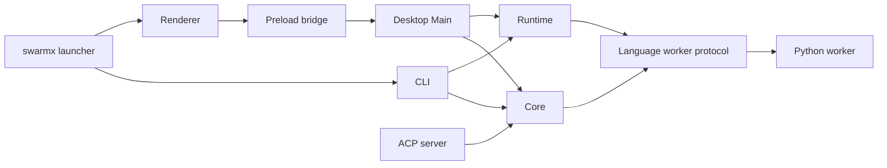

# Codebase documentation

This directory is the implementation map behind [`CODEBASE.md`](../../CODEBASE.md).
It is optimized for agents: load the index, choose one boundary, then open only
the exact files named by the relevant row.

## Package maps

- [`@swarmx/core`](core.md): schemas, identity/catalog, Agent/workflow
  execution, durable task control, Sessions, Projects, extensions, and protocol
  adapters.
- [`@swarmx/desktop`](desktop.md): Electron Main, Preload, shared IPC types,
  Renderer, styles, and host integrations.
- [`@swarmx/runtime`, `@swarmx/cli`, ACP server, and launcher](cli-runtime.md):
  runtime discovery/repair, commands, ACP entrypoint, and npm bootstrap.
- [`tests and auxiliary source`](tests.md): all test paths plus scripts and
  evaluation adapters.

## How to read a row

Each row uses this contract:

`path` → responsibility; key exports/consumers; side effects or boundary notes.

Rows use source paths from the repository root. A row without a side-effect
marker is intended to be pure or schema-oriented, but the implementation and
the architecture documents remain authoritative if code and prose disagree.

## Cross-package dependency direction

Core is the reusable contract, domain, and durable task authority. Runtime
depends on Core and discovers verified worker environments; a language worker
executes a leased operation but does not become a higher-level authority. Main
may depend on both. Preload and Renderer may use only browser-safe Core exports
and the typed shared API. No lower layer imports a higher layer.

## Side-effect legend

- `pure`: parsing, normalization, schemas, presentation helpers.
- `fs`: reads/writes local files; check path containment and atomicity.
- `proc`: spawns or controls subprocesses/PTYs.
- `net`: network, ACP, MCP, or HTTP transport.
- `ipc`: Electron IPC/context bridge.
- `secret`: credential resolution; plaintext must remain Main/process-local.
- `ui`: React/UI side effects only.

## Source scope

The documentation guard covers authored `.ts`, `.tsx`, `.js`, `.jsx`, `.mjs`,
`.cjs`, `.css`, `.html`, and selected `.py` files in package source/test
directories, launcher/scripts, and `evals/inspect`. `dist`, `build`, `out`,
`release`, `node_modules`, generated reports, and media assets are not source
contracts and are not indexed as code.
