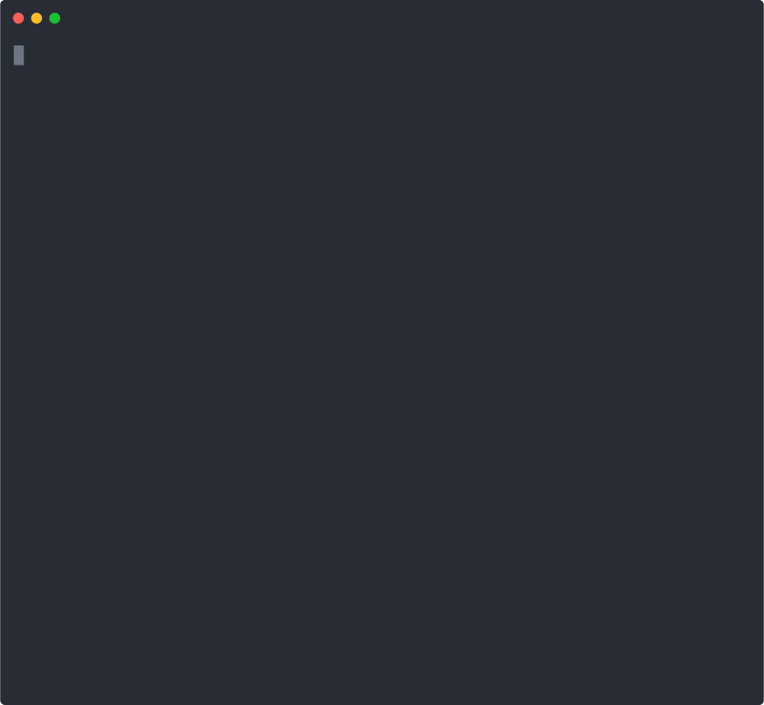
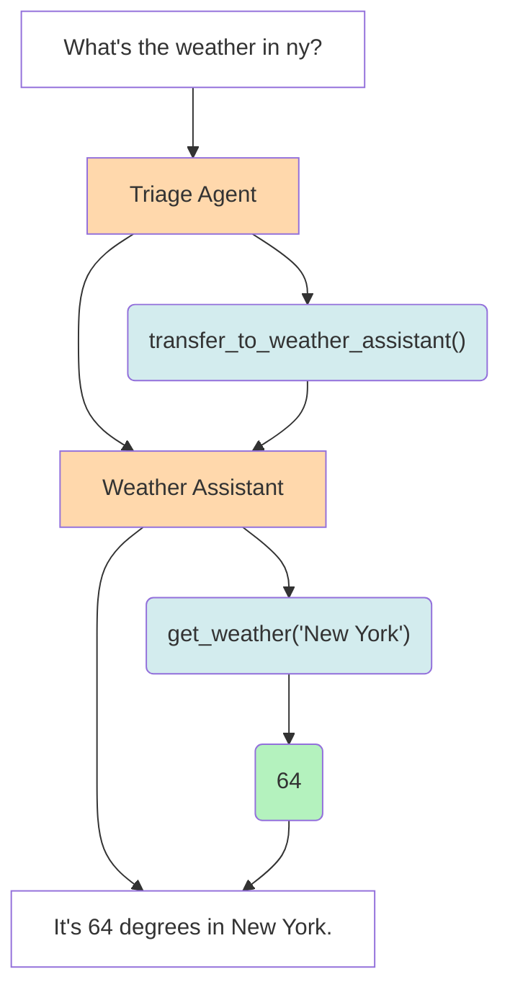

# SwarmX

An extreme simple framework exploring ergonomic, lightweight multi-agent orchestration.

## Highlights
1. SwarmX is both Agent and Workflow
2. MCP servers support
3. OpenAI-compatible streaming-server
4. Workflow import/export in JSON format



## JSON Format Details
SwarmX supports importing and exporting workflows in JSON format. The JSON structure includes:
- `nodes`: List of nodes with their type (`agent` or `swarm`) and associated data
- `edges`: List of edges connecting nodes, optionally with conditions
- `mcpServers`: Optional configuration for MCP servers

Example JSON structure:
```json
{
  "nodes": [
    {
      "id": 0,
      "type": "agent",
      "agent": {
        "name": "Assistant",
        "model": "gpt-4o",
        "instructions": "You are a helpful agent."
      }
    },
    {
      "id": 1,
      "type": "agent",
      "agent": {
        "name": "Specialist",
        "model": "deepseek-r1:7b",
        "instructions": "You are a specialist agent."
      }
    }
  ],
  "edges": [
    {
      "source": 0,
      "target": 1
    }
  ]
}
```

## Star History

[](https://www.star-history.com/#tcztzy/swarmx&Date)

## Quick start

SwarmX automatically loads environment variables from a `.env` file if present. You can either:

1. **Use a .env file** (recommended):
   ```shell
   # Create a .env file in your project directory
   echo "OPENAI_API_KEY=your-api-key" > .env
   echo "OPENAI_BASE_URL=http://localhost:11434/v1" >> .env  # optional
   uvx swarmx  # Start interactive REPL
   ```

2. **Set environment variables manually**:
   ```shell
   export OPENAI_API_KEY="your-api-key"
   # export OPENAI_BASE_URL="http://localhost:11434/v1"  # optional
   uvx swarmx  # Start interactive REPL
   ```

### API Server

You can also start SwarmX as an OpenAI-compatible API server:

```shell
uvx swarmx serve --host 0.0.0.0 --port 8000
```

This provides OpenAI-compatible endpoints:

- `POST /chat/completions` - Chat completions with streaming support
- `GET /models` - List available models

Use it with any OpenAI-compatible client:

```python
import openai

client = openai.OpenAI(
    base_url="http://localhost:8000",
    api_key="dummy"  # SwarmX doesn't require authentication
)

response = client.chat.completions.create(
    model="gpt-4o",
    messages=[{"role": "user", "content": "Hello!"}]
)
```

## Installation

Requires Python 3.12+

```console
$ pip install swarmx # or `uv tool install swarmx`
```

## Usage

```python
import asyncio
from swarmx import Agent, Edge, Swarm

agent_a = Agent(
    name="agent_a",
    instructions="You are a helpful agent.",
)

agent_b = Agent(
    name="agent_b",
    model="deepseek-r1:7b",
    instructions="你只能说中文。",  # You can only speak Chinese.
)

swarm = Swarm(
    name="demo_swarm",
    parameters={},
    nodes={agent_a.name: agent_a, agent_b.name: agent_b},
    edges=[Edge(source=agent_a.name, target=agent_b.name)],
    root=agent_a.name,
)


async def main():
    messages = await swarm(
        {"messages": [{"role": "user", "content": "I want to talk to agent B."}]},
    )

    print(messages[-1]["content"])


asyncio.run(main())
```

## Architecture



[1]: https://platform.openai.com/docs/api-reference/chat/create
