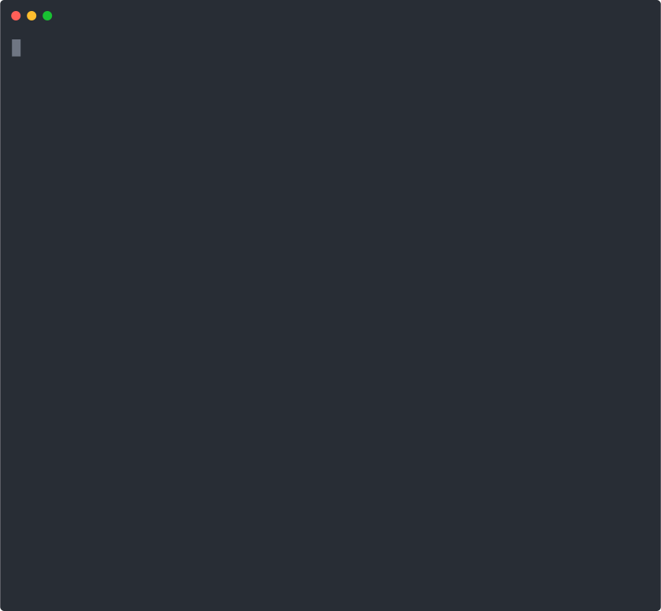
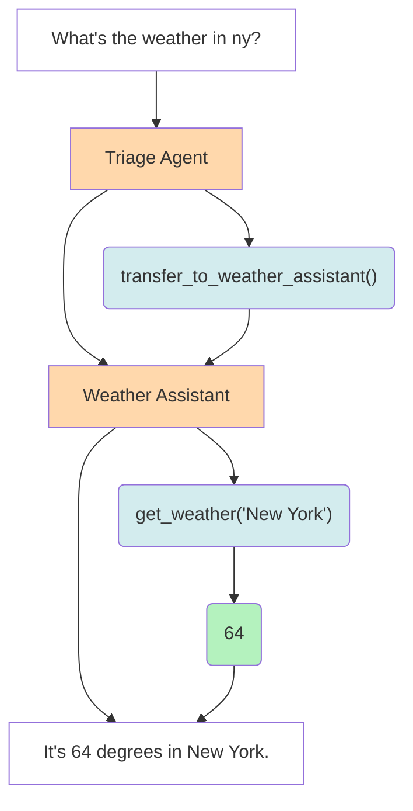

# SwarmX

An extreme simple framework exploring ergonomic, lightweight multi-agent orchestration.

## Highlights
1. SwarmX is both Agent and Workflow
2. MCP servers support
3. OpenAI-compatible streaming-server
4. Workflow import/export in JSON format



## JSON Format Details
SwarmX supports importing and exporting workflows in JSON format. The JSON structure includes:
- `nodes`: Map of node names to node definitions (`agent`, `swarm`, or `tool`)
- `edges`: List of edges connecting nodes, optionally with CEL conditions
- `mcpServers`: Optional configuration for MCP servers

Example JSON structure:
```json
{
  "name": "demo_swarm",
  "root": "agent_a",
  "nodes": {
    "agent_a": {
      "type": "agent",
      "name": "agent_a",
      "instructions": "You are a helpful agent."
    },
    "agent_b": {
      "type": "agent",
      "name": "agent_b",
      "model": "deepseek-r1:7b",
      "instructions": "You are a specialist agent."
    }
  },
  "edges": [
    {
      "source": "agent_a",
      "target": "agent_b"
    }
  ]
}
```

## Star History

[](https://www.star-history.com/#tcztzy/swarmx&Date)

## Quick start

SwarmX automatically loads environment variables from a `.env` file if present. You can either:

1. **Use a .env file** (recommended):
   ```shell
   # Create a .env file in your project directory
   echo "OPENAI_API_KEY=your-api-key" > .env
   echo "OPENAI_BASE_URL=http://localhost:11434/v1" >> .env  # optional
   cargo run -p swarmx-cli  # Start interactive REPL
   ```

2. **Set environment variables manually**:
   ```shell
   export OPENAI_API_KEY="your-api-key"
   # export OPENAI_BASE_URL="http://localhost:11434/v1"  # optional
   cargo run -p swarmx-cli  # Start interactive REPL
   ```

### API Server

You can also start SwarmX as an OpenAI-compatible API server:

```shell
cargo run -p swarmx-cli -- serve --host 0.0.0.0 --port 8000
```

This provides OpenAI-compatible endpoints:

- `POST /chat/completions` - Chat completions with streaming support
- `GET /models` - List available models

Use it with any OpenAI-compatible client:

```python
import openai

client = openai.OpenAI(
    base_url="http://localhost:8000",
    api_key="dummy"  # SwarmX doesn't require authentication
)

response = client.chat.completions.create(
    model="gpt-4o",
    messages=[{"role": "user", "content": "Hello!"}]
)
```

## Installation

Requires Rust 1.85+

```console
$ cargo install --path crates/swarmx-cli
```

Or run directly from source:

```console
$ cargo run -p swarmx-cli
```

## Usage

```rust
use swarmx_core::{Agent, Edge, Swarm, swarm::SwarmNode};

#[tokio::main]
async fn main() -> anyhow::Result<()> {
    let agent_a = Agent::new("agent_a")
        .with_instructions("You are a helpful agent.");

    let agent_b = Agent::new("agent_b")
        .with_model("deepseek-r1:7b")
        .with_instructions("You can only speak Chinese.");

    let swarm = Swarm::new("demo_swarm", "agent_a")
        .with_node(SwarmNode::Agent(agent_a))
        .with_node(SwarmNode::Agent(agent_b))
        .with_edge(Edge::new("agent_a", "agent_b"));

    let messages = swarm.execute(
        serde_json::json!({"messages": [{"role": "user", "content": "I want to talk to agent B."}]}),
        None,
    ).await?;

    println!("{}", serde_json::to_string_pretty(&messages)?);
    Ok(())
}
```

## Architecture


```mermaid
graph TD
   classDef QA fill:#ffffff;
   classDef agent fill:#ffd8ac;
   classDef tool fill:#d3ecee;
   classDef result fill:#b4f2be;
   func1("transfer_to_weather_assistant()"):::tool
   Weather["Weather Assistant"]:::agent
   func2("get_weather('New York')"):::tool
   temp(64):::result
   A["It's 64 degrees in New York."]:::QA
   Q["What's the weather in ny?"]:::QA --> 
   Triage["Triage Agent"]:::agent --> Weather --> A
   Triage --> func1 --> Weather
   Weather --> func2 --> temp --> A
```

[1]: https://platform.openai.com/docs/api-reference/chat/create
