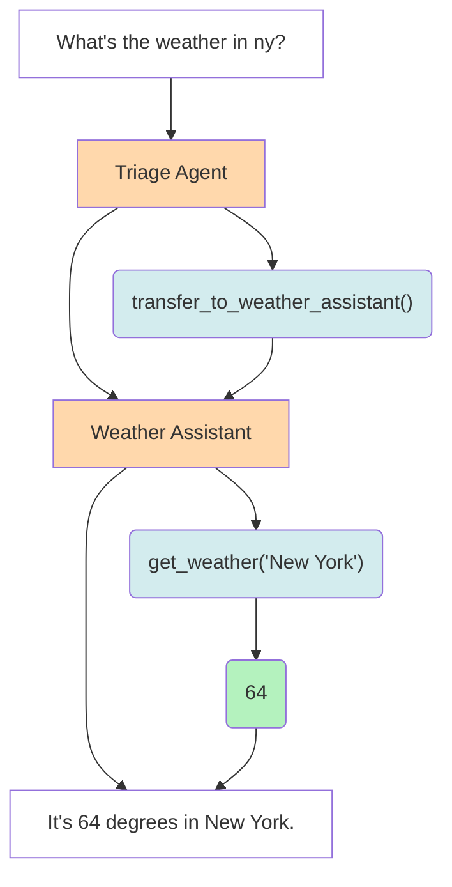

# SwarmX

An extreme simple framework exploring ergonomic, lightweight multi-agent orchestration.

## Highlights
1. SwarmX is both Agent and Workflow
2. MCP servers support
3. OpenAI-compatible streaming-server
4. Workflow import/export in JSON format


## JSON Format Details
SwarmX supports workflows in JSON format. This JSON is the same `SwarmConfig`
accepted by the TypeScript core, CLI `--config`, ACP metadata, and desktop
Workflow panel:

- `name`: workflow name
- `root`: first node to run
- `nodes`: map of node ids to node definitions with `kind: "agent" | "tool" | "swarm"`
- Agent nodes represent ACP agent identity: `model` plus a fine-grained
  harness descriptor. A harness is the software package/version, MCP set,
  skill set, and project context files (`AGENTS.md`, `CLAUDE.md`, and similar).
  Tool use belongs inside the agent configuration through MCP servers and instructions.
- `edges`: list of transitions, optionally with CEL `condition`
- `mcpServers`: optional MCP server configuration

## Extension Inventory

SwarmX can load reusable extension bundles for downstream products such as
GEEPilot. A bundle may declare software, standalone Models, ModelSupplies,
provider profiles, skills, MCP servers, harnesses, agent profiles, app
connectors, GUI contributions, commands, LSP servers, hooks,
monitors, output styles, settings, assets, permission declarations, auth
policies, marketplace sources, and plugin catalog entries. Set
`SWARMX_EXTENSION_PATHS` to a path-delimited list of
manifest files or directories containing
`swarmx.extension.json`, `swarmx-extension.json`, `extension.json`, or
`plugin.json`.

LSP declarations can set `mentionPrefixes` to opt into Composer mention routing;
the host invokes only the server(s) with the longest matching prefix. The
built-in local-files provider accepts a non-empty bare reference such as
`@src/app.ts` and deliberately does not enumerate the workspace when the user
has typed only `@`. A bare `$` lists the Skills contributed by the active
extension inventory.

The core API exposes `loadExtensionInventory()` for discovery,
`resolveAgentCompositionPlan()` for side-effect-free preflight, and
`resolveAgentComposition()` for turning a selected agent profile plus Harness,
and a Model into an `AgentConfig`. An extension Agent profile may bind internal
ModelSupply metadata, but the ordinary composer never asks the user to choose
it. The preflight plan reports the `harnessId:modelId` Agent id, display name,
canonical selector, host, Harness, Model, any internally resolved supply route,
definition source, plugin ids, selected skill and MCP provenance, context,
permissions, visual metadata, readiness status, and blocked requirements
without spawning ACP harnesses, starting MCP servers, reading secrets, calling
providers, or mutating settings. Manifests and plans are metadata only: inline
provider keys, tokens, passwords, private keys, and credentials are rejected.

Skill capability records can also describe host compatibility without forking a
downstream skill tree. `SkillCapabilitySchema` carries `canonicalPath`,
`governanceRef`, `requiresGateSkillIds`, `hostExposures`, read-only state, and
source-plugin metadata. `SkillHostExposureSchema` distinguishes plugin,
rules-only, unsupported, and unknown host surfaces and can point to manifest
paths, marketplace source ids, rules files, or packages. The pure
`validateSkillHostCompatibility()` helper returns passive issues for paths
outside caller-configured canonical roots, missing or self-referential gate
skills, unknown marketplace sources, rules-only manifest claims, and host local
paths that must use `./` repository-root form. It does not inspect files,
install plugins, mutate manifests, start adapters, or implement downstream
skills or safety policy.

The desktop **Settings → Extensions** workspace displays marketplace sources, plugin catalog
entries, plugin bundles, executable harnesses, standalone Models, ModelSupplies,
agent profiles, providers,
skills, MCP servers, app connectors, GUI contributions, and generic plugin
components as separate layers. GUI contributions cover passive navigation,
view, panel, settings, dashboard, composer, message, inspector, toolbar, menu,
and status declarations through refs such as `route`, `componentRef`,
`assetRef`, `commandId`, `settingIds`, `permissionIds`, and `authPolicyIds`.
Generic plugin components cover commands, LSP servers, hooks, monitors,
output styles, settings, assets, permissions, and auth policies. Agent profile
rows also show the resolved composition plan: readiness, canonical selector,
Harness x Model identity, optional supply, plugin count, selected skill and MCP provenance,
context, permissions, auth requirement, and blocked requirements. Blocked or
disabled plans are visible but cannot be selected for invocation from the
read-only inventory view. Skill rows show canonical path, governance, gate-skill
ids, host exposure, manifest/rules/source, and read-only metadata. The workspace
can persist sources, fetch bounded HTTPS/local catalogs, cache upstream
candidates, install/enable/disable/update/rollback/uninstall revision metadata
with explicit confirmation, and configure Skill evolution promotion policy.
Remote component code still enters through the trusted host inventory
loader: the Settings surface does not evaluate scripts, mount iframes or
webviews, grant permissions, start arbitrary MCP/LSP processes, or write
secrets.

Extension distribution is separate from Harness composition. In the canonical
model, `Harness = Software + Skills + MCP servers + project context + policies +
...`, and `Agent = Harness + Model`. **Settings → Custom Agents** creates that
versioned Harness recipe and pairs it with a Model; **Settings → Runtime** owns
the standalone Node.js baseline, Harness tool inventory, embedded Doctor, and
container detection. See
[Extensions, Harness Recipes, and Custom Agents](./extensions-custom-agents.md)
for variant resolution, legacy migration, update/rollback, and evolution rules.

Desktop GUI customization is host-owned code. A downstream desktop can embed
the SwarmX renderer and explicitly register safe React components for
`componentRef` values declared by extension manifests:

```tsx
import { createSwarmxDesktopApp } from "@swarmx/desktop/renderer";
import { GeepilotShell } from "./GeepilotShell";

export const App = createSwarmxDesktopApp({
  product: {
    name: "GEEPilot",
    subtitle: "analysis cockpit",
  },
  uiComponentRegistry: {
    "geepilot.ui.shell": GeepilotShell,
  },
});
```

Only contributions whose `componentRef` exists in that host registry become
navigable. Unregistered contributions remain passive rows in the Extensions
inventory. Registered components receive sanitized contribution and inventory
metadata plus explicit callbacks such as `onSelectAgent`; SwarmX never loads
React, HTML, scripts, iframes, webviews, or remote assets from manifest fields.

Sends from that composer include an `agentComposition` payload; the main process
reloads the extension inventory and resolves the composition before creating the
single-agent Swarm. This allows downstream harness ids such as a
GEEPilot-provided Codex profile to remain plugin metadata instead of being added
to the built-in SwarmX harness list. Resolved `custom` agent backends execute
through the ACP client using the manifest-declared command, args, cwd, and
environment, so extension-provided Codex or Claude profiles do not silently fall
back to the native OpenAI path.

Direct Project-bound agents use model-trained tool profiles rather than a
SwarmX-specific file-tool vocabulary. See
[Model-trained tool compatibility](./native-tool-compatibility.md) for the
Claude Code/Codex schemas, protocol behavior, security boundary, and upgrade
audit checklist.

Provider profiles are connection metadata. When a trusted extension profile or
fixed core route binds a ModelSupply, the main process follows it to its
Provider, resolves its `env` or desktop `local_keychain` `secretRef` immediately
before invocation, and injects request-scoped route variables into the child
process only. Missing credentials, unsupported secret sources, or an invalid
ModelSupply link fail before the Agent starts. Provider never owns a Model,
chooses a default Model, or participates in Harness compatibility.

See [GEEPilot Platform Boundary Review](./geepilot-platform-review.md) for the
spec split between SwarmX platform capabilities and GEEPilot-owned analysis
workflows.

## Action Intent Primitives

SwarmX exposes browser-safe explicit-action contracts as
`@swarmx/core/actions`. The API lets desktop and downstream products describe
user-initiated operations without performing them in core.

Core action exports include:

- `ActionIntentSchema`: action id, kind, host, source/target refs, risk list,
  confirmation requirement, confirmation text, sanitized payload, and timestamp.
- `ActionConfirmationSchema` and `assertActionConfirmed()`: matching
  confirmation records for risky actions before an execution layer installs,
  enables, starts, reruns, opens, reveals, or changes trust.
- `createActionIntent()`: deterministic `act_` id generation from sanitized
  intent content, default risk classification, and payload redaction.
- `requiresExplicitConfirmation()`: shared risk policy where anything beyond
  `read_only` requires an explicit positive confirmation.
- `actionIntentFromDependencyPlan()`: converts side-effect-free dependency
  install plans into explicit action intents for managed installs, external
  installers, existing detections, and unavailable dependencies.

Action records reject inline secret-looking fields while allowing secret
references as metadata. Core does not install plugins, write settings, start MCP
servers, open installers, rerun commands, reveal raw host payloads, or mutate
trust state; those remain caller-owned effects guarded by the action intent and
confirmation contract.

## Desktop Settings Primitives

SwarmX exposes browser-safe local desktop settings contracts as
`@swarmx/core/desktop-settings`. The API models reusable settings documents,
desktop-root resolution, UI state, locale resources, standalone Models,
ModelSupplies, Provider connections, and Agent profile metadata without reading
or writing files.

Core desktop settings exports include:

- `DesktopSettingsDocumentSchema`: a v1 document with `desktop`, `server`,
  `ui`, `models`, `modelSupplies`, `providers`, `agents`, and `extensions`
  sections. Each array reuses its core schema, so Model identity, supply links,
  Provider connections, Harnesses, Agents, and plugins remain separate records.
- `resolveDesktopRoot()`: deterministic desktop-root selection. Explicit
  desktop-root env vars win over settings roots; legacy app-root env/settings
  values are compatibility fallbacks; server data roots are returned separately
  and are not silently treated as desktop roots.
- `LocaleRegistrySchema`, `createLocaleRegistry()`, and
  `resolveLocaleSelection()`: centralized locale metadata and message resources,
  duplicate-locale checks, persisted locale selection, env locale support, and
  default fallback.
- `DesktopUiStateSchema` and `createDefaultDesktopSettings()`: portable UI
  state/defaults without choosing a downstream product root.

Settings and UI records reject inline secret-looking fields while allowing
secret references. SwarmX does not create directories, manage keychains, migrate
secrets, persist localStorage, call providers, or decide concrete downstream
settings paths such as `~/.geepilot/settings.json`.

## Secret Store Primitives

SwarmX exposes browser-safe secret-store contracts as `@swarmx/core/secrets`.
The API models the allowed secret surfaces without reading files, writing auth
documents, calling keychains, prompting users, or sending secrets to servers.

Core secret exports include:

- `SecretRefSchema`: source, key, purpose, service, and account metadata for
  `env`, `local_auth_file`, `local_keychain`, `server_keychain`, `prompt`, and
  `request_only` sources.
- `SecretVaultDocumentSchema`: a local/server vault document shape where secret
  values are allowed only under explicit vault entry `value` fields.
- `SecretWriteRequestSchema`: an explicit write-request shape where a caller can
  pass one secret value to an implementation layer.
- `SecretStatusSchema`: configured/missing status metadata that rejects returned
  secret values.
- `evaluateSecretFileMode()`: pure file-mode evaluation for contracts such as
  `0600`; it does not chmod or create files.
- `secretStatusFromVault()`, `secretValueFromVault()`,
  `redactSecretVaultDocument()`, and `redactSecretWriteRequest()`: lookup and
  redaction helpers.

`assertSecretRefPolicy()` rejects persistent storage for request-only secrets
such as remote-compute passwords. Provider API keys may reference env,
local-auth-file, local-keychain, server-keychain, or prompt sources, but runtime
injection remains request-scoped in the caller. SwarmX does not own concrete
paths such as `~/.geepilot/auth.json` or server keychain routes.

## Model and ModelSupply Primitives

`Model` is an independent primary entity. Its stable `id`, display label,
runtime model name, API protocols, and capability references do not depend on a
Provider. `ModelSupply` is the many-to-many join between one Model and one
Provider connection; it may carry only route-specific runtime-model and API
bridge metadata. It is internal routing metadata, not a fourth composer choice:
the desktop exposes exactly Harness, Model, and Effort.

Core model exports include:

- `ModelSchema`: standalone Model records from discovery, extensions, or manual
  settings.
- `MODELS`: built-in capability metadata. In desktop it enriches a matching
  discovered/declared Model id but is not itself a visible Model-list source.
- `ModelSupplySchema`: explicit `modelId` + `providerProfileId` links with
  optional route alias and bridge configuration.
- `resolveHarnessModelInventory()`: returns one entry per compatible
  `harnessId:modelId`. Provider readiness annotates available supplies but never
  adds, removes, or identifies a Harness-Model pair.
- `resolveModelReasoningCapability()` and
  `normalizeModelReasoningEffort()`: exact Model/API reasoning controls kept
  separate from internal supply routing.

### Dynamic desktop Model catalog

The desktop starts with manually declared Models and the last successful
discovery cache. App restart and Renderer remount do not automatically call
configured Provider Models APIs. Discovery runs only after **Refresh Models**;
Provider create/update only saves connection metadata. Users manage Provider
connections from the dedicated Settings workspace, while the Model secondary menu only refreshes or
adds/removes Models; Harness, Model, and Effort remain the only primary composer
choices.

The Model menu groups cached routes as **Provider → optional group → Model**.
OpenAI-compatible/New API discovery preserves `owned_by` as the optional group,
and duplicate model ids from different Providers remain separate selectable
routes without changing the stable `harnessId:modelId` Agent identity. Each
Provider owns one last-successful cache partition, so one failed refresh cannot
erase another Provider's models. Known model ids receive canonical readable
labels, while unknown ids keep the Provider label or raw id.

When the Codex Harness is installed, explicit refresh uses the official local
`codex app-server` `model/list` method and caches its display names plus
supported/default reasoning efforts. Those routes are available to the Codex
Harness only when the runtime id also appears in the pinned ACP adapter's proven
session configuration; every discovered route remains available to the built-in
SwarmX Harness in `codex_responses` mode. The latter uses SwarmX Agent
instructions, conversation, and MCP tools directly and never creates an
app-server thread or turn, so no Codex task context is injected.
Before execution, the desktop may call app-server `account/read` with managed
refresh enabled and then extract and use only `tokens.access_token` from private
mode-`0600` Codex auth storage. It never extracts or copies `refresh_token`.

`codex_responses` targets the ChatGPT Codex backend as an experimental
compatibility surface rather than the public OpenAI API. Its endpoint behavior
may change independently of SwarmX. CLI/server callers must explicitly provide
`CODEX_ACCESS_TOKEN`; desktop execution can reuse a current official Codex
sign-in.

Protected Codex ACP is a separate authentication path: the pinned adapter does
not consume `CODEX_ACCESS_TOKEN`. SwarmX mounts only the private official
`auth.json` as a read-only file volume and points container `CODEX_HOME` at it;
`CODEX_API_KEY` and `OPENAI_API_KEY` remain supported automation alternatives.

The built-in SwarmX direct Harness natively accepts Anthropic Messages, OpenAI
Responses, and OpenAI Chat Completions Models. It keeps each protocol's request,
stream, reasoning, tool-call continuation, and cancellation behavior native.
When a Provider exposes more than one entrypoint, SwarmX selects its matching
native kind or declared entrypoint first. yallm is consulted only for an
explicit bridge route or when no native route can satisfy the selected Harness
x Model pair.

To configure an endpoint in the desktop app, open the lower-left **Anonymous
user → Settings → Providers → Add Provider** path and enter:

- A user-facing Provider name.
- The endpoint API protocol: Anthropic, OpenAI Responses, OpenAI Chat, or Ollama.
- Its Base URL.
- Authentication mode: API Key or Auth Token.
- The credential value.

A normal Custom Provider is deliberately not treated as New API. It keeps one
credential and one exact API Base URL; OpenAI-compatible discovery requests
`<baseUrl>/models`. New API quota/account calls are enabled only by the explicit
**Usage API → New API** selection, never by URL or response-shape detection.

Desktop does not scan ambient `OPENAI_API_KEY`, `ANTHROPIC_API_KEY`,
`DEEPSEEK_API_KEY`, `OLLAMA_HOST`, or related variables to create connections or
start network discovery. Add desktop Providers explicitly through Settings.
Extension-declared Providers may name a specific env secret reference, but the
reference cannot synthesize a Provider by itself. CLI/server environment
configuration remains separate from desktop discovery.

The anonymous-user popover contains exactly one **Settings** action. It opens a
single Provider matrix, where **Refresh all** and each row's refresh action
place supported balances and quota windows beside the matching connection.
Codex is rendered as an OpenAI Provider peer when a signed-in local Codex
installation is available; it is not separated into a tool-account group.
Every row reserves 5-hour, 7-day, combined credit/balance, resets, updated, and
actions positions, with `Not provided` used for unavailable fields.

Provider Usage currently has this support boundary:

| Source | Displayed data | Interface |
| --- | --- | --- |
| DeepSeek | All returned CNY/USD balances, including granted and topped-up amounts | [Documented balance API](https://api-docs.deepseek.com/api/get-user-balance/) |
| Moonshot/Kimi API | Regional available, voucher, and cash balance | [International](https://platform.kimi.ai/docs/api/balance) or [China](https://platform.kimi.com/docs/api/balance) documented API |
| Kimi Code | Weekly and other returned quota windows | [Official Kimi CLI usage interface](https://github.com/MoonshotAI/kimi-cli/blob/main/src/kimi_cli/ui/shell/usage.py) |
| Z.AI/GLM Coding Plan | Returned 5-hour and weekly token windows | [Official usage plugin interface](https://github.com/zai-org/zai-coding-plugins/blob/main/plugins/glm-plan-usage/skills/usage-query-skill/scripts/query-usage.mjs) |
| MiniMax Token Plan | Model-specific current/weekly quota, boosts, and unlimited status | [Official CLI quota interface](https://github.com/MiniMax-AI/cli/blob/main/src/client/endpoints.ts) |
| New API | Primary API-key quota; optionally one shared account wallet plus masked, individually expandable token limits | Same-origin `GET /api/usage/token/`; explicit account access adds `/api/status`, `/api/user/self`, and bounded `/api/token/` pagination |
| Codex | 5-hour/weekly remaining percentage, plan, and returned credits | [Official local app-server rate-limit method](https://learn.chatgpt.com/docs/app-server#6-rate-limits-chatgpt) |
| OpenCode Go | Per-key locally observed request/token counts, last use, and cooldown state | No remote usage request; state comes only from successful SwarmX requests and explicit quota-exhaustion responses |
| Anthropic/Claude Code, Google Gemini, OpenCode Zen | Explicit automatic-query-unavailable state | No supported API-key subscription-quota interface |

These requests run only in Electron main against fixed official HTTPS origins,
or the configured HTTPS origin when the user explicitly selects New API.
Redirects are refused, timeout and streamed response bytes are bounded, and
vendor bodies are normalized before IPC. The renderer never receives a key,
authorization header, raw response, or private vendor error. Codex quota usage
is queried through its installed app-server and does not parse auth files,
scrape web consoles, or collect cookies. Eligible
credentials are restricted to code-owned built-in env bindings and id-bound
desktop-managed keychain Providers, so extension metadata cannot select another
connection's key.

For New API, the primary model API token and optional account access token have
different roles. Account access is a high-privilege management credential and
must be entered explicitly with its numeric user id; it is encrypted separately
and is never inferred from environment state or reused for model requests. The
shared account wallet is shown once, and per-token limits are never added
together.

For the canonical DeepSeek API origin, one Provider and one secret cover both
official native entrypoints: Anthropic Messages at `/anthropic` and OpenAI Chat
Completions at the origin. Anthropic is the default; selecting OpenAI Chat is an
explicit preference override. Model discovery continues through the compatible
origin `/models` endpoint.

For the exact official OpenCode Go Base URL (`https://opencode.ai/zen/go` or
`https://opencode.ai/zen/go/v1`), one Provider exposes Anthropic Messages and
OpenAI Chat entrypoints and discovers models from `/zen/go/v1/models`. Settings
accepts a primary key plus encrypted backup keys. Each successful request adds
only normalized local token counters to
`~/.swarmx/provider-key-usage.json`. SwarmX changes keys only when the error is
an explicit quota/balance exhaustion (not a generic HTTP 429), and retries only
before any output or tool event has been emitted. Provider reset metadata sets
the cooldown when present; otherwise the affected key cools for five hours.
Removing a backup key removes its separate encrypted credential and ledger row.

Update UI remains hidden until the canonical npm latest endpoint reports a newer
stable `@swarmx/desktop`. The account row then shows a circular download control
that expands to **Update** on hover/focus; clicking it renders integer download
progress, installing, and restarting states in the same slot.

The updater downloads only the canonical HTTPS npm tarball, verifies the
declared SHA-512 integrity, installs it into
`~/.swarmx/desktop-updates/<version>` with package lifecycle scripts disabled,
and verifies the installed package version before relaunching Electron with the
new app path. It never overwrites the running directory. This self-update path
is enabled only for Electron default-app/npm launches; signed packaged apps and
products embedding the reusable desktop package keep the control hidden and
retain ownership of their own deployment mechanism.

For an Anthropic Base URL plus auth token, choose **Anthropic** and **Auth
Token**. Discovery sends `Authorization: Bearer`; Harness execution receives a
request-scoped `ANTHROPIC_AUTH_TOKEN`. Choosing **API Key** instead sends
`x-api-key` for discovery and exposes `ANTHROPIC_API_KEY` only to the launched
request. OpenAI-compatible credentials use bearer authentication.

Discovery adapters support:

- OpenAI-compatible `GET /models` responses with `data[].id`.
- Anthropic `GET /v1/models`, including `has_more`/`last_id` pagination.
- Ollama `GET /api/tags` responses with `models[].name`.

CLI/server environment configuration, which does not create desktop Providers:

- `OPENAI_API_KEY`, with optional `OPENAI_BASE_URL`.
- `SWARMX_API_MODE=codex_responses` with `CODEX_ACCESS_TOKEN` and optional
  `CODEX_BASE_URL` for trusted CLI/server subscription execution.
- `ANTHROPIC_API_KEY`, with optional `ANTHROPIC_BASE_URL`.
- `ANTHROPIC_AUTH_TOKEN`, with optional `ANTHROPIC_BASE_URL` (used when no
  `ANTHROPIC_API_KEY` is set).
- `DEEPSEEK_API_KEY`, with optional `DEEPSEEK_BASE_URL`.
- `OLLAMA_HOST` or `OLLAMA_BASE_URL`.

Extension Provider profiles are also eligible discovery connections. A remote
item is normalized into an independent Model plus an internal ModelSupply link
to the connection that returned it. Results with the same Model id merge API
and capability metadata; Provider ids are never appended to Model or Agent ids.

Manual Models require a stable id, runtime model id, and API protocol and are
stored in `~/.swarmx/settings.json`. User Provider connection metadata and a
`local_keychain` reference are stored in that same settings file; the credential
itself is encrypted with Electron `safeStorage` into the mode-`0600`
`~/.swarmx/provider-auth.json`. SwarmX refuses a plaintext fallback. Successful
discovery is cached in `~/.swarmx/model-catalog-cache.json`. Refresh timeouts or
Provider errors retain the last successful cache and never persist request
headers or resolved keys. Desktop restarts read this cache directly and perform
no Provider discovery until explicit refresh.
Execution reloads this same augmented catalog and deterministically resolves an
eligible internal ModelSupply when the user did not choose one—which the
ordinary composer never asks them to do.

Built-in Harness x Model routes are deterministic code, so a manual composition
sends only `harnessId`, `modelId`, and optional effort. For example,
`claude_code:deepseek-v4-pro` resolves the runtime alias
`deepseek-v4-pro[1m]`, requires `DEEPSEEK_API_KEY`, and injects:

```text
ANTHROPIC_BASE_URL=https://api.deepseek.com/anthropic
ANTHROPIC_AUTH_TOKEN=${DEEPSEEK_API_KEY}
ANTHROPIC_MODEL=deepseek-v4-pro[1m]
ANTHROPIC_DEFAULT_OPUS_MODEL=deepseek-v4-pro[1m]
ANTHROPIC_DEFAULT_SONNET_MODEL=deepseek-v4-pro[1m]
ANTHROPIC_DEFAULT_HAIKU_MODEL=deepseek-v4-flash
CLAUDE_CODE_SUBAGENT_MODEL=deepseek-v4-flash
CLAUDE_CODE_EFFORT_LEVEL=<selected Effort>
CLAUDE_MODEL_CONFIG={"availableModels":["deepseek-v4-pro[1m]"]}
```

This environment is request scoped; SwarmX does not edit Claude Code's global
configuration or persist the secret.

Harnesses declare `modelControl` as `direct`, `session`, or `unsupported`.
Direct Harnesses receive the selected Model through request-scoped API
variables. A session Harness is included in the executable matrix only when the
Model has a fixed runtime id for that adapter or its ModelSupply explicitly
names the adapter and supplies a runtime model id. API compatibility or `any`
alone is not route evidence. Session Harnesses then use ACP `configOptions`
(Model first, then refreshed effort); omission keeps the Harness-negotiated
default, while an explicit unsupported selection fails. Anthropic and Codex
catalog supplies name their session Harness only for runtime ids proven against
the pinned adapter. OpenCode and Hermes remain empty until their
provider-prefixed runtime ids are imported explicitly; SwarmX does not pass bare
catalog ids and claim they work.
OpenClaw is the current explicit gap because its official ACP bridge states that
[Model selection is not exposed as an ACP config option](https://docs.openclaw.ai/cli/acp);
SwarmX does not simulate support by rewriting the user's global Gateway config.

## Provider Profile Primitives

SwarmX exposes browser-safe provider profile contracts as
`@swarmx/core/providers`. The API separates supply-connection metadata from
secret storage and request-scoped route injection.

Core provider exports include:

- `ProviderProfileMetadataSchema`: profile id, preset id, display name, API
  supply label, base URL, authentication mode, read-only state, metadata, and a
  secret reference.
  Provider-owned `model`, `models`, default-Model, and Harness override fields
  are rejected.
- `ProviderSecretRefSchema`: references to `env`, `local_keychain`,
  `server_keychain`, or `prompt` sources without storing secret values.
- `ProviderSecretStatusSchema`: status records that can say whether a secret is
  configured, but reject returned secret values.
- `ProviderSelectionSchema` and `resolveProviderProfile()`: explicit profile
  resolution that fails on unknown, missing, or ambiguous selections; it does
  not choose a default Provider.
- `ProviderPromptRequestSchema`: direct provider prompt metadata without an ACP
  harness.
- `buildProviderRuntimeEnv()`: constructs request-scoped environment variables
  from the already selected Model/ModelSupply route only when the caller
  supplies the runtime secret value explicitly.

Provider profile metadata, secret statuses, prompt requests, and selection
records reject inline secret-looking fields. Core remains storage-neutral. The
desktop host implements its `local_keychain` reference with Electron
`safeStorage`-encrypted local auth state; server keychain routes and
provider-specific migrations remain host-owned surfaces.

## Harness Management Primitives

SwarmX exposes browser-safe harness management contracts as
`@swarmx/core/harness-management`. The API models host adapter discovery,
selector resolution, named agent aliases, and invocation metadata without
probing local CLIs or installing adapters.

Core harness management exports include:

- `HarnessDiscoveryRecordSchema`: adapter id, display name, availability,
  host scope, command path, version, installability, dependency id, status note,
  and checked timestamp.
- `resolveHarnessSelector()`: strips leading selectors such as `@codex` and
  `@claude:claude-sonnet-4-6`, resolves named Agent aliases, and returns the
  canonical Harness-Model selector plus stripped prompt. Unknown or ambiguous
  selectors throw instead of falling back to a default Harness or Model.
- `HarnessAgentAliasSchema`: named alias metadata that maps one alias to an
  explicit Harness, Model, and optional ModelSupply.
- `HarnessInvocationMetadataSchema`: invocation trace metadata for Harness x
  Model identity, optional ModelSupply/Agent profile, context packet, external
  session reference, status, timestamps, and errors.

Harness records reject inline secret-looking fields while allowing secret
references as metadata. SwarmX does not decide which adapters a product exposes,
does not probe PATH, and does not run vendor installers; those actions stay with
the desktop, server, or downstream product layer.

## Runtime Doctor and Desktop Setup

The shared `@swarmx/runtime` host layer owns local harness detection and repair
planning. It expands the host `PATH` with common user install locations such as
`~/.npm-global/bin`, `~/.local/bin`, Homebrew, and system binary directories. Hermes
detection checks the existing `~/.hermes/hermes-agent` checkout first; Doctor
never clones, fetches, pulls, or updates that repository.

`swarmx doctor` is read-only and reports harness health, detected commands, and
fixable issues. It supports `--harness <id>` and `--json`. `swarmx doctor --fix`
prints the risk-labelled repair plan before asking for confirmation; `--yes` is
required for deliberate non-interactive repair. No installer, service mutation,
PATH write, or administrator prompt occurs during inspection or after a declined
plan.

The desktop exposes the same service through preload IPC and embeds its health,
diagnostics, repair plan, and explicit confirmation in **Settings → Runtime**.
`/doctor`, `/doctor --fix`, and `/setup` continue to expose the same service from
chat, but there is no permanent Setup navigation destination or separate Doctor
detour from Runtime.

Runtime presents Node.js separately, then detects SwarmX, Claude Code, Codex,
OpenCode, Hermes Agent, and OpenClaw as independent Harness tools. Every displayed
version is normalized to its semantic-version token, and clicking a Harness
version rechecks only that tool. The protected container backend is detected
separately. On macOS,
SwarmX prefers Apple Container (`container`) over Docker, verifies Apple silicon
plus a supported macOS version, and checks `container system status`. A confirmed
repair may install the signed package or start its service and can therefore
show the normal administrator authorization prompt. After repair, Doctor
redetects the environment and the desktop refreshes runtime, extension, and ACP
session metadata.

Protected mode is the default for external built-in ACP harnesses. When Apple
Container is ready, the desktop main process wraps the harness backend as a
`container run --rm -i ...` process that preserves ACP stdio, mounts the current
workspace deliberately, passes only selected request-scoped environment
variables, and keeps the core runtime unaware of container-specific details. If
protected mode is required but no container backend is ready, the desktop opens
Doctor for that harness instead of silently falling back to native execution.

This does not change the core contracts above: `@swarmx/core/harness-management`,
`@swarmx/core/dependencies`, and `@swarmx/core/actions` remain side-effect free
and browser-safe. CLI and desktop hosts are the side-effect boundaries that may
run official installer scripts or start the Apple Container service, and only
after Doctor receives explicit repair confirmation.

## Agent Profile Definition Primitives

SwarmX exposes browser-safe agent profile definition contracts as
`@swarmx/core/agent-profiles`. The API models Claude Code Markdown and Codex
TOML definitions as adapters around normalized profile metadata. Core codecs
remain side-effect free: they do not import files, enable Agents, start hooks,
or mutate settings.

Core agent profile exports include:

- `AgentDefinitionFrontmatterSchema`: Claude-compatible fields such as `name`,
  `description`, `tools`, `disallowedTools`, `model`, `permissionMode`,
  `mcpServers`, `hooks`, `maxTurns`, `skills`, `initialPrompt`, `memory`,
  `effort`, `background`, `isolation`, and `color`.
- `AgentDefinitionFormatSchema` and `AgentDefinitionHostSchema`: distinguish
  `claude_code` and `codex` source/projection semantics without changing
  Harness x Model Agent identity.
- `AgentDefinitionGeepilotMetadataSchema`: GEEPilot-scoped metadata under
  `geepilot` for Harness id, optional supply id, selector alias, enablement, and
  source label.
- `parseAgentDefinitionMarkdown()`: splits Markdown frontmatter from the body,
  parses YAML, preserves unknown frontmatter fields as inert metadata, and
  rejects malformed or non-object frontmatter.
- `parseCodexAgentDefinitionToml()`: validates the required Codex Agent fields,
  maps model/effort/sandbox/nickname/MCP/Skill metadata, and retains the safe
  native TOML table for round trips.
- `parseNativeAgentDefinition()`: selects the native codec explicitly by
  format; Claude Code native parsing requires `name` and `description`.
- `createAgentProfileFromDefinition()`: converts a definition into separate
  profile metadata for Harness/Model/optional-supply selection, selector aliases,
  tools, skills, memory, permission-like fields, provenance, read-only state,
  and instructions.
- `projectAgentDefinitionForClaudeCode()`: emits a host-facing Claude Code
  projection that omits GEEPilot-only frontmatter while preserving compatible
  fields and the Markdown body.
- `projectAgentDefinitionForCodex()`: emits Codex TOML with required role fields
  and preserves safe Codex-native configuration. Cross-host projections carry
  only shared fields and do not invent equivalent policy semantics.

Agent definition and profile records reject inline secret-looking fields while
allowing secret references. The desktop host passively discovers direct `.md`
or `.toml` files from project/user `.claude/agents` and `.codex/agents`
directories with a 1 MiB per-file limit. Project definitions override
same-host, same-name user definitions; host-namespaced ids keep cross-host names
separate. Discovery is read-only, isolates failures as inventory warnings, and
does not activate native hooks, MCP servers, Skills, subprocesses, or sessions.
Profile persistence, enablement, test invocation, and export writes remain
explicit host actions.

Extension agent profiles can also carry passive definition and policy metadata:
tools, disallowed tools, permission mode, turn budget, memory, effort,
background execution preference, isolation, color, and definition source. The
composition resolver records that metadata under `parameters.extension.profile`
for traceability, and the desktop Extensions view renders it as inspection
chips. Native `inherit` or omitted Models remain unresolved until a composition
provides an explicit Model and passes normal preflight. SwarmX does not enforce
host-specific tool policy or activate hooks or MCP servers from passive
inventory.

## Context Packet Primitives

SwarmX exports typed context packet primitives for parented Agent delegation and
resumption. The core API does not own local conversation files or model-backed
compression; it only provides deterministic schemas and helpers that Electron or
downstream products can use.

Core exports include:

- `ContextObjectSchema`: typed packet objects for `instructions`,
  `summary_checkpoint`, `message_tail`, `agent_invocations`, and
  `delegated_request`, with source ids, message ids, byte counts, priority, and
  compressed/truncated flags.
- `ContextPacketSchema`: packet metadata plus rendered prompt, including
  requested/resolved strategy, included/dropped/truncated object ids, included
  message ids, prompt bytes, and prompt SHA-256.
- `SummaryCheckpointSchema`: append-only checkpoint metadata with optional
  Model/ModelSupply runtime metadata, covered/included message ids, compression
  prompt hash, and summary text.
- `AgentInvocationContextMetadataSchema`: Harness x Model invocation identity,
  optional ModelSupply and adapter metadata that child Harnesses can cite
  without treating external sessions as canonical context.

Helpers:

- `resolveContextStrategy()` maps `auto` to `checkpoint_tail` when a usable
  checkpoint exists and to `microcompact` otherwise.
- `buildContextPacket()` fits typed objects to a prompt budget, preserves the
  delegated request, and records dropped/truncated object ids.
- `contextPromptSha256()` computes the packet hash used by packet and
  checkpoint metadata.

Like extension and autonomy records, context records reject inline
secret-looking fields. Agent invocation and checkpoint runtime metadata use
Model ids and optional ModelSupply ids; Provider identity fields are rejected.

## Conversation Ledger Primitives

SwarmX exposes a browser-safe conversation ledger API as
`@swarmx/core/conversation`. The API models append-only local conversation
records for desktop products without deciding the concrete filesystem root or
replacing the existing SwarmX session helpers.

Core conversation exports include:

- `ConversationIndexRecordSchema`: session index metadata with title, agent,
  harness, model, timestamps, message count, archived state, context strategy,
  and storage references.
- `ConversationEventSchema`: append-only `cev_` rollout events for session
  creation, message append, checkpoint append, invocation lifecycle, artifact
  linking, title update, and archiving.
- `ConversationStorageRefSchema`: portable references to desktop, server,
  benchmark, or custom storage roots plus index and rollout paths.
- `createConversationEvent()`: deterministic event-id creation when the caller
  does not supply an id.
- `conversationJsonlLine()` and `parseConversationJsonl()`: stable JSONL
  serialization and line-numbered parse errors.
- `replayConversationEvents()` and `applyConversationEvent()`: deterministic
  reconstruction of session index state and message arrays, with invalid append
  order recorded as rejected events rather than mutating state.

Conversation records reject inline secret-looking structured fields while
allowing secret references as metadata. The primitives do not read or write
files, compress context, call providers, own runtime memory, or decide
GEEPilot-specific knowledge admission.

## Normalized Rendering Events

SwarmX provides normalized render events so the desktop app and downstream
products can show messages, tool calls, artifacts, and host traces without
branching the UI by host adapter.

The browser-safe rendering API is available as `@swarmx/core/rendering`; the
root `@swarmx/core` export remains available for Node-side consumers.

Core rendering exports include:

- `NormalizedRenderEventSchema`: stable `rne_` events with kind, status, source,
  parent message or invocation ids, title, summary, content, tool name,
  sanitized input/output, artifacts, timestamps, raw payload reference, and
  provenance.
- `RenderArtifactReferenceSchema`: file, diff, log, screenshot, image, table,
  HTML, JSON, terminal, report, evidence, and generic artifact references.
- `RenderProvenanceSchema`: host, adapter, plugin, MCP, Harness x Model,
  optional ModelSupply, Agent, and external-session trace metadata.
- `normalizeMessageChunk()` and `normalizeMessageChunks()`: map current SwarmX
  message chunks into the normalized event model.
- `sanitizeRenderPayload()`: recursively redacts secret-looking fields in tool
  arguments, tool results, artifact metadata, and provenance.

The desktop run timeline now renders tool-call and tool-result payloads through
the normalizer before display, so raw host output does not expose provider keys,
bearer tokens, passwords, private keys, or credentials. Raw host payloads should
be kept behind explicit references such as run-log paths rather than embedded in
the render event.

Tool-call and tool-result rows also expose a read-only trace card. The compact
view shows normalized title, status, and summary. The disclosure view shows
sanitized input/output, provenance chips, passive artifact-reference chips, and
the raw-payload reference when one exists. These cards do not open artifacts,
fetch artifact URLs, reveal raw payload contents, rerun commands, start tools,
or mutate trust/session state.

The trace card disclosure can present terminal, file, diff/patch, test/check,
MCP, browser/app automation, and generated-media shapes as read-only display
adapters over normalized fields, artifact references, and provenance. These
presentations never execute commands, read file paths, fetch media, call MCP
servers, or infer downstream domain meaning; products such as GEEPilot keep
HPC queues, data-analysis semantics, and scientific interpretation in their own
plugin code.

Message Markdown uses the same safe rendering boundary:

- raw HTML from model output is escaped;
- GitHub Flavored Markdown tables, lists, task lists, and code fences render
  through `react-markdown` and `remark-gfm`;
- inline and display math render offline through `remark-math` and KaTeX for
  `$...$`, `\(...\)`, `$$...$$`, and `\[...\]`, with KaTeX trust disabled and
  parse errors kept local to the affected formula;
- obvious currency and shell-prompt dollar text stays literal instead of being
  interpreted as inline math;
- remote Markdown images render as placeholders by default instead of fetching
  network media during message rendering;
- trusted local image paths are resolved through the preload IPC image loader
  and render only after the main process returns a data URL;
- fenced code blocks render in stable framed blocks with language labels,
  keyboard-reachable copy controls, exact-code clipboard behavior, and
  horizontal scrolling for long lines;
- known-language code blocks are enhanced with offline Shiki highlighting after
  the plain-text fallback renders; unknown languages or highlighter failures
  remain escaped plain text;
- display formulas, tables, and code blocks scroll within the message width
  without changing canonical message text;
- tool-call and tool-result payloads stay literal unless they have first been
  normalized into safe render events.

## Telemetry Primitives

SwarmX exposes a browser-safe telemetry API as `@swarmx/core/telemetry` and
also re-exports it from the Node-oriented root package. The API implements the
generic product telemetry contract without deciding downstream analytics,
retention, or server storage.

Core telemetry exports include:

- `TelemetryEnvelopeSchema`: v1 telemetry envelopes with schema version,
  event id, timestamp, event type, source, pseudonymous installation id,
  optional session/release metadata, and sanitized payload.
- `resolveTelemetryConfig()`: opt-in config loading from settings or
  `SWARMX_TELEMETRY_*` / `GEEPILOT_TELEMETRY_*` environment variables.
- `sanitizeTelemetryPayload()`: recursive redaction for provider keys, bearer
  tokens, SMTP passwords, telemetry tokens, private credentials, and raw content
  fields such as prompts, responses, terminal output, stack traces, source code,
  Wiki bodies, and run logs.
- `createTelemetryClient()`: an injected sender/outbox client. Disabled
  telemetry, missing endpoints, and missing installation ids skip sends; sender
  failures are returned as `outboxed` when an outbox is provided instead of
  throwing through user workflows.
- `telemetryStatus()` and `telemetryHeaders()`: status and bearer-header helpers
  for app/server integration.
- `TelemetryIngestConfigSchema`, `TelemetryIngestAcceptedRecordSchema`, and
  `TelemetryIngestDecisionSchema`: generic ingest-side contracts for opt-in
  server intake, accepted records, and accepted/rejected decisions.
- `resolveTelemetryIngestConfig()`: disabled-by-default ingest config with an
  optional bearer-token gate and a schema-version allowlist from settings or
  `SWARMX_TELEMETRY_INGEST_*` / `GEEPILOT_TELEMETRY_INGEST_*` environment
  variables.
- `evaluateTelemetryIngest()` and `createTelemetryIngestHandler()`: validate a
  caller-supplied envelope, reject unsupported schema versions or unsafe raw
  payloads before append, preserve event ids and timestamps, and call only a
  caller-injected append adapter when a record is accepted.

The v1 event-name validator rejects Task-product events such as `task_created`
and `task_updated`, keeping product telemetry separate from any future task
surface.

Telemetry ingest deliberately stops at validation, decision, and injected append
boundaries. SwarmX does not expose telemetry HTTP routes, choose JSONL or
database storage, run aggregation pipelines, deduplicate stores, or interpret
product metrics; downstream products such as GEEPilot own those server, storage,
analysis, and HPC/job workflow choices.

## Managed Dependency Primitives

SwarmX exposes browser-safe dependency manifest contracts as
`@swarmx/core/dependencies` and also re-exports them from the root package for
Node-side consumers. These APIs cover metadata, validation, receipts, detection
results, and install planning only; they do not download files, inspect PATH,
run `uv`, run `npm`, open installers, or mutate managed roots.

Core dependency exports include:

- `ManagedDependencyManifestSchema`: v1 manifests with dependency classes such
  as `python-project`, `desktop-node-project`, `system-prerequisite`,
  `managed-binary`, `managed-installer`, `external-harness-cli`, and
  `benchmark-asset`.
- `ManagedDependencySchema` and `ManagedDependencyPlatformSchema`: owner,
  version, version source, install root, platform URL, SHA-256, archive member,
  target binary, signature policy, and trust-model metadata. Parsers accept the
  snake_case manifest fields used by GEEPilot and normalize them to camelCase.
- `DependencyDetectionResultSchema`: read-only detection outcomes such as
  `detected`, `installed`, `missing`, or `failed`, with the source recorded as
  env, PATH, managed root, lockfile, system, vendor, or user.
- `DependencyInstallReceiptSchema`: audit metadata for product-managed installs,
  including dependency id, version, platform, source URL, SHA-256, installed
  path, timestamp, and installer or SwarmX version.
- `parseManagedDependencyManifest()` and
  `validateManagedDependencyPolicy()`: reject duplicate ids, inline secrets,
  unpinned managed-download versions, missing hashes, non-HTTPS or credentialed
  URLs, unsafe archive members, unsafe target names, and unknown install-root
  styles.
- `planDependencyAction()`: side-effect-free planning that returns
  `use_existing`, `install_managed`, `requires_user_action`, or `unavailable`.

Managed binary plans may return `install_managed` only when the manifest pins a
version, declares an HTTPS artifact URL, provides repository-stored SHA-256, and
names a managed install root. Managed installers, external harness CLIs, system
prerequisites, and lockfile-owned project dependencies require explicit user or
owning-package-manager action. Benchmark assets are treated as unavailable for
product startup.

## Optional Server Boundary

SwarmX can expose a local OpenAI-compatible HTTP server through
`createServer(swarm, options)` or `swarmx serve`. The server remains optional and
binds to `127.0.0.1` by default.

Security defaults:

- Loopback bindings do not require a bearer token unless `apiToken` is supplied.
- Non-loopback bindings such as `0.0.0.0` require `apiToken`; attempting to bind
  without one throws before the server starts.
- Browser CORS is not wildcarded. Requests with an `Origin` header are accepted
  only when the origin appears in `allowedOrigins`.
- `Origin: null` is rejected unless `allowNullOrigin` is explicitly set for a
  trusted desktop bridge.
- When `apiToken` is configured, requests must include
  `Authorization: Bearer <token>`.

CLI options:

```console
swarmx serve --host 0.0.0.0 --api-token "$SWARMX_API_TOKEN" \
  --allowed-origin https://app.example
```

This boundary is intentionally generic. SwarmX does not implement downstream
team identity, email activation, Wiki storage, deployment databases, telemetry
ingest storage, or product-specific server routes.

## Autonomy Runtime Primitives

SwarmX also exposes generic autonomy contracts in `@swarmx/core` so downstream
products can build deterministic schedulers without forking platform schemas.
These APIs are intentionally side-effect free: they do not install wakeups,
start daemons, run ticks, acquire filesystem locks, write reports, serve
dashboards, run commands, invoke agents, or decide product-specific analysis
claims.

Core exports include:

- `AutonomyWorkItemSchema`: structured work items with `awi_` ids, work class,
  lifecycle status, autonomy level, source references, evidence requirements,
  budgets, blockers, retry state, leases, workflow stage, and optional
  downstream metadata.
- `AutonomyRuntimeEventSchema`: append-only runtime events with `evt_` ids,
  idempotency keys, source, run/work-item references, previous/next state, and
  redacted payloads.
- `AutonomyTriggerRecordSchema`: typed `trg_` triggers for schedule ticks,
  manual requests, issues, validation failures, feedback, analysis findings,
  file changes, and dependency updates before any work item executes.
- `EngineeringLifecycleStateSchema`, `EngineeringIntakeRecordSchema`,
  `EngineeringProposalRecordSchema`, and `EngineeringApprovalRecordSchema`:
  generic engineering lifecycle records for intake, triage, proposal,
  discussion, specification, implementation, validation, report, close, and side
  states such as blocked or needs-human.
- `AutonomyTransitionDecisionSchema`: deterministic transition decisions with
  requested from/to state, idempotency status, guard preconditions, missing
  requirements, reason, and optional state patch.
- `EngineeringLifecycleTransitionDecisionSchema`: evidence-, approval-, and
  validator-gated lifecycle transition decisions that do not mutate the work
  item or accept specs by themselves.
- `AutonomyAgentRunRecordSchema`: portable `agt_` Agent-stage records with
  work/run refs, workflow kind/stage, role, Harness x Model identity, optional
  ModelSupply/adapter/profile refs, status, timestamps, artifact/evidence refs,
  compact summaries, and result/error refs.
- `AutonomyWorkflowDecisionRecordSchema`: portable `dec_` workflow-decision
  records with current/next stage, decision status/kind, linked agent-run ids,
  evidence/artifact ids, reason, and optional next workflow state.
- `CommandDagSchema`: validated command DAGs with declared inputs, outputs,
  dependencies, command or internal operation nodes, timeouts, retry policy,
  validators, and artifact policy. DAG parsing rejects missing dependencies,
  duplicate nodes, and cycles.
- `ValidatorManifestSchema` and `ValidatorOutcomeSchema`: deterministic
  validation gates and recorded outcomes such as `passed`, `failed`, `skipped`,
  and `waived`.
- `ValidatorGateDecisionSchema`: deterministic gate summaries that cite
  required, missing, passed, failed, waived, and skipped validator ids without
  running validators or copying raw validator output.
- `EvidencePacketSchema`: durable `evp_` packets with workspace snapshot,
  inputs, commands, parameters, environment summary, artifacts, validation,
  limitations, observations, conclusions, confidence, and follow-up.
- `AutonomyScheduleStateSchema`, `AutonomyScheduleDecisionSchema`, and
  `AutonomyScheduleTriggerSchema`: interval schedule metadata and deterministic
  schedule-trigger records, including the default 24-hour report cadence.
- `AutonomyReportMetadataSchema`: report summaries with attempted, completed,
  failed, blocked, and deferred work; verification outcomes; budget usage;
  evidence and artifact ids; decisions; risks; next work; and at most three
  human decision prompts.
- `AutonomyDashboardMetadataSchema`: self-contained local report/live dashboard
  metadata with the default 60-second refresh interval, plus an explicit
  non-authoritative server-live variant.
- `AutonomyFeedbackRecordSchema`: durable `fbk_` feedback actions linked to
  report ids and typed downstream routes such as work item, memory, spec, paper,
  or benchmark. SwarmX records the route metadata but does not perform the
  downstream mutation.
- `AutonomyWakeupStateSchema`: project-owned wakeup controller state for `app`
  and `server` roles, including adapter kind, desired cadence, heartbeat,
  next-due time, last error, and the shared tick-lock path.
- `AutonomyDaemonRunMetadataSchema` and
  `AutonomyCircuitBreakerDecisionSchema`: portable daemon-run state and
  retry-breaker records without implementing a daemon, GitHub webhook intake,
  or worker loop.
- `AutonomyReplayRecordSchema`: replay summaries with event counts,
  applied/rejected ids, work-item ids, status counts, deterministic state hash,
  and explicit missing external dependencies.

Runtime records reject inline secret-looking fields such as provider keys,
bearer tokens, passwords, private keys, and credentials. Secret references are
metadata; runtime logs, DAGs, validator records, and evidence packets should not
copy deployment secrets, raw issue bodies, raw terminal output, raw validator
output, or raw data-analysis output.

Pure helpers:

- `createAutonomyRuntimeEvent()` creates deterministic event ids from event
  content when `eventId` is not supplied.
- `runtimeEventFromTrigger()` turns a typed trigger into an append-only runtime
  event without creating work items, starting runs, or bypassing eligibility,
  lease, budget, or validation policy.
- `evaluateAutonomyTransition()` evaluates current state, valid status edge,
  guard preconditions, and idempotency keys before a state transition can be
  emitted.
- `evaluateEngineeringLifecycleTransition()` evaluates typed engineering
  lifecycle edges, current workflow stage, required evidence ids, required
  approval ids, and optional validator-gate decisions before a lifecycle move is
  allowed.
- `engineeringLifecycleWorkflowState()` creates a typed `workflow` value with
  `kind: "engineering"` and a lifecycle stage for an autonomy work item.
- `createAutonomyTransitionRuntimeEvent()` converts an allowed transition
  decision into `deterministic_transition` and a rejected decision into a
  non-mutating rejection event.
- `createAutonomyAgentRunRuntimeEvent()` and
  `createAutonomyWorkflowDecisionRuntimeEvent()` project caller-owned
  agent-run and workflow-decision records into sanitized append-only runtime
  events.
- `linkAgentStageToWorkflowState()` returns a new workflow state with linked
  agent-run ids and a final decision id without invoking agents or deciding
  lifecycle policy.
- `evaluateValidatorGate()` summarizes manifest gate status from supplied
  validator outcomes without running commands.
- `replayAutonomyEvents()` reconstructs current work-item state from event
  order while applying idempotency keys once.
- `applyAutonomyRuntimeEvent()` applies one event to a replay state and records
  rejected transition events instead of advancing invalid lifecycle moves.
- `evaluateAutonomySchedule()` and `createAutonomyScheduleTrigger()` determine
  whether a schedule is due from explicit timestamps and create deterministic
  `trg_` trigger records.
- `defaultReportSchedule()` returns the default 24-hour report schedule.
- `evaluateCircuitBreaker()` maps repeated failure counts to `allow` or
  `needs_human` decisions using the default three-failure breaker.
- `createAutonomyReplayRecord()` summarizes replay output with a deterministic
  `sha256:` state hash and explicit missing external references.
- `wakeupStatePath()` resolves the default app/server wakeup state paths.
- `autonomyDatedPath()` derives portable paths such as
  `autonomy/runs/YYYY/MM/DD/<runId>.jsonl` and
  `autonomy/evidence/YYYY/MM/DD/<evidenceId>.json`.

Agent-stage trace records intentionally stop at provenance and linkage. SwarmX
does not dispatch workers, call Codex or ACP adapters, run validators, verify
issues, submit remote jobs, write ledgers, or advance lifecycle state from an
agent result. Raw prompts, raw responses, terminal transcripts, validator logs,
and data-analysis outputs belong in caller-owned artifacts referenced by
`resultRef`, `errorRef`, artifact ids, or evidence ids.

Example work-item creation:

```ts
import { createAutonomyRuntimeEvent, replayAutonomyEvents } from "@swarmx/core";

const created = createAutonomyRuntimeEvent({
  eventType: "work_item_created",
  timestamp: "2026-07-03T00:00:00.000Z",
  source: "manual_request",
  idempotencyKey: "manual:awi_platform_foundation",
  payload: {
    workItem: {
      id: "awi_platform_foundation",
      class: "project_iteration",
      type: "spec_review",
      status: "queued",
      priority: 10,
      autonomyLevel: "A2",
      sourceRefs: [{ kind: "spec", id: "0703" }],
      requiredEvidence: ["validator_manifest"]
    }
  }
});

const state = replayAutonomyEvents([created]);
```

### Import n8n workflow JSON

The desktop Workflow panel can import an n8n workflow JSON file. Use **Import n8n**
and select a JSON export from n8n. SwarmX converts the n8n `nodes` and
`connections` into the same `SwarmConfig` JSON used by the core, CLI, ACP
metadata, and desktop editor.

Import scope:

- Every n8n node becomes a SwarmX `kind: "agent"` node with a `swarmx` backend.
- The original n8n node name, type, type version, canvas position, parameters,
  disabled state, notes, and credential references are preserved under
  `agent.parameters.n8n`.
- n8n connection topology is converted into SwarmX `edges`; cycle-forming
  connections are imported as disabled edges with warnings so the SwarmX DAG
  remains executable.
- Credential secrets are not imported. Native n8n node implementations are not
  executed by SwarmX unless you later reimplement them through agents, MCP
  tools, or custom backends.

Example JSON structure:
```json
{
  "name": "research_review",
  "description": "Route a request through ACP agents using each harness's negotiated model.",
  "root": "triage_agent",
  "nodes": {
    "triage_agent": {
      "kind": "agent",
      "agent": {
        "name": "triage_agent",
        "description": "Codex ACP agent for classification and planning.",
        "backend": {
          "type": "custom",
          "program": "npx",
          "args": ["--yes", "@agentclientprotocol/codex-acp@1.1.2"]
        },
        "parameters": {
          "harness": {
            "software": {
              "name": "codex-acp",
              "version": "1.1.2",
              "runner": "npx",
              "command": ["--yes", "@agentclientprotocol/codex-acp@1.1.2"]
            },
            "mcps": [{ "name": "filesystem", "transport": "stdio", "scope": "project" }],
            "skills": ["test-driven-development", "backprop"],
            "projectFiles": ["AGENTS.md", "CLAUDE.md"]
          }
        },
        "instructions": "Identify the user's goal, constraints, and required evidence."
      }
    },
    "researcher_agent": {
      "kind": "agent",
      "agent": {
        "name": "researcher_agent",
        "description": "Claude Code ACP agent for repository research.",
        "backend": {
          "type": "custom",
          "program": "npx",
          "args": ["--yes", "@agentclientprotocol/claude-agent-acp@0.58.1"]
        },
        "parameters": {
          "harness": {
            "software": {
              "name": "claude-agent-acp",
              "version": "0.58.1",
              "runner": "npx",
              "command": ["--yes", "@agentclientprotocol/claude-agent-acp@0.58.1"]
            },
            "mcps": [{ "name": "filesystem", "transport": "stdio", "scope": "project" }],
            "skills": ["test-driven-development", "backprop"],
            "projectFiles": ["AGENTS.md", "CLAUDE.md"]
          }
        },
        "instructions": "Inspect the repository and collect evidence for the plan."
      }
    },
    "writer_agent": {
      "kind": "agent",
      "agent": {
        "name": "writer_agent",
        "description": "Codex ACP agent for implementation-quality synthesis.",
        "backend": {
          "type": "custom",
          "program": "npx",
          "args": ["--yes", "@agentclientprotocol/codex-acp@1.1.2"]
        },
        "parameters": {
          "harness": {
            "software": {
              "name": "codex-acp",
              "version": "1.1.2",
              "runner": "npx",
              "command": ["--yes", "@agentclientprotocol/codex-acp@1.1.2"]
            },
            "mcps": [{ "name": "filesystem", "transport": "stdio", "scope": "project" }],
            "skills": ["test-driven-development", "backprop"],
            "projectFiles": ["AGENTS.md", "CLAUDE.md"]
          }
        },
        "instructions": "Write a concise answer using the research output."
      }
    }
  },
  "edges": [
    {
      "source": "triage_agent",
      "target": "researcher_agent"
    },
    {
      "source": "researcher_agent",
      "target": "writer_agent"
    }
  ]
}
```

## Star History

[](https://www.star-history.com/#tcztzy/swarmx&Date)

## Quick start

Configure an OpenAI-compatible provider in your shell before running the CLI,
server, or desktop app:

```shell
export OPENAI_API_KEY="your-api-key"
export OPENAI_BASE_URL="http://localhost:11434/v1" # optional
export OPENAI_MODEL="gpt-4o"                       # optional
```

For local development from this repository:

```shell
corepack enable
pnpm install
pnpm build
pnpm --filter swarmx exec swarmx --help
```

Run a one-shot prompt:

```shell
pnpm --filter swarmx exec swarmx send "Hello from SwarmX"
```

Select a Harness and its exact runtime model id for one request:

```shell
pnpm --filter swarmx exec swarmx send --harness claude_code --model claude-opus-4-6 --effort high "Review this project"
```

Start an interactive REPL:

```shell
pnpm --filter swarmx exec swarmx repl
```

### API Server

You can also start SwarmX as an OpenAI-compatible API server:

```shell
pnpm --filter swarmx exec swarmx serve --port 8000
```

This provides OpenAI-compatible endpoints:

- `POST /chat/completions` - Chat completions with streaming support
- `GET /models` - List available models
- `GET /sessions` - List local SwarmX sessions

Loopback hosting is the default. If you bind to a non-loopback host, pass an
explicit bearer token:

```shell
pnpm --filter swarmx exec swarmx serve \
  --host 0.0.0.0 \
  --port 8000 \
  --api-token "$SWARMX_API_TOKEN"
```

Use it with any OpenAI-compatible client:

```python
import openai

client = openai.OpenAI(
    base_url="http://127.0.0.1:8000",
    api_key="dummy",
)

response = client.chat.completions.create(
    model="agent",
    messages=[{"role": "user", "content": "Hello!"}]
)

print(response.choices[0].message.content)
```

## Installation

Requires Node.js 20+ and pnpm 9+ for source builds.

Install the published CLI wrapper:

```shell
npm install -g swarmx
swarmx --help
```

Or run directly from source:

```shell
git clone <your-swarmx-repo-url>
cd swarmx
corepack enable
pnpm install
pnpm build
pnpm --filter swarmx exec swarmx --help
```

## Usage

```ts
import { Swarm } from "@swarmx/core";

const swarm = new Swarm({
  name: "demo_swarm",
  root: "agent_a",
  nodes: {
    agent_a: {
      kind: "agent",
      agent: {
        name: "agent_a",
        instructions: "You are a helpful agent.",
        model: "gpt-4o",
      },
    },
    agent_b: {
      kind: "agent",
      agent: {
        name: "agent_b",
        instructions: "You can only speak Chinese.",
        model: "deepseek-r1:7b",
      },
    },
  },
  edges: [{ source: "agent_a", target: "agent_b" }],
});

const messages = await swarm.execute({
  messages: [{ role: "user", content: "I want to talk to agent B." }],
});

console.log(messages.map((message) => message.content).join("\n"));
```

## Architecture


```mermaid
graph TD
   classDef QA fill:#ffffff;
   classDef agent fill:#ffd8ac;
   classDef tool fill:#d3ecee;
   classDef result fill:#b4f2be;
   func1("transfer_to_weather_assistant()"):::tool
   Weather["Weather Assistant"]:::agent
   func2("get_weather('New York')"):::tool
   temp(64):::result
   A["It's 64 degrees in New York."]:::QA
   Q["What's the weather in ny?"]:::QA --> 
   Triage["Triage Agent"]:::agent --> Weather --> A
   Triage --> func1 --> Weather
   Weather --> func2 --> temp --> A
```

[1]: https://platform.openai.com/docs/api-reference/chat/create
