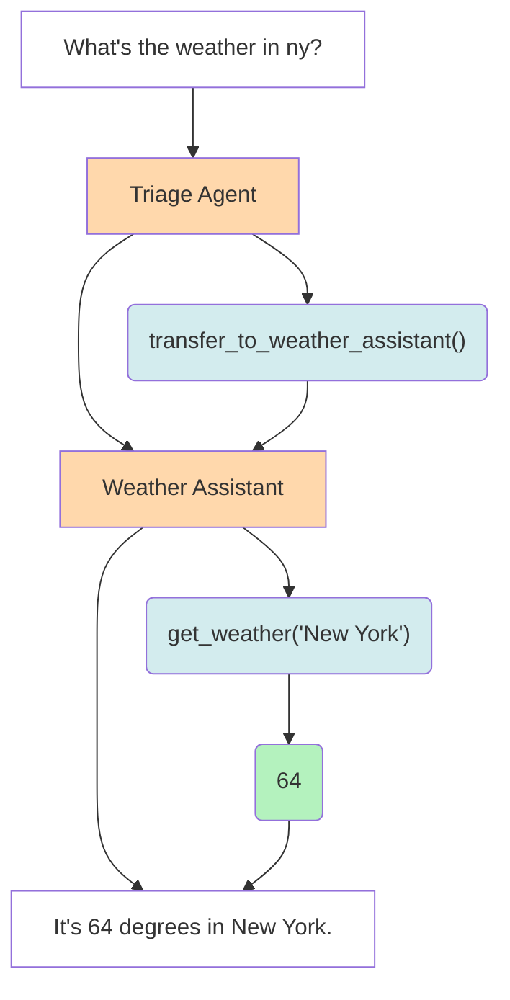

# SwarmX

An extreme simple framework exploring ergonomic, lightweight multi-agent orchestration.

## Highlights
1. SwarmX is both Agent and Workflow
2. MCP servers support
3. OpenAI-compatible streaming-server
4. Workflow import/export in JSON format


## JSON Format Details
SwarmX supports workflows in JSON format. This JSON is the same `SwarmConfig`
accepted by the TypeScript core, CLI `--config`, ACP metadata, and desktop
Workflow panel:

- `name`: workflow name
- `root`: first node to run
- `nodes`: map of node ids to node definitions with `kind: "agent" | "tool" | "swarm"`
- Agent nodes represent ACP agent identity: `model` plus a fine-grained
  harness descriptor. A harness is the software package/version, MCP set,
  skill set, and project context files (`AGENTS.md`, `CLAUDE.md`, and similar).
  Tool use belongs inside the agent configuration through MCP servers and instructions.
- `edges`: list of transitions, optionally with CEL `condition`
- `mcpServers`: optional MCP server configuration

## Extension Inventory

SwarmX can load reusable extension bundles for downstream products such as
GEEPilot. A bundle may declare software, skills, MCP servers, provider profiles,
harnesses, agent profiles, app connectors, GUI contributions, commands, LSP servers, hooks,
monitors, output styles, settings, assets, permission declarations, auth
policies, marketplace sources, and plugin catalog entries. Set
`SWARMX_EXTENSION_PATHS` to a path-delimited list of
manifest files or directories containing
`swarmx.extension.json`, `swarmx-extension.json`, `extension.json`, or
`plugin.json`.

The core API exposes `loadExtensionInventory()` for discovery,
`resolveAgentCompositionPlan()` for side-effect-free preflight, and
`resolveAgentComposition()` for turning a selected agent profile plus harness
and model/provider selection into an `AgentConfig`. The preflight plan reports
the agent id, display name, canonical selector, host, harness, provider/model,
definition source, plugin ids, selected skill and MCP provenance, context,
permissions, visual metadata, readiness status, and blocked requirements
without spawning ACP harnesses, starting MCP servers, reading secrets, calling
providers, or mutating settings. Manifests and plans are metadata only: inline
provider keys, tokens, passwords, private keys, and credentials are rejected.

Skill capability records can also describe host compatibility without forking a
downstream skill tree. `SkillCapabilitySchema` carries `canonicalPath`,
`governanceRef`, `requiresGateSkillIds`, `hostExposures`, read-only state, and
source-plugin metadata. `SkillHostExposureSchema` distinguishes plugin,
rules-only, unsupported, and unknown host surfaces and can point to manifest
paths, marketplace source ids, rules files, or packages. The pure
`validateSkillHostCompatibility()` helper returns passive issues for paths
outside caller-configured canonical roots, missing or self-referential gate
skills, unknown marketplace sources, rules-only manifest claims, and host local
paths that must use `./` repository-root form. It does not inspect files,
install plugins, mutate manifests, start adapters, or implement downstream
skills or safety policy.

The desktop Extensions view displays marketplace sources, plugin catalog
entries, plugin bundles, executable harnesses, agent profiles, providers,
skills, MCP servers, app connectors, GUI contributions, and generic plugin
components as separate layers. GUI contributions cover passive navigation,
view, panel, settings, dashboard, composer, message, inspector, toolbar, menu,
and status declarations through refs such as `route`, `componentRef`,
`assetRef`, `commandId`, `settingIds`, `permissionIds`, and `authPolicyIds`.
Generic plugin components cover commands, LSP servers, hooks, monitors,
output styles, settings, assets, permissions, and auth policies. Agent profile
rows also show the resolved composition plan: readiness, canonical selector,
harness, provider/model, plugin count, selected skill and MCP provenance,
context, permissions, auth requirement, and blocked requirements. Blocked or
disabled plans are visible but cannot be selected for invocation from the
read-only inventory view. Skill rows show canonical path, governance, gate-skill
ids, host exposure, manifest/rules/source, and read-only metadata as inspection
chips only. It is a passive management surface today: it can show source/catalog
metadata, component inventory, GUI contribution inventory, host-compatible skill
metadata, and ready extension-provided agent profiles for the composer, but it
does not install plugins, load component code from manifests, mount iframes or
webviews, evaluate scripts, execute commands, enable hooks, start MCP/LSP
servers, grant permissions, activate monitors or output styles, open assets,
authenticate services, enforce skill gate policy, or write secrets.

Desktop GUI customization is host-owned code. A downstream desktop can embed
the SwarmX renderer and explicitly register safe React components for
`componentRef` values declared by extension manifests:

```tsx
import { createSwarmxDesktopApp } from "@swarmx/desktop/renderer";
import { GeepilotShell } from "./GeepilotShell";

export const App = createSwarmxDesktopApp({
  product: {
    name: "GEEPilot",
    subtitle: "analysis cockpit",
  },
  uiComponentRegistry: {
    "geepilot.ui.shell": GeepilotShell,
  },
});
```

Only contributions whose `componentRef` exists in that host registry become
navigable. Unregistered contributions remain passive rows in the Extensions
inventory. Registered components receive sanitized contribution and inventory
metadata plus explicit callbacks such as `onSelectAgent`; SwarmX never loads
React, HTML, scripts, iframes, webviews, or remote assets from manifest fields.

Sends from that composer include an `agentComposition` payload; the main process
reloads the extension inventory and resolves the composition before creating the
single-agent Swarm. This allows downstream harness ids such as a
GEEPilot-provided Codex profile to remain plugin metadata instead of being added
to the built-in SwarmX harness list. Resolved `custom` agent backends execute
through the ACP client using the manifest-declared command, args, cwd, and
environment, so extension-provided Codex or Claude profiles do not silently fall
back to the native OpenAI path.

Provider profiles are metadata until execution. If an agent profile names a
provider profile with an `env` `secretRef`, the main process resolves that env
var immediately before invocation and injects the provider-specific variables
into the child process only. Missing env vars, unsupported secret sources, or a
provider kind that is not compatible with the selected harness fail before the
agent starts.

See [GEEPilot Platform Boundary Review](./geepilot-platform-review.md) for the
spec split between SwarmX platform capabilities and GEEPilot-owned analysis
workflows.

## Action Intent Primitives

SwarmX exposes browser-safe explicit-action contracts as
`@swarmx/core/actions`. The API lets desktop and downstream products describe
user-initiated operations without performing them in core.

Core action exports include:

- `ActionIntentSchema`: action id, kind, host, source/target refs, risk list,
  confirmation requirement, confirmation text, sanitized payload, and timestamp.
- `ActionConfirmationSchema` and `assertActionConfirmed()`: matching
  confirmation records for risky actions before an execution layer installs,
  enables, starts, reruns, opens, reveals, or changes trust.
- `createActionIntent()`: deterministic `act_` id generation from sanitized
  intent content, default risk classification, and payload redaction.
- `requiresExplicitConfirmation()`: shared risk policy where anything beyond
  `read_only` requires an explicit positive confirmation.
- `actionIntentFromDependencyPlan()`: converts side-effect-free dependency
  install plans into explicit action intents for managed installs, external
  installers, existing detections, and unavailable dependencies.

Action records reject inline secret-looking fields while allowing secret
references as metadata. Core does not install plugins, write settings, start MCP
servers, open installers, rerun commands, reveal raw host payloads, or mutate
trust state; those remain caller-owned effects guarded by the action intent and
confirmation contract.

## Desktop Settings Primitives

SwarmX exposes browser-safe local desktop settings contracts as
`@swarmx/core/desktop-settings`. The API models reusable settings documents,
desktop-root resolution, UI state, locale resources, and persisted provider and
agent profile metadata without reading or writing files.

Core desktop settings exports include:

- `DesktopSettingsDocumentSchema`: a v1 document with `desktop`, `server`,
  `ui`, `providers`, `agents`, and `extensions` sections. Provider profile
  entries reuse `ProviderProfileMetadataSchema`; agent profile entries reuse
  `AgentProfileMetadataSchema`, so those records stay separate from harness and
  plugin records.
- `resolveDesktopRoot()`: deterministic desktop-root selection. Explicit
  desktop-root env vars win over settings roots; legacy app-root env/settings
  values are compatibility fallbacks; server data roots are returned separately
  and are not silently treated as desktop roots.
- `LocaleRegistrySchema`, `createLocaleRegistry()`, and
  `resolveLocaleSelection()`: centralized locale metadata and message resources,
  duplicate-locale checks, persisted locale selection, env locale support, and
  default fallback.
- `DesktopUiStateSchema` and `createDefaultDesktopSettings()`: portable UI
  state/defaults without choosing a downstream product root.

Settings and UI records reject inline secret-looking fields while allowing
secret references. SwarmX does not create directories, manage keychains, migrate
secrets, persist localStorage, call providers, or decide concrete downstream
settings paths such as `~/.geepilot/settings.json`.

## Secret Store Primitives

SwarmX exposes browser-safe secret-store contracts as `@swarmx/core/secrets`.
The API models the allowed secret surfaces without reading files, writing auth
documents, calling keychains, prompting users, or sending secrets to servers.

Core secret exports include:

- `SecretRefSchema`: source, key, purpose, service, and account metadata for
  `env`, `local_auth_file`, `local_keychain`, `server_keychain`, `prompt`, and
  `request_only` sources.
- `SecretVaultDocumentSchema`: a local/server vault document shape where secret
  values are allowed only under explicit vault entry `value` fields.
- `SecretWriteRequestSchema`: an explicit write-request shape where a caller can
  pass one secret value to an implementation layer.
- `SecretStatusSchema`: configured/missing status metadata that rejects returned
  secret values.
- `evaluateSecretFileMode()`: pure file-mode evaluation for contracts such as
  `0600`; it does not chmod or create files.
- `secretStatusFromVault()`, `secretValueFromVault()`,
  `redactSecretVaultDocument()`, and `redactSecretWriteRequest()`: lookup and
  redaction helpers.

`assertSecretRefPolicy()` rejects persistent storage for request-only secrets
such as remote-compute passwords. Provider API keys may reference env,
local-auth-file, local-keychain, server-keychain, or prompt sources, but runtime
injection remains request-scoped in the caller. SwarmX does not own concrete
paths such as `~/.geepilot/auth.json` or server keychain routes.

## Provider Profile Primitives

SwarmX exposes browser-safe provider profile contracts as
`@swarmx/core/providers`. The API separates provider metadata from provider
secret storage and can be used by direct provider prompts or harness provider
injection.

Core provider exports include:

- `ProviderProfileMetadataSchema`: profile id, preset id, display name,
  provider kind, default model, base URL, default flag, harness-specific model
  overrides, read-only state, and a secret reference. Parsers accept the
  snake_case fields used by downstream settings files and the `label`/`model`
  aliases used by extension manifests.
- `ProviderSecretRefSchema`: references to `env`, `local_keychain`,
  `server_keychain`, or `prompt` sources without storing secret values.
- `ProviderSecretStatusSchema`: status records that can say whether a secret is
  configured, but reject returned secret values.
- `ProviderSelectionSchema` and `resolveProviderProfile()`: explicit/default
  profile resolution that fails on unknown, missing, or ambiguous selections.
- `ProviderPromptRequestSchema`: direct provider prompt metadata without an ACP
  harness.
- `buildProviderRuntimeEnv()`: constructs request-scoped environment variables
  only when the caller supplies the runtime secret value explicitly.

Provider profile metadata, secret statuses, prompt requests, and selection
records reject inline secret-looking fields. SwarmX does not implement local
auth files, keychain persistence, server keychain routes, or provider-specific
migration; downstream products own those storage surfaces.

## Harness Management Primitives

SwarmX exposes browser-safe harness management contracts as
`@swarmx/core/harness-management`. The API models host adapter discovery,
selector resolution, named agent aliases, and invocation metadata without
probing local CLIs or installing adapters.

Core harness management exports include:

- `HarnessDiscoveryRecordSchema`: adapter id, display name, availability,
  host scope, command path, version, installability, dependency id, status note,
  and checked timestamp.
- `resolveHarnessSelector()`: strips leading selectors such as `@codex` and
  `@claude:deepseek`, resolves named agent aliases such as `@deepseek`, and
  returns the canonical selector plus stripped prompt. Unknown or ambiguous
  selectors throw instead of falling back to a default harness.
- `HarnessAgentAliasSchema`: named alias metadata that maps one alias to an
  explicit adapter and optional provider profile.
- `HarnessInvocationMetadataSchema`: invocation trace metadata for adapter,
  provider profile, agent profile, context packet, external session reference,
  status, timestamps, and errors.

Harness records reject inline secret-looking fields while allowing secret
references as metadata. SwarmX does not decide which adapters a product exposes,
does not probe PATH, and does not run vendor installers; those actions stay with
the desktop, server, or downstream product layer.

## Agent Profile Definition Primitives

SwarmX exposes browser-safe agent profile definition contracts as
`@swarmx/core/agent-profiles`. The API models Claude-compatible Markdown
definitions and normalized profile metadata without importing files, enabling
agents, starting hooks, or mutating settings.

Core agent profile exports include:

- `AgentDefinitionFrontmatterSchema`: Claude-compatible fields such as `name`,
  `description`, `tools`, `disallowedTools`, `model`, `permissionMode`,
  `mcpServers`, `hooks`, `maxTurns`, `skills`, `initialPrompt`, `memory`,
  `effort`, `background`, `isolation`, and `color`.
- `AgentDefinitionGeepilotMetadataSchema`: GEEPilot-scoped metadata under
  `geepilot` for harness id, provider profile id, selector alias, enablement,
  and source label.
- `parseAgentDefinitionMarkdown()`: splits Markdown frontmatter from the body,
  parses YAML, preserves unknown frontmatter fields as inert metadata, and
  rejects malformed or non-object frontmatter.
- `createAgentProfileFromDefinition()`: converts a definition into separate
  profile metadata for harness/provider/model selection, selector aliases,
  tools, skills, memory, permission-like fields, provenance, read-only state,
  and instructions.
- `projectAgentDefinitionForClaudeCode()`: emits a host-facing Claude Code
  projection that omits GEEPilot-only frontmatter while preserving compatible
  fields and the Markdown body.

Agent definition and profile records reject inline secret-looking fields while
allowing secret references. SwarmX does not own host directory discovery,
plugin-cache mutation, profile persistence, enablement, test invocation, or
export writes; downstream products decide those effects and guard them with
explicit action intents.

Extension agent profiles can also carry passive definition and policy metadata:
tools, disallowed tools, permission mode, turn budget, memory, effort,
background execution preference, isolation, color, and definition source. The
composition resolver records that metadata under `parameters.extension.profile`
for traceability, and the desktop Extensions view renders it as inspection
chips. SwarmX still does not enforce host-specific tool policy or activate hooks
or MCP servers from passive inventory.

## Context Packet Primitives

SwarmX exports typed context packet primitives for parented agent delegation and
resumption. The core API does not own local conversation files or provider-backed
compression; it only provides deterministic schemas and helpers that Electron or
downstream products can use.

Core exports include:

- `ContextObjectSchema`: typed packet objects for `instructions`,
  `summary_checkpoint`, `message_tail`, `agent_invocations`, and
  `delegated_request`, with source ids, message ids, byte counts, priority, and
  compressed/truncated flags.
- `ContextPacketSchema`: packet metadata plus rendered prompt, including
  requested/resolved strategy, included/dropped/truncated object ids, included
  message ids, prompt bytes, and prompt SHA-256.
- `SummaryCheckpointSchema`: append-only checkpoint metadata with redacted
  provider metadata, covered/included message ids, compression prompt hash, and
  summary text.
- `AgentInvocationContextMetadataSchema`: trace metadata that child harness
  invocations can cite without treating external sessions as canonical context.

Helpers:

- `resolveContextStrategy()` maps `auto` to `checkpoint_tail` when a usable
  checkpoint exists and to `microcompact` otherwise.
- `buildContextPacket()` fits typed objects to a prompt budget, preserves the
  delegated request, and records dropped/truncated object ids.
- `contextPromptSha256()` computes the packet hash used by packet and
  checkpoint metadata.

Like extension and autonomy records, context records reject inline
secret-looking fields. Provider metadata may identify a provider or model, but
must not copy provider keys, bearer tokens, passwords, private keys, or
credentials.

## Conversation Ledger Primitives

SwarmX exposes a browser-safe conversation ledger API as
`@swarmx/core/conversation`. The API models append-only local conversation
records for desktop products without deciding the concrete filesystem root or
replacing the existing SwarmX session helpers.

Core conversation exports include:

- `ConversationIndexRecordSchema`: session index metadata with title, agent,
  harness, model, timestamps, message count, archived state, context strategy,
  and storage references.
- `ConversationEventSchema`: append-only `cev_` rollout events for session
  creation, message append, checkpoint append, invocation lifecycle, artifact
  linking, title update, and archiving.
- `ConversationStorageRefSchema`: portable references to desktop, server,
  benchmark, or custom storage roots plus index and rollout paths.
- `createConversationEvent()`: deterministic event-id creation when the caller
  does not supply an id.
- `conversationJsonlLine()` and `parseConversationJsonl()`: stable JSONL
  serialization and line-numbered parse errors.
- `replayConversationEvents()` and `applyConversationEvent()`: deterministic
  reconstruction of session index state and message arrays, with invalid append
  order recorded as rejected events rather than mutating state.

Conversation records reject inline secret-looking structured fields while
allowing secret references as metadata. The primitives do not read or write
files, compress context, call providers, own runtime memory, or decide
GEEPilot-specific knowledge admission.

## Normalized Rendering Events

SwarmX provides normalized render events so the desktop app and downstream
products can show messages, tool calls, artifacts, and host traces without
branching the UI by host adapter.

The browser-safe rendering API is available as `@swarmx/core/rendering`; the
root `@swarmx/core` export remains available for Node-side consumers.

Core rendering exports include:

- `NormalizedRenderEventSchema`: stable `rne_` events with kind, status, source,
  parent message or invocation ids, title, summary, content, tool name,
  sanitized input/output, artifacts, timestamps, raw payload reference, and
  provenance.
- `RenderArtifactReferenceSchema`: file, diff, log, screenshot, image, table,
  HTML, JSON, terminal, report, evidence, and generic artifact references.
- `RenderProvenanceSchema`: host, adapter, plugin, MCP, harness, provider
  profile, model, agent, and external-session trace metadata.
- `normalizeMessageChunk()` and `normalizeMessageChunks()`: map current SwarmX
  message chunks into the normalized event model.
- `sanitizeRenderPayload()`: recursively redacts secret-looking fields in tool
  arguments, tool results, artifact metadata, and provenance.

The desktop run timeline now renders tool-call and tool-result payloads through
the normalizer before display, so raw host output does not expose provider keys,
bearer tokens, passwords, private keys, or credentials. Raw host payloads should
be kept behind explicit references such as run-log paths rather than embedded in
the render event.

Tool-call and tool-result rows also expose a read-only trace card. The compact
view shows normalized title, status, and summary. The disclosure view shows
sanitized input/output, provenance chips, passive artifact-reference chips, and
the raw-payload reference when one exists. These cards do not open artifacts,
fetch artifact URLs, reveal raw payload contents, rerun commands, start tools,
or mutate trust/session state.

The trace card disclosure can present terminal, file, diff/patch, test/check,
MCP, browser/app automation, and generated-media shapes as read-only display
adapters over normalized fields, artifact references, and provenance. These
presentations never execute commands, read file paths, fetch media, call MCP
servers, or infer downstream domain meaning; products such as GEEPilot keep
HPC queues, data-analysis semantics, and scientific interpretation in their own
plugin code.

Message Markdown uses the same safe rendering boundary:

- raw HTML from model output is escaped;
- GitHub Flavored Markdown tables, lists, task lists, and code fences render
  through `react-markdown` and `remark-gfm`;
- inline and display math render offline through `remark-math` and KaTeX for
  `$...$`, `\(...\)`, `$$...$$`, and `\[...\]`, with KaTeX trust disabled and
  parse errors kept local to the affected formula;
- obvious currency and shell-prompt dollar text stays literal instead of being
  interpreted as inline math;
- remote Markdown images render as placeholders by default instead of fetching
  network media during message rendering;
- trusted local image paths are resolved through the preload IPC image loader
  and render only after the main process returns a data URL;
- fenced code blocks render in stable framed blocks with language labels,
  keyboard-reachable copy controls, exact-code clipboard behavior, and
  horizontal scrolling for long lines;
- known-language code blocks are enhanced with offline Shiki highlighting after
  the plain-text fallback renders; unknown languages or highlighter failures
  remain escaped plain text;
- display formulas, tables, and code blocks scroll within the message width
  without changing canonical message text;
- tool-call and tool-result payloads stay literal unless they have first been
  normalized into safe render events.

## Telemetry Primitives

SwarmX exposes a browser-safe telemetry API as `@swarmx/core/telemetry` and
also re-exports it from the Node-oriented root package. The API implements the
generic product telemetry contract without deciding downstream analytics,
retention, or server storage.

Core telemetry exports include:

- `TelemetryEnvelopeSchema`: v1 telemetry envelopes with schema version,
  event id, timestamp, event type, source, pseudonymous installation id,
  optional session/release metadata, and sanitized payload.
- `resolveTelemetryConfig()`: opt-in config loading from settings or
  `SWARMX_TELEMETRY_*` / `GEEPILOT_TELEMETRY_*` environment variables.
- `sanitizeTelemetryPayload()`: recursive redaction for provider keys, bearer
  tokens, SMTP passwords, telemetry tokens, private credentials, and raw content
  fields such as prompts, responses, terminal output, stack traces, source code,
  Wiki bodies, and run logs.
- `createTelemetryClient()`: an injected sender/outbox client. Disabled
  telemetry, missing endpoints, and missing installation ids skip sends; sender
  failures are returned as `outboxed` when an outbox is provided instead of
  throwing through user workflows.
- `telemetryStatus()` and `telemetryHeaders()`: status and bearer-header helpers
  for app/server integration.
- `TelemetryIngestConfigSchema`, `TelemetryIngestAcceptedRecordSchema`, and
  `TelemetryIngestDecisionSchema`: generic ingest-side contracts for opt-in
  server intake, accepted records, and accepted/rejected decisions.
- `resolveTelemetryIngestConfig()`: disabled-by-default ingest config with an
  optional bearer-token gate and a schema-version allowlist from settings or
  `SWARMX_TELEMETRY_INGEST_*` / `GEEPILOT_TELEMETRY_INGEST_*` environment
  variables.
- `evaluateTelemetryIngest()` and `createTelemetryIngestHandler()`: validate a
  caller-supplied envelope, reject unsupported schema versions or unsafe raw
  payloads before append, preserve event ids and timestamps, and call only a
  caller-injected append adapter when a record is accepted.

The v1 event-name validator rejects Task-product events such as `task_created`
and `task_updated`, keeping product telemetry separate from any future task
surface.

Telemetry ingest deliberately stops at validation, decision, and injected append
boundaries. SwarmX does not expose telemetry HTTP routes, choose JSONL or
database storage, run aggregation pipelines, deduplicate stores, or interpret
product metrics; downstream products such as GEEPilot own those server, storage,
analysis, and HPC/job workflow choices.

## Managed Dependency Primitives

SwarmX exposes browser-safe dependency manifest contracts as
`@swarmx/core/dependencies` and also re-exports them from the root package for
Node-side consumers. These APIs cover metadata, validation, receipts, detection
results, and install planning only; they do not download files, inspect PATH,
run `uv`, run `npm`, open installers, or mutate managed roots.

Core dependency exports include:

- `ManagedDependencyManifestSchema`: v1 manifests with dependency classes such
  as `python-project`, `desktop-node-project`, `system-prerequisite`,
  `managed-binary`, `managed-installer`, `external-harness-cli`, and
  `benchmark-asset`.
- `ManagedDependencySchema` and `ManagedDependencyPlatformSchema`: owner,
  version, version source, install root, platform URL, SHA-256, archive member,
  target binary, signature policy, and trust-model metadata. Parsers accept the
  snake_case manifest fields used by GEEPilot and normalize them to camelCase.
- `DependencyDetectionResultSchema`: read-only detection outcomes such as
  `detected`, `installed`, `missing`, or `failed`, with the source recorded as
  env, PATH, managed root, lockfile, system, vendor, or user.
- `DependencyInstallReceiptSchema`: audit metadata for product-managed installs,
  including dependency id, version, platform, source URL, SHA-256, installed
  path, timestamp, and installer or SwarmX version.
- `parseManagedDependencyManifest()` and
  `validateManagedDependencyPolicy()`: reject duplicate ids, inline secrets,
  unpinned managed-download versions, missing hashes, non-HTTPS or credentialed
  URLs, unsafe archive members, unsafe target names, and unknown install-root
  styles.
- `planDependencyAction()`: side-effect-free planning that returns
  `use_existing`, `install_managed`, `requires_user_action`, or `unavailable`.

Managed binary plans may return `install_managed` only when the manifest pins a
version, declares an HTTPS artifact URL, provides repository-stored SHA-256, and
names a managed install root. Managed installers, external harness CLIs, system
prerequisites, and lockfile-owned project dependencies require explicit user or
owning-package-manager action. Benchmark assets are treated as unavailable for
product startup.

## Optional Server Boundary

SwarmX can expose a local OpenAI-compatible HTTP server through
`createServer(swarm, options)` or `swarmx serve`. The server remains optional and
binds to `127.0.0.1` by default.

Security defaults:

- Loopback bindings do not require a bearer token unless `apiToken` is supplied.
- Non-loopback bindings such as `0.0.0.0` require `apiToken`; attempting to bind
  without one throws before the server starts.
- Browser CORS is not wildcarded. Requests with an `Origin` header are accepted
  only when the origin appears in `allowedOrigins`.
- `Origin: null` is rejected unless `allowNullOrigin` is explicitly set for a
  trusted desktop bridge.
- When `apiToken` is configured, requests must include
  `Authorization: Bearer <token>`.

CLI options:

```console
swarmx serve --host 0.0.0.0 --api-token "$SWARMX_API_TOKEN" \
  --allowed-origin https://app.example
```

This boundary is intentionally generic. SwarmX does not implement downstream
team identity, email activation, Wiki storage, deployment databases, telemetry
ingest storage, or product-specific server routes.

## Autonomy Runtime Primitives

SwarmX also exposes generic autonomy contracts in `@swarmx/core` so downstream
products can build deterministic schedulers without forking platform schemas.
These APIs are intentionally side-effect free: they do not install wakeups,
start daemons, run ticks, acquire filesystem locks, write reports, serve
dashboards, run commands, invoke agents, or decide product-specific analysis
claims.

Core exports include:

- `AutonomyWorkItemSchema`: structured work items with `awi_` ids, work class,
  lifecycle status, autonomy level, source references, evidence requirements,
  budgets, blockers, retry state, leases, workflow stage, and optional
  downstream metadata.
- `AutonomyRuntimeEventSchema`: append-only runtime events with `evt_` ids,
  idempotency keys, source, run/work-item references, previous/next state, and
  redacted payloads.
- `AutonomyTriggerRecordSchema`: typed `trg_` triggers for schedule ticks,
  manual requests, issues, validation failures, feedback, analysis findings,
  file changes, and dependency updates before any work item executes.
- `EngineeringLifecycleStateSchema`, `EngineeringIntakeRecordSchema`,
  `EngineeringProposalRecordSchema`, and `EngineeringApprovalRecordSchema`:
  generic engineering lifecycle records for intake, triage, proposal,
  discussion, specification, implementation, validation, report, close, and side
  states such as blocked or needs-human.
- `AutonomyTransitionDecisionSchema`: deterministic transition decisions with
  requested from/to state, idempotency status, guard preconditions, missing
  requirements, reason, and optional state patch.
- `EngineeringLifecycleTransitionDecisionSchema`: evidence-, approval-, and
  validator-gated lifecycle transition decisions that do not mutate the work
  item or accept specs by themselves.
- `AutonomyAgentRunRecordSchema`: portable `agt_` agent-stage records with
  work/run refs, workflow kind/stage, role, adapter/profile refs, status,
  timestamps, artifact/evidence refs, compact summaries, and result/error refs.
- `AutonomyWorkflowDecisionRecordSchema`: portable `dec_` workflow-decision
  records with current/next stage, decision status/kind, linked agent-run ids,
  evidence/artifact ids, reason, and optional next workflow state.
- `CommandDagSchema`: validated command DAGs with declared inputs, outputs,
  dependencies, command or internal operation nodes, timeouts, retry policy,
  validators, and artifact policy. DAG parsing rejects missing dependencies,
  duplicate nodes, and cycles.
- `ValidatorManifestSchema` and `ValidatorOutcomeSchema`: deterministic
  validation gates and recorded outcomes such as `passed`, `failed`, `skipped`,
  and `waived`.
- `ValidatorGateDecisionSchema`: deterministic gate summaries that cite
  required, missing, passed, failed, waived, and skipped validator ids without
  running validators or copying raw validator output.
- `EvidencePacketSchema`: durable `evp_` packets with workspace snapshot,
  inputs, commands, parameters, environment summary, artifacts, validation,
  limitations, observations, conclusions, confidence, and follow-up.
- `AutonomyScheduleStateSchema`, `AutonomyScheduleDecisionSchema`, and
  `AutonomyScheduleTriggerSchema`: interval schedule metadata and deterministic
  schedule-trigger records, including the default 24-hour report cadence.
- `AutonomyReportMetadataSchema`: report summaries with attempted, completed,
  failed, blocked, and deferred work; verification outcomes; budget usage;
  evidence and artifact ids; decisions; risks; next work; and at most three
  human decision prompts.
- `AutonomyDashboardMetadataSchema`: self-contained local report/live dashboard
  metadata with the default 60-second refresh interval, plus an explicit
  non-authoritative server-live variant.
- `AutonomyFeedbackRecordSchema`: durable `fbk_` feedback actions linked to
  report ids and typed downstream routes such as work item, memory, spec, paper,
  or benchmark. SwarmX records the route metadata but does not perform the
  downstream mutation.
- `AutonomyWakeupStateSchema`: project-owned wakeup controller state for `app`
  and `server` roles, including adapter kind, desired cadence, heartbeat,
  next-due time, last error, and the shared tick-lock path.
- `AutonomyDaemonRunMetadataSchema` and
  `AutonomyCircuitBreakerDecisionSchema`: portable daemon-run state and
  retry-breaker records without implementing a daemon, GitHub webhook intake,
  or worker loop.
- `AutonomyReplayRecordSchema`: replay summaries with event counts,
  applied/rejected ids, work-item ids, status counts, deterministic state hash,
  and explicit missing external dependencies.

Runtime records reject inline secret-looking fields such as provider keys,
bearer tokens, passwords, private keys, and credentials. Secret references are
metadata; runtime logs, DAGs, validator records, and evidence packets should not
copy deployment secrets, raw issue bodies, raw terminal output, raw validator
output, or raw data-analysis output.

Pure helpers:

- `createAutonomyRuntimeEvent()` creates deterministic event ids from event
  content when `eventId` is not supplied.
- `runtimeEventFromTrigger()` turns a typed trigger into an append-only runtime
  event without creating work items, starting runs, or bypassing eligibility,
  lease, budget, or validation policy.
- `evaluateAutonomyTransition()` evaluates current state, valid status edge,
  guard preconditions, and idempotency keys before a state transition can be
  emitted.
- `evaluateEngineeringLifecycleTransition()` evaluates typed engineering
  lifecycle edges, current workflow stage, required evidence ids, required
  approval ids, and optional validator-gate decisions before a lifecycle move is
  allowed.
- `engineeringLifecycleWorkflowState()` creates a typed `workflow` value with
  `kind: "engineering"` and a lifecycle stage for an autonomy work item.
- `createAutonomyTransitionRuntimeEvent()` converts an allowed transition
  decision into `deterministic_transition` and a rejected decision into a
  non-mutating rejection event.
- `createAutonomyAgentRunRuntimeEvent()` and
  `createAutonomyWorkflowDecisionRuntimeEvent()` project caller-owned
  agent-run and workflow-decision records into sanitized append-only runtime
  events.
- `linkAgentStageToWorkflowState()` returns a new workflow state with linked
  agent-run ids and a final decision id without invoking agents or deciding
  lifecycle policy.
- `evaluateValidatorGate()` summarizes manifest gate status from supplied
  validator outcomes without running commands.
- `replayAutonomyEvents()` reconstructs current work-item state from event
  order while applying idempotency keys once.
- `applyAutonomyRuntimeEvent()` applies one event to a replay state and records
  rejected transition events instead of advancing invalid lifecycle moves.
- `evaluateAutonomySchedule()` and `createAutonomyScheduleTrigger()` determine
  whether a schedule is due from explicit timestamps and create deterministic
  `trg_` trigger records.
- `defaultReportSchedule()` returns the default 24-hour report schedule.
- `evaluateCircuitBreaker()` maps repeated failure counts to `allow` or
  `needs_human` decisions using the default three-failure breaker.
- `createAutonomyReplayRecord()` summarizes replay output with a deterministic
  `sha256:` state hash and explicit missing external references.
- `wakeupStatePath()` resolves the default app/server wakeup state paths.
- `autonomyDatedPath()` derives portable paths such as
  `autonomy/runs/YYYY/MM/DD/<runId>.jsonl` and
  `autonomy/evidence/YYYY/MM/DD/<evidenceId>.json`.

Agent-stage trace records intentionally stop at provenance and linkage. SwarmX
does not dispatch workers, call Codex or ACP adapters, run validators, verify
issues, submit remote jobs, write ledgers, or advance lifecycle state from an
agent result. Raw prompts, raw responses, terminal transcripts, validator logs,
and data-analysis outputs belong in caller-owned artifacts referenced by
`resultRef`, `errorRef`, artifact ids, or evidence ids.

Example work-item creation:

```ts
import { createAutonomyRuntimeEvent, replayAutonomyEvents } from "@swarmx/core";

const created = createAutonomyRuntimeEvent({
  eventType: "work_item_created",
  timestamp: "2026-07-03T00:00:00.000Z",
  source: "manual_request",
  idempotencyKey: "manual:awi_platform_foundation",
  payload: {
    workItem: {
      id: "awi_platform_foundation",
      class: "project_iteration",
      type: "spec_review",
      status: "queued",
      priority: 10,
      autonomyLevel: "A2",
      sourceRefs: [{ kind: "spec", id: "0703" }],
      requiredEvidence: ["validator_manifest"]
    }
  }
});

const state = replayAutonomyEvents([created]);
```

### Import n8n workflow JSON

The desktop Workflow panel can import an n8n workflow JSON file. Use **Import n8n**
and select a JSON export from n8n. SwarmX converts the n8n `nodes` and
`connections` into the same `SwarmConfig` JSON used by the core, CLI, ACP
metadata, and desktop editor.

Import scope:

- Every n8n node becomes a SwarmX `kind: "agent"` node with a `swarmx` backend.
- The original n8n node name, type, type version, canvas position, parameters,
  disabled state, notes, and credential references are preserved under
  `agent.parameters.n8n`.
- n8n connection topology is converted into SwarmX `edges`; cycle-forming
  connections are imported as disabled edges with warnings so the SwarmX DAG
  remains executable.
- Credential secrets are not imported. Native n8n node implementations are not
  executed by SwarmX unless you later reimplement them through agents, MCP
  tools, or custom backends.

Example JSON structure:
```json
{
  "name": "research_review",
  "description": "Route a request through ACP agents, each defined by model plus harness.",
  "root": "triage_agent",
  "nodes": {
    "triage_agent": {
      "kind": "agent",
      "agent": {
        "name": "triage_agent",
        "description": "Codex ACP agent for classification and planning.",
        "model": "gpt-4o-mini",
        "backend": {
          "type": "custom",
          "program": "bun",
          "args": ["x", "--silent", "@agentclientprotocol/codex-acp@0.22.0"]
        },
        "parameters": {
          "harness": {
            "software": {
              "name": "codex-acp",
              "version": "0.22.0",
              "runner": "bun",
              "command": ["x", "--silent", "@agentclientprotocol/codex-acp@0.22.0"]
            },
            "mcps": [{ "name": "filesystem", "transport": "stdio", "scope": "project" }],
            "skills": ["test-driven-development", "backprop"],
            "projectFiles": ["AGENTS.md", "CLAUDE.md"]
          }
        },
        "instructions": "Identify the user's goal, constraints, and required evidence."
      }
    },
    "researcher_agent": {
      "kind": "agent",
      "agent": {
        "name": "researcher_agent",
        "description": "Claude Code ACP agent for repository research.",
        "model": "claude-sonnet-4-20250514",
        "backend": {
          "type": "custom",
          "program": "bun",
          "args": ["x", "--silent", "@agentclientprotocol/claude-agent-acp@0.22.0"]
        },
        "parameters": {
          "harness": {
            "software": {
              "name": "claude-agent-acp",
              "version": "0.22.0",
              "runner": "bun",
              "command": ["x", "--silent", "@agentclientprotocol/claude-agent-acp@0.22.0"]
            },
            "mcps": [{ "name": "filesystem", "transport": "stdio", "scope": "project" }],
            "skills": ["test-driven-development", "backprop"],
            "projectFiles": ["AGENTS.md", "CLAUDE.md"]
          }
        },
        "instructions": "Inspect the repository and collect evidence for the plan."
      }
    },
    "writer_agent": {
      "kind": "agent",
      "agent": {
        "name": "writer_agent",
        "description": "Codex ACP agent for implementation-quality synthesis.",
        "model": "gpt-4o",
        "backend": {
          "type": "custom",
          "program": "bun",
          "args": ["x", "--silent", "@agentclientprotocol/codex-acp@0.22.0"]
        },
        "parameters": {
          "harness": {
            "software": {
              "name": "codex-acp",
              "version": "0.22.0",
              "runner": "bun",
              "command": ["x", "--silent", "@agentclientprotocol/codex-acp@0.22.0"]
            },
            "mcps": [{ "name": "filesystem", "transport": "stdio", "scope": "project" }],
            "skills": ["test-driven-development", "backprop"],
            "projectFiles": ["AGENTS.md", "CLAUDE.md"]
          }
        },
        "instructions": "Write a concise answer using the research output."
      }
    }
  },
  "edges": [
    {
      "source": "triage_agent",
      "target": "researcher_agent"
    },
    {
      "source": "researcher_agent",
      "target": "writer_agent"
    }
  ]
}
```

## Star History

[](https://www.star-history.com/#tcztzy/swarmx&Date)

## Quick start

SwarmX automatically loads environment variables from a `.env` file if present. You can either:

1. **Use a .env file** (recommended):
   ```shell
   # Create a .env file in your project directory
   echo "OPENAI_API_KEY=your-api-key" > .env
   echo "OPENAI_BASE_URL=http://localhost:11434/v1" >> .env  # optional
   cargo run -p swarmx-cli  # Start interactive REPL
   ```

2. **Set environment variables manually**:
   ```shell
   export OPENAI_API_KEY="your-api-key"
   # export OPENAI_BASE_URL="http://localhost:11434/v1"  # optional
   cargo run -p swarmx-cli  # Start interactive REPL
   ```

### API Server

You can also start SwarmX as an OpenAI-compatible API server:

```shell
cargo run -p swarmx-cli -- serve --host 0.0.0.0 --port 8000
```

This provides OpenAI-compatible endpoints:

- `POST /chat/completions` - Chat completions with streaming support
- `GET /models` - List available models

Use it with any OpenAI-compatible client:

```python
import openai

client = openai.OpenAI(
    base_url="http://localhost:8000",
    api_key="dummy"  # SwarmX doesn't require authentication
)

response = client.chat.completions.create(
    model="gpt-4o",
    messages=[{"role": "user", "content": "Hello!"}]
)
```

## Installation

Requires Rust 1.85+

```console
$ cargo install --path crates/swarmx-cli
```

Or run directly from source:

```console
$ cargo run -p swarmx-cli
```

## Usage

```rust
use swarmx_core::{Agent, Edge, Swarm, swarm::SwarmNode};

#[tokio::main]
async fn main() -> anyhow::Result<()> {
    let agent_a = Agent::new("agent_a")
        .with_instructions("You are a helpful agent.");

    let agent_b = Agent::new("agent_b")
        .with_model("deepseek-r1:7b")
        .with_instructions("You can only speak Chinese.");

    let swarm = Swarm::new("demo_swarm", "agent_a")
        .with_node(SwarmNode::Agent(agent_a))
        .with_node(SwarmNode::Agent(agent_b))
        .with_edge(Edge::new("agent_a", "agent_b"));

    let messages = swarm.execute(
        serde_json::json!({"messages": [{"role": "user", "content": "I want to talk to agent B."}]}),
        None,
    ).await?;

    println!("{}", serde_json::to_string_pretty(&messages)?);
    Ok(())
}
```

## Architecture


```mermaid
graph TD
   classDef QA fill:#ffffff;
   classDef agent fill:#ffd8ac;
   classDef tool fill:#d3ecee;
   classDef result fill:#b4f2be;
   func1("transfer_to_weather_assistant()"):::tool
   Weather["Weather Assistant"]:::agent
   func2("get_weather('New York')"):::tool
   temp(64):::result
   A["It's 64 degrees in New York."]:::QA
   Q["What's the weather in ny?"]:::QA --> 
   Triage["Triage Agent"]:::agent --> Weather --> A
   Triage --> func1 --> Weather
   Weather --> func2 --> temp --> A
```

[1]: https://platform.openai.com/docs/api-reference/chat/create
